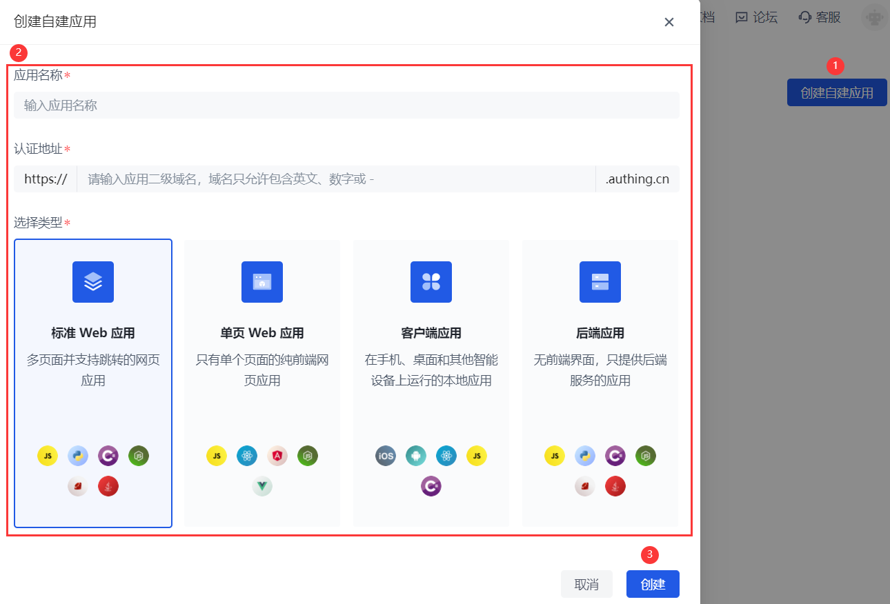

<<<<<<< HEAD
<<<<<<< HEAD
# 自建应用的创建​
​
<LastUpdated/>​
​
路径：**应用->自建应用**​
​
您可以在 **自建应用** 页面查看所有自建应用。
​
=======
=======
>>>>>>> ba53c2dd0bf518dbfa90efa3ac5d7ac5dfcd8126
# 创建自建应用
​
<LastUpdated/>

路径：**应用->自建应用**

你可以在 **自建应用** 页面查看所有自建应用。

<<<<<<< HEAD
>>>>>>> ba53c2dd0bf518dbfa90efa3ac5d7ac5dfcd8126
=======
>>>>>>> ba53c2dd0bf518dbfa90efa3ac5d7ac5dfcd8126
要创建新的自建应用，执行以下步骤：​
​
1. 点击页面右上角 **创建自建应用** 按钮。​
​
2. 在弹出窗口填写如下信息：​

    * **应用名称**：指定应用名。​

<<<<<<< HEAD
<<<<<<< HEAD
    * **认证地址**：输入二级域名，必须为合法的域名格式（只允许包含英文、数字和 ‘-’，例如 **my-awesome-app**​）。

    * **选择类型**：按照您的业务应用的实际类型对应选择在 Authing 的应用类型。
​
3. 点击 **创建** 按钮。
=======
=======
>>>>>>> ba53c2dd0bf518dbfa90efa3ac5d7ac5dfcd8126
    * **认证地址**：输入二级域名，必须为合法的域名格式（只允许包含英文、数字和 ‘-’，例如 `my-awesome-app`​）。

    * **选择类型**：按照你的业务应用的实际类型对应选择在 {{$localeConfig.brandName}} 的应用类型。
​
3. 点击 **创建** 按钮。
<<<<<<< HEAD
>>>>>>> ba53c2dd0bf518dbfa90efa3ac5d7ac5dfcd8126
=======
>>>>>>> ba53c2dd0bf518dbfa90efa3ac5d7ac5dfcd8126
