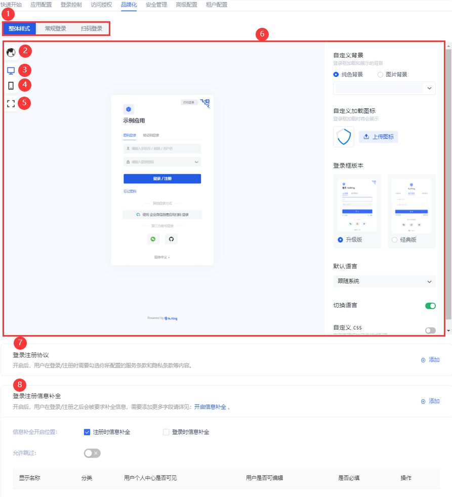
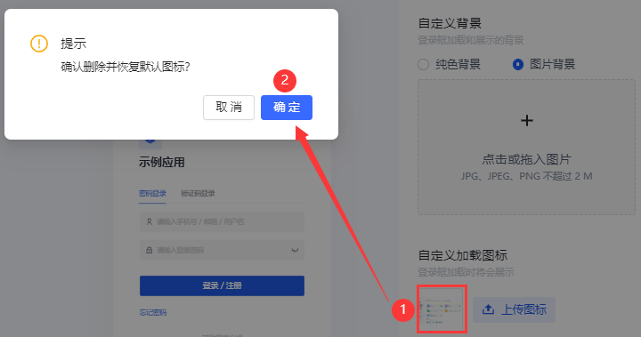
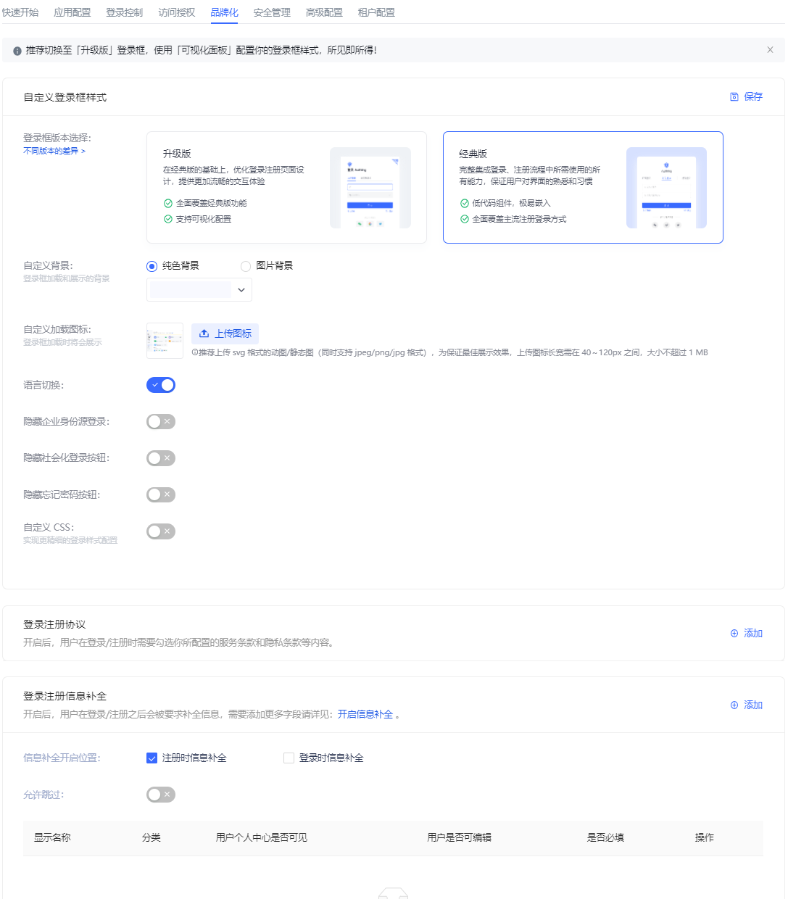
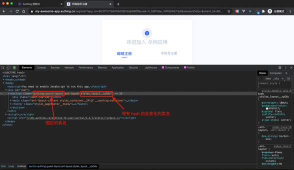
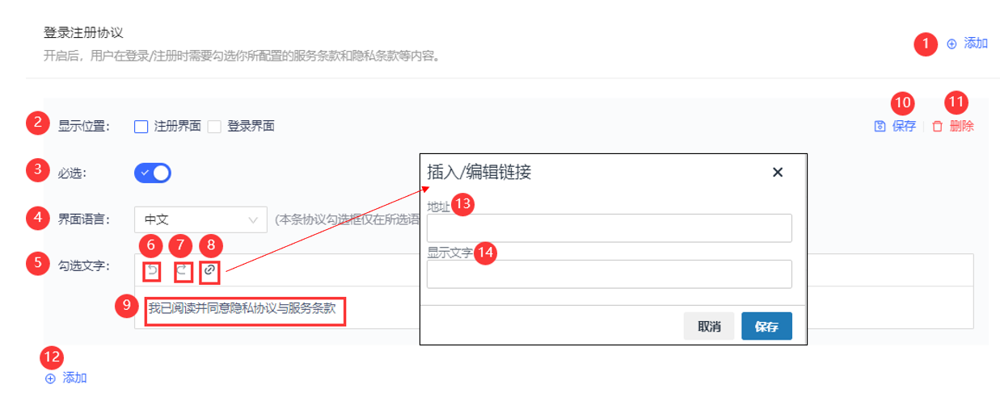
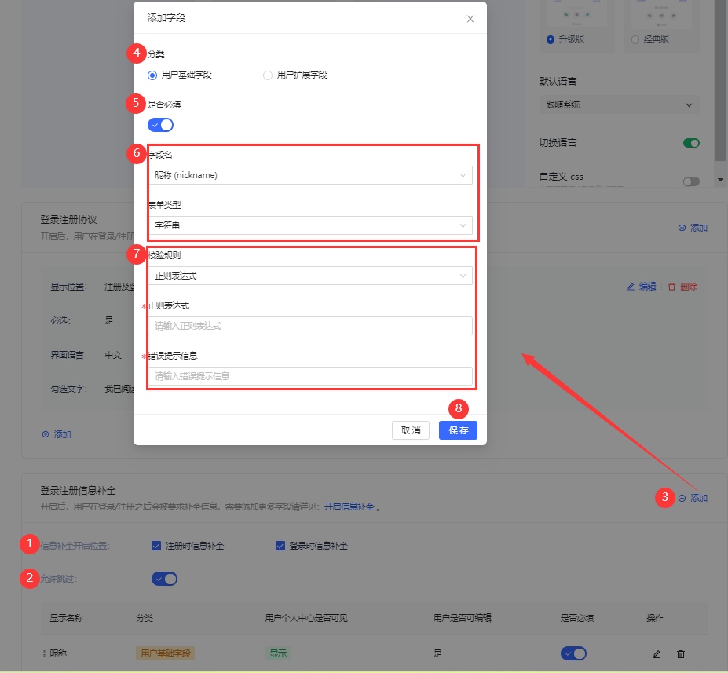

# 品牌化
​
<LastUpdated/>

路径：**应用->自建应用->应用详情->品牌化**

管理员可以在用户池内自建应用的 **品牌化** 标签页自定义 {{$localeConfig.brandName}} ​托管式登录框的 UI 以及登录注册信息补全功能。

::: hint-info
* 应用中 **品牌化** 选项卡默认是关闭的。要打开此选项卡进行配置，需要在 **高级配置->自定义配置** 中开启 **自定义本应用的登录框** 开关。
* 打开本开关后，当前应用的登录框将继承左侧导航栏 **品牌化->全局登录框** 中的配置。管理员可以对某个自建应用的登录框进行独立于全局的个性化配置。
:::

 

|序号|说明|
|:----:|----|
|1|登录框样式选项卡|
|2|登录框预览语言：**跟随系统**、**简体中文**、**繁體中文**、**English**|
|3|Web 端预览|
|4|移动端预览|
|5|全屏显示，仅适用于 Web 端预览；再次点击，恢复原尺寸|
|6|登录框样式配置及展示页面|
|7|登录注册协议配置模块|
|8|登录注册信息补全配置模块|

## 登录框样式

**品牌化** 将登录框样式分成三类：**整体样式**、**常规登录**、**扫码登录**。

### 整体样式

整体样式适用于一次认证、二次认证、信息补全等应用登录 / 注册全程。

管理员可以在 **整体样式** 页面自定义登录 / 注册页背景、加载图标、登录框版本、显示语言、CSS 等。

#### 自定义背景

管理员可以将登录框展示背景设置为纯色，或者上传图片，以图片为背景。

::: hint-info
上传图片时，确保图片大小不超过 2M。
:::

#### 自定义加载图标

管理员可以在此模块自定义登录框加载时展示的图标。

要删除当前加载图标，只需点击选框，确定删除。

 

#### 登录框版本

管理员可以选择 **升级版**、**经典版** 两种登录框配置页面·，默认升级版。下图为经典版配置页面：



#### 默认语言

定义登录框的显示语言：

* **跟随系统** </br>登录框显示语言和登录后的应用系统语言可能不同。管理员可以设置登录框显示语言跟随应用的系统语言，从而提升用户登录体验。
* **简体中文**
* **繁體中文**
* **English**

#### 切换语言

管理员可以通过 **切换语言** 开关定义是否在登录框底部显示语言切换选项，从而用户可以自定义登录框显示语言。如过该开关关闭，则用户无法自定义登录框显示语言。此时，界面显示语言为管理员在 **默认语言** 中配置的。

#### 自定义 css

通过自定义 CSS 对登录框进行一些高级自定义样式定制，如修改背景颜色：

```css
.authing-guard-layout {
  background: gray;
}
```

::: hint-info
具体的 CSS 类名可以在 {{$localeConfig.brandName}} 的登录界面通过 Chrome 控制台查看，需要自定义样式的 dom 标签都提供了固定的类名，若带有 hash 的类名不能使用，因为会经常变化。
:::



### 常规登录

所谓的 **常规登录** 指的是密码登录和验证码登录。本章节会介绍只适用于常规登录的 **忘记密码**、**企业账号登录**、**社交账号登陆** 隐藏 / 显示开关。


#### 忘记密码

管理员可以在此定义是否在登录框显示 **忘记密码** 组件。开启后，用户在忘记登录密码时可以通过点击此按钮，重置密码登录。

#### 企业账号登录

::: hint-info
**企业账号登陆** 隐藏 / 显示开关作用的前提是已为该自建应用添加并启用了第三方企业登录方式。否则即便该开关开启，也无法在登录框显示企业账号登录入口。有关为自建应用添加企业登录方式的详细信息，请参阅 [登录控制-企业登录方式](./login-control.md#企业登录方式​)。
:::

管理员可以在此定义是否在登录框显示其他企业账号登录入口。开启后，用户可以使用其他企业应用账号登录。

#### 社交账号登录

::: hint-info
**社交账号登陆** 隐藏 / 显示开关作用的前提是已为该自建应用添加并启用了第三方社交登录方式。否则即便该开关开启，也无法在登录框显示社交账号登录入口。有关为自建应用添加社交登录方式的详细信息，请参阅 [登录控制-社交登录方式](./login-control.md#社交登录方式​)。
:::

管理员可以在此定义是否在登录框显示第三方社交账号登录入口。开启后，用户可以使用第三方社交账号登录。

### 扫码登录

{{$localeConfig.brandName}} 支持用户通过移动端扫码来登录自建应用。除了使用移动端自建应用 APP 扫码，还可以使用移动端第三方企业应用或者社会化身份源扫码。

管理员可在此配置是否开启企业账号登录和社交账号登录。开启后，用户在扫码登录页可见。

 

#### 企业账号登录

同 [常规登录企业账号登录](#企业账号登录)。

#### 社交账号登录

同 [常规登录社交账号登录](#社交账号登录)。

## 登录注册协议

用户注册时，需要让用户了解并同意您的服务条款，从而帮助您规避法律风险。为此，{{$localeConfig.brandName}} 提供 **登录注册协议** 功能。



|序号|字段|说明|
|:----:|----|----|
|1|添加|点击添加新的注册协议。
|2|显示位置|协议呈现的位置：出现在 **注册界面** 还是 **登录界面**。</br>**注意**：支持复选。|
|3|必选|添加注册协议时默认开启。|
|4|界面语言|**注意**：当前配置的协议仅在所选语言界面下才会显示。</br>可以点击协议添加面板下的 **添加** 按钮为不同语言的登录框添加不同语言版本注册协议。|
|5|勾选文字|可在此配置注册协议标题和内容。|
|6|撤销|撤销对注册协议标题和内容的修改。|
|7|重做|恢复对注册协议标题和内容的修改。|
|8|协议内容|点击配置具体的协议内容。|
|9|注册协议提示|可在此配置待查看和勾选的注册协议提示，用户登录 / 注册时可见。|
|10|保存|保存配置和修改。|
|11|删除|删除当前注册协议配置。|
|12|添加|同 1。|
|13|地址|协议内容可以是外部链接：即您已经部署好了协议详细内容的页面，直接输入页面地址即可，用户点击协议标题会跳转到您配置的链接。|
|14|显示文字|可在此配置外部链接对应的协议内容标题。|

要开启此功能，执行以下步骤：
  
1. 在应用详情页 **品牌化->登录注册协议** 模块点击右上角 **添加** 按钮。</br>下方打开协议添加面板。

2. 勾选 **显示位置**。

3. 选择注册协议适用的界面语言。

4. 配置协议内容。

5. 点击 **保存** 按钮保存当前配置。

配置完成后就可以在注册界面看到该注册协议。用户在登录 / 注册时需要查看和勾选您所配置的服务条款和隐私条款等内容：


## 登录注册信息补全

用户在登录和注册时通常需要提供手机号 / 邮箱等个人信息。除了这些常规个人信息，管理员可以指定用户补全特定信息才能完成登录 / 注册，用以作业务数据的收集。

管理员可以在控制台自建应用详情页 **品牌化->登录注册信息补全** 模块指定要补全的信息（即字段）。



要配置待补全的信息，执行以下步骤：

1. 选择 **信息补全开启位置**：**注册时信息补全** 和 / 或 **登录时信息补全**。

2. 指定用户在登录 / 注册时，是否可以跳过补全窗口。

::: hint-info
* 若 **允许跳过** 开关开启，则在用户登录补全时，补全窗口右上角呈现 **跳过** 按钮，用户可以点击按钮跳过补全。

* 若 **允许跳过** 开关关闭，则补全窗口不会出现 **跳过** 按钮。
:::

3. 在 **登录注册信息补全** 模块点击右上角 **添加** 按钮添加待补全的字段。</br>打开 **添加字段** 弹窗。

4. 选择待补全的字段分类：**用户基础字段**、**用户扩展字段**。

::: hint-info
* 管理员可以在 **设置->字段管理** 查看用户基础字段和用户扩展字段。

* 管理员仅可编辑用户基础字段，不可增加和删除。
:::

5. 指定当前待补全字段 **是否必填**。

::: hint-info
* 开启 **是否必填** 后，用户登录 / 注册时必须补全必填字段。

* 若补全信息在用户登录 / 注册时已提供（如手机号、邮箱），则无论该补全信息是否被指定为 **必填**，不会出现在补全窗口，即只有当前为空的字段才会出现在补全窗口。
:::

6. 选择待补全字段。

::: hint-info
* **字段名** 与 **分类** 联动，数据源与 **设置->字段管理** 中的 **用户基础字段** 列表和 **用户扩展字段** 列表同步。

* 若补选信息为用户扩展字段，需在 **字段管理** 菜单提前配置。有关用户扩展字段配置详情，请参阅 [添加自定义用户字段](/guides/users/user-defined-field/README.md)。

* 选定字段后，自动带出下方 **表单类型**，与 **字段管理** 中该字段的 **数据类型** 一致，不可修改。
:::

7. 指定 **校验规则**，包含两个选项：
  * **不校验**
  * **正则表达式**： 输入下方 **正则表达式** 及 **错误提示信息**（必填）。

8. 点击 **保存**。

::: hint-info
* 可以在补全字段列表点击目标字段所在行 **操作** 列相应按钮对当前字段进行编辑、删除。

* 对于已创建的补全字段，点击编辑按钮，只能修改 **是否必填** 及 **校验规则**。
:::