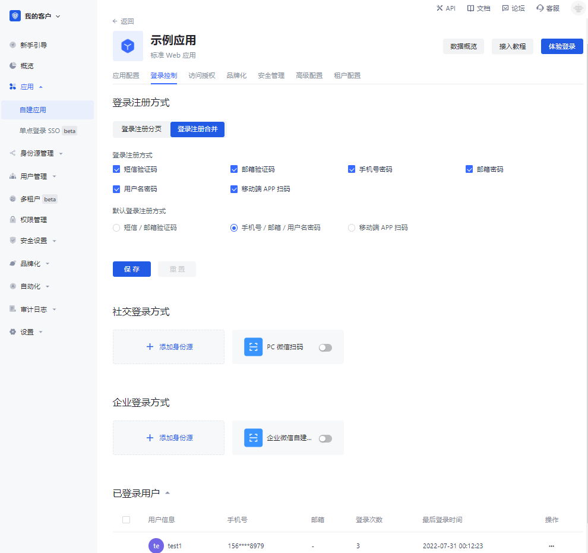
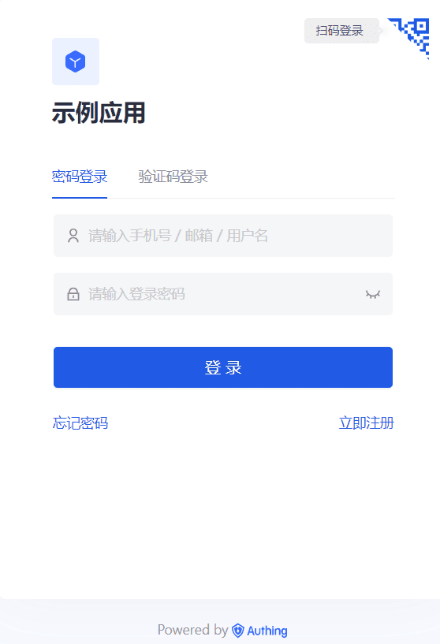
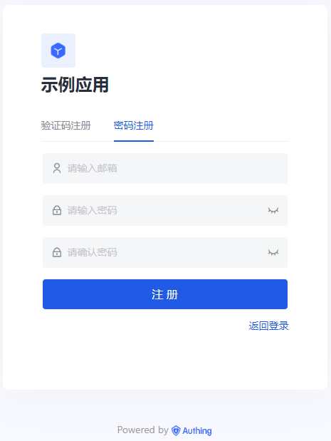
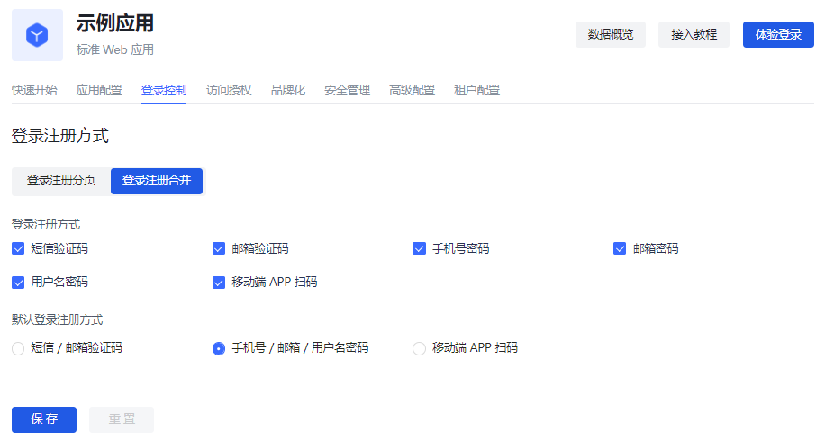
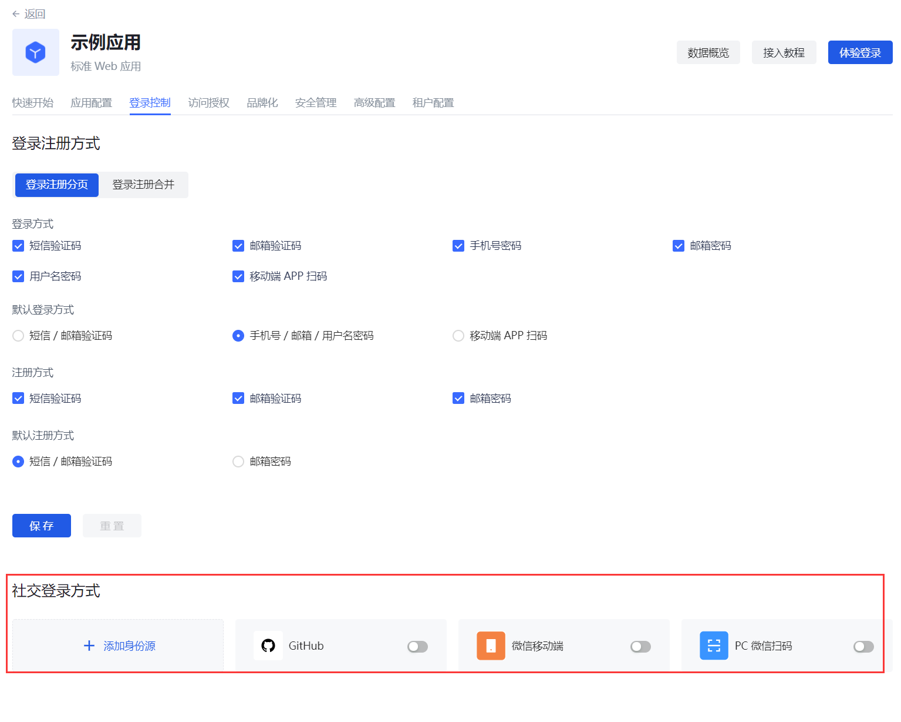

# 登录控制
​
<LastUpdated/>

路径：**控制台->应用->自建应用->应用详情->登录控制**

登录体验是软件开发者需要考虑的最重要的用户体验之一，为用户提供一个无缝、便捷而又安全的认证体验不是一件很容易的事。一般而言，登录逻辑同时关联着注册、重置密码、关联账号等。更重要的是，在登录过程中以强健和自适应身份验证的形式增强安全性通常对于许多实现至关重要。

{{$localeConfig.brandName}} 中每个用户池都拥有一个独立的二级域名，并配备了在线的登录页，访问该应用的地址即可打开本应用的登录页面。{{$localeConfig.brandName}} 提供了非常多的认证方式给开发者选择、组合。你不需要编写一行代码，可以通过托管页自建应用的 **登录控制** 维护登录页，并做一些定制化配置。

**登录控制** 选项卡支持以下几种登录 / 注册方式：​
​
* [账号密码登录](#配置登录方式)
* [短信 / 邮箱 + 验证码登录](#配置登录方式)
* [移动端 APP 扫码登录](#配置登录方式)
* [社会化身份源登录](#社会化登录方式​)
* [企业身份源登录](#企业登录方式​)

多种登录 / 注册方式支持 Web 端、移动端、小程序等多种交叉实现场景。有关详情，请参阅 [对用户进行认证](/guides/authentication/) 下相关章节。

账号密码登录、验证码登录及移动端 APP 扫码登录可以在 **登录控制** 标签页实现登录注册分页和登录注册合并。下面会分别介绍各类登录 / 注册方式。

## 登录注册分页​
​
下文分别描述登录和注册分页显示的多种场景。​
​
### 登录页​
​
你可以配置通过密码、验证码及扫码方式登录应用。​
​
{{$localeConfig.brandName}} 提供以下几种登录组合：​
​
* 手机号 + 密码​
* 邮箱 + 密码​
* 用户名 + 密码​
* 手机号 + 验证码​
* 邮箱 + 验证码​
* 移动端 APP 扫码

#### 配置登录方式
​
要在托管页配置登录方式，执行以下步骤：​
​
1. 在 **登录控制->登录注册方式->登录注册分页->登录方式** 下勾选所需登录方式。​
2. 选择 **默认登录方式**。​

::: hint-info
默认登录方式是指跳转至登录页时，默认选中的登录方式（密码、验证码、扫码）。
:::
​
3. 点击 **保存** 按钮保存配置。

#### 使用密码、验证码、扫码登录

管理员可以通过 **体验登录** 按钮体验配置的各种登录方式。

要使用账号密码登录应用，执行以下步骤：
​
1. 在上方输入框输入手机号 / 邮箱 / 用户名。​
2. 在下方输入框输入登录密码。​
3. 点击 **登录** 按钮。​
​

对于验证码登录，执行以下步骤：​
​
1. 在上方输入框输入手机号 / 邮箱。​
2. 点击 **发送验证码**。
3. 在下方输入框输入手机 / 邮箱收到的验证码。​
4. 点击 **登录** 按钮。​

::: hint-info
扫码登录功能前提是客户既有网页端应用，也有移动端 APP，并已登录移动端。此时，可使用移动端 APP 扫码登录。​
:::

对于移动端 APP 扫码登录，执行以下步骤：

1. 在移动端点开此应用。
2. 使用移动端 APP 扫码网页端登录框。

#### 忘记密码​

你若忘记密码，执行以下步骤找回密码：​
​
1. 点击登录框左下角 **忘记密码**。​
2. 输入手机号 / 邮箱。​
3. 点击 **发送验证码**。​
4. 输入验证码。​
5. 输入新密码。​
6. 点击 **确认** 按钮。​
​
提示重置成功，返回登录页重新登录。

### 注册页​
​
你可以通过密码、验证码方式注册应用。​
​
{{$localeConfig.brandName}} 提供以下几种注册组合：​
​
* 邮箱 + 密码​
* 手机号 + 验证码​
* 邮箱 + 验证码

#### 配置注册方式​

要在托管页配置注册方式，执行以下步骤：​
​
1. 在 **登录控制->登录注册方式->登录注册分页->注册方式** 下勾选所需登录方式。​
2. 选择 **默认注册方式**。​

::: hint-info
默认注册方式是指跳转至注册页时，默认打开的注册页面（密码注册、验证码注册）。​
:::

3. 点击 **保存** 按钮保存配置。

#### 使用密码、验证码注册​

要使用密码注册应用，执行以下步骤：​
​
1. 在上方输入框输入邮箱。​
2. 在下方输入框输入密码，并再次确认。​
3. 点击 **注册** 按钮。
​

对于验证码注册，执行以下步骤：​
​
1. 在上方输入框输入手机号 / 邮箱。​
2. 点击 **发送验证码**。​
3. 在下方输入框输入手机 / 邮箱收到的验证码。​
4. 点击 **注册** 按钮。

## 登录注册合并​
​
登录和注册合并显示支持以下多种场景：​
​

::: hint-info
对于登录注册分页和登录注册合并两种显示形式，登录和注册的配置和使用方法类似，可参阅登录注册分页部分了解详情。​
:::

## 社会化登录方式​

社会化登录，是指用户使用社交平台的身份认证信息在第三方应用或网址进行认证登录的流程，比如大家经常使用个人微信、QQ、微博等社交账号登录滴滴、网易云音乐等。​

社会化登录不仅有助于简化用户在第三方平台的登录体验，同时也为用户在第三方平台创建新账号提供了一种更为简单便捷的方式。不论是对于普通用户来说，还是企业来说，社会化登录都有着无可比拟的优势。​

Authing 目前共支持国内外近 30 种 [社会化登录](../../connections/social.md)，如 [微信](../../connections/social/wechat-pc/README.md)、[GitHub](../../connections/social/github/README.md)、[Apple](../../connections/social/apple-web/README.md)、[支付宝](../../connections/social/alipay-web/index.md) 等。

::: hint-info
你需要先创建待使用的社会化身份源，才可在 **自建应用->登录控制** 标签页选择已创建的身份源。
:::
​

要为单个应用添加社会化身份源，执行以下步骤：
​
1. 在应用详情页选择 **登录控制->社交登录方式**。​
2. 点击 **+添加身份源**，打开 **选择社会化身份源** 页面。​
3. 选择目标社会化身份源进行添加。

除了集成现有第三方社会化身份源，管理员还可以连接自定义社会化登录。

有关社会化登录方式详细介绍，请参阅 [社会化身份源](/guides/connections/social.md)。

## 企业登录方式​
​
企业身份源登录，是指用户使用企业的身份认证信息在公司内部应用或第三方应用进行认证登录的流程。在 {{$localeConfig.brandName}} 控制台中，企业身份源包含两类：办公应用（比如飞书、企业微信、钉钉）与标准协议应用（比如 OIDC、SAML、CAS 等标准协议）。你可以通过配置企业身份源连接，实现使用第三方身份源登录 {{$localeConfig.brandName}} 应用及 [从第三方身份源导入组织机构和用户](/guides/org/create-or-import-org/#导入组织机构)，从而降低迁移成本。Authing 会在用户每次使用企业身份源登录的时候自动将用户信息同步到 {{$localeConfig.brandName}} 的用户目录。

::: hint-info
你需要先创建待使用的企业身份源，才可在 **自建应用->登录控制** 标签页选择已创建的身份源。
:::
​

要为单个应用添加企业身份源，执行以下步骤：​
​
1. 在应用详情页选择 **登录控制->企业登录方式**。​
2. 点击 **+添加身份源**，打开 **选择企业身份源** 页面。​
3. 选择目标企业身份源进行添加。

有关企业登录方式详细介绍，请参阅 [企业身份源](/guides/connections/enterprise.md)。

## 已登录用户​

管理员可以在 **登录控制** 选项卡查看当前应用的已登录用户列表，查看并管理用户信息，强制下线：​
​
* 要查看已登录用户详情，点击 **已登录用户** 列表中目标用户，打开用户详情页。​
* 关于管理用户信息的详细描述，请参阅 [管理用户账号](/guides/user/manage-profile.md)。​
* 要强制下线已登录用户，在目标用户所在行 **操作** 列，点击更多按钮（...），选择 **强制下线**，点击 **确定** 确认下线用户。