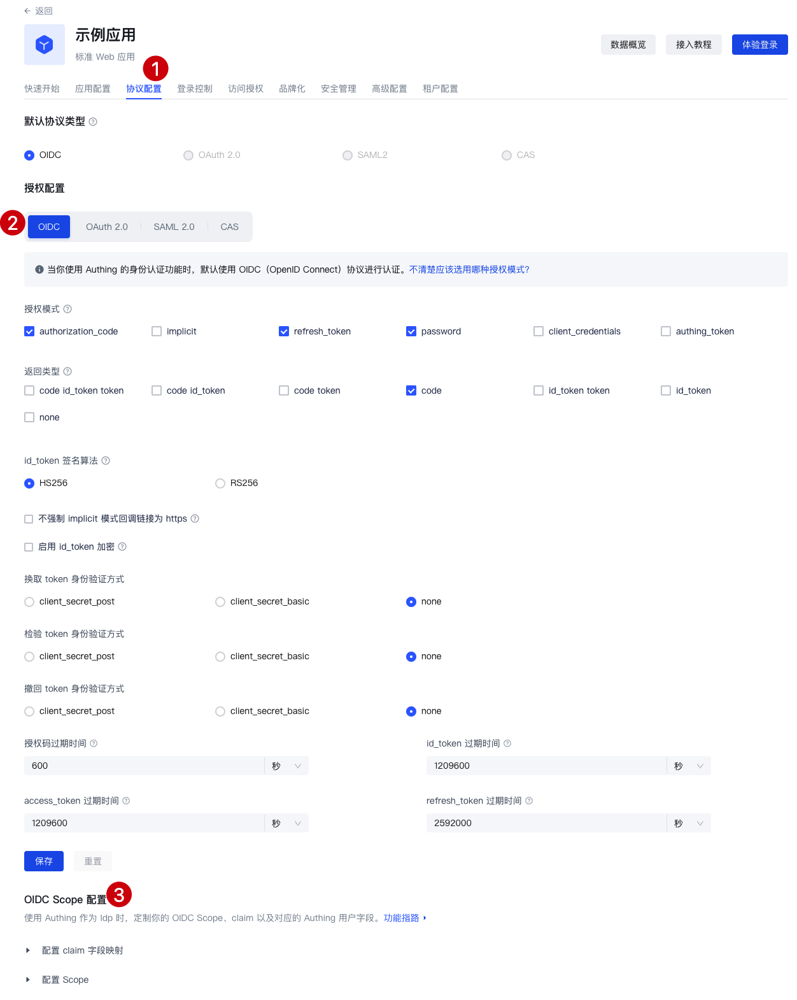
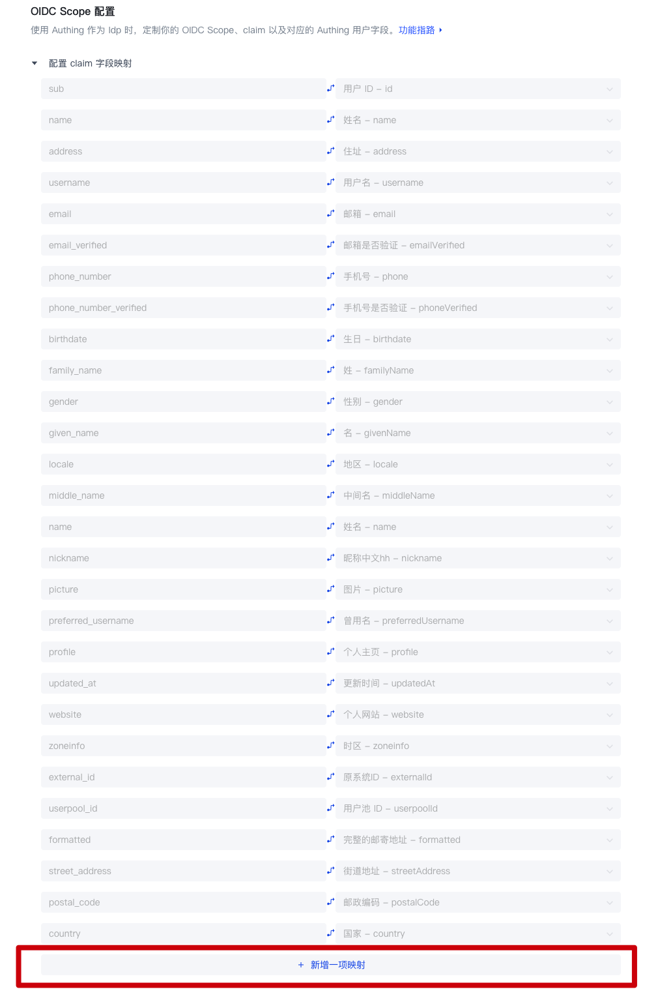
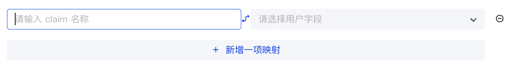
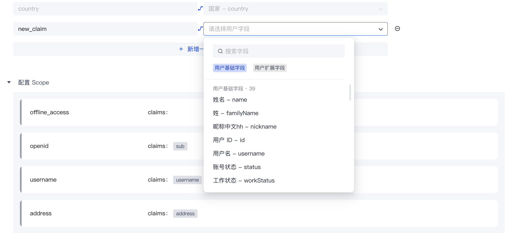
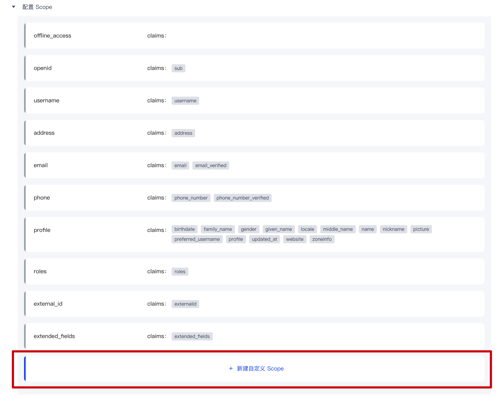
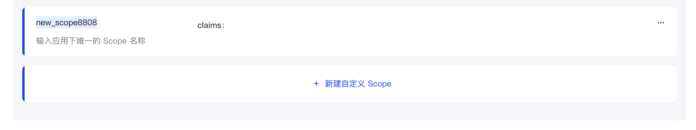
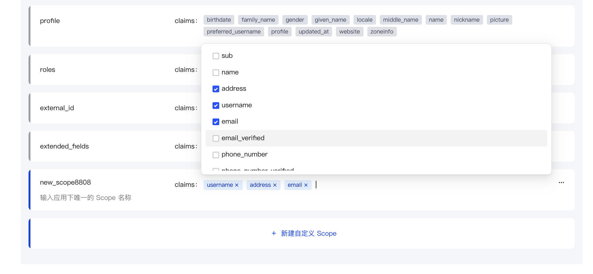

# 自定义 OIDC Scope

## 使用场景

通过自定义 Scope 以及其中的 Claim 来自定义 ID Token 返回的用户信息。

## OIDC Scope 功能配置

创建自建应用后，你可以在「协议配置」功能区下找到「OIDC」功能区，并找到「OIDC Scope 配置」。

### Claim 配置

#### 默认 Claim

| Claim 名称 | 映射的 Authing 用户字段 |
| --- | --- |
| sub | userId |
| name | name |
| address | address |
| username | username |
| email | email |
| email_verified | emailVerified |
| phone_number | phone |
| phone_number_verified | phoneVerified |
| birthdate | birthdate |
| family_name | familyName |
| gender | gender |
| given_name | givenName |
| locale | locale |
| middle_name | middleName |
| name | name |
| nickname | nickname |
| picture | picture |
| preferred_username | preferredUsername |
| profile | profile |
| updated_at | updatedAt |
| website | website |
| zoneinfo | zoneinfo |
| external_id | externalId |
| userpool_id | userpoolId |
| formatted | formatted |
| street_address | streetAddress |
| postal_code | postalCode |
| country | country |

#### 自定义 Claim

如果上述的默认 Claim 仍不满足你期望返回的用户字段，那么你可以创建自定义 Claim，并自定义配置你的 Claim 映射到哪个 Authing 用户字段（基础字段或拓展字段）。

**第一步: 点击「新增一项映射」**

**第二步: 编辑你的自定义 Claim 的名称**

**第三步: 配置自定义 Claim 映射的Authing 用户字段**

### Scope 配置

#### 默认 Scope

| Scope 名称 | 包含的 Claim | 描述 |
| --- | --- | --- |
| offline_access | / | 如果存在此参数，token 接口会返回 refresh_token 字段 |
| openid | sub | 用于存放用户 ID |
| username | username | 用户名 |
| address | address | 用户地址 |
| email | email, email_verified | 用户邮箱及验证状态 |
| phone | phone_number, phone_number_verified | 用户手机号及验证状态 |
| profile | birthday, family_name, gender, given_name, locale, middle_name, name, nickname, picture, preferred_username, profile, updated_at, website, zoneinfo | 用户详细信息 |
| roles | roles | 对应 role 信息，用户的角色列表 |
| external_id | externalId | 用户在原有系统的用户 ID |
| extended_fields | extended_fields | 用户的扩展字段信息，内容为一个对象，key 为扩展字段名，value 为扩展字段值 |

#### 自定义 Scope

如果上述的默认 Scope 仍不满足你期望返回的用户字段，那么你可以创建自定义 Scope，并自定义配置你的 Scope 中将要包含哪些 Claim。

**第一步: 点击「新建自定义 Scope」**

**第二步: 修改你的自定义 Scope 的名称**

**第三步: 配置自定义 Scope 中包含的 Claim**

### 使用自定义 Scope & Claim

- 使用托管登录页：Authing 将会默认返回所有的预置 Scope 以及你的自定义 Scope。
- 使用 SDK 直接调用：你可以自由选取调用所有你完成配置的 Scope 及其包含的 Claim。