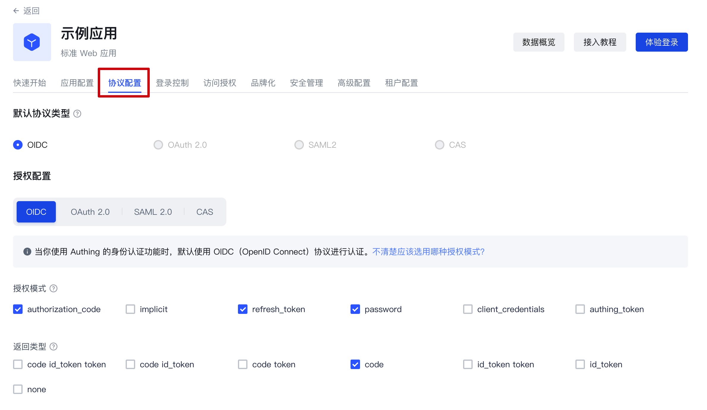
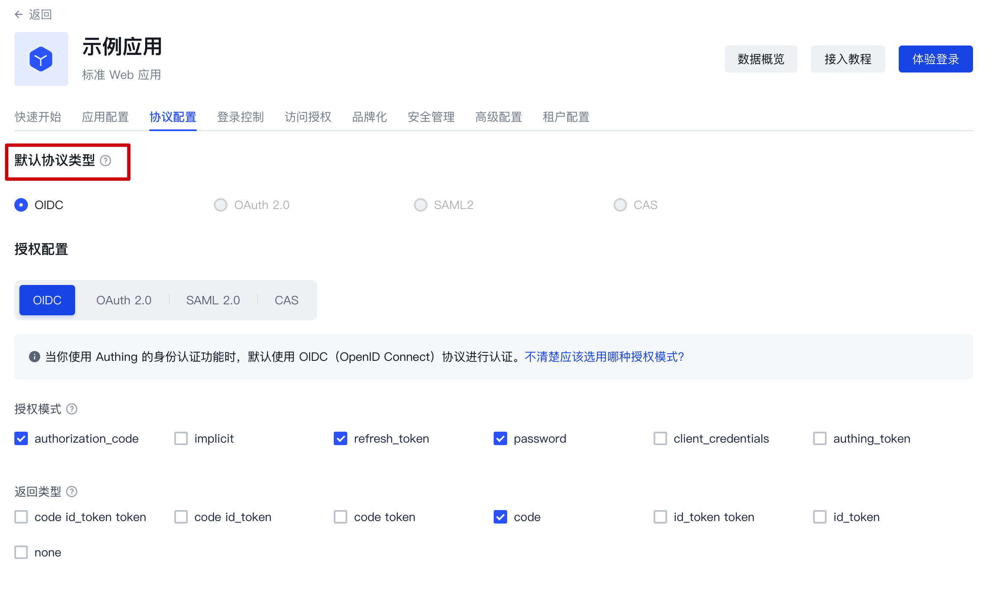

# 协议配置

路径：**应用->自建应用->应用详情->协议配置**

## 协议是什么？

首先需要明确的是：协议是在认证场景下发挥作用的。

那么，为什么用户需要认证？

最直接的原因是，管理员需要为用户能够访问的内容设定边界，特定的用户完成身份认证之后，登录至特定的应用，在这个过程中，系统管理员通过功能的配置实现了对用户的[「授权」](/concepts/authorization.md)。

在 Authing 提供的身份认证模型下，这种对用户的授权发生在用户完成身份认证的过程中，通过协议来明确这个授权流程中，客户端和服务端之间进行信息传输和验证的细节。

也就是说，这里我们讨论的「协议」，**即用户在完成身份认证过程中，管理员对用户进行「授权」时所遵循的标准流程和规则。**

如果你对「授权」的概念还不清晰，请前往阅读：[什么是授权？](/concepts/authorization.md)

## Authing 支持的协议类型

### OIDC

**1.定义**

OpenID Connect 是基于 OAuth 2.0 的身份认证协议，OIDC 的授权流程与 OAuth 2.0 一样，主要区别在于 OIDC 授权流程中会额外返回 Id Token。

**2.关键主体**

除 OAuth2.0 已经规定的主体之外，在 OIDC 协议中，**「授权服务器」**不仅签发 Access Token，同时也签发 ID Token。

**3.基本元素**

除 OAuth2.0 已经规定的关键元素之外，增加**Id Token**：由 OpenID Provider 颁发，包含关于终端用户的信息字段。

更详细的描述请阅读：[OAuth2.0 与 OIDC 解读。](/concepts/oidc/oidc-overview.md)如果你想了解更多的 OIDC 内容，可以阅读[协议规范](https://openid.net/specs/openid-connect-core-1_0.html)。

### OAuth2.0

**1.定义**

OAuth2.0 是一个关于授权的标准协议。一次 OAuth 2.0 授权是指用户**授权调用方**相关的权限。

**2.关键主体**

- **授权服务器**：负责颁发 Access Token，Authing 是授权服务器。
- **资源所有者**：你的应用的用户是资源的所有者，授权其他人访问他的资源。
- **调用方**：调用方请求获取 Access Token，经过用户授权后，Authing 为其颁发 Access Token。调用方可以携带 Access Token 到资源服务器访问用户的资源。
- **资源服务器**：接受 Access Token，然后验证它的被赋予的权限项目，最后返回资源。

**3.基本元素**

- **Code 授权码**：由授权服务器 Authing 颁发的，用于调用方使用 Code 换取 Token。
- **Access Token**：由授权服务器 Authing 颁发，持有 Access Token 说明完成了用户授权。
- **Refresh Token**：一个可选的 Token，用于在 Access Token 过期后获取一个新的 Access Token。

**4.常见的授权模式**

- 在你的应用中，让用户访问登录链接，浏览器跳转到 Authing，用户在 Authing 完成**认证**。
- 浏览器接收到一个从 Authing 服务器发来的**授权码**。
- 浏览器通过重定向将**授权码**发送到你的应用**后端**。
- 你的应用服务将**授权码**发送到 Authing 获取 **AccessToken**，如果需要，还会返回 refresh token。
- 你的应用后端现在知道了用户的身份，后续可以保存用户信息，重定向到前端其他页面，使用 AccessToken 调用资源方的其他 API 等等。

更详细的描述请阅读：[OAuth2.0 与 OIDC 解读。](/concepts/oidc/oidc-overview.md)如果你想了解更多的 OAuth 2.0 内容，可以阅读[协议规范](https://tools.ietf.org/html/rfc6749)。

### SAML2.0

**1.定义**

应用（SP）需要知道用户的身份，就需要向身份提供方（IdP）询问。IdP 知道用户的身份，当用户在 IdP 登录成功，IdP 就将用户的身份以 **SAML 断言**的形式发给 SP。SP 信任 IdP 发来的身份断言，从而赋予该用户在 SP 的相关权限。

**2.关键主体**

- **服务提供方（Service Provider）**：应用本身
- **身份提供方（Identity Provider）**：向 SP 提供身份的对象；Authing 可以作为身份提供方，还有一些其他的身份提供方，例如 Okta、SSOCircle、Auth0，他们都可以向 SP 返回身份断言。

**3.基本元素**

Assertion：XML 格式的身份断言。**身份提供方**能够向 SP 发送**身份断言**，所谓身份断言就是由 Authing 签发的，可以**标识某个人身份的 Token**，只不过，在 SAML 协议中，这个 Token 的格式是 XML 形式的。

更详细的描述请阅读：[SAML 协议解读。](/concepts/saml/saml-overview.md)如果你想了解更多的 OIDC 内容，可以阅读[协议规范](https://www.rfc-editor.org/rfc/rfc7522)。

### CAS

**1.定义**

CAS 是一种单点登录协议，允许网站对用户进行身份验证。他可以为多个应用提供单点登录解决方案。与 OAuth 和 OIDC 不同的是，CAS 是一种对用户进行身份验证的工具；而授权是基于实际的应用的。

**2.关键主体**

1. 应用（SP）：可以是有前端页面的 Web 应用，也可以是仅有后端服务的数据库服务器
2. 浏览器：应用程序通过浏览器来与 CAS 服务器进行通信
3. CAS 服务器

**3.基本元素**

应用服务（SP）和 CAS 服务器通过 Ticket 进行验证结果的通信。

**4.常见的认证授权流程**

- 用户尝试访问尚未验证的应用
- 用户被重定向到 CAS 服务器（Authing 可以作为 CAS 服务器）
- 用户在 CAS 服务器提供的认证页面完成身份验证，CAS 服务器验证用户是否是可信的
- 认证成功后生成 Ticket 作为认证成功的凭证，附加在 URL 上进行返回
- 应用（SP）向 CAS 服务器发送请求，验证 Ticket 是否有效，通过验证后回调至应用（SP）

如果你想了解更多 CAS 相关的内容，可以阅读[协议规范](https://www.rfc-editor.org/rfc/rfc7522)。

## 在什么情况下你需要进行协议配置？

Authing 的所有自建应用默认基于 OIDC 协议进行认证和授权。如果你的应用需要基于其他的协议类型进行认证授权流程的实现，你可以在「协议配置」功能区开启对应类型的协议，并完成配置。

## 协议配置的步骤

### 第一步: 创建自建应用并找到配置区

创建自建应用后，找到「协议配置」功能区：

### 第二步: 完成协议配置

#### 配置 OIDC 协议

**1.选择合适的授权模式**

当你创建完成自建应用后，Authing 默认使用 OIDC 的授权码（authorization code）模式。如果需要更换授权模式，请提前查阅文档以判断授权模型与你的实际情况的契合程度：[选择合适的 OIDC 授权模式](/concepts/oidc/choose-flow.md)

**2.完成授权模式下的配置**

确定要选择的授权模式后，你可以根据这里的指引完成对应授权模式下的功能配置：[OIDC 授权模式配置](/guides/federation/oidc.md)

**3.配置 Claim 和 Scope**

这是 Authing 对于 OIDC 协议支持的高级功能，你可以在此：

- 查看 Authing 默认的 Claim 及其与 Authing 用户字段之间的映射关系
- 创建自定义 Claim，并自定义这些 Claim 的映射关系
- 查看 Authing 默认的 Scope 及其包含的 Claim
- 创建自定义 Scope，并自定义每这些 Scope 中携带的 Claim

更多关于 Authing 默认的 Scope 与 Claim 相关信息以及该功能的具体使用方式，请查看：[自定义 OIDC Scope](oidc-scope.md)

#### 配置 OAuth2.0 协议

**1.选择合适的授权模式**

在授权模型上，OIDC 是 OAuth2.0 的超集。因此，你可以参考 OIDC 的授权模式选择与你的场景相符的类型：[选择合适的 OAuth 授权模式](/concepts/oidc/oidc-overview.md)

**2.完成授权模式下的配置**

确定要选择的授权模式后，你可以根据这里的指引完成对应授权模式下的功能配置：[OAuth 授权模式配置](/guides/federation/oauth.md)

#### 配置 SAML 协议

在「SAML2 身份提供商」卡片中，打开启用 SAML2 Provider 开关，填写**默认 ACS 地址**
和**设置**信息。然后点击保存。具体的 ACS 地址 SAML SP 方会提供，具体的设置项需要根据 SAML SP 方的要求进行配置。更详细的配置流程请参考：[配置 SAML 协议](/guides/federation/saml.md)

#### 配置 CAS 协议

在「CAS 」卡片中，打开启用 CAS IdP 开关，输入你的用户唯一标识，如：`${user.username}`

点击保存后即可完成配置。更详细的配置流程请参考：[配置 CAS 协议](/guides/federation/cas.md)

### 第三步: 选择默认协议类型

完成配置后，如果你直接使用托管登录页，那么你可以直接在「默认协议类型」中切换至你新配置的协议类型：

