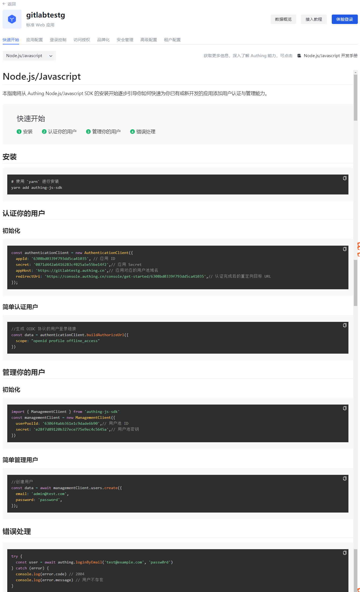

# 快速开始

<LastUpdated/>

路径：**应用->自建应用->应用详情->快速开始**

各应用的 **快速开始** 标签页将会简要介绍如何安装并使用各语言 SDK 为已有或新开发应用快速认证、管理用户，并提供常见错误处理的方法。

::: hint-info​
此部分仅提供快速引导。关于各语言 SDK 的使用详情，可以点击页面右上角链接访问开发手册相应章节。
::: ​

​
