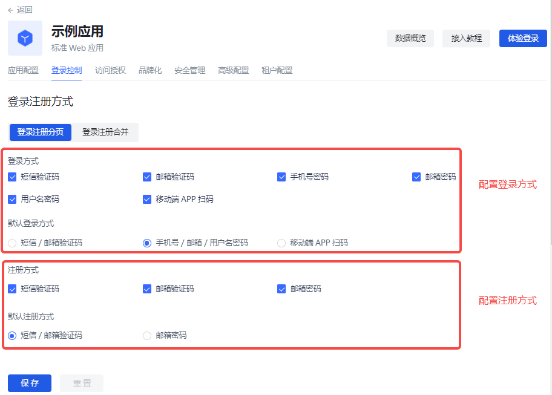

# 登录控制

路径：**应用->自建应用->应用详情->登录控制**

登录体验是软件开发者需要考虑的最重要的用户体验之一，为用户提供一个无缝、便捷而又安全的认证体验不是一件很容易的事。一般而言，登录逻辑同时关联着注册、重置密码、关联账号等逻辑。更重要的是，在登录过程中以强健和自适应身份验证的形式增强安全性通常对于许多实现至关重要。

{{$localeConfig.brandName}} 中每个用户池都拥有一个独立的二级域名，并配备了在线的登录页，访问 `https://YOUR_DOMAIN.authing.cn/login`
即可访问此登录页面。{{$localeConfig.brandName}} 提供了非常多的认证方式给开发者选择、组合。您不需要编写一行代码，可以通过托管页自建应用的 **登录控制** 维护登录页，并做一些定制化配置。

有两种方式配置登录注册页：
* 登录注册分页
* 登录注册合并

## 登录注册分页

下文分别描述登录和注册分页显示的多种场景。

### 登录页

您可以通过密码、验证码及扫码方式登录应用。

Authing 提供以下几种登录组合：
* 手机号 + 密码
* 邮箱 + 密码
* 用户名 + 密码
* 手机号 + 验证码
* 邮箱 + 验证码
* 移动端 APP 扫码

#### 配置登录方式

要在托管页配置登录方式，执行以下步骤：

1. 在 **登录控制->登录注册方式->登录注册分页->登录方式** 下勾选所需登录方式。
2. 选择 **默认登录方式**。
::: hint-info
默认登录方式是指跳转至登录页时，默认打开的登录页面（密码、验证码、扫码）。
::: 
3. 点击 **保存** 按钮保存配置。

#### 使用密码、验证码、扫码登录

使用密码登录应用，执行以下步骤：
1. 在上方输入框输入手机号 / 邮箱 / 用户名。
2. 在下方输入框输入登录密码。
3. 点击 **登录** 按钮。

对于验证码登录，执行以下步骤：
1. 在上方输入框输入手机号 / 邮箱。
2. 点击 **发送验证码**。
3. 在下方输入框输入手机 / 邮箱收到的验证码。
3. 点击 **登录** 按钮。

对于扫码登录，执行以下步骤：

::: hint-info
扫码登录功能前提是客户既有网页端应用，也有移动端 APP，并已登录移动端。此时，可使用移动端 APP 扫码登录。
::: 

1. 登录移动端 APP。
2. 在网页端点击登录框右上角二维码。
3. 移动端 APP 扫码登录。

#### 忘记密码

您若忘记密码，执行以下步骤找回密码：

1. 点击登录框左下角 **忘记密码**。
2. 输入手机号 / 邮箱。
3. 点击 **发送验证码**。
4. 输入四位验证码。
5. 输入新密码。
6. 点击 **确认** 按钮。

提示重置成功，返回登录页重新登录。

### 注册页

您可以通过密码、验证码方式注册应用。

Authing 提供以下几种注册组合：
* 邮箱 + 密码
* 手机号 + 验证码
* 邮箱 + 验证码

#### 配置注册方式

要在托管页配置注册方式，执行以下步骤：

1. 在 **登录控制->登录注册方式->登录注册分页->注册方式** 下勾选所需登录方式。
2. 选择 **默认注册方式**。

::: hint-info
默认注册方式是指跳转至注册页时，默认打开的注册页面（密码注册、验证码注册）。
::: 

3. 点击 **注册** 按钮保存配置。

#### 使用密码、验证码注册

使用密码登录应用，执行以下步骤：
1. 在上方输入框输入邮箱。
2. 在下方输入框输入密码，并再次确认。
3. 点击 **注册** 按钮。

对于验证码注册，执行以下步骤：
1. 在上方输入框输入手机号 / 邮箱。
2. 点击 **发送验证码**。
3. 在下方输入框输入手机 / 邮箱收到的验证码。
4. 点击 **注册** 按钮。

## 登录注册合并

登录和注册合并显示支持以下多种场景：

::: hint-info
对于登录注册分页和登录注册合并两种显示形式，登录和注册的配置和使用方法类似，可参阅登录注册分页部分了解详情。
::: 
