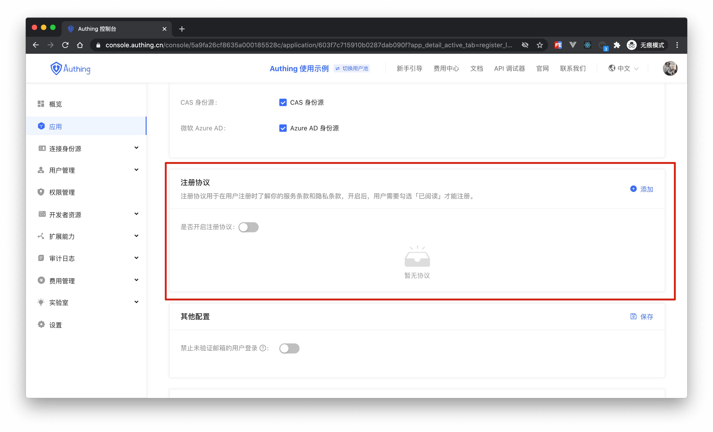
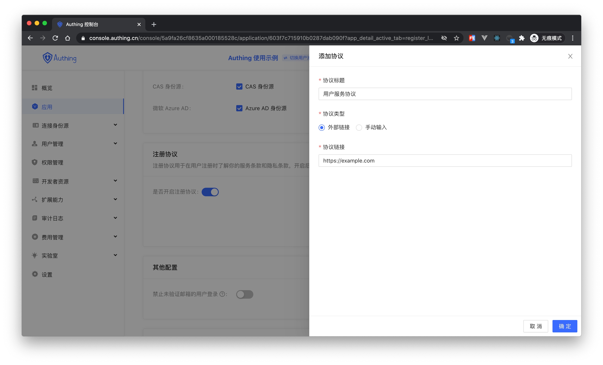
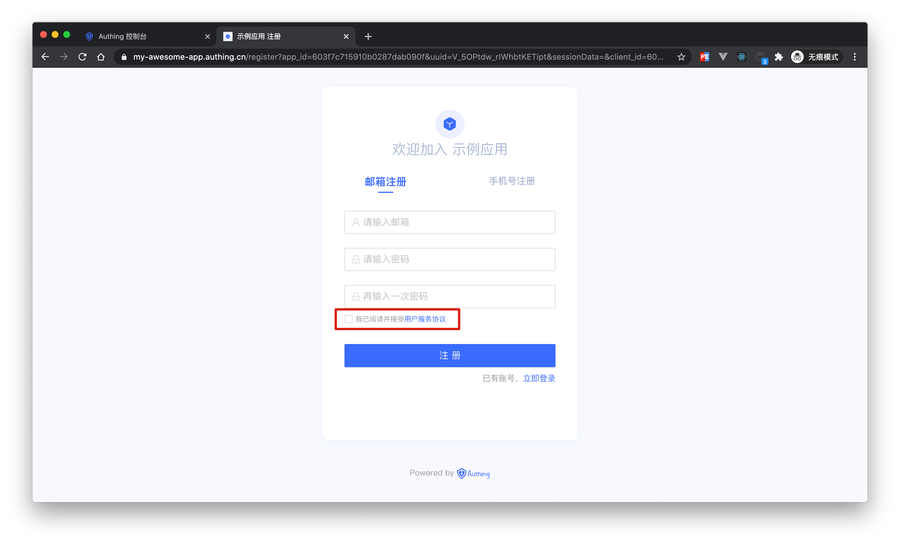

# 添加注册协议

<LastUpdated/>

当用户注册，你可能需要让用户了解并同意你的服务条款才让其注册，可以在 **品牌化->全局登录框->功能配置->登录注册协议** 中进行配置：

## 配置注册协议

首先点击开关，开启注册协议，然后点击添加按钮，填入协议信息：

- 协议标题是用户在登录界面看到的协议标题
- 协议类型可以有两种模式
  - 外部链接：即你已经部署好了协议详细内容的页面，直接输入页面地址即可，用户点击协议标题会跳转到你配置的链接。
  - 手动输入：即你可以在 {{$localeConfig.brandName}} 通过富文本编辑器输入协议的详细内容，用户点击协议标题会显示此内容。

配置完成后就可以在注册界面看到了：

