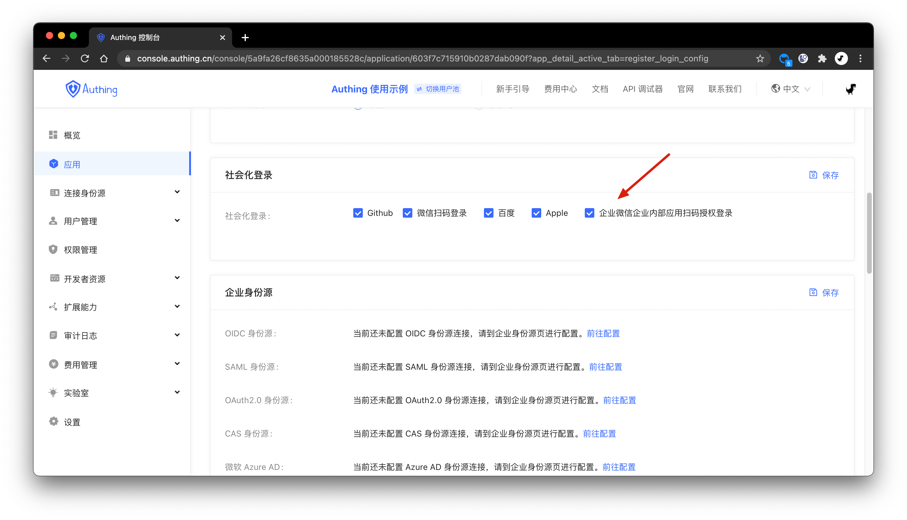
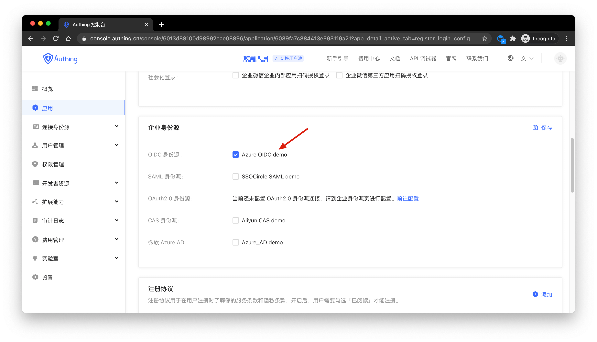
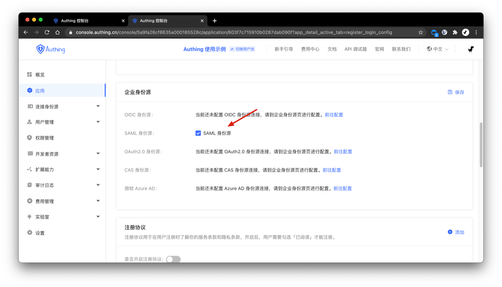
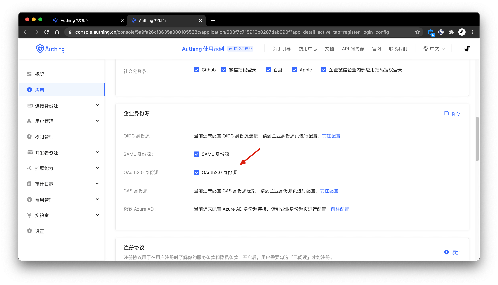
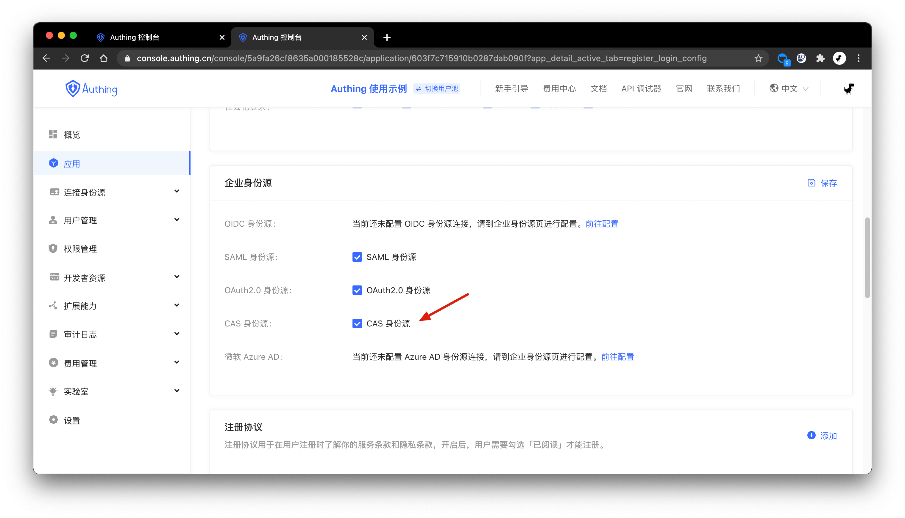
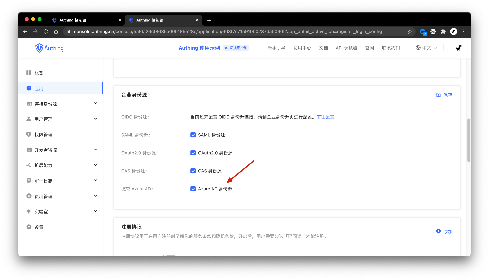
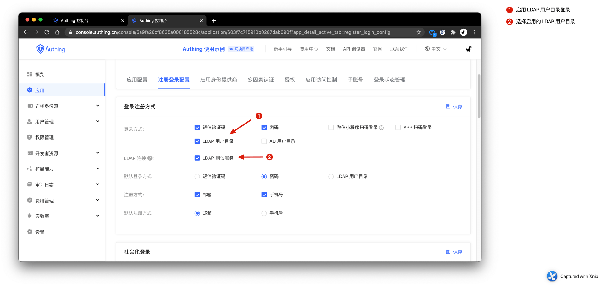
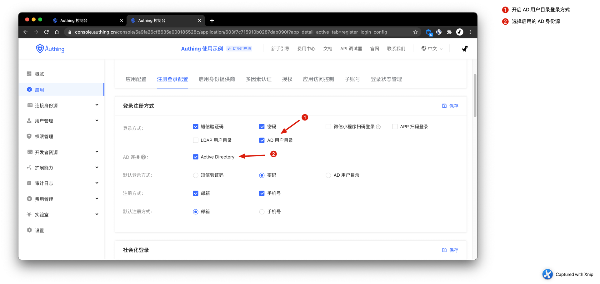

# 配置登录注册方式

<LastUpdated/>

默认情况下，你的应用只包含最基本的登录注册方式：手机号验证码登录、账号密码登录、邮箱注册、手机号注册。

除了上述最基础的登录注册方式，{{$localeConfig.brandName}} 还支持：

  - [添加社会化登录](#添加社会化登录)
  - [添加扫码登录](#添加扫码登录)
    - [使用小程序扫码登录](#添加小程序扫码登录)
    - [使用自建移动应用扫码登录](#添加自建移动应用扫码登录)
  - [添加企业身份源登录](#添加企业身份源登录)
    - [使用企业微信登录](#添加企业微信登录)
    - [使用 OIDC 身份源登录](#添加-oidc-身份源登录)
    - [使用 SAML 身份源登录](#添加-saml-身份源登录)
    - [使用 OAuth2.0 身份源登录](#添加-oauth20-身份源登录)
    - [使用 CAS 身份源登录](#添加-cas-身份源登录)
    - [使用 微软 Azure AD 登录](#添加-微软-azure-ad-登录)
    - [使用 LDAP 用户目录登录](#添加-ldap-用户目录登录)
    - [使用 Windows AD 用户目录登录](#添加-windows-ad-用户目录登录)

## 添加社会化登录

{{$localeConfig.brandName}} 目前一共支持国内外将近 20 余种社会化登录，如微信、GitHub、Sign in with Apple、支付宝等，以下是完整的列表：

!!!include(common/social-connections-table.md)!!!

### 配置自定义社会化登录

{{$localeConfig.brandName}} 提供接入**自定义 OAuth2.0 身份提供商**的能力，如果你需要连接非 {{$localeConfig.brandName}} 内置的社会化登录身份源，可以<router-link to="/connections/custom-social-provider/" target="_blank">阅读此指引</router-link>。

### 微信解决方案

{{$localeConfig.brandName}} 针对微信生态有一套完整的解决方案，你可以查看[产品介绍](https://authing.cn/solutions/wechat)以及阅读[打通微信账号体系指引](/guides/wechat-ecosystem/)。

## 添加扫码登录

### 添加小程序扫码登录

小程序扫码登录网站是 {{$localeConfig.brandName}}  的一个开创性的设计，在 {{$localeConfig.brandName}}  中开启扫描小登录二维码登录后可以获得微信官方的实名用户信息， 用户一键授权即可以真实号码完成注册或者登录，为开发者建立以手机号码为基础的账号体系。
详情请[阅读此文档](/guides/wechat-ecosystem/wechat-miniprogram-qrcode/README.md)。

### 添加自建移动应用扫码登录

随着移动互联网的普及，手机已经成为人们生活中的必需品，通过手机扫描二维码完成认证的方式变得越来越常见。越来越多的移动应用集成了扫描二维码登录 PC 端网站应用的功能，这对于用户来说是一种既方便又安全的体验。借助 {{$localeConfig.brandName}} 提供的扫描登录能力，可以帮助快速、安全地实现此功能。详情请[阅读此文档](/guides/authentication/qrcode/use-self-build-app/)。

## 添加企业身份源登录

通过配置企业身份源登录，你可以利用现用企业用户目录（如企业微信、LDAP 用户目录、Windows AD 用户目录等），降低迁移成本。{{$localeConfig.brandName}} 会在用户每次使用企业身份源登录的时候自动将用户信息同步到 {{$localeConfig.brandName}} 的用户目录。

### 添加企业微信登录

配置流程请见[接入企业微信内部应用扫码登录](/connections/wechatwork-corp-qrconnect/)。配置完成之后，你需要在应用中开启此登录方式：

### 添加 OIDC 身份源登录

配置流程请见[连接 OIDC 身份源](/connections/oidc/)。配置完成之后，你需要在应用中开启此登录方式：

### 添加 SAML 身份源登录

配置流程请见[连接 SAML 身份源](/connections/saml/)。配置完成之后，你需要在应用中开启此登录方式：

### 添加 OAuth2.0 身份源登录

配置流程请见[连接 OAuth2.0 身份源](connections/custom-social-provider/)。配置完成之后，你需要在应用中开启此登录方式：

### 添加 CAS 身份源登录

配置流程请见[连接 CAS 身份源](/connections/cas/)。配置完成之后，你需要在应用中开启此登录方式：

### 添加 微软 Azure AD 登录

配置流程请见[连接 Azure Active Directory 身份源](/connections/azure-active-directory/)。配置完成之后，你需要在应用中开启此登录方式：

### 添加 LDAP 用户目录登录

配置流程请见[连接 LDAP 身份源](/connections/ldap/)。配置完成之后，你需要在应用中开启此登录方式：

### 添加 Windows AD 用户目录登录

配置流程请见[连接 Windows Active Directory 身份源](/connections/windows-active-directory/)。配置完成之后，你需要在应用中开启此登录方式：

