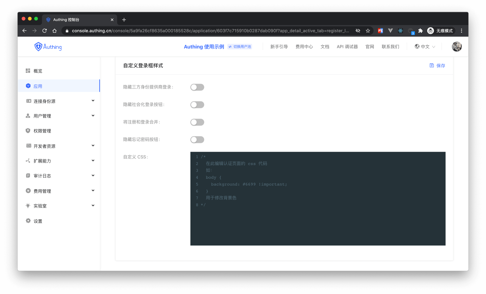
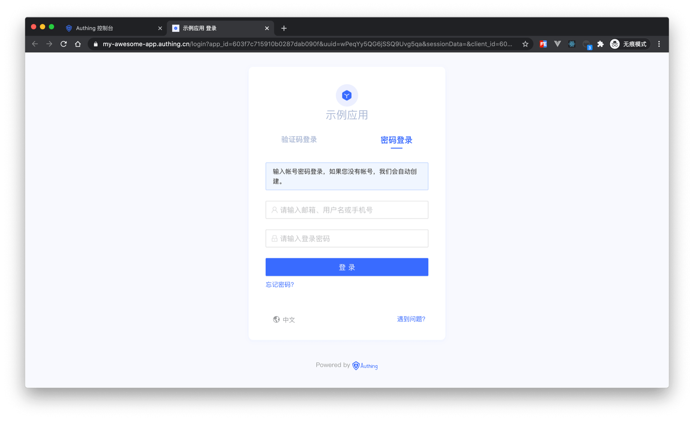
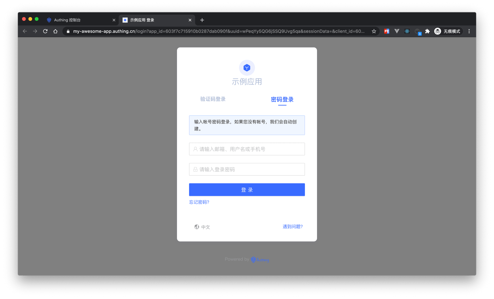
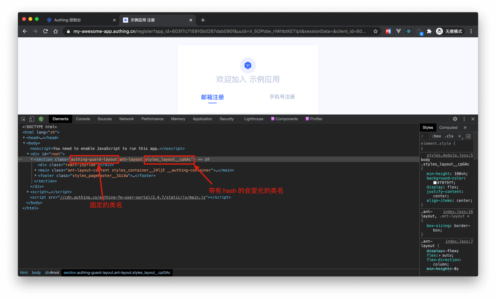

# 自定义登录框样式

<LastUpdated/>

{{$localeConfig.brandName}} 的登录框提供了非常方便的自定义样式配置，你可以在 **应用详情**->**注册登录配置** 中进行配置：


## 可配置项

### 隐藏三方身份提供商登录

开启之后将不会显示所有第三方身份提供商按钮

### 隐藏社会化登录按钮

开启之后将不会显示所有社会化登录应用按钮。

### 将注册和登录合并

开启之后，如果用户输入一个不存在的账号，会自动为其创建一个账号并登录，还会有相关的提示信息。


### 隐藏忘记密码按钮

开启之后，「忘记密码」按钮将会被隐藏。

### 自定义 CSS

通过自定义 CSS 对登录框进行一些高级自定义样式定制。如修改背景颜色：

```css
.authing-guard-layout {
  background: gray;
}
```



::: hint-warning
注意：具体的 CSS 类名可以在 {{$localeConfig.brandName}} 的登录界面通过 Chrome 控制台查看，需要自定义样式的 dom 标签都提供了固定的类名，若带有 hash 的类名不能使用，因为会经常变化。
:::


