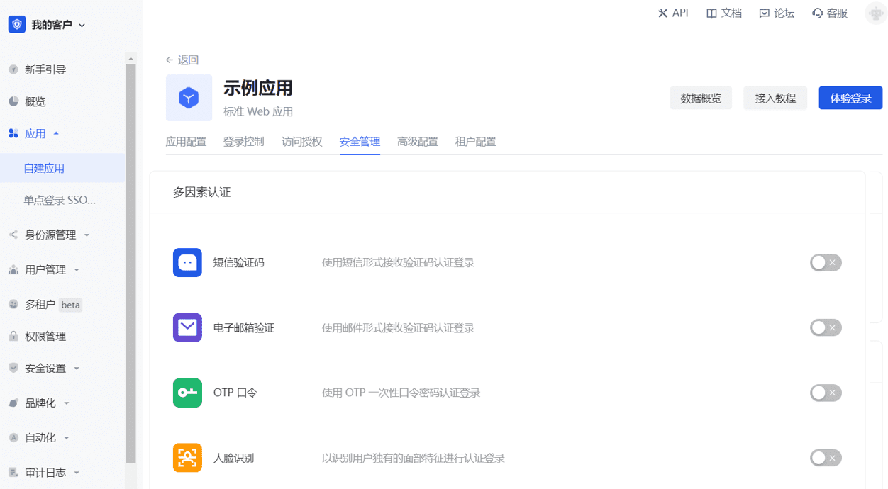

# 开启多因素认证

<LastUpdated/>

多因素认证（Multi Factor Authentication，简称 MFA）是一种非常简单的安全实践方法，能够在用户名称和密码之外再额外增加一层保护。启用 MFA 后，用户登录时，除了需要提供用户名和密码外（第一次身份验证），还需要进行第二次身份验证，多因素身份认证结合起来将为你的帐号和资源提供更高的安全保护。你可以在此了解[什么是多因素认证](/concepts/mfa.md)。

你可以如下图所示为你的应用开启 MFA：

::: hint-info
* 要配置应用级别 MFA，必须在 **应用->自建应用->应用详情->高级配置** 中开启 **自定义本应用的安全规则** 开关，才会出现 **安全管理** 页签。
* 应用级别的 MFA 配置优先级高于全局 MFA。
:::

更多接入流程，详见[多因素认证综述](/guides/security/mfa/)。