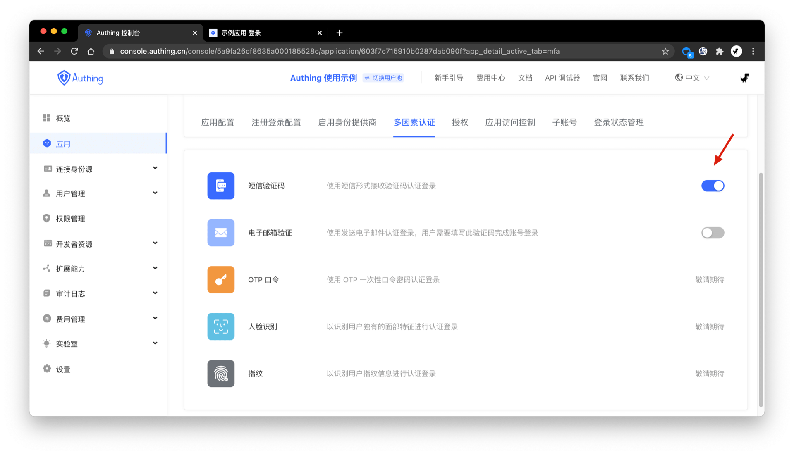
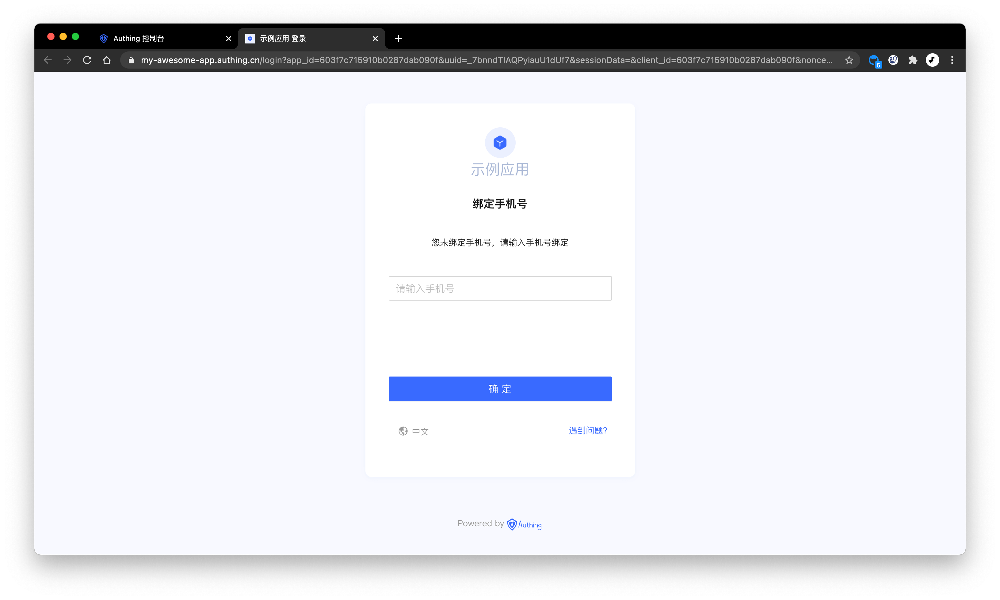

# 开启多因素认证

<LastUpdated/>

多因素认证（Multi Factor Authentication，简称 MFA）是一种非常简单的安全实践方法，它能够在用户名称和密码之外再额外增加一层保护。启用多因素认证后，用户进行操作时，除了需要提供用户名和密码外（第一次身份验证），还需要进行第二次身份验证，多因素身份认证结合起来将为你的帐号和资源提供更高的安全保护。你可以[在此了解更多 MFA 相关的概念](/concepts/mfa.md)。

你可以在此为你的应用开启多因素认证：

## 自适应 MFA

Authing 中的多因素认证是自适应的，即会根据用户具备的验证手段动态验证：

- 如果用户绑定了手机号，且应用开启了短信验证码 MFA，就会使用手机号验证码作为 MFA 验证手段；
- 如果用户绑定了手机号，且应用开启了电子邮件 MFA，就会使用邮件验证码作为 MFA 验证手段；
- 如果用户没有绑定手机号、邮箱，会要求用户先绑定手机号。

更多具体的接入流程请见[对用户进行多因素认证](/guides/authentication/mfa/)。

