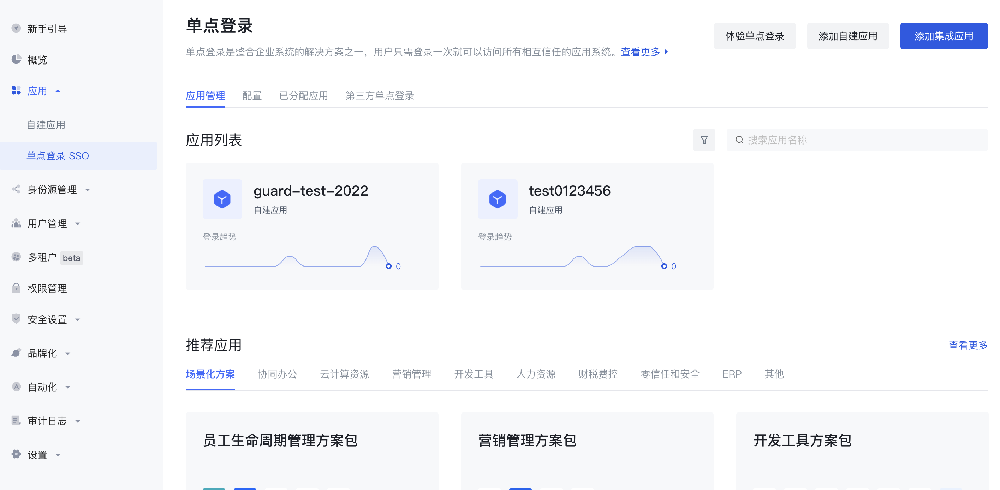
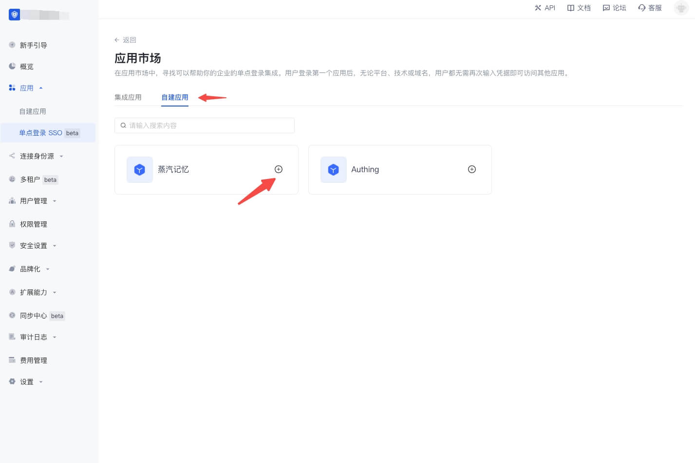
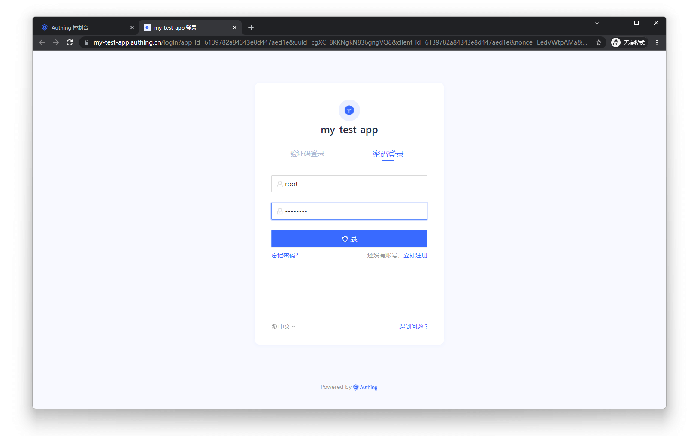
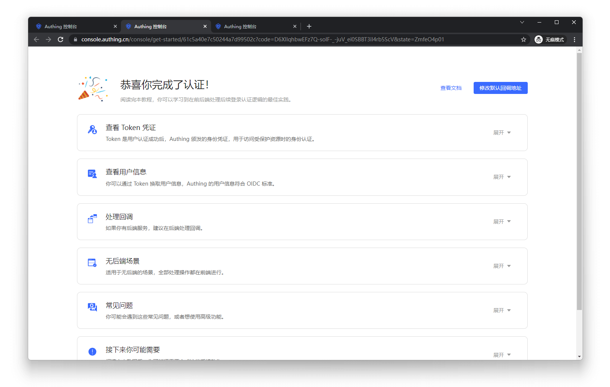

# 自建应用 SSO 方案

<LastUpdated/>

开启应用之间的单点登录后，同一个用户池下的不同应用之间的登录状态将会打通，终端用户只需登录一次即可在不同的应用之间畅行。

## 创建两个应用

首先你可以按照[指引](./create-app.md)创建两个应用。

## 配置单点登录

进入菜单 **应用** > **单点登录 SSO**，点击左上角**添加应用**，然后选择**自建应用**，在下方的列表里找到刚刚创建的应用，点击 **+** 号，就完成了多应用单点登录的配置

<!-- 分别进入这两个应用的配置页面，选择**登录控制**标签页，开启多域名单点登录开关。 -->

## 体验应用单点登录

进入 **单点登录 SSO**的**应用列表**标签，选择一个应用，点击**体验登录**

在登录页面完成登录：

成功后会跳转到应用回调地址：

接下来我们点击另一个应用的体验按钮：

用户无需再次输入密码，直接进入了该用用的回调地址：

## 使用 SDK 接入单点登录

详细的接入流程请见 [实现单点登录（SSO）](/guides/authentication/sso/)，以及[单点登录 SDK](/reference/sdk-for-sso.md)文档。
