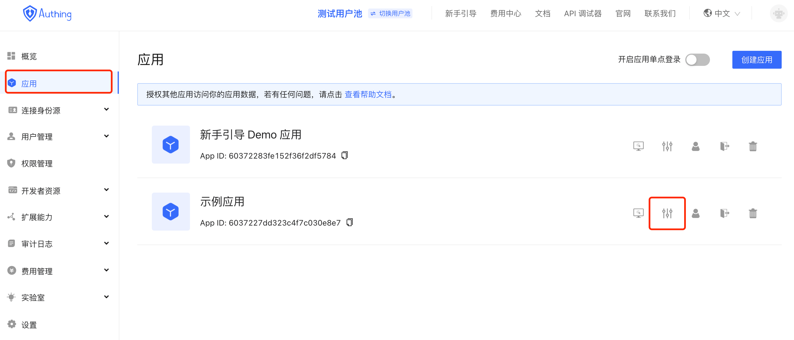

# 管理子账号

<LastUpdated/>

本文旨在描述如何通过 Authing 的「子账号」功能进行应用子账号的添加。通过添加子账号，用户可以通过 Authing 账号登录到所有应用。

## 背景

传统应用都是通过录入账号密码进行登录访问，随着开发、办工、工具类软件使用的越来越多，就需要用户记忆多套的账号密码。如果为了便捷登录，设置为统一的密码、弱密码（如：12345678），又存在撞库、盗库等安全风险，对用户的信息造成损失。

## Authing 子账号

Authing 「子账号」功能是将用户在 Authing 平台的账号与用户的应用账号进行绑定，通过账号映射与应用的账号建立唯一标识，以 Authing 的账号作为 “主账号”，通过“主账号” 登录用户的所有应用，解决用户记忆多套账号的问题。

## 操作步骤

通过分配的 Authing 认证地址，输入注册的 Authing 账号登录；  
点击「应用」选择要分配子账号的应用，点击「配置」；

进入配置页面，选择「子账号」功能；

点击「添加」，在弹出的添加窗口录入相关信息，点击「确定」，完成绑定  
主账号： Authing 唯一账号  
子账号：应用账号

完成添加状态

