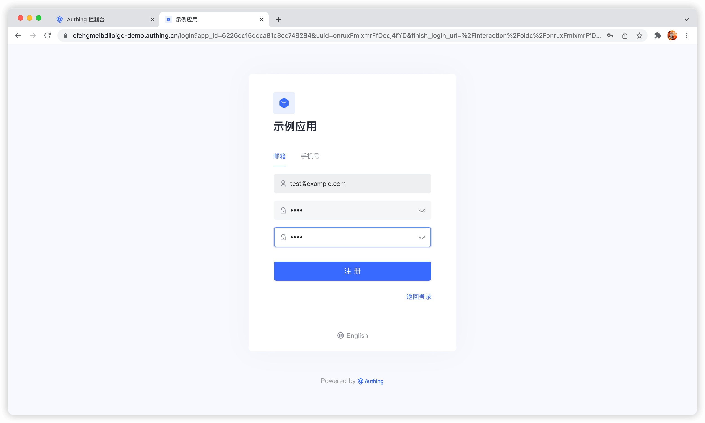
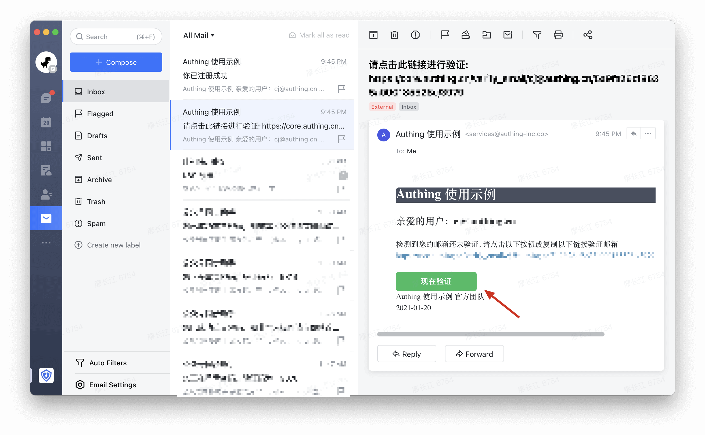
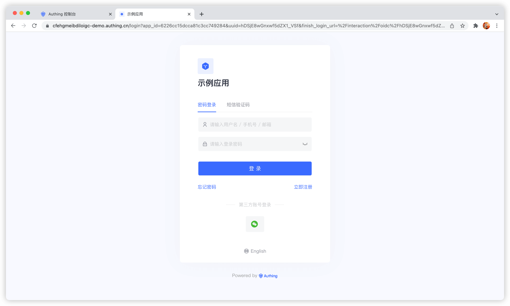
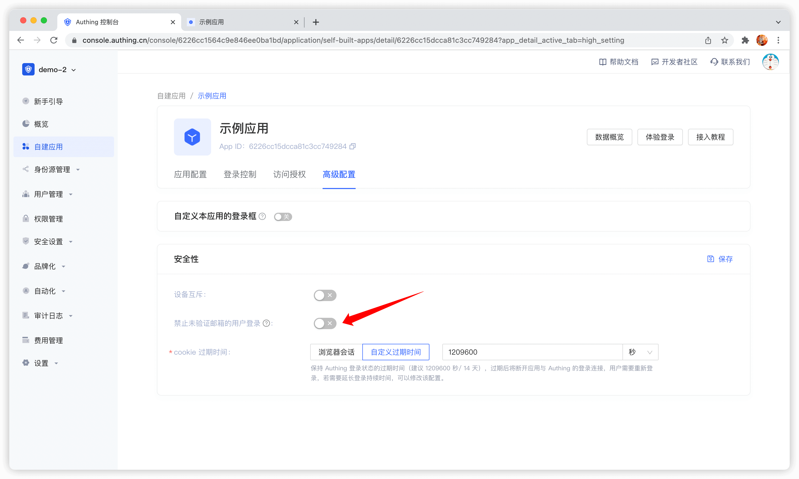
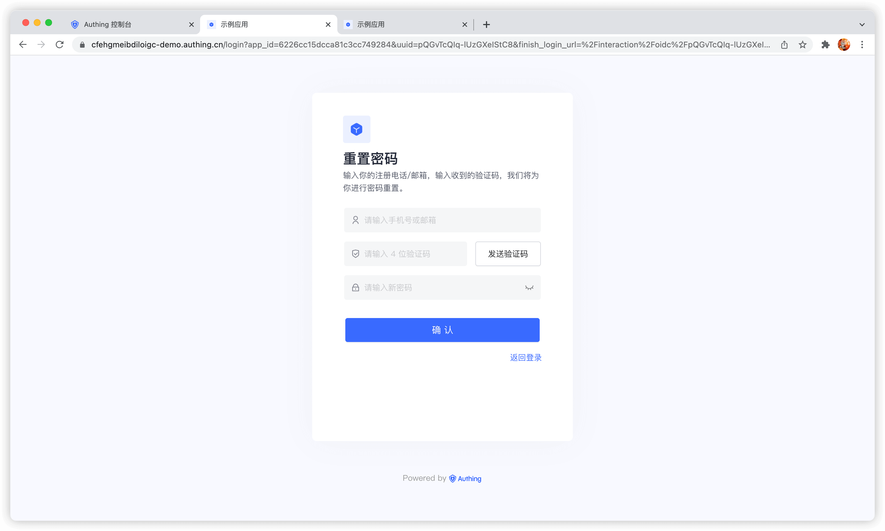
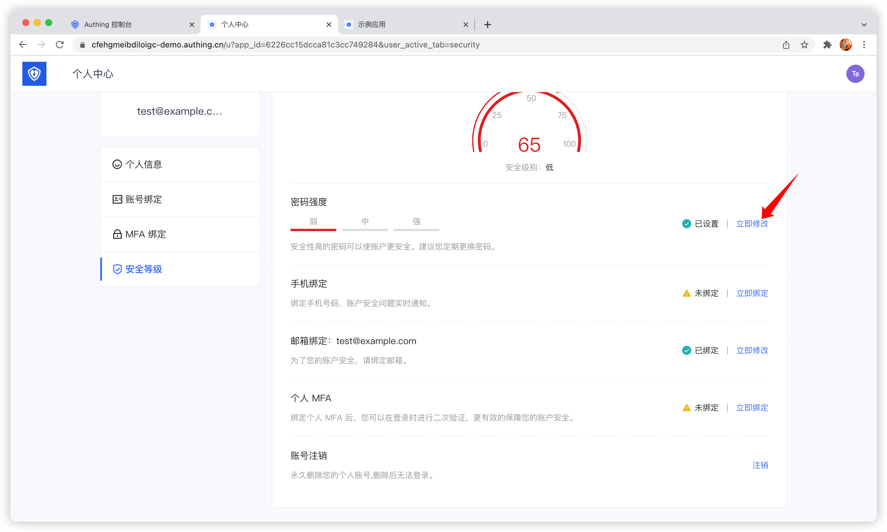

# 使用账号密码认证

<LastUpdated/>

在 {{$localeConfig.brandName}} 中，账号密码共分为以下三种形式：

* 邮箱 + 密码登录
* 用户名 + 密码登录
* 手机号 + 密码登录

当为用户提供账号密码形式的认证手段时，作为 IT 系统管理员或者开发者，你还需要实现以下功能：

* 重置密码：可以通过邮箱验证码或者手机号验证码找回密码。
* 修改密码：可以通过现有密码重置密码。

要使用 {{$localeConfig.brandName}} 实现这些功能， 我们提供了三种不同的接入方式：

1. [使用 {{$localeConfig.brandName}} 托管登录页](#使用托管登录页)，无需一行代码，你可以通过 {{$themeConfig.sampleAppDomain}} 体验。
2. [使用 {{$localeConfig.brandName}} 提供的内嵌登录组件](#使用内嵌登录组件)，可以集成到你的 Web 和移动端项目中，你不需要自己实现登录表单 UI。
3. [使用 API & SDK](#使用-api-sdk)，{{$localeConfig.brandName}} 提供 RESTFul 和 GraphQL 两种形式的 API 以及 10 余种语言或框架的 SDK，你可以基于此自定义 UI 和认证流程。

## 使用托管登录页

### 注册

用户注册成功之后，系统会发送欢迎邮件到用户的邮箱：

> 你也可以在控制台**设置** - **安全信息** - **用户池安全配置** 中关闭注册发送欢迎邮件的选项，还可以在控制台**设置** - **消息服务**中修改默认欢迎邮件的模版。

用户注册成功之后，{{$localeConfig.brandName}} 会发送验证邮箱邮件到用户的邮箱：

用户点击验证按钮即可验证邮箱。

### 登录

默认情况下，未验证邮箱的账号可以进行登录，你也可以在应用详情中修改次配置：

用户登录成功之后，将回调到你配置的回调链接，你可以在此获取用户信息，详情请见 [使用 {{$localeConfig.brandName}} 托管登录页完成认证](/guides/basics/authenticate-first-user/use-hosted-login-page.md) 。

### 重置密码

你可以使用绑定的手机号或邮箱重置密码。

### 修改密码

用户可以在个人中心修改自己的密码：

## 使用内嵌登录组件

内嵌登录组件和在线托管登录页在样式和交互上基本一致，不同点在于在线托管登录页由 {{$localeConfig.brandName}} 完全托管运维，与你的应用之间完全独立，而内嵌登录组件则可以嵌入到你的应用中。

详细使用方法请见：[使用内嵌登录组件完成认证](/guides/basics/authenticate-first-user/use-embeded-login-component/) 。

## 使用 API & SDK

### 注册

<StackSelector snippet="register-by-email-password" selectLabel="选择语言" :order="['java', 'javascript', 'python', 'csharp']"/>

### 登录

<StackSelector snippet="login-by-email-password" selectLabel="选择语言" :order="['java', 'javascript', 'python', 'csharp']"/>

### 重置密码

<StackSelector snippet="reset-password" selectLabel="选择语言" :order="['java', 'javascript', 'python', 'csharp']"/>

### 修改密码

<StackSelector snippet="update-password" selectLabel="选择语言" :order="['java', 'javascript', 'python', 'csharp']"/>
