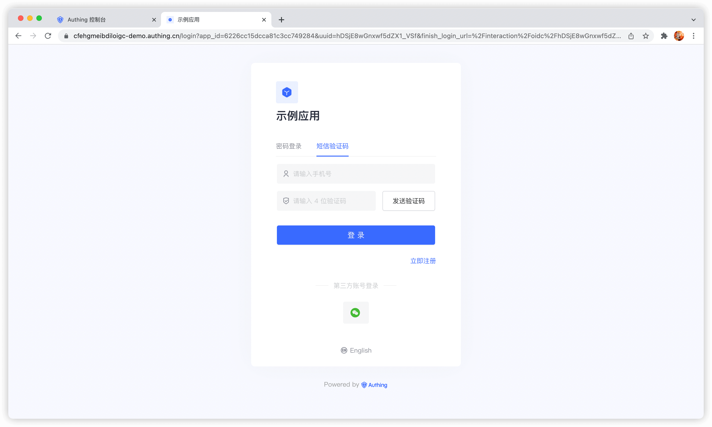
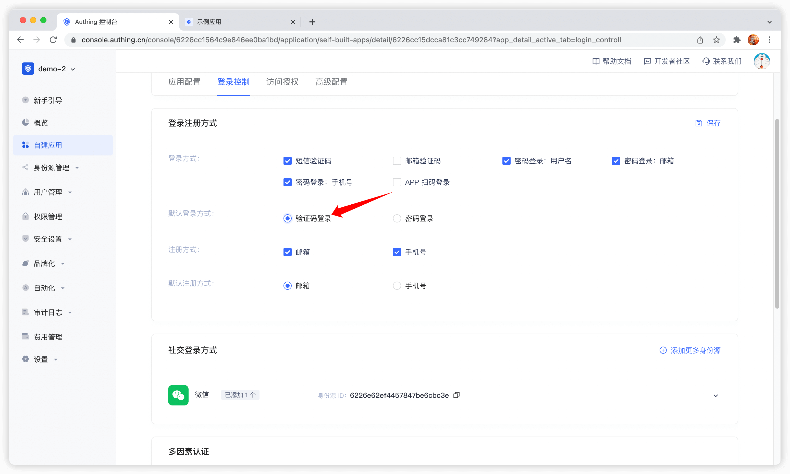
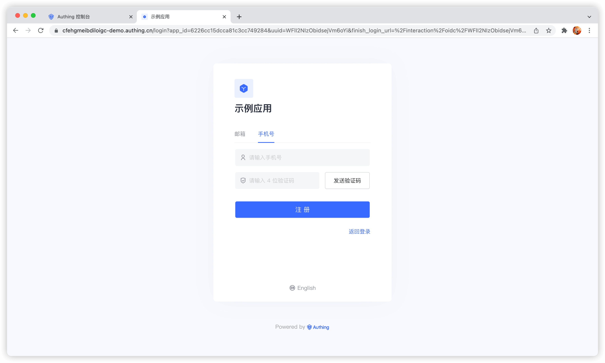

# 使用短信验证码认证

<LastUpdated/>

开发者可以借助 {{$localeConfig.brandName}} 提供的标准登录组件以及 API & SDK 快速实现基于手机号的用户体系。你还可以在控制台的用户管理 - 注册白名单中配置手机号白名单，这样只有在白名单中的手机号才能注册登录。

验证码短信默认会使用 {{$localeConfig.brandName}} 的统一短信模版，如果你想自定义短信模版，可以在控制台的设置 - 消息服务中配置自定义短信模版（目前支持的短信服务商有创蓝、阿里云、腾讯云）。

## 使用托管登录页

### 登录

> 手机号密码登录方式，用户不存在会自动创建账号。

默认情况下，应用的默认登录方式为密码登录，你可以在应用配置中修改：

### 注册

## 使用内嵌登录组件

内嵌登录组件和在线托管登录页在样式和交互上基本一致，不同点在于在线托管登录页由 {{$localeConfig.brandName}} 完全托管运维，与你的应用之间完全独立，而内嵌登录组件则可以嵌入到你的应用中。
详细使用方法请见：[使用内嵌登录组件完成认证](/guides/basics/authenticate-first-user/use-embeded-login-component/)。

## 使用 API & SDK

### 发送短信验证码

<StackSelector snippet="send-sms-code" selectLabel="选择语言" :order="['java', 'javascript', 'python', 'csharp']"/>

### 登录

<StackSelector snippet="login-by-phone-code" selectLabel="选择语言" :order="['java', 'javascript', 'python', 'csharp']"/>

### 注册

<StackSelector snippet="register-by-phone-code" selectLabel="选择语言" :order="['java', 'javascript', 'python', 'csharp']"/>
