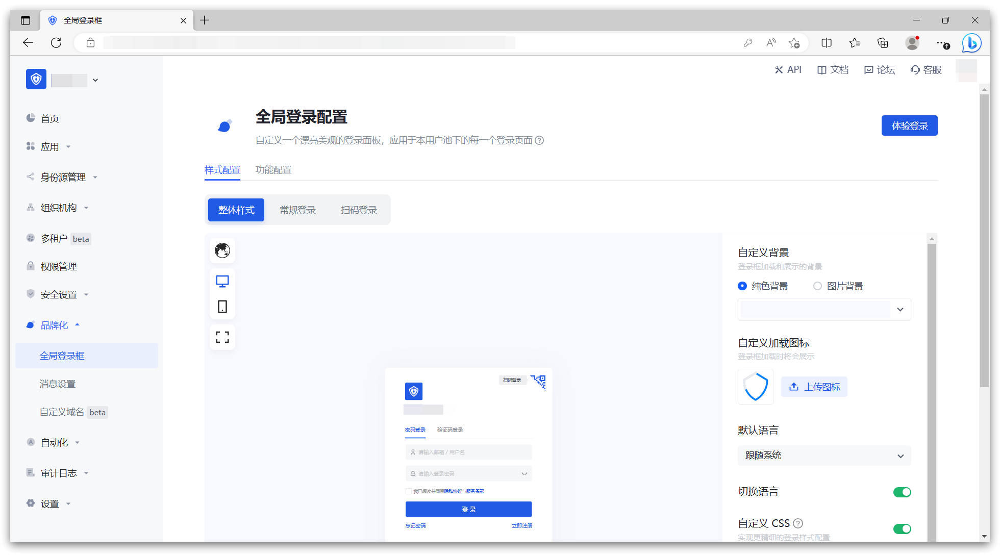
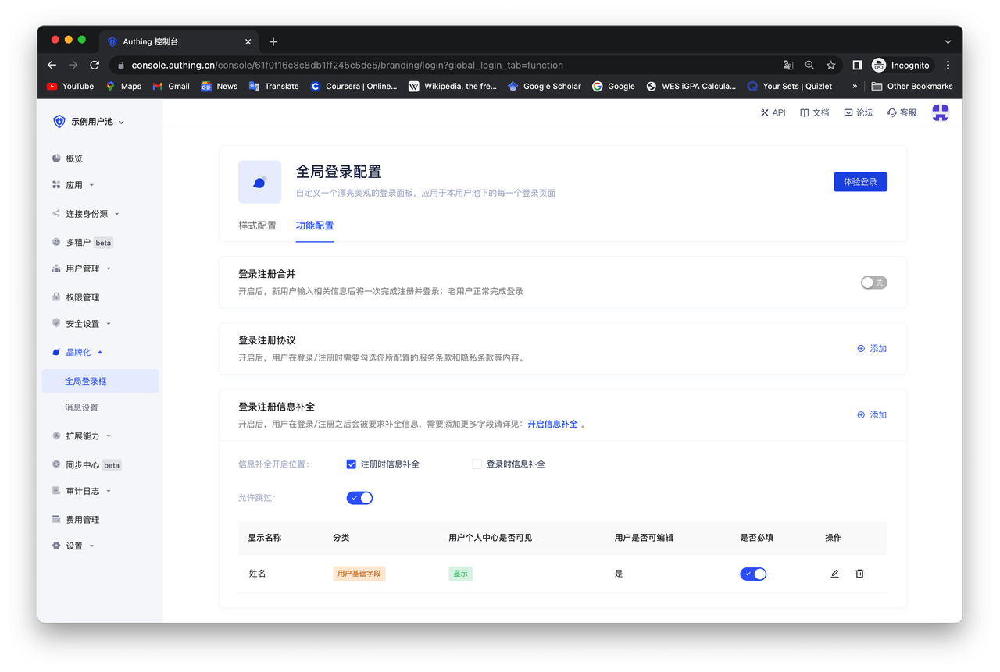
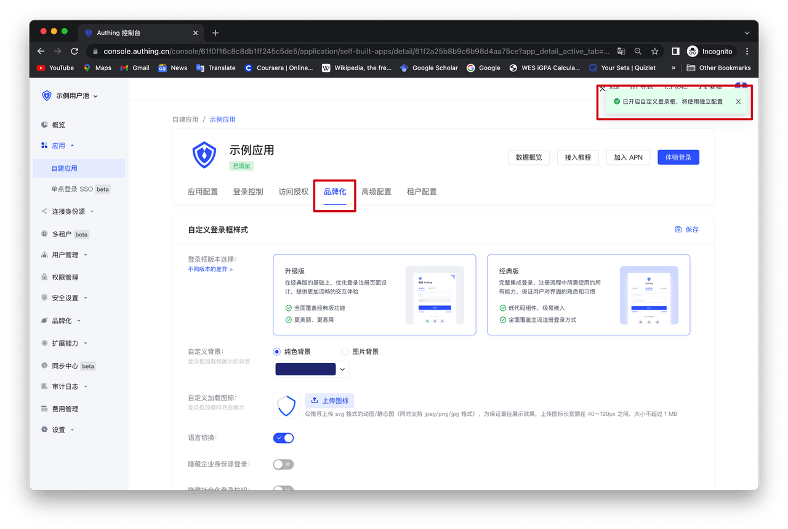

# 对登录框进行个性化配置

<LastUpdated/>

你可以在 Authing 控制台的「品牌化」功能区对整个用户池的登录框进行个性化的配置，包括「单点登录 SSO」的登录框以及用户池内所有自建应用的登录框。

在「全局登录框」，你可以根据需要进行相关的「样式配置」和「功能配置」。具体功能包括：

## 样式配置

- 登录框版本选择：[如何切换至新版 Guard | Authing 文档](/reference-new/guard/console-migrate.md)
- 自定义背景：改变登录框加载和展示的背景
- 自定义加载图标：改变登录框加载时的图标
- 隐藏企业身份源登录
- 隐藏社会化登录
- 隐藏忘记密码
- 自定义 CSS
  

## 功能配置

- 登录注册合并：开启后，新用户输入相关信息后将一次完成注册并登录；老用户正常完成登录。
- 登录注册协议：开启后，用户在登录/注册时需要勾选你所配置的服务条款和隐私条款等内容。
- 登录注册信息补全：开启后，用户在登录/注册之后会被要求补全信息，需要添加更多字段请详见：[添加自定义用户字段](/guides/users/user-defined-field/) 。
  

如果你想对某个自建应用的登录框进行独立于全局的个性化配置，可以这样操作：

首先，找到「高级配置」区域，并打开「自定义本应用的登录框」开关。打开本开关后，本应用的登录框首先将继承你在「全局登录框」中的配置，你可以在此基础上进行改动，不用担心会对用户带来突然的登录框样式改变。

开启此开关后，你便可以在该自建应用的「品牌化」功能区实现对其的独立配置了。

