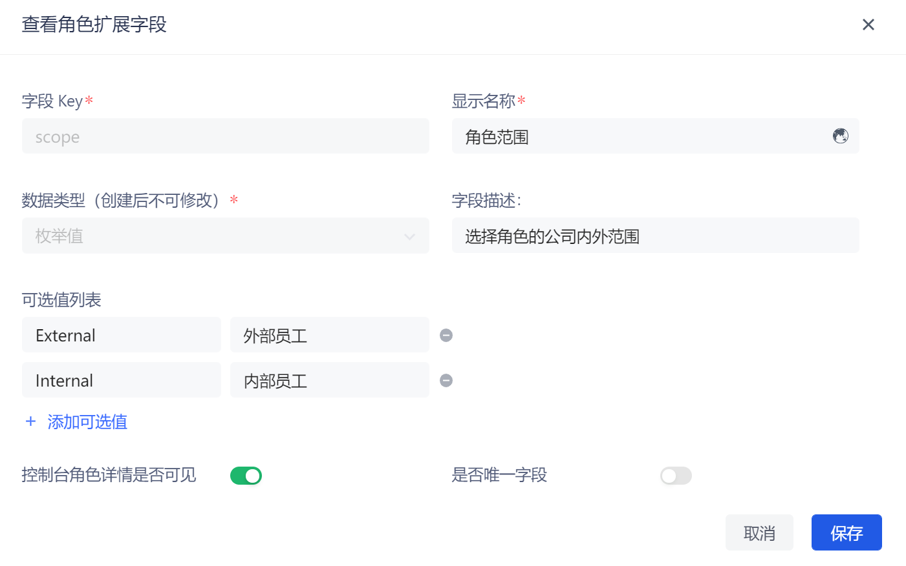

# 添加角色自定义字段

角色自定义字段是除了基础角色字段之外，可以给角色添加的额外字段。开发者可以通过设置自定义字段，存储少量业务相关的数据。

您可以在 **设置->字段管理->角色字段管理** 标签页添加、编辑、搜索（通过 **Key** 和 **显示名称** 搜索）和删除角色扩展字段。

要添加角色扩展字段，执行以下步骤：

1. 点击 **添加** 按钮添加角色扩展字段。

2. 输入 **字段Key**、**显示名称**，选择 **数据类型**，输入 **字段描述**。

::: hint-info
可以定义以下几种类型的自定义字段：
* 字符串
* 数字
* 布尔值
* 枚举值
* 日期
:::

3. 选择是否开启 **控制台角色详情是否可见** 开关（默认开启）。

::: hint-info
如开启了 **控制台角色详情是否可见** 开关，则在控制台权限模块下 **角色管理** 页面查看某角色详情时，可在 **扩展字段** 标签页查看并设置角色自定义字段。
:::

4. 对于 **字符串** / **数字** 数据类型，可以选择是否开启 **是否唯一字段**。

5. 点击 **保存** 按钮。