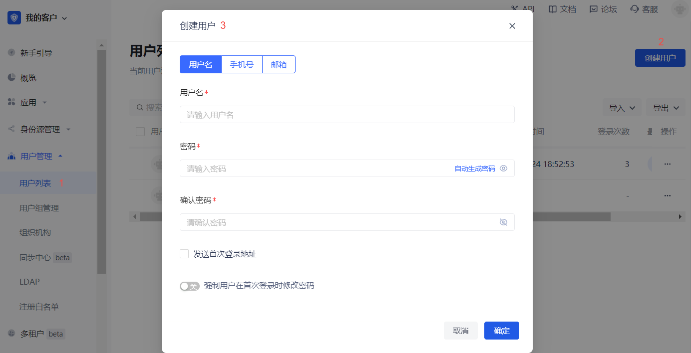

# 基于短信验证码的 MFA

<LastUpdated/>

## 概述

多因素身份验证（MFA）是一种安全系统，是为了验证一项操作合法性而进行的二次身份验证。例如银行的 U 盾，异地登录要求手机短信验证。本文介绍的是基于短信验证码的多因素认证方式。

## 准备工作

在开启短信 MFA 前，执行以下准备工作：

1. <a :href="`${$themeConfig.consoleDomain}`">注册一个 {{$localeConfig.brandName}} 账号</a>。
2. [创建用户池和应用](/guides/basics/authenticate-first-user/use-hosted-login-page.md)。

## 开启短信 MFA

### 开启应用级别短信 MFA

要开启应用级别短信 MFA，执行以下步骤：

1. 在控制台左侧导航菜单选择 **应用->自建应用**。

2. 在自建应用列表中选择需要开启短信 MFA 的应用。

3. 进入应用详情页，选择 **安全管理**，并在 **多因素认证** 模块开启 **短信验证码** 开关。

### 开启全局短信 MFA

要开启全局短信 MFA，执行以下步骤：

1. 在控制台左侧导航菜单选择 **安全设置->多因素认证**。

2. 在 **多因素认证** 模块开启 **短信验证码** 开关。

3. 在 **策略配置** 模块选择适用的身份源，关闭其他不相关身份源的 MFA 开关。

## 使用短信 MFA 登录

要在登录时执行短信 MFA，执行以下步骤：

1. 在控制台左侧导航菜单选择 **用户管理->用户列表**，点击 **创建用户** 按钮通过 **用户名/手机号/邮箱** 方式创建一个用于短信 MFA 登录的用户。

::: hint-info
要启用短信验证码 MFA，必须为新增用户绑定手机号。
要绑定手机号，可在用户详情页 **个人信息** 模块点击下拉隐藏按钮填写手机号。

:::

2. 选择 **应用->自建应用**，点击目标应用详情页右上角 **体验登录** 按钮，使用上述创建的账号登录。

3. 在 **验证码登录** 页面输入手机号及发送至手机的验证码，即可完成基于短信的 MFA 验证流程。

## 关闭短信 MFA

要关闭短信 MFA，可以在应用级别和全局分别关闭功能：

* 关闭应用级别短信 MFA：进入应用详情，选择 **安全管理**，在 **多因素认证** 模块关闭 **短信验证码** 开关。
* 关闭全局短信 MFA：选择 **安全设置->多因素认证**，在 **多因素认证** 模块关闭 **短信验证码** 开关。

