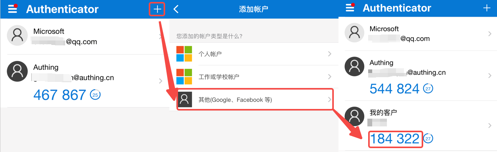
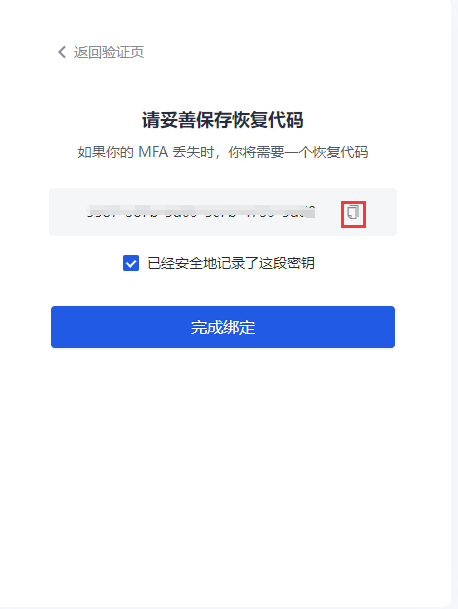
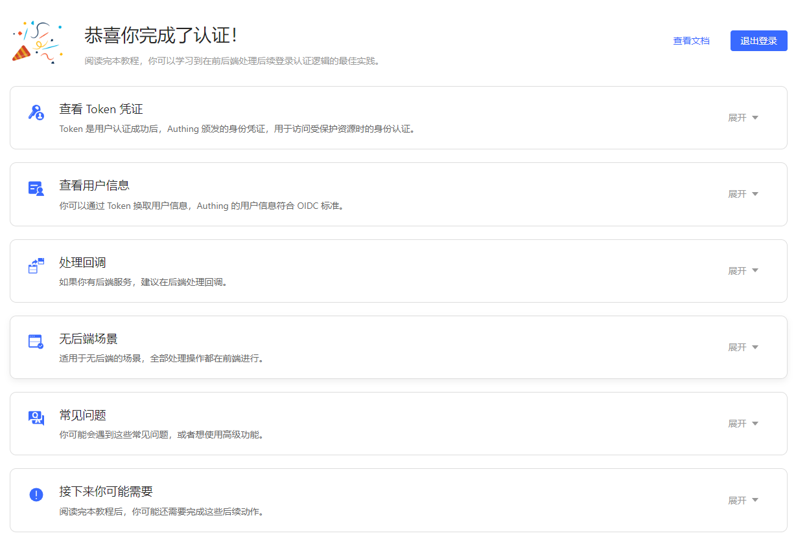
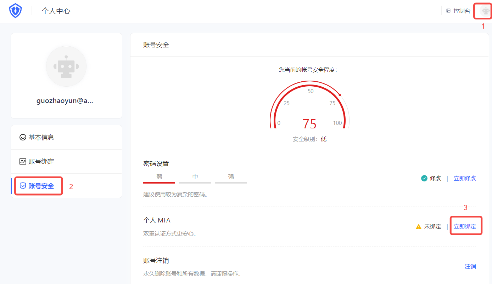
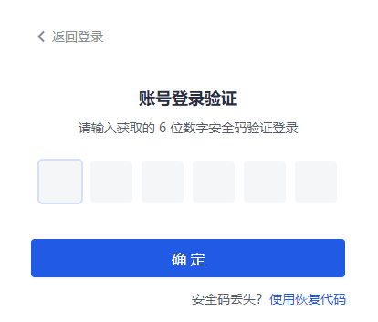

# 基于时间戳算法的一次性密码的 MFA

<LastUpdated/>

## 概述

多因素认证（MFA）是一种安全系统，是为了验证一项操作合法性而进行的二次身份验证。例如银行的 U 盾，异地登录要求手机短信验证。本文介绍的是一种随时间动态变化的六位数字口令构成的一次性密码（OTP）多因素认证方式。

## 准备工作

角色：管理员

在开启 OTP MFA 前，执行以下准备工作：

1. <a :href="`${$themeConfig.consoleDomain}`">注册一个 {{$localeConfig.brandName}} 账号</a>。

2. [创建用户池和应用](/guides/basics/authenticate-first-user/use-hosted-login-page.md)。

## 开启 OTP MFA

角色：管理员

### 开启应用级别 OTP MFA

::: hint-info
要配置应用级别 MFA，必须在 **应用->自建应用->应用详情->高级配置** 中开启 **自定义本应用的安全规则** 开关，才会出现 **安全管理** 页签。
::: 

要开启应用级别 OTP MFA，执行以下步骤：

1. 在控制台左侧导航菜单选择 **应用->自建应用**。

2. 在自建应用列表中选择需要开启 OTP MFA 的应用。

3. 进入应用详情页，选择 **安全管理**，并在 **多因素认证** 模块开启 **OTP 口令** 开关。

### 开启全局 OTP MFA

要开启全局 OTP MFA，执行以下步骤：

1. 在控制台左侧导航菜单选择 **安全设置->多因素认证**。

2. 在 **多因素认证** 模块开启 **OTP 口令** 开关。

3. 在 **策略配置** 模块选择适用的身份源，关闭其他不相关身份源的 MFA 开关。

## 使用 OTP MFA 登录

### 体验登录

角色：管理员

管理员要体验 OTP MFA，执行以下步骤：

1. 在控制台左侧导航菜单选择 **用户管理->用户列表**，点击 **创建用户** 按钮通过 **用户名/手机号/邮箱** 方式创建一个用于 OTP MFA 登录的用户。

2. 选择 **应用->自建应用**，点击目标应用详情页右上角 **体验登录** 按钮，使用上述创建的账号登录。

3. 绑定 OTP。
    * 方法一：

        a. 点击 **确定**，打开 MFA 绑定 QR 窗口。

        b. 在手机端下载并打开 Google Authenticator / Microsoft Authenticator APP（下文以 Microsoft Authenticator 为例添加 MFA。），点击右上角 + 按钮，选择 **其他（Google、Facebook 等）**， 扫码添加 MFA。

        扫码后，可以在 APP 的账户列表中查看到刚刚添加的 MFA。

        c. 在电脑端输入该 MFA 上显示的动态口令，点击 **下一步**，备份密钥，勾选下方保存密钥提示，点击 **下一步** 完成确认绑定。

        ::: hint-info
        务必将这里展示的恢复代码妥善保存。如果以后丢失了 MFA、无法通过 MFA 口令登录，可使用这个密钥来恢复账号访问。
        :::

        系统提示认证成功。

    * 方法二：
        
        要绑定 OTP，执行以下步骤：

        a. 访问 `https://<您的应用域名>.{{$themeConfig.officeSiteDomain}}` 进行登录。然后访问 `https://<您的应用域名>.{{$themeConfig.officeSiteDomain}}/u` ，点击页面右上角头像进入 **个人中心**。

        b. 选择 **个人中心->账号安全->个人 MFA**，点击 **立即绑定** 按钮绑定 MFA。

        c. 在手机端下载并打开 Google Authenticator / Microsoft Authenticator APP（下文以 Microsoft Authenticator 为例添加 MFA。），点击右上角 + 按钮，选择 **其他（Google、Facebook 等）**，扫描网页端控制台二维码。

 

        扫码后，可以在 APP 的账户列表中查看到刚刚添加的 MFA 及生产的动态口令。

        d. 在网页端点击 **下一步**，输入动态口令。

        e. 备份密钥，勾选下方保存密钥提示，点击 **下一步** 完成确认绑定，点击 **下一步**。
    
        提示绑定成功。

### 用户登录

角色：普通用户

用户使用 OTP MFA 登录方法与管理员体验登录类似，可参考上述方法一和二。

如用户已完成 OTP MFA 的绑定，下次登录时可执行以下步骤：

1. 访问 `https://<您的应用域名>.{{$themeConfig.officeSiteDomain}}`。使用绑定过 MFA 的账号进行登录，在一次身份认证后，会提示输入安全码进行二次认证。

2. 查看手机 Authenticator APP 输入动态口令，完成二次认证，进行登录。

## 解绑 OTP MFA

角色：普通用户

要解绑 Authenticator 和控制台的 MFA 绑定，执行以下步骤：

1. 选择 **个人中心->账号安全->个人 MFA**。
2. 点击 **立即修改** 按钮。
3. 在打开的 **MFA绑定** 页面右上角点击 **解除绑定** 按钮，并确认解绑。

提示解绑成功。

## 关闭 OTP MFA

角色：管理员

要关闭 OTP MFA，可以在应用级别和全局分别关闭功能：

* 关闭应用级别 OTP MFA：进入应用详情，选择 **安全管理**，在 **多因素认证** 模块关闭 **OTP 口令** 开关。

* 关闭全局 OTP MFA：选择 **安全设置->多因素认证**，在 **多因素认证** 模块关闭 **OTP 口令** 开关。
