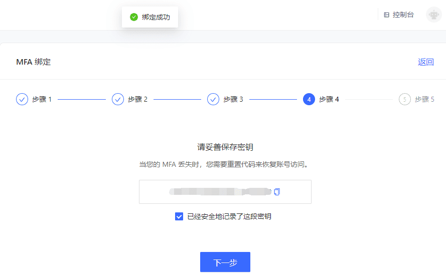

# 基于时间戳算法的一次性密码的 MFA

<LastUpdated/>

## 概述

多因素认证（MFA）是一种安全系统，是为了验证一项操作合法性而进行的二次身份验证。例如银行的 U 盾，异地登录要求手机短信验证。本文介绍的是一种随时间动态变化的六位数字口令构成的一次性密码（OTP）多因素认证方式。

## 准备工作

在开启 OTP MFA 前，执行以下准备工作：

1. <a :href="`${$themeConfig.consoleDomain}`">注册一个 {{$localeConfig.brandName}} 账号</a>。
2. [创建用户池和应用](/guides/basics/authenticate-first-user/use-hosted-login-page.md)。

## 绑定 MFA

要绑定 MFA，执行以下步骤：

1. 访问 `https://<您的应用域名>.{{$themeConfig.officeSiteDomain}}` 进行登录。然后访问 `https://<您的应用域名>.{{$themeConfig.officeSiteDomain}}/u` ，点击页面右上角头像进入 **个人中心**。

2. 选择 **账号安全->个人 MFA**，点击 **立即绑定** 按钮绑定 MFA。
3. 在手机端下载并打开 Google Authenticator / Microsoft Authenticator APP 扫码添加 MFA。

::: hint-info
本文以 Microsoft Authenticator 为例添加 MFA。
如图所示，选择其他（Google、Facebook 等）帐户。
::: 

4. 扫码后自动添加 MFA，可以在 APP 的账户列表中查看到刚刚添加的 MFA。

5. 在电脑端点击 **下一步**，输入该 MFA 上显示的动态口令，备份密钥，勾选下方保存密钥提示，点击 **下一步** 完成确认绑定。

::: hint-info
务必将这里展示的恢复代码妥善保存。如果以后丢失了 MFA，无法通过 MFA 口令登录，可以使用这个密钥来恢复账号访问。
:::

6. 绑定成功。

## 使用 MFA 口令登录

要使用 OTP 登录控制台，执行以下步骤：

1. 执行命令`https://<您的应用域名>.{{$themeConfig.officeSiteDomain}}/oidc/session/end`从应用登出。
2. 访问 `https://<您的应用域名>.{{$themeConfig.officeSiteDomain}}`。使用刚刚绑定过 MFA 的账号进行登录，在一次身份认证后，会提示输入安全码进行二次认证。

3. 查看手机 Authenticator APP 输入动态口令，完成二次认证，进行登录。

## 解绑 OTP MFA

要解绑 Authenticator 和控制台的 MFA 绑定，执行以下步骤：

1. 选择 **个人中心->账号安全->个人 MFA**。
2. 点击 **立即修改** 按钮。
3. 在打开的 **MFA绑定** 页面右上角点击 **解除绑定** 按钮，并确认解绑。

提示解绑成功。
