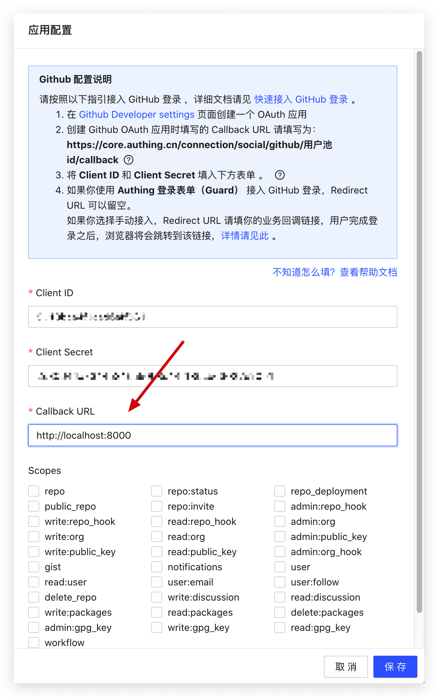

你需要在社会化登录的配置页面设置回调链接（Callback URL），用户完成登录之后将会跳转到该回调地址：



### 引导用户跳转到社会化登录授权页

此方式仅适用于 Web 端的社会化登录，如果你需要在移动 App 内发起社会化登录，请阅读相关社会化登录服务商的文档。

此操作应该在浏览器完成。你可以在 Web 页面上放置一个可点击的按钮或 Logo 链接到上面的链接以便用户可以点击登录。

你需要拼接下面以下格式的链接，其中 YOUR_APP_ID 为你的应用 ID（注意不是用户池 ID）：

`https://core.authing.cn/connection/social/<IDENTIFIER>?app_id=<YOUR_APP_ID>`

### 处理 {{$localeConfig.brandName}} 回调请求

上一步用户同意授权之后，会先跳转到 {{$localeConfig.brandName}} 服务器，之后 {{$localeConfig.brandName}} 会携带用户信息跳转到开发者在 {{$localeConfig.brandName}} 控制台中配置的业务回调链接，并附带以下 Get 请求参数：

| 参数                   | 说明                                      | 劣势                                                | 是否推荐   |
|------------------------|-------------------------------------------|-----------------------------------------------------|------------|
| code                   | 错误或成功代码，200 为成功，非 200 为失败 |                                                     | 推荐使用   |
| message                | 成功或错误信息                            |                                                     | 推荐使用   |
| data                   | userInfo，若 code 为非 200 不返回此参数   | 无法嵌入到你的应用中                                | 推荐使用   |

部分浏览器和 Web Server 在 URL 过长的情况下有可能出现 404，如 ASP.NET，这个时候需要修改一下配置，[具体方式请见这个 StackOverflow 回答](https://stackoverflow.com/questions/28681366/in-asp-net-mvc-would-a-querystring-too-long-result-in-404-file-not-found-error/28681600)。
以下是使用 JavaScript 从 URL 参数中获取用户数据的代码

```javascript
// 获取 URL 参数
function getQueryString(name) {
  var reg = new RegExp("(^|&)" + name + "=([^&]*)(&|$)", "i");
  var r = window.location.search.substr(1).match(reg);
  if (r != null) {
    return unescape(r[2]);
  }
  return null;
}

// 将 Code 转为 Int 类型，方便判断
const code = parseInt(getQueryString("code"));

if (code !== 200) {
  // 出错了
  const errorMsg = getQueryString("message");
  // 展示 errorMsg 给用户或执行其他业务 ...
} else {
  const userInfo = getQueryString("data");

  // 将 token 存储到 localStorage
  // 建议在之后的请求中附带 Token，并由后端验证 Token 合法性
  localStorage.setItem("token", userInfo.token);
}
```
