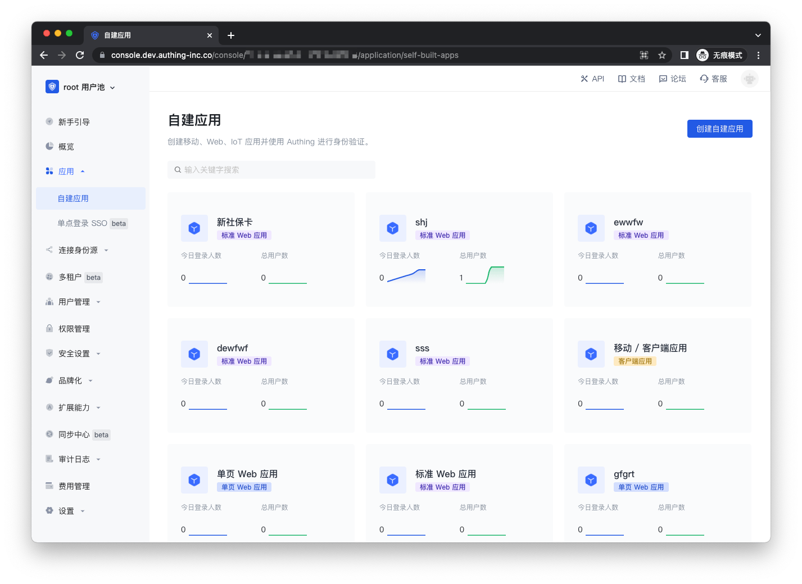
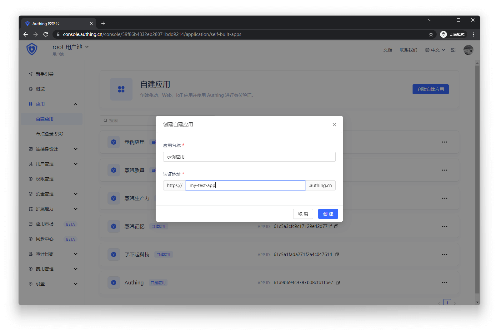

---
meta:
  - name: description
    content: 实现单点登录（SSO）
---

# 实现单点登录（SSO）

<LastUpdated/>

本文讲述如何使用 {{$localeConfig.brandName}} 实现应用账号打通和单点登录。

## 什么是单点登录

我们通过一个例子来说明，假设有一所大学，内部有两个系统，一个是邮箱系统，一个是课表查询系统。现在想实现这样的效果：在邮箱系统中登录一遍，然后此时进入课表系统的网站，无需再次登录，课表网站系统直接跳转到个人课表页面，反之亦然。比较专业的定义如下：

**单点登录**（Single Sign On），简称为 **SSO**，是目前比较流行的企业业务整合的解决方案之一。 SSO 的定义是在多个应用系统中，**用户只需要登录一次**就可以**访问所有**相互信任的应用系统。
## 创建一个授权应用

> 也可以使用现有应用，创建应用参考 [如何创建自建应用](../../app/create-app.md)





**参数解释**

**应用名称**，请为你的应用起一个名字。

**认证地址**，一个 authing.cn 的二级域名，用户将在此网址进行登录。

在应用列表中点击刚创建好的应用，记录下 AppID，二级域名，供以后使用。

## 快速集成单点登录

- 进入应用找到认证配置，配置登录回调 URL 并进行保存
- 授权配置中，授权模式开启 implicit
- 授权配置中，返回类型开启 ( id_token token，id_token )
- 授权配置中，不强制 implicit 模式回调链接为 https 进行开启
- 点击保存进行保存配置
- 打开 SSO 单点登录


## 安装

Authing SSO SDK 支持通过包管理器安装、script 标签引入的方式集成到你的前端业务软件。

### 使用 NPM 安装

``` shell
npm install @authing/sso
```

### 使用 Yarn 安装

``` shell
yarn add @authing/sso
```

### 使用 script 标签直接引入
``` html
<script src="https://cdn.authing.co/packages/authing-sso/2.1.2/umd/index.min.js"></script>
```

## 初始化
为了使用 Authing SSO SDK，你需要填写应用 ID、用户池域名、回调地址等参数，如下示例：

``` javascript
const authing = new AuthingSSO({
  appId: '应用 ID',
  origin: 'https://{用户池域名}.authing.cn',
  redirectUri: '你的业务软件路由地址',
})
```

::: img-description
appId 字段
:::


::: img-description
origin 字段
:::


::: img-description
redirectUri 字段
:::
## 代码参考
[AuthingSSO Demo](https://github.com/Authing/authing-sso-demo)
## Authing SSO 提供的功能

### 注册

如果你希望为用户展示 Authing 托管的注册页，可以按以下方式调用：

``` javascript
import { AuthingSSO } from '@authing/sso'

const authing = new AuthingSSO({
  appId: '应用 ID',
  origin: 'https://{用户池域名}.authing.cn',
  redirectUri: '你的业务软件路由地址',
})

authing.register()
```

### 登录

Authing SSO SDK 可以向 Authing 发起认证授权请求，目前支持两种形式：

1. 在当前窗口转到 Authing 托管的登录页；
2. 弹出一个窗口，在弹出的窗口中加载 Authing 托管的登录页。

#### 跳转登录

运行下面的代码，浏览器会跳转到 Authing 托管的登录页：

```js
import { AuthingSSO } from '@authing/sso'

const authing = new AuthingSSO({
  appId: '应用 ID',
  origin: 'https://{用户池域名}.authing.cn',
  redirectUri: '你的业务软件路由地址',
})

authing.login()
```

如果你想自定义参数，也可以对以下参数进行自定义传参，如不传参将使用默认参数

```js
authing.login({
  scope: 'openid profile email phone',
  responseMode: 'fragment',
  responseType: 'id_token token',
  state: Math.random().toString(),
  nonce: Math.random().toString(),
})
```

用户完成登录后，Authing 会将用户重定向到你的业务软件回调地址。 Id Token、Access Token 会以 URL hash 的形式发到回调地址。你可以在你的业务软件前端路由对应的页面使用 Authing SSO SDK 的方法将它们从 URL hash 中取出：

```js
import { AuthingSSO } from '@authing/sso'

const authing = new AuthingSSO({
  appId: '应用 ID',
  origin: 'https://{用户池域名}.authing.cn',
  redirectUri: '你的业务软件路由地址',
})

// authing.cn/#id_token=123123&access_token=547567
// 返回 { id_token: 123123, access_token: 547567 }
const { access_token, id_token } = authing.getTokenSetFromUrlHash()

// 之后可以使用 Access Token 获取用户信息
const userInfo = await authing.getUserInfoByAccessToken(access_token)
```

#### 弹出窗口登录

你可以在你的业务软件页面调用下面的方法，通过弹出一个新窗口的方式让用户在新窗口登录：

```js
import { AuthingSSO } from '@authing/sso'

const authing = new AuthingSSO({
  appId: '应用 ID',
  origin: 'https://{用户池域名}.authing.cn',
  redirectUri: '你的业务软件路由地址',
})

authing.popUpLogin()

// 登录成功回调
authing.onPopUpLoginSuccess(async ({ access_token, id_token }) => {
  // 可以存储 token
  // 可以使用 token 获取用户的信息
  const userInfo = await authing.getUserInfoByAccessToken(access_token)
})
// 登录失败回调
authing.onPopUpLoginFail(async ({ error, error_description }) => {
  console.log(error, error_description)
})
// 登录取消回调
authing.onPopUpLoginCancel(async () => {
  // 可根据业务逻辑进行处理
})
```
### 高级使用

每次发起登录本质是访问一个 URL 地址，可以携带许多参数。AuthingSSO SDK 默认会使用缺省参数。如果你需要精细控制登录请求参数，可以参考本示例。

```js
import { AuthingSSO } from '@authing/sso'

const authing = new AuthingSSO({
  appId: '应用 ID',
  origin: 'https://{用户池域名}.authing.cn',
  redirectUri: '你的业务软件路由地址',
})

// 发起认证请求
authing.login({
  scope: 'openid profile email phone',
  responseMode: 'fragment',
  responseType: 'id_token token',
  state: Math.random().toString(),
  nonce: Math.random().toString(),
  prompt: 'consent',
})

// 使用弹窗登录
authing.popUpLogin({
  scope: 'openid email phone profile',
  responseMode: 'web_message',
  responseType: 'id_token token',
  state: Math.random().toString(),
  nonce: Math.random().toString(),
  prompt: 'consent',
})
```

更多参数请参考 [文档](/federation/oidc/authorization-code/?build-url=curl) 。

## 检查登录态并获取 Token

如果你想检查用户的登录态，并获取用户的 Access Token、Id Token，可以按以下方式调用，如果用户没有在 Authing 登录，该方法会抛出错误：

```js
import {
  AuthingSSO,
  AuthenticationError,
  InvalidParamsError,
} from '@authing/sso'

const authing = new AuthingSSO({
  appId: '应用 ID',
  origin: 'https://{用户池域名}.authing.cn',
  redirectUri: '你的业务软件路由地址',
})

async function main() {
  try {
    const { id_token, access_token } = await authing.getAccessTokenSilently()
    // 无需在前端验证 token，统一在资源服务器验证即可
    // 后续可以存储 token
  } catch (err) {
    if (err instanceof AuthenticationError) {
      // 用户未登录，引导用户去登录页
      authing.login()
    } else if (err instanceof InvalidParamsError) {
      // 可以根据自己的业务进行逻辑处理
    } else {
      // 发生未知错误
      throw err
    }
  }
}
main()
```

## 获取用户信息

你需要使用 Access Token 获取用户的个人信息：

1. 用户初次登录成功时可以在回调函数中拿到用户的 Access Token，然后使用 Access Token 获取用户信息；
2. 如果用户已经登录，你可以先获取用户的 Access Token 然后使用 Access Token 获取用户信息。

```js
import {
  AuthingSSO,
  AuthenticationError,
  InvalidParamsError,
} from '@authing/sso'

const authing = new AuthingSSO({
  appId: '应用 ID',
  origin: 'https://{用户池域名}.authing.cn',
  redirectUri: '你的业务软件路由地址',
})

async function main() {
  try {
    // 获取用户的 token
    const { id_token, access_token } = await authing.getAccessTokenSilently()
    // 可以使用 token 获取用户的信息
    const userInfo = await authing.getUserInfoByAccessToken(access_token)
  } catch (err) {
    if (err instanceof AuthenticationError) {
      // 可以根据自己的业务进行逻辑处理
    } else if (err instanceof InvalidParamsError) {
      // 可以根据自己的业务进行逻辑处理
    } else {
      // 发生未知错误
      throw err
    }
  }
}
main()
```

## 退出登录

```js
import { AuthingSSO, AuthenticationError } from '@authing/sso'

const authing = new AuthingSSO({
  appId: '应用 ID',
  origin: 'https://{用户池域名}.authing.cn',
  redirectUri: '你的业务软件路由地址',
})

await authing.logout()
// 需要业务软件清除本地保存的所有 token 和用户信息
```

在后端接口中需要检验此 `token` 的合法性，来验证用户的身份，验证方式详情请见[验证用户身份凭证（token）](/guides/faqs/how-to-validate-user-token)。识别用户身份之后，你可能还需要[对该用户进行权限管理](/guides/access-control/)，以判断用户是否对此 API 具备操作权限。

## trackSession

跨域携带 cookie 访问 /cas/session 端点，获取当前登录的用户信息

示例：

```js
let res = await auth.trackSession()
/**
 * {
 *    session: { appId: 'xxx', type: 'oidc/oauth', userId: 'yyy'},
 *    userInfo: {
 *      "_id": "USER_ID",
 *      "email": "USER_EMAIL",
 *      "registerInClient": "CLIENT_ID",
 *      "token": "JWT_TOKEN",
 *      "tokenExpiredAt": "2019-10-28 10:15:32",
 *      "photo": "PICTURE",
 *      "company": "",
 *      "nickname": "NICKNAME",
 *      "username": "USERNAME",
 *   }
 * }
 *
 * 如果 session 不存在，返回：
 *
 * {
 *   session: null
 * }
 * */
```

::: hint-danger
从 13.1 版本开始，Safari 默认会**阻止第三方 Cookie**，会影响 Authing 的某些**单点登录功能**。其他类似的更新，从 Chrome 83 版本开始，**隐身模式**下默认禁用第三方 Cookie。其他浏览器也在慢慢进行此类更新以保护用户隐私，很多浏览器将禁用第三方 Cookie 作为了一个安全配置功能。

这可能会对此方法产生影响，详情请见 [禁用第三方 Cookie 对 Authing 的影响](/guides/faqs/block-third-party-cookie-impact.md#tracksession)，你可以在此[查看解决方案](/guides/faqs/block-third-party-cookie-impact.md#如何解决)。
:::

## 获取帮助 <a id="get-help"></a>

Join us on Gitter: [\#authing-chat](https://forum.authing.cn/)


你还可以参考以下资料
- [使用 SDK 集成 SSO 单点登录](/reference-new/other/sdk-for-sso.md)
- [自建应用 SSO 方案](../../app/sso.md)
