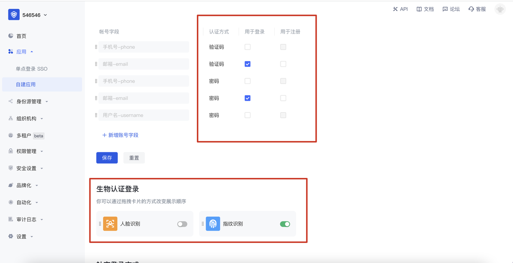

# Authing 令牌

<LastUpdated />

## 场景介绍

- Authing 令牌是北京蒸汽记忆科技有限公司针对手机设备开发的认证、登录及授权的工具型应用。目前支持 iOS 及 Android 系统，它是 Authing 云原生身份管理产品的重要组成部分。该产品具备以下核心功能：
  - OTP 口令录入/读取/认证 - 为账号绑定 OTP 口令，随时对应用提供认证及登录能力；
  - Authing 客户端应用注册/登录能力- 绑定 & 体验登录 Authing 控制台客户端应用及 Guard，并查看用户信息；
  - WebauthN 生物认证登录能力 - 支持系统、设备级别的指纹识别及人脸识别能力；
  - Fastpass 认证登录 Web 端应用- 移动端推送认证登录、扫码认证登录 Web 端应用；
  - Fastpass 认证登录客户端应用 - 移动端应用扫码 Web 端具有登录态的二维码（目前位于应用个人中心），完成移动端的快速登录认证；

## 前置准备工作

- 下载 「Authing 令牌」到手机：
  - iOS 下载地址：https://apps.apple.com/app/authing-令牌/id1603744061
  - 安卓下载地址：https://mobile.baidu.com/item?docid=5000565464&source=appbaidu
- 注册并登录成为 Authing Console 控制台开发者：  
  Authing Console 开发者注册 / 登录地址：https://console.authing.cn/

## 功能 1：OTP 口令录入 / 读取 / 认证；

Authing 为账号提供多因素认证能力，为账号绑定 OTP ，随时对 Web 应用提供认证及登录能力；

步骤 1: 在 Authing Console 控制台，创建一个 Web 端应用：

步骤 2: 进入到刚刚创建的 Web 端应用，打开「高级配置」-「安全设置」模块：

步骤 3: 在「安全管理」模块，找到「多因素认证」，开启「 OTP 口令」认证方式：

步骤 4: 在刚刚创建的 Web 端应用中， 点击「体验登录」并且输入该用户池的用户账号信息，点击「登录」button：

步骤 5: 此时该应用登录框提示，需要进行 OTP 绑定，点击确定，进入到绑定流程：

步骤 6: 打开「Authing 令牌」，扫描以下二维码，绑定相关的账户；

<video controls>
  <source src="./bind-account.mp4" type="video/mp4">
</video>

步骤 7: 点击「完成绑定」，即可进入到该应用的页面里：

以上示例简单的描述了一次在 Authing 应用里面使用「 Authing 令牌」完成口令认证的一个流程，Authing 令牌适用于市面上所有的标准化 OTP 口令录入、读取及认证；

## 功能 2：Authing 客户端应用注册/登录能力

Authing 令牌支持绑定控制台客户端应用，并体验登录 Guard 能力；

步骤 1: 在 Authing Console 控制台，创建一个客户端应用：

步骤 2: 在 Authing 控制台，客户端应用的「登录控制」下面，找到该应用的二维码：

步骤 3: 打开 Authing 令牌，进入「我的」 Tab，点击 「添加应用」-「扫码二维码」，即可进入该应用的 Guard 界面：
<video controls>

  <source src="./scan-qrcode.mp4" type="video/mp4">
</video>

步骤 4: 在 Authing 控制台，客户端应用的登录控制下面，配置相关的登录方式：

步骤 5: 打开 Authing 令牌，进入「我的」 Tab，点击体验登录某个应用，选择相应的登录方式，即可进入该应用的 个人中心：

<video controls>
  <source src="./personal-center.mp4" type="video/mp4">
</video>

## 功能 3: WebauthN 生物认证（指纹、人脸识别）
目前安卓设备支持设备指纹识别，iOS 支持设备人脸识别：
步骤 1 : 在 Authing 控制台，客户端应用的登录控制下面，开启/关闭相应的生物认证能力：
