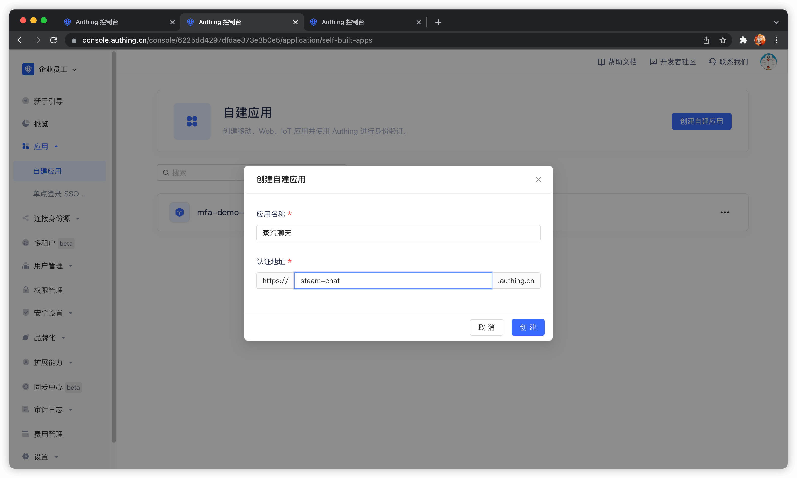
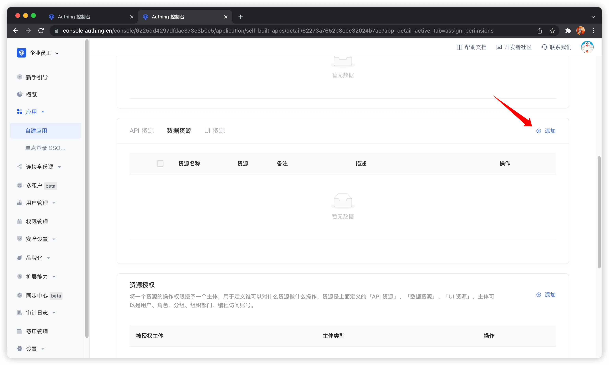
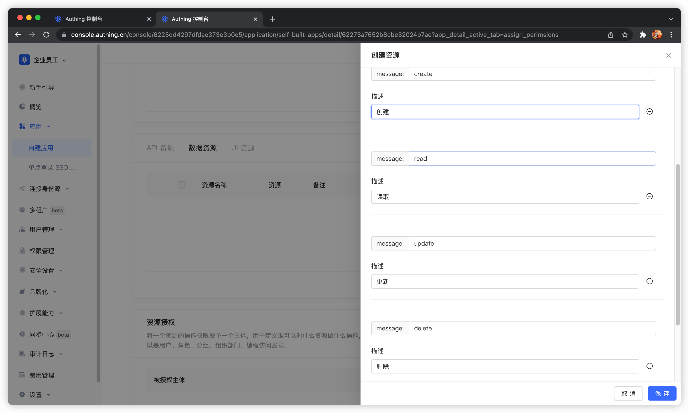
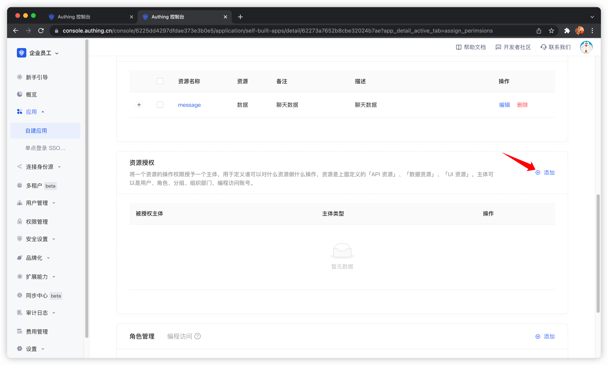
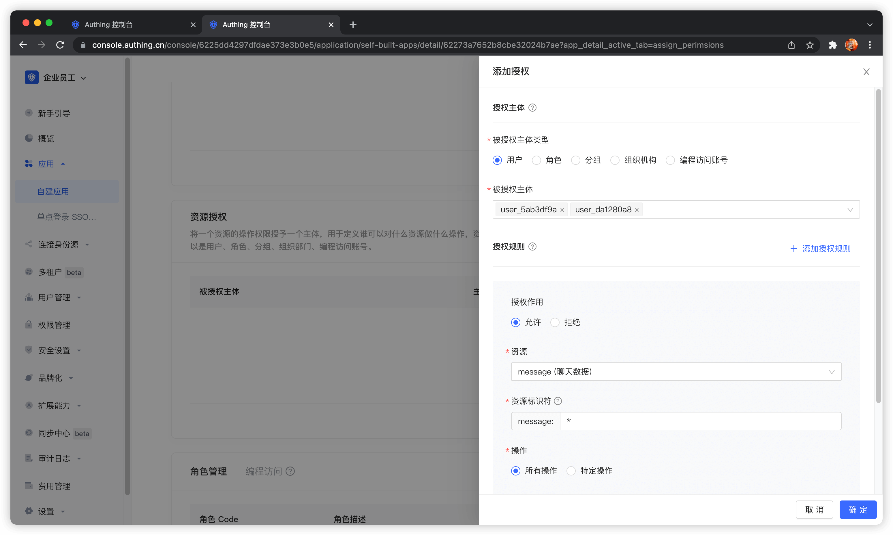
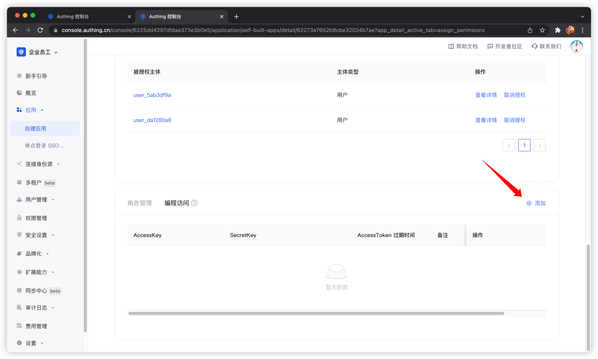
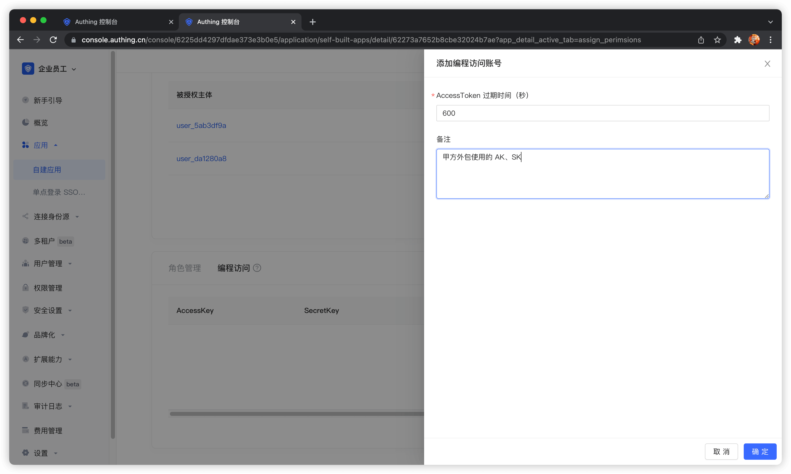
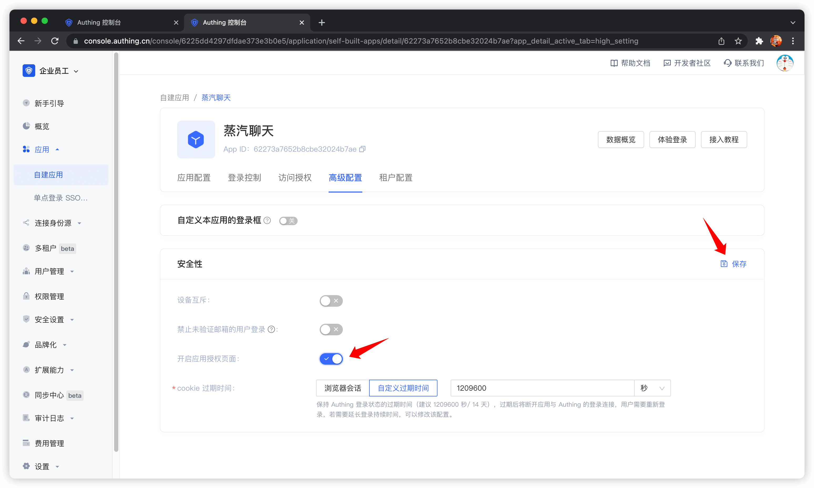
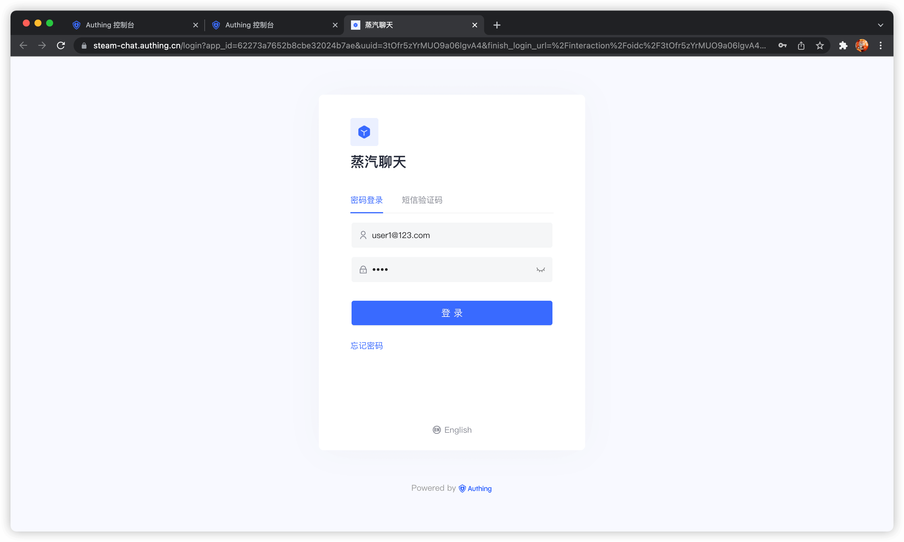
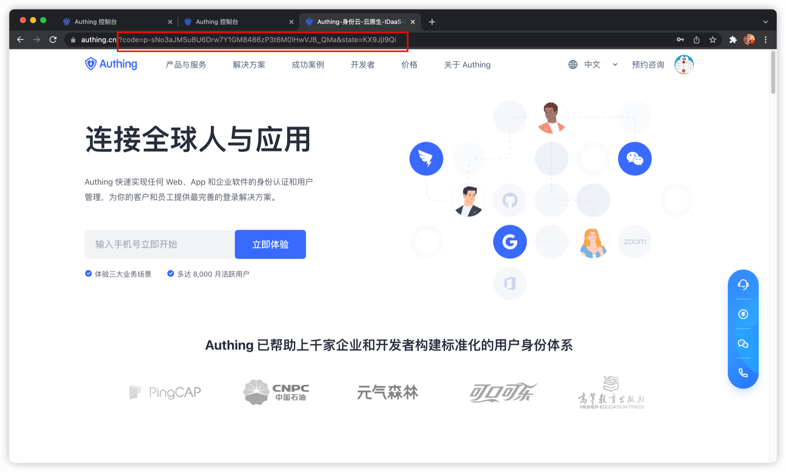

# 用户许可的资源授权

<LastUpdated/>

假如你的公司是一家做社交通讯业务的公司，现在有另外一家公司想通过调用你的业务 API 开发一个聊天记录整理导出的工具，并且已经和你的公司签约合作。现在你想要安全地将用户信息授权给这家公司，你期望：

1. API 的调用只开放给合作伙伴公司。
2. 不同的合作伙伴拥有的访问权限不同，能够访问的业务 API 也不同。
3. 合作伙伴公司从业务 API 获取自己公司的用户数据之前，**必须先征得用户的同意**。
4. 如果将来终止合作，或者发生变化，希望能够收回某些数据的权限或者完全禁用。

## 权限管理与分配

首先在 Authing 创建两个用户。分别为 user1@123.com 和 user2@123.com。

在 Authing 创建一个应用，假设我们的社交软件叫做「蒸汽聊天」，那么应用名字就叫做「蒸汽聊天」。



在应用详情，点击访问授权选项卡，切换到数据资源 tab，然后点击添加。

> API 资源、数据资源、UI 资源在本质上没有区别，类型仅用于管理层面上的区分，创建良好的资源分类能够方便管理员快速聚焦不同的资源。



我们创建一个聊天数据资源，定义增删改查几个操作，最后点击保存。



然后在**资源授权**中添加授权规则。



**被授权主体**选择 user1@123.com 和 user2@123.com，**资源类型**选择聊天数据，然后点击确定。



到此管理员进行权限管理的操作就全部结束了。

然后我们创建一个**编程访问账号**，将来会交给调用方。





如果将编程访问账号删除，调用方将会失去获取用户授权的能力。

### AccessToken 过期时间

当你创建编程访问账号时，需要指定 AccessToken 过期时间。Authing 在颁发 AccessToken 时使用 RS256 签名算法进行签名，以确保 AccessToken 不会被篡改。
> Token 签名是 JWT 中的一部分，更多内容请参考 [JWT 释义及使用](/concepts/jwt-token.md)。

RS256 是一种非对称签名算法，Authing 持有私钥对 Token 进行签名，JWT 的消费者使用公钥来验证签名。RS256 签名算法，有以下好处：

1. 任何人都可以使用应用公钥验证签名，签名方一定是 Authing。
2. 无私钥泄露风险，如果你使用 HS256 但泄露了应用密钥，需要刷新密钥并重新部署所有 API。
   关于签名问题更多内容请参考[验证 Token](/guides/faqs/how-to-validate-user-token.md)。

## 展示确权页面

当**业务软件**和**身份数据**不是被同一方掌握的时候，作为身份提供商，你需要向用户展示确权页面。在本例中，你的公司掌握身份数据，你的合作伙伴公司掌握业务软件，所以在他们获取用户数据时，你作为身份提供商有义务告知终端用户其他公司需要获取他们的哪些用户数据（例如手机号、邮箱）以及哪些资源权限。

你可以在**控制台** > **应用** > **应用详情** >「高级配置」选项卡，开启应用授权页面。



## 获取具备权限的 AccessToken

调用方需要通过 **OIDC 授权码模式**从资源方获得资源授权。资源方的用户会参与到授权过程，经过用户的授权后，Authing 会签发具备权限 scope 且主体为资源持有者的 AccessToken。
首先需要拼接**授权链接**：

```http
https://{应用域名}.authing.cn/oidc/auth?client_id={应用ID}&response_type=code&scope=openid email message&redirect_uri={调用方业务地址}&state={随机字符串}
```

其中的 scope 参数中可以填写上面步骤中定义的**资源**以及**相应操作**，具体格式如下。

### Scope 权限项目规范

Authing 的 scope 权限项目以**空格分隔**，每一项的格式是`资源标识符:资源操作`。

以下是 Authing 支持的所有 scope 格式：

`book:1:read` 含义为编号为 1 的书籍资源的读取权限

`book:*:read` 含义为所有书籍资源的读取权限

`book:read` 含义为所有书籍资源的读取权限

`book:*:*` 含义为所有书籍资源的所有操作权限

`book:*` 含义为所有书籍资源的所有操作权限

`book` 含义为所有书籍资源的所有操作权限

`*:*:*` 含义为所有资源的所有操作权限

`*:*` 含义为所有资源的所有操作权限

`*` 含义为所有资源的所有操作权限

例如上面定义了 `message` 资源和 `message` 资源的 `create` 操作，这里的 scope 中可以填写 `message:create` 内容。

调用方应该引导用户点击此链接。用户点击后会跳转到认证页面。



用户完成登录后，会跳转到调用方的业务地址。并在 URL 中携带**授权码 code** 参数。



接下来需要使用授权码 code 和编程访问账号的 Key 和 Secret，换取用户的 AccessToken 和 IdToken。有关 OIDC 授权码模式的更多信息请查看[文档](/authentication/oidc/oidc-authorization.md#使用授权码模式-authorization-code-flow)。


可以看到用户的 AccessToken 中具备 message 权限 scope。token 的**受众**（aud）是**编程访问账号 Key**。AccessToken 的含义是：**调用方** aud 具备**资源所有者** sub 的 scope **权限**，**颁发者**是 iss。资源方可以根据 AccessToken 中的信息进行权限校验。


## 添加 API 鉴权拦截器

在 Authing 定义了 API 之后，你需要在你的实际业务 API 接口增加 **API 鉴权拦截器**，对于受保护的资源，只放行携带了合法的 AccessToken 且具备所需权限的来访者。
代码示例如下：

```javascript
var express = require('express');
var app = express();
var jwt = require('express-jwt');
var jwks = require('jwks-rsa');
var port = process.env.PORT || 8080;
var jwtCheck = jwt({
  secret: jwks.expressJwtSecret({
    cache: true,
    rateLimit: true,
    jwksRequestsPerMinute: 5,
    jwksUri: 'https://{应用域名}.authing.cn/oidc/.well-known/jwks.json',
  }),
  audience: '{编程访问账号 ID}',
  issuer: 'https://{应用域名}.authing.cn/oidc',
  algorithms: ['RS256'],
});
// 检验 AccessToken 合法性
app.use(jwtCheck);

app.post('/article', function(req, res) {
  // 检验 AccessToken 是否具备所需要的权限项目
  if (!req.user.scope.split(' ').incldues('write:article')) {
    return res.status(401).json({ code: 401, message: 'Unauthorized' });
  }
  res.send('Secured Resource');
});

app.listen(port);
```

有关 Token 检验的其他内容请参考[验证 Token](/guides/faqs/how-to-validate-user-token.md)。

## 常见问题

### 用户拒绝授权意味着什么？

如果你开启了授权页面，而用户在授权页面点击了「拒绝」。那么认证授权请求的发起方（在本例是你的合作伙伴公司）无法获取到该用户的任何用户信息以及 Token。

### 用户拒绝授权之后，我应该怎么做？

如果你是应用软件的开发者，你应该引导用户点击「允许」，并且告知用户不会滥用他的的数据和权限。如果用户点击了「拒绝」，Authing 会将浏览器重定向到应用的**业务回调地址**（和成功时的是同一个），通过 URL query 携带 error 和 error_description 参数。如果你的后端接收到 error 参数，你可以给用户展示一个登录失败的友好页面，并引导用户重新发起认证授权。

处理用户拒绝授权的示例代码如下：

```js
app.get('/oidc/callback', async (req, res) => {
  if (req.query.error) {
      // 你可以记录日志
      console.log('用户取消授权，登录失败');
      // 你可以渲染失败页面，告知用户点击允许授权按钮，引导用户重新发起登录
      res.render('login-error', { error: req.query.error, error_description: req.query.error_description });
  } else {
      // ...正常登录逻辑...
  }
});
```

如果你是身份提供商，负责管理用户数据，当用户拒绝授权后，你无需做任何事情。
