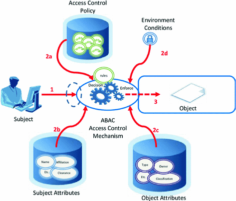
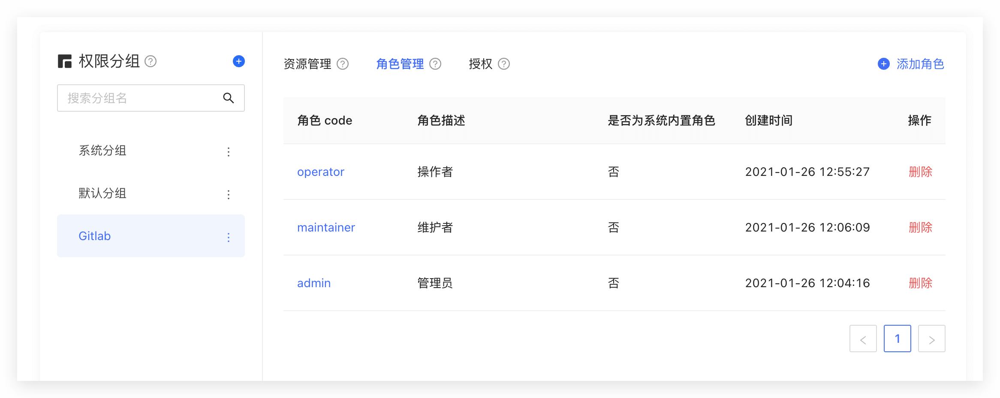
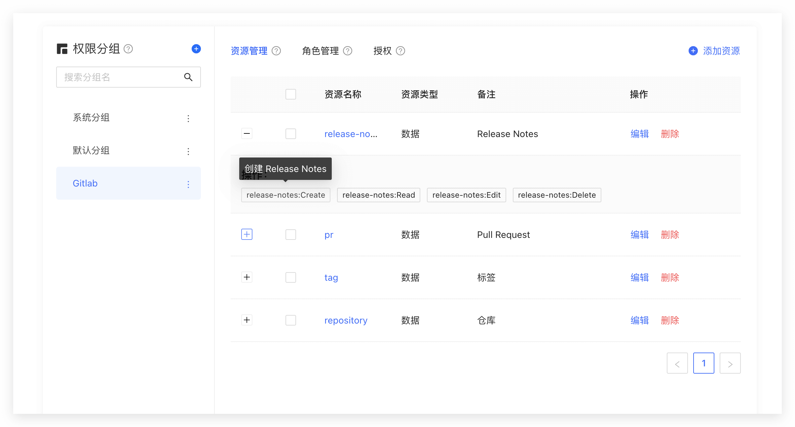
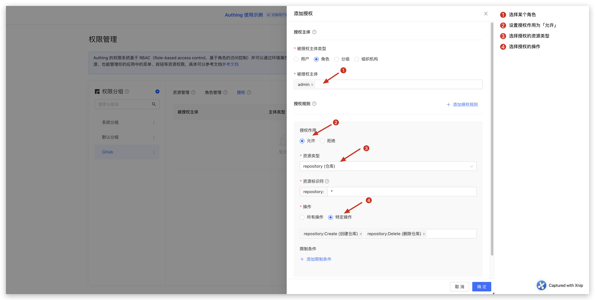

# 对用户进行权限管理

<LastUpdated/>

当你已经构建起用户系统，在某个时刻你的 API 就需要判断当前访问的用户是否能够访问当前资源了。这时候你就需要构建自己的权限系统。权限系统中一个很重要的概念是授权，授权指的是判断用户具备哪些权限的过程，与认证是两个完全不同的含义。

目前被大家广泛采用的两种权限模型为：基于角色的访问控制（RBAC）和基于属性的访问控制（ABAC），二者各有优劣：RBAC 模型构建起来更加简单，缺点在于无法做到对资源细粒度地授权（都是授权某一类资源而不是授权某一个具体的资源）；ABAC 模型构建相对比较复杂，学习成本比较高，优点在于细粒度和根据上下文动态执行。

在 {{$localeConfig.brandName}} 的权限系统中，我们通过用户、角色这两种对象实现了 RBAC 模型的角色权限继承，在此之上，我们还能围绕属性进行动态地、细粒度地授权，从而实现了 ABAC 权限模型。同时，我们为了满足大型系统中复杂组织架构的设计需求，将资源、角色、权限授权统一组合到一个权限分组中：


你可以基于 {{$localeConfig.brandName}} 强大而又灵活的权限系统快速构建出适合你业务场景的权限模型。下面我们以现实中一个简单的场景为例。

## 权限模型介绍

### 什么是基于角色的访问控制（RBAC）

基于角色的访问控制（Role-based access control，简称 RBAC），指的是通过用户的角色（Role）授权其相关权限，简单来说，这相比直接授予用户权限，要更加灵活、高效、可扩展。


当使用 RBAC 时，通过分析系统用户的实际情况，基于共同的职责和需求，授予他们不同角色。你可以授予给用户一个或多个角色，每个角色具有一个或多个权限，这种 用户-角色、角色-权限 间的关系，让我们可以不用再单独管理单个用户，用户从授予的角色里面继承所需的权限。

以一个简单的场景（Gitlab 的权限系统）为例，用户系统中有 Admin、Maintainer、Operator 三种角色，这三种角色分别具备不同的权限，比如只有 Admin 具备创建代码仓库、删除代码仓库的权限，其他的角色都不具备。


我们授予某个用户「Admin」这个角色，他就具备了「创建代码仓库」和「删除代码仓库」这两个权限。

不直接给用户授权策略，是为了之后的扩展性考虑。比如存在多个用户拥有相同的权限，在分配的时候就要分别为这几个用户指定相同的权限，修改时也要为这几个用户的权限进行一一修改。有了角色后，我们只需要为该角色制定好权限后，给不同的用户分配不同的角色，后续只需要修改角色的权限，就能自动修改角色内所有用户的权限。

### 什么是基于属性的访问控制（ABAC）

基于属性的访问控制（Attribute-Based Access Control，简称 ABAC）是一种灵活的授权模型，通过一个或一组属性来控制是否有对操作对象的权限。
ABAC 属性通常来说分为四类：用户属性（如用户年龄），环境属性（如当前时间），操作属性（如读取）和对象属性（如一篇文章，又称资源属性），所以理论上能够实现非常灵活的权限控制：


在 ABAC 权限模型下，你可以轻松地实现以下权限控制逻辑：

1. 授权编辑 A 具体某本书的编辑权限；
2. 当一个文档的所属部门跟用户的部门相同时，用户可以访问这个文档；
3. 当用户是一个文档的拥有者并且文档的状态是草稿，用户可以编辑这个文档；
4. 早上九点前禁止 A 部门的人访问 B 系统；
5. 在除了上海以外的地方禁止以管理员身份访问 A 系统；

上述的逻辑中有几个共同点：

1. 具体到某一个而不是某一类资源；
2. 具体到某一个操作；
3. 能通过请求的上下文（如时间、地理位置、资源 Tag）动态执行策略；

如果浓缩到一句话，**你可以细粒度地授权在何种情况下对某个资源具备某个特定的权限。**

## 授权模式介绍

{{$localeConfig.brandName}} 支持两种授权模式：

1. 通过基于 OAuth 2.0 流程中的[授权码模式](/v2/concepts/oidc/choose-flow#授权码模式)。
2. 通过权限 API 对用户进行授权管理。

## 借助 {{$localeConfig.brandName}} 实现权限模型

下面我们以调用权限 API 的模式为例。

### 创建角色

你可以使用 {{$localeConfig.brandName}} 控制台创建角色：在权限管理 - 角色管理中，点击添加角色按钮：

- 角色 code: 该角色的唯一标志符，只允许包含英文字母、数字、下划线 \_、横线 -，这里我们填 admin。
- 角色描述：该角色的描述信息，这里我们填管理员。

创建好三个角色：



你也可以使用 API & SDK 创建角色，详情请见[角色 Management SDK](/reference/sdk-for-node/management/RolesManagementClient.md)。

### 授权用户角色

在角色详情页面，你可以将此角色授权给用户。你可以通过用户名、手机号、邮箱、昵称搜索用户：


选择用户之后点击确认，你可以查看被授权此角色的用户列表。

你也可以使用 API & SDK 给用户授予角色，详情请见[角色 Management SDK](/reference/sdk-for-node/management/RolesManagementClient.md)。

### 在后端通过用户角色控制权限

当用户成功认证、获取到 Token 之后，你可以解析到当前用户的 ID，接下来你可以使用我们提供的 API & SDK 在后端获取该用户被授予的角色，这里以 Node.js 为例：

首先获取用户的被授予的所有角色列表：

```javascript
import { ManagementClient } from 'authing-js-sdk'

const managementClient = new ManagementClient({
  userPoolId: 'YOUR_USERPOOL_ID',
  secret: 'YOUR_USERPOOL_SECRET',
})
const { totalCount, list } = await managementClient.users.listRoles('USER_ID')
```

得到用户的所有角色之后，我们可以判断该用户是否具备 devops 这个角色：

```javascript
if (!list.map((role) => role.code).includes('devops')) {
  throw new Error('无权限操作！')
}
```

### 创建资源

上一步我们通过用户是否具备某个角色来控制权限，这种权限控制还是比较粗粒度的，因为只判断了用户是否具备某个角色，而没有判断其是否具备某个特定的权限。{{$localeConfig.brandName}} 在基于角色的访问控制模型（RBAC）的基础上，还能够围绕资源进行更细粒度的授权。

你可以把系统的一些对象抽象为资源，在这些资源上可以定义了一些操作。比如在本文的场景中，Repository、Tag、PR、Release Notes 都是资源，且这些资源都有对应的操作：

- Repository：创建、删除等。
- PR：开启、评论、合并等。
- Tag：创建、删除等。
- Release Notes：创建、阅读、编辑、删除等。

我们在 {{$localeConfig.brandName}} 中创建这些资源：



### 授权角色操作资源的权限

而且 {{$localeConfig.brandName}} 还同时支持给用户、角色授权，如果用户在某个角色中，他也将继承这个角色被授权的权限。所以 {{$localeConfig.brandName}} 既能够实现标准的 RBAC 权限模型，也能在这基础上进行更细粒度、更动态的权限控制。
比如下面这个例子中，我们给 admin 这个角色授权了 repository 资源的 Create 和 Delete 权限：



### 在后端判断用户是否具备权限

在上一步我们通过资源授权，做到了授权给某个用户（角色）对某个特定资源的特定操作权限，我们在后端进行接口鉴权的时候，就可以做更细粒度的判断了：

首先初始化 Management SDK：

> 这里已 Node SDK 为例，我们同时还支持 Python、Java、C#、PHP 等语言的 SDK，详情[请点击此](/reference/)。

```javascript
import { ManagementClient } from 'authing-js-sdk'

const managementClient = new ManagementClient({
  userPoolId: 'YOUR_USERPOOL_ID',
  secret: 'YOUR_USERPOOL_SECRET',
})
```

调用 `managementClient.acl.isAllowed` 方法，参数分别为：

- userId: 用户 ID，用户可以被直接授权特定资源的操作，也可以继承角色被授权的权限。
- resource: 资源标志符，如 `repository:123` 表示 ID 为 123 的代码仓库，`repository:\*` 表示代码仓库这一类资源。
- action: 特定操作，如 `repository:Delete` 表示删除代码仓库这个操作。
- options: 其他选项，可选
  - options.namespace，资源所属权限分组 code

```javascript
const { totalCount, list } = await managementClient.acl.isAllowed(
  'USER_ID',
  'repository:123',
  'repository:Delete'
)
```

{{$localeConfig.brandName}} 策略引擎会根据你配置的权限策略，动态执行策略，最后返回 `true` 或者 `false`，你只需要根据返回值就能判断用户是否具备操作权限。

## 总结

本文从最简单的 RBAC 权限模型开始，再在此之上实现了如何进行更细粒度、动态的 ABAC 权限模型，且整个过程是渐进地，你可以随着业务的复杂性不断变大，逐步地迁移到 ABAC 权限模型。
