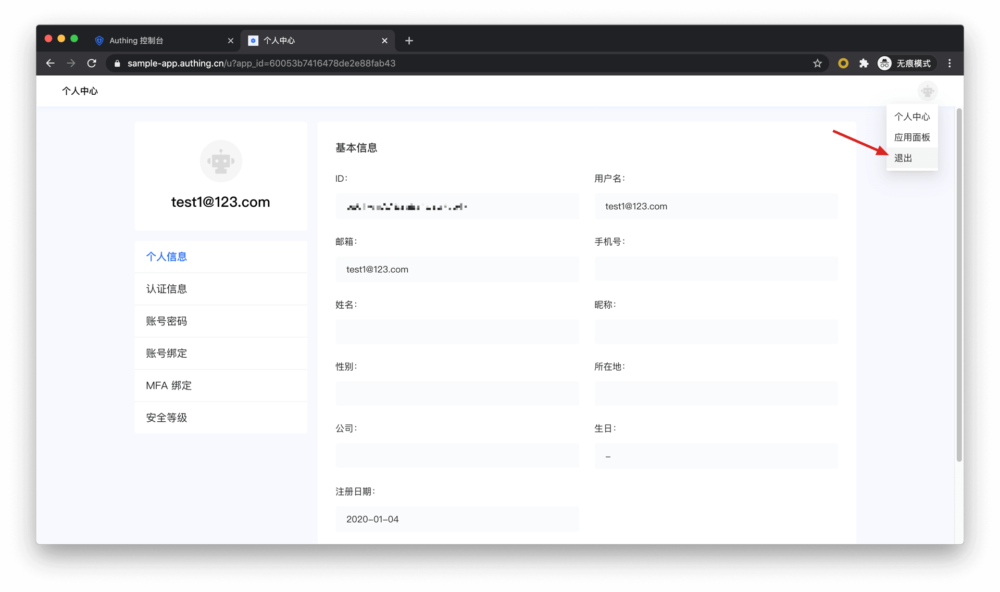
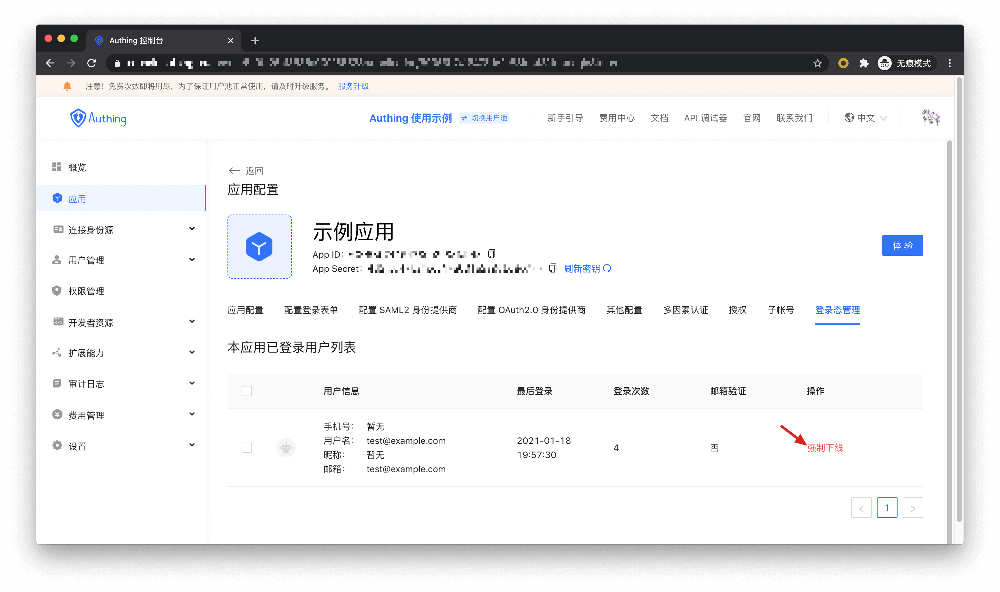

# 退出登录

<LastUpdated/>

{{$localeConfig.brandName}} 支持多种退出方式：

- [从个人中心退出](#从个人中心退出)：此方式适合你使用 {{$localeConfig.brandName}} 托管的在线个人中心的场景；
- [从前端退出](#从前端退出)：此方式适合几乎任何场景；
- [从后端登出](#从后端登出)：此方式适合管理员调用 API 强制下线用户的场景；
- [强制用户下线](#强制用户下线)：此方式适合管理员使用控制台强制下线用户的场景。

## 从个人中心退出

终端用户可以访问 `https://应用域名.authing.cn/u` 进入个人中心，点击右上角的头像，点击退出。



## 从前端退出

引导你的终端用户访问 `https://应用域名.authing.cn/login/profile/logout?redirect_uri={{CALLBACK_URL}}` 进行退出，redirect_uri 可以填写一个退出后的回调地址，例如可以跳转到你的业务首页。

> 注意 ⚠️：你需要使用 `encodeURIComponent` 对回调链接进行 URL Encode。

## 从后端登出

如果你需要在后端退出一个 {{$localeConfig.brandName}} 用户，需要访问以下接口：

- 接口说明：用户池管理员在后端将 {{$localeConfig.brandName}} 用户退出登录。
- 接口地址：`POST` `https://<你的应用域名>.authing.cn/api/v2/applications/:appId/kick-active-users`
- 请求头：

| 参数                  | 类型   | 是否必填 | 描述               |
| --------------------- | ------ | -------- | ------------------ |
| x-authing-userpool-id | string | 是       | 用户池 ID。        |
| Authorization         | string | 是       | 用户池管理员 token |

- 请求参数：

| 参数    | 类型     | 是否必填 | 描述           |
| ------- | -------- | -------- | -------------- |
| userIds | string[] | 是       | 用户 ID 数组。 |
| appId   | string   | 是       | 应用 ID。      |

- 返回数据：

```json
{
  "code": 200,
  "message": "强制下线成功"
}
```

## 强制用户下线

用户池管理员可以通过**控制台** > **应用** > **登录态管理**，强制让用户下线。


