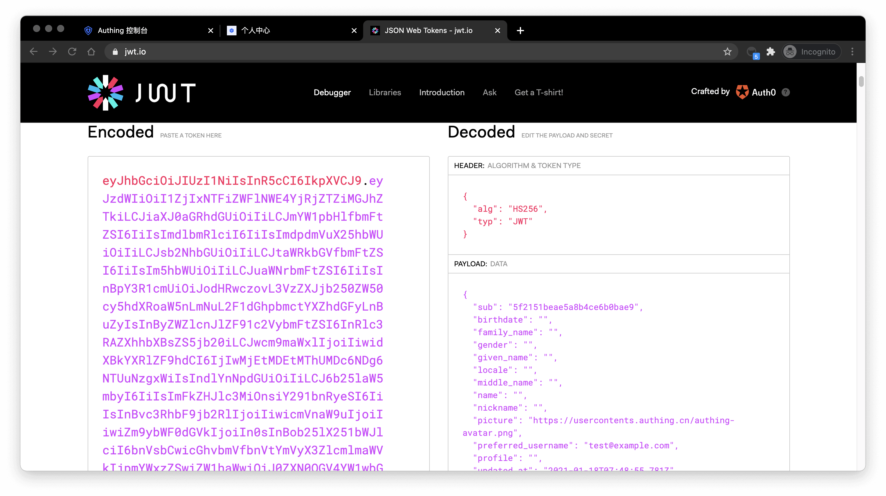

# 使用内嵌登录组件完成认证

<LastUpdated/>

内嵌登录组件（Guard）被认为是灵活性和集成之间的最佳平衡。如果集成需要更深入的自定义级别，或者在一些前后端分离的场景中无法使用 [托管模式](../use-hosted-login-page.md)，则建议使用此模式。内嵌登录组件由 {{$localeConfig.brandName}} 构建和更新，使用行业最佳实践安全性设计，仅需要几行 JavaScript 代码就可以集成到你开发的项目中。它可以直接从 CDN 或 NPM 加载，也可以从源代码构建。Authing 登录组件同时提供 Javascript 原生、React、Vue 和 Angular 的多种集成模式，在你的任何项目中都可以无缝集成并享有高度自定义灵活性。更加详细的介绍请见 [接入 Authing Guard](/reference/guard/v2/)。

::: hint-info
你可以查看 [托管登录页 vs 可嵌入登录组件](/concepts/embeded-vs-hosted.md) 了解 {{$localeConfig.brandName}} 托管的登录页和内嵌登录组件的区别。
:::

## 内嵌登录组件介绍

{{$localeConfig.brandName}} 内嵌登录组件集成了以下功能：

- 登录：包含账号密码登录（包括手机号 + 密码、邮箱 + 密码、用户名 + 密码）、验证码登录（短信验证码、邮箱验证码）以及移动端 APP 扫码。
- 注册：包含手机验证码注册和用户名密码注册。
- 社会化登录，如 GitHub 登录（需先在后台配置）。
- APP 扫码登录（需先接入 APP 扫码登录）。
- 小程序扫码登录（需先在后台配置）。
- 企业身份源登录（需要配置企业身份源）。
- 忘记密码以及重置密码。
- MFA 认证。

其具备以下特性：

- 轻量级：所有资源打包起来只有几百 kb；
- 响应式：兼容移动端和 PC 端网页；
- 定制化：可以支持完整的 UI 自定义功能。

<iframe src="https://codesandbox.io/embed/red-microservice-6613h?fontsize=14&hidenavigation=1&theme=dark"
     style="width:100%; height:500px; border:0; border-radius: 4px; overflow:hidden;"
     title="authing-react-guard"
     allow="accelerometer; ambient-light-sensor; camera; encrypted-media; geolocation; gyroscope; hid; microphone; midi; payment; usb; vr; xr-spatial-tracking"
     sandbox="allow-forms allow-modals allow-popups allow-presentation allow-same-origin allow-scripts"
></iframe>

</br>

## 不同前端框架的接入流程

无论使用哪一种框架，你都需要用到应用的 `appId` ，请先 [前往控制台获取](https://console.authing.cn)。关于 **APP ID** 所在位置，请参阅 [应用配置](https://docs.authing.cn/v2/guides/app-new/create-app/app-configuration.html)。

<StackSelector snippet="ui-components-example" selectLabel="选择前端框架" :order="['react', 'react18', 'vue', 'vue3', 'angular', 'native-javascript']"/>

## 在后端验证用户的 Token 是否有效

用户信息的 `token` 字段为标准的 [OIDC IdToken](/concepts/id-token.md)，你可以在后端使用应用的 ID 和 Secret 验证此 `token`。

示例的 `token` 如下：

```
eyJhbGciOiJIUzI1NiIsInR5cCI6IkpXVCJ9.eyJzdWIiOiI1ZjIxNTFiZWFlNWE4YjRjZTZiMGJhZTkiLCJiaXJ0aGRhdGUiOiIiLCJmYW1pbHlfbmFtZSI6IiIsImdlbmRlciI6IiIsImdpdmVuX25hbWUiOiIiLCJsb2NhbGUiOiIiLCJtaWRkbGVfbmFtZSI6IiIsIm5hbWUiOiIiLCJuaWNrbmFtZSI6IiIsInBpY3R1cmUiOiJodHRwczovL3VzZXJjb250ZW50cy5hdXRoaW5nLmNuL2F1dGhpbmctYXZhdGFyLnBuZyIsInByZWZlcnJlZF91c2VybmFtZSI6InRlc3RAZXhhbXBsZS5jb20iLCJwcm9maWxlIjoiIiwidXBkYXRlZF9hdCI6IjIwMjEtMDEtMThUMDc6NDg6NTUuNzgxWiIsIndlYnNpdGUiOiIiLCJ6b25laW5mbyI6IiIsImFkZHJlc3MiOnsiY291bnRyeSI6IiIsInBvc3RhbF9jb2RlIjoiIiwicmVnaW9uIjoiIiwiZm9ybWF0dGVkIjoiIn0sInBob25lX251bWJlciI6bnVsbCwicGhvbmVfbnVtYmVyX3ZlcmlmaWVkIjpmYWxzZSwiZW1haWwiOiJ0ZXN0QGV4YW1wbGUuY29tIiwiZW1haWxfdmVyaWZpZWQiOmZhbHNlLCJkYXRhIjp7InR5cGUiOiJ1c2VyIiwidXNlclBvb2xJZCI6IjVhOWZhMjZjZjg2MzVhMDAwMTg1NTI4YyIsImFwcElkIjoiNjAwNTNiNzQxNjQ3OGRlMmU4OGZhYjQzIiwiaWQiOiI1ZjIxNTFiZWFlNWE4YjRjZTZiMGJhZTkiLCJ1c2VySWQiOiI1ZjIxNTFiZWFlNWE4YjRjZTZiMGJhZTkiLCJfaWQiOiI1ZjIxNTFiZWFlNWE4YjRjZTZiMGJhZTkiLCJwaG9uZSI6bnVsbCwiZW1haWwiOiJ0ZXN0QGV4YW1wbGUuY29tIiwidXNlcm5hbWUiOiJ0ZXN0QGV4YW1wbGUuY29tIiwidW5pb25pZCI6bnVsbCwib3BlbmlkIjpudWxsLCJjbGllbnRJZCI6IjVhOWZhMjZjZjg2MzVhMDAwMTg1NTI4YyJ9LCJ1c2VycG9vbF9pZCI6IjVhOWZhMjZjZjg2MzVhMDAwMTg1NTI4YyIsImF1ZCI6IjYwMDUzYjc0MTY0NzhkZTJlODhmYWI0MyIsImV4cCI6MTYxMjE2NTg4OCwiaWF0IjoxNjEwOTU2Mjg4LCJpc3MiOiJodHRwczovL3NhbXBsZS1hcHAuYXV0aGluZy5jbi9vaWRjIn0.SNyGBffF-zBqDQFINGxUJZrWSAADHQhbEOsKvnH4SLg
```

你可以在 [JWT.IO](https://jwt.io/)（国内用户可以访问此 [镜像站](https://jwt.yelexin.cn)）中解码此 ID Token ：



其中 `sub` 字段为用户的 ID，`aud` 字段为应用的 ID，你可以通过 [Microsoft identity platform ID tokens](https://docs.microsoft.com/en-us/azure/active-directory/develop/id-tokens) 了解 OIDC `IdToken` 每个字段的详细释义。

基本上所有语言都提供了检验 `IdToken` 的 Library，以 Node.js 为例，你可以使用 [JSON Web Token](https://www.npmjs.com/package/jsonwebtoken) 来验证 `IdToken`：

```javascript
const jwt = require("jsonwebtoken");

try {
  const data = jwt.verify("YOUR_ID_TOKEN", "YOUR_APP_SECRET");
} catch (error) {
  // token might be invalid or expired
  console.error(error);
}
```

如果验证成功，你可以通过 sub 字段得到该用户的唯一 ID，之后你就可以将用户 ID 与自己的业务结合起来啦！如果你需要给不同的用户授权不同的角色、权限，你可以了解如何给用户授权角色、权限，以进行细粒度的权限控制。

## 详细的参数与事件列表

{{$localeConfig.brandName}} 内嵌登录组件支持高度自定义化，除了自定义标题、Logo 等基础配置外，你还可以配置不同的登录方式，通过自定义 CSS 完全自定义样式等；除了成功登录事件外，{{$localeConfig.brandName}} 内嵌登录组件还封装了成功注册、登录失败、登录注册方式切换等事件，详细文档请见 [登录组件（Guard）文档](/reference/guard/v2/)。
