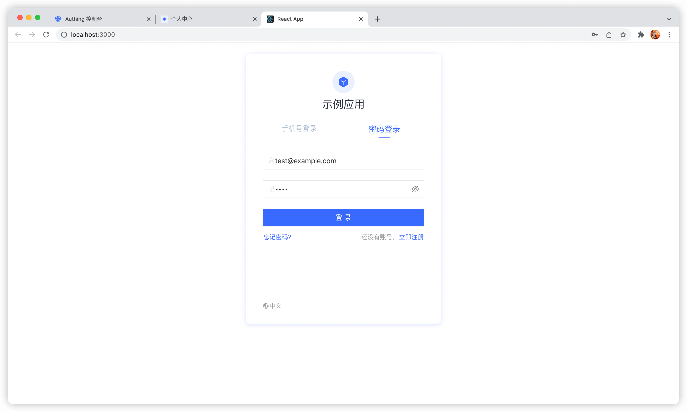
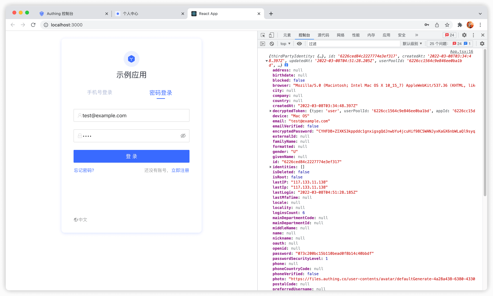

### 安装

这里推荐使用 `create-react-app` 初始化一个 React 项目：

```shell
npx create-react-app first-authing-app --template typescript
```

之后安装 `@authing/react-ui-components` SDK：

```shell
yarn add @authing/react-ui-components
```

或者：

```
npm install @authing/react-ui-components --save
```

### 初始化

你需要从 `@authing/react-ui-components` 中引入 `AuthingGuard`，初始化 `AuthingGuard` 只需要一个参数 —— 你的应用 ID（appId），你可以在控制台的应用列表页面获取应用的 appId。

```javascript
import { AuthingGuard } from "@authing/react-ui-components";
import "@authing/react-ui-components/lib/index.min.css";

function App() {
  return (
    <div className="App">
      <AuthingGuard appId="AUTHING_APP_ID" />
    </div>
  );
}
```

Authing Guard 会自动从服务器拉取该应用的配置，如名称、Logo 等，刷新一下页面，一个内嵌登录表单就显示出来了：



接下来我们来监听用户登录事件，在用户登录成功之后获取其用户信息。

### 监听成功登录事件

监听成功登录事件非常简单，你只需要传入一个 `onLogin` 回调即可：

```javascript
function App() {
  return (
    <div className="App">
      <AuthingGuard
        appId="AUTHING_APP_ID"
        onLogin={(userinfo) => {
          console.log(userinfo);
        }}
      />
    </div>
  );
}
```

在此我们只是简单地把获取到的用户信息 `console.log` 了出来：



用户信息中的 `token` 字段为该用户的身份凭证，后续访问你后端资源的时候应该带上，然后在后端验证此 `token` 的身份。
