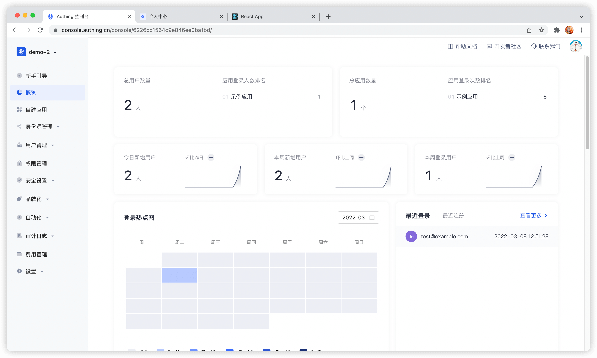

---
meta:
  - name: description
    content: 控制台概览
---

# 控制台概览

<LastUpdated/>

控制台是你管理和配置所有 Authing 资源的地方，这篇文章会帮助你学会使用 Authing 控制台提升生产力！

在 [Authing 控制台](https://console.authing.cn/console/userpool) 中你可以对 Authing 的资源、用户等信息进行配置和修改。

::: img-description
控制台概览
:::

以下会按照控制台左侧导航菜单 **从上往下** 介绍控制台每个模块：

<table>
  <thead>
    <tr>
      <th style="text-align:left">模块</th>
      <th style="text-align:left">说明</th>
    </tr>
  </thead>
  <tbody>
   <tr>
      <td style="text-align:left"><b>概览</b></td>
      <td style="text-align:left">
    展示系统和用户的多种统计信息，包括：
        <ul>
            <li>展示总应用数量。</li>
            <li>展示总用户数量。</li>
            <li>展示登录和新增用户统计。</li>
            <li>多种图形方式查看一段时间内用户的登录次数、数量变化、应用登录信息、用户分布等统计。</li>
        </ul>
      </td>
    </tr>
        <tr>
      <td style="text-align:left"><b>应用</b></td>
      <td style="text-align:left">
      可以在 <b>应用</b> 模块配置单点登录（SSO），包括：
        <ul>
          <li>集成第三方应用。</li>
          <li>作为服务提供商（SP），将 APP集成至 Authing：</li>
          <ul> ​
         <li>可配置应用基本信息、默认页面显示，为应用集成 OIDC / SAML2 / CAS / OAuth 2.0 / 协议。</li>​
         <li>配置登录方式。</li>​
         <li>进行访问授权。</li>​
          <li>自定义应用登录框、安全规则，身份品牌化。</li>​
          <li>进行租户配置。</li>​
         </ul>
         </li>
          <li>作为身份提供商（IDP），对外提供认证。</li>
        </ul>
      </td>
    </tr>
    <tr>
      <td style="text-align:left"><b>身份源管理</b></td>
      <td style="text-align:left">
        
连接第三方身份源，支持应用通过第三方身份源进行认证、授权登录，并支持客户自定义数据库用以存储用户数据，具体如下：

        <ul>
          <li>连接企业身份源（OIDC、SAML、办公应用如钉钉、企业微信）。</li>
          <li>配置社会化登录。</li>
          <li>自定义数据库。</li>
        </ul>
      </td>
    </tr>
    <tr>
<td style="text-align:left"><b>用户管理</b></td>
      <td style="text-align:left">
        
管理系统中的所有组织和用户信息，包括：

        <ul>
          <li>创建、管理用户。</li>
          <li>创建、管理用户组。</li>
          <li>创建、管理组织机构。</li>
<li>创建同步任务，实现组织信息和用户信息的上 / 下游同步。</li>
<li>使用 LDAP 协议查看、修改、增加和删除用户信息。</li>
<li>配置注册白名单。开启后，只有白名单内的用户才可进行注册。</li>
        </ul>
      </td>
    </tr>
    <tr>
      <td style="text-align:left"><b>权限管理</b></td>
      <td style="text-align:left">
        
围绕资源、基于 RBAC（Role-Based Access Control，基于角色的访问控制）和 ABAC（Attribute-Based Access Control，基于属性的权限控制）进行精细化的权限管理，包括：

        <ul>
          <li>添加和管理资源，配置资源操作类型。</li>
          <li>添加和管理角色，为角色分配用户、组织，并为角色授权资源操作。</li>
          <li>通过一定的授权规则，将资源的访问、修改等权限授予某些主体。</li>
        </ul>
      </td>
    </tr>
    <tr>
      <td style="text-align:left"><b>安全设置</b></td>
      <td style="text-align:left">
        
配置开发过程、密码设置、二次身份验证所涉及的安全策略，包括：

        <ul>
          <li>配置用户池级的基础、注册及登录安全规则。
          
安全域（Allowed Origins） 是允许从 JavaScript 向 Authing API 发出请求的 URL（通常与 CORS 一起使用）。 默认情况下，系统会允许你使用所有网址（\*）。 如果需要，此字段允许你输入其他来源。 你可以通过逐行分隔多个有效 URL，并在子域级别使用通配符（例如：[https://\*.sample.com）。](https://*.sample.com）。) 验证这些 URL 时不考虑查询字符串和哈希信息，如果带上了查询字符串和哈希信息系统会自动忽略整个域名。

          </li>
          <li>自定义密码强度、加密方法和密码轮换策略。</li>
          <li>配置用户池级二次身份验证。</li>
        </ul>
      </td>
    </tr>
    <tr>
      <td style="text-align:left"><b>品牌化</b></td>
      <td style="text-align:left">
        
可根据不同企业品牌需求自定义登录面板，配置信息补全。

        <ol>
          <li>配置登录框样式。</li>
          <li>上传自定义 CSS。</li>
          <li>配置登录注册用户协议。</li>
          <li>配置消息邮件和短信提醒。</li>
        </ol>
      </td>
    </tr>
    <tr>
      <td style="text-align:left"><b>自动化</b></td>
      <td style="text-align:left">
        
Authing 的 Pipeline、 Webhook、自定义密码函数极大地提升了认证过程中的灵活性和可扩展性，赋能用户自动化处理复杂场景。

        <ul>
          <li>Pipeline</li>
          <li>Webhook</li>
        </ul>
      </td>
    </tr>
    <tr>
      <td style="text-align:left"><b>审计日志</b></td>
      <td style="text-align:left">
        
在此可以查看用户操作日志和管理员日志。

      </td>
    </tr>
    <tr>
      <td style="text-align:left"><b>设置</b>
      </td>
      <td style="text-align:left">
      
编辑或删除用户池，修改开发环境变量等：

      <ul>
        <li>用户池基础信息设置</li>
        <li>费用管理
在此可以服务升级以及查看订单详情。
</li>
        <li>扩展字段</li>
        <li>环境变量
环境变量就是一组 Key-Value 键值对（类似于操作系统的环境变量），你可以在环境变量中统一管理一些常量值，以便在 Pipeline、SAML 字段 Mapping、自定义数据等场景下使用。
</li>
        <li>协作管理员
邀请用户池中的用户或 Authing 的官方用户池中的开发者，帮你管理该用户池，被授权的开发者将会在用户池列表页面中看到该用户池。
</li>
      </ul>
      </td>
    </tr>
  </tbody>
</table>
