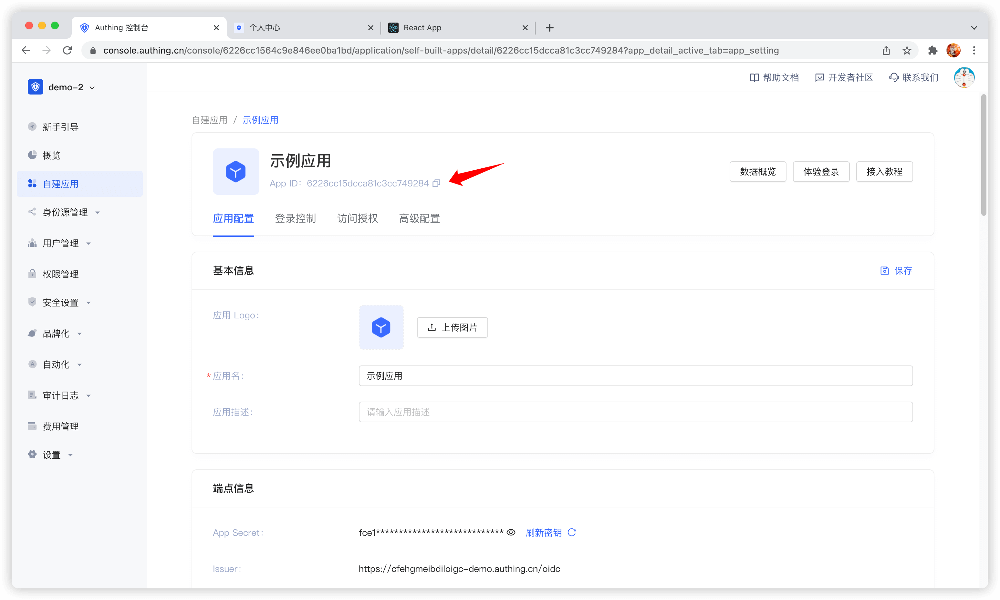

# 在单页应用（SPA）中集成 {{$localeConfig.brandName}}

<LastUpdated/>

单页应用（Single Page Application，简称 SPA）指的是一种 Web 应用或者网站的模型，它通过动态重写当前页面来与用户交互，而非传统的从服务器重新加载整个新页面。这种方法避免了页面之间切换打断用户体验，使应用程序更像一个桌面应用程序。在单页应用中，所有必要的代码（HTML、JavaScript 和 CSS）都通过单个页面的加载而检索，或者根据需要（通常是为响应用户操作）动态加载适当的资源并添加到页面。与单页应用的交互通常涉及到与后端服务器的动态通信。

在 SPA 应用中接入 {{$localeConfig.brandName}} 最简单的方式是使用 {{$localeConfig.brandName}} 提供的[内嵌登录组件](/reference-new/guard/)和 [Javascript SDK](/reference-new/standard-web-application/sdk-for-node/) 来进行登录和认证。本文以 React 项目为例。

## 获取应用 ID

登录 {{$localeConfig.brandName}} 后，{{$localeConfig.brandName}} 会为你创建一个默认用户池和应用，你也可以自己创建应用，在应用详情中，可以获取应用 ID，点击复制按钮复制即可：



## 集成 {{$localeConfig.brandName}} 到你的 SPA 应用

### 安装 {{$localeConfig.brandName}} 登录组件

```bash
yarn add @authing/react-ui-components

 # OR

npm i @authing/react-ui-components --save
```

`@authing/react-ui-components` 中有 {{$localeConfig.brandName}} 提供的一些 React 组件和获取 [AuthenticationClient](/sdk/sdk-for-node/authentication/AuthenticationClient) 的 API，其中就包括 [AuthingGuard](/reference-new/guard/) 登录组件。

### 配置 AuthingGuard

```js
import React from 'react'
import ReactDOM from 'react-dom'
import { AuthingGuard } from '@authing/react-ui-components'
// 引入 css 文件
import '@authing/react-ui-components/lib/index.min.css'

const App = () => {
  const appId = 'AUTHING_APP_ID'

  // 登录成功
  const onLogin = (userInfo) => {
    console.log(userInfo)
    // 这里可以重定向到其他页面了
    // ...
  }

  return <AuthingGuard appId={appId} onLogin={onLogin} />
}

ReactDOM.render(<App />, root)
```

通过传入 `appId`，`AuthingGuard` 就可以展示登录框进行登录了。

### 退出登录

现在你已经可以登录了，同时需要一个方法使用户登出，可以通过 [AuthenticationClient](/sdk/sdk-for-node/authentication/AuthenticationClient) 实现。

```js
// src/index.js

import { initAuthClient } from '@authing/react-ui-components'
// 在项目入口文件中初始化 AuthenticationClient
initAuthClient({
  appId: 'YOUR_APP_ID',
})
```

```js
import React from 'react'
import { getAuthClient } from '@authing/react-ui-components'

const LogoutButton = () => {
  return <button onClick={() => getAuthClient().logout()}>退出</button>
}

export default LogoutButton
```

### 获取用户信息

用户登录后，你可能还需要获取当前登录用户的用户信息。

```js
// src/index.js

import { initAuthClient } from '@authing/react-ui-components'
// 在项目入口文件中初始化 AuthenticationClient
initAuthClient({
  appId: 'YOUR_APP_ID',
})
```

```js
import React, { useState, useEffect } from 'react'
import { getAuthClient } from '@authing/react-ui-components'

const UserInfo = () => {
  const [user, setUser] = useState()
  const [isAuthenticated, setIsAuthenticated] = useState(true)

  useEffect(() => {
    getAuthClient()
      .getCurrentUser()
      .then((userInfo) => {
        if (userInfo) {
          setUser(userInfo)
        } else {
          setIsAuthenticated(false)
        }
      })
  }, [])

  return isAuthenticated ? (
    user ? (
      <div>
        
        <h2>{user.username}</h2>
        <p>{user.email}</p>
      </div>
    ) : (
      <div>Loading...</div>
    )
  ) : (
    <h3>暂未登录</h3>
  )
}

export default UserInfo
```

`getCurrentUser` 能获取当前登录用户的信息，若未登录会返回 `null`
