# 管理员相关操作

<LastUpdated/>

## 开通体验期

新老用户都可以为不同场景下的用户池开通体验期，体验相应用户池下所有权益。本章节分别介绍新老用户如何开通体验期。

::: hint-info
* 仅支持为新建用户池开通体验期，现有用户池不能直接开通体验期。
* 注意：体验期到期后，用户池若未升级版本，则关闭对应用户池的所有权益，不可以继续使用。
:::

### 新用户开通体验期

要开通体验期，管理员需执行以下步骤：

1. 新用户在官网按照提示进行注册，认证成功后点击 **开始使用**。

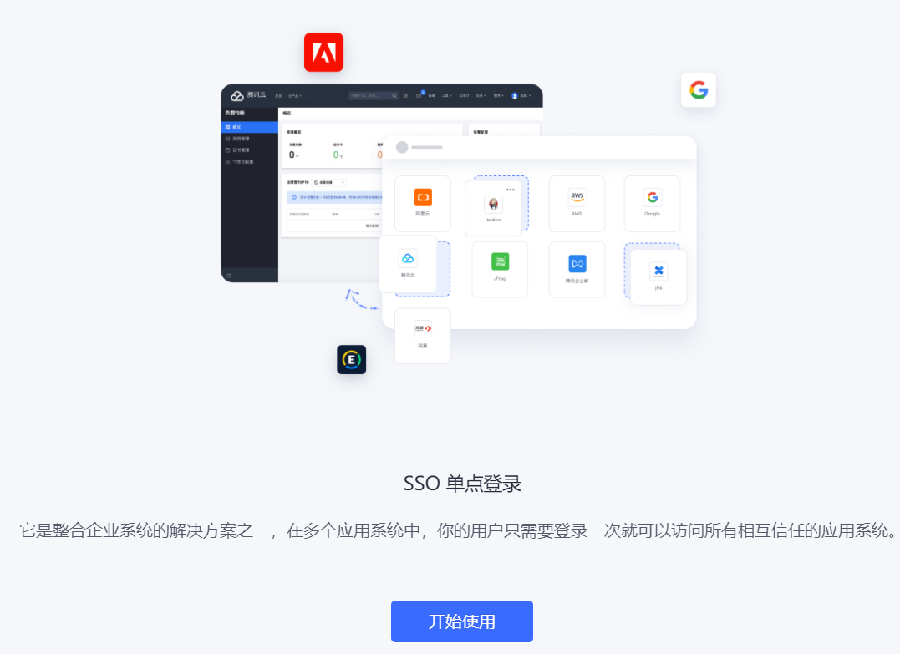

2. 选择待开通体验期的用户池类型（此处以 ToB 为例），点击 **创建用户池**。 提示已为当前用户池开启了体验期。

::: hint-info
* 根据不同的用户使用场景，用户池可分为 ToE（企业员工）、ToB（客户）、ToC（终端用户）。一个账号可以在免费阶段为每个场景开通且仅能开通一次体验期。
* 页面下方默认勾选开启体验期提示，选择用户池并点击点击 **创建用户池** 即为创建的用户池默认开启 30 天体验期。若取消勾选，则会创建免费版用户池。
* **注意：**体验期到期后如未升级，则无法登录用户池。
:::

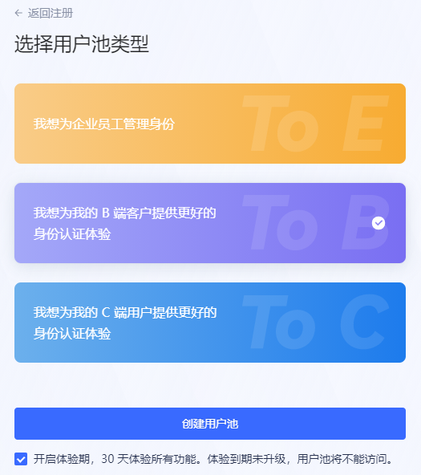

3. 输入用户池名称，补全当前账户手机号信息，输入收到的验证码，点击 **完成创建**。

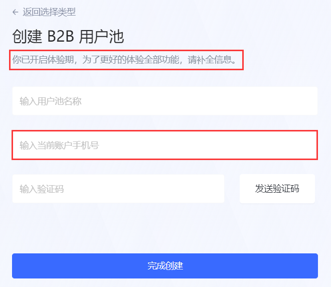

::: hint-info
* 新用户需提供手机号，便于 {{$localeConfig.brandName}} 了解您的使用体验，为您提供直达服务。
* 对于手机号注册用户，无需再补充手机号。
:::

至此，完成新用户的注册并为创建的用户池开通体验期。新用户进入用户池首页，现在可以开始体验该用户池内所有权益。

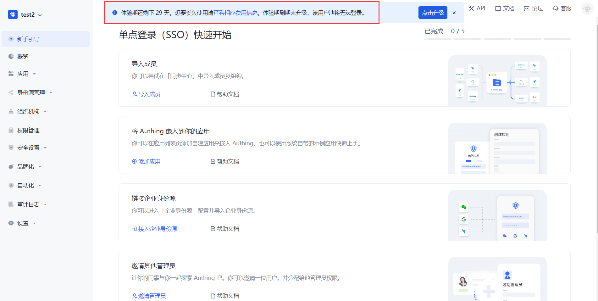

### 老用户开通体验期

对于已经注册的用户，可以创建不同场景的用户池，并为其开通体验期。

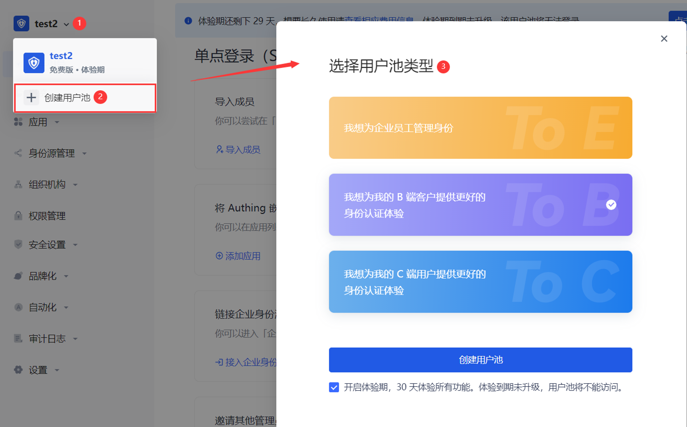

要为老用户开通体验期，执行以下步骤：

1. 点击页面左上角用户池下拉按钮。

2. 点击 **+ 创建用户池**。

3. 选择用户池类型并点击 **创建用户池** 按钮。

4. 输入用户池名，点击 **完成创建**。

::: hint-info
系统会判断老用户是否已经注册了手机号，如已注册，则此处无需补全手机信息；否则，需要补全。
:::

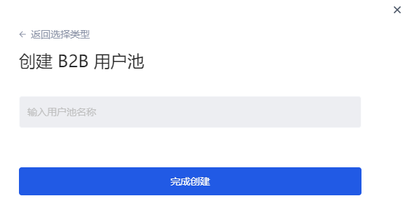

### 用户池体验期提示

开通体验期后，体验期提示出现在以下位置，借以帮助用户快速识别当前用户池已开通体验期，并提示用户体验期倒计时：

* 托管页所有页面顶部

::: hint-info
对于每个场景的用户池，页面顶部都会提供相同的体验期策略提示：
  * 显示体验期剩余天数（29->0 倒计时）。
  * 体验期前 20 天，提示可关；超出 20 天，提示不可关闭。
  * 点击 **查看相应费用信息** 可跳转至 **设置->费用管理** 页面查看用户池当前 **版本信息**（包括各用户池版本权益对比列表）、**用量信息** 及 **订单管理** 信息。
  * 点击提示中 **点击升级** 按钮可跳转至 **设置->费用管理->版本信息->版本升级** 模块进行用户池版本升级。
:::

* 用户池下拉列表

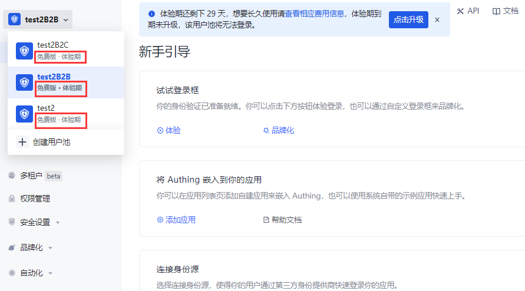

* 用户池管理

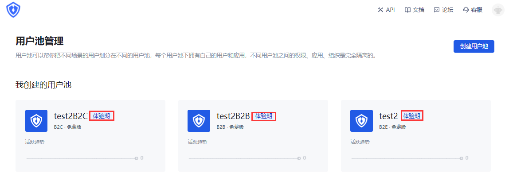

## 查看权益对比

### 版本信息

路径：**设置->费用管理->版本信息->版本对比**

每个场景用户池支持多种权益版本，不同版本提供不同权益和用量。体验期集成各版本所有权益，每种权益的用量采用各版本中最小用量（即阶梯式权益），不会超出高版本的限制。

在 **费用管理** 菜单下提供了各用户池版本间权益的对比，管理员可以在此查看各用户池版本所提供权益有哪些不同，以及各版本每个权益授权的用量有怎样的不同限制。

::: hint-info
* 下图以 ToB 场景用户池为例，说明当体验期基于免费版时开放给用户的权益和相应用量。
* 如体验期内权益有更新，会为当前用户池同步更新，体验期策略不受影响。
:::

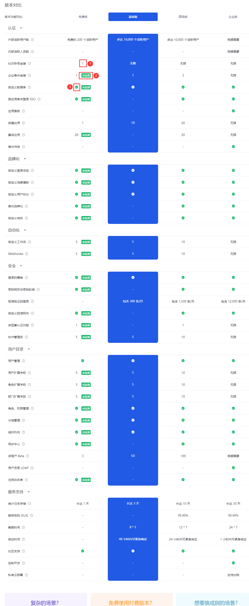

|序号|说明|
|----|----|
|1|表示当前权益限量，数字为被授权的用量。|
|2|表示当前功能是体验期权益，免费版本身无此权益。|
|3|表示当前权益不限量。|

### 用量信息

路径：**设置->费用管理->用量信息**

管理员可以在 **用量信息** 标签页查看当前用户池体验期内享有的各权益详细用量信息。

权益卡片标有 **体验期** 表示，当前权益是超出免费版权益、为体验期试用的权益。

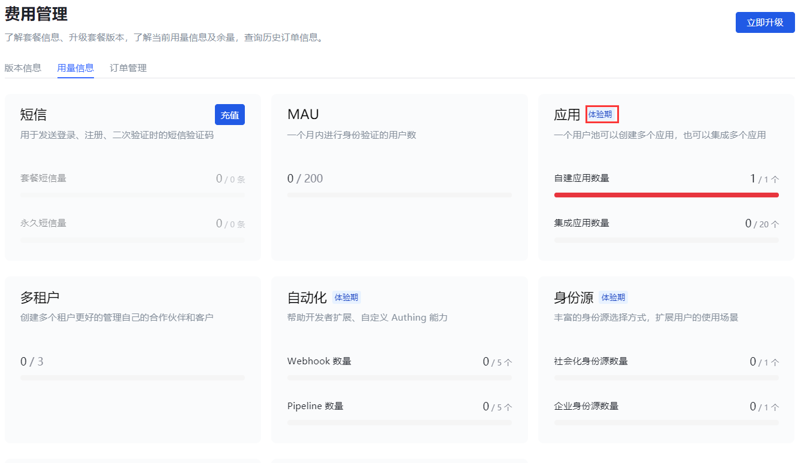

## 用户升级

### 体验期结束

* 体验期最长 30 天，如到期后用户池未升级，则体验期自动结束。

* 如 30 天体验期未满，用户即升级用户池版本，则体验期提前结束，开始升级版计费。此时，体验期内享有的溢出权益不可再用。

#### 短信、邮件通知

创建当天，管理员会收到邮件及短信，通知已开通体验期。

到期前第 7 天、第 3 天、到期前 1 天、及到期当天，管理员会收到短信、邮件，提醒到期。
#### 系统页面提示

在系统各页面顶部会在到期前十天始终作倒计时提示，不可关闭。

### 体验期到期未升级

新用户注册时，当前版本为免费版。体验期到期后，若没有升级版本，体验期用户池所有权益全部停用（包括该用户池的免费权益）。

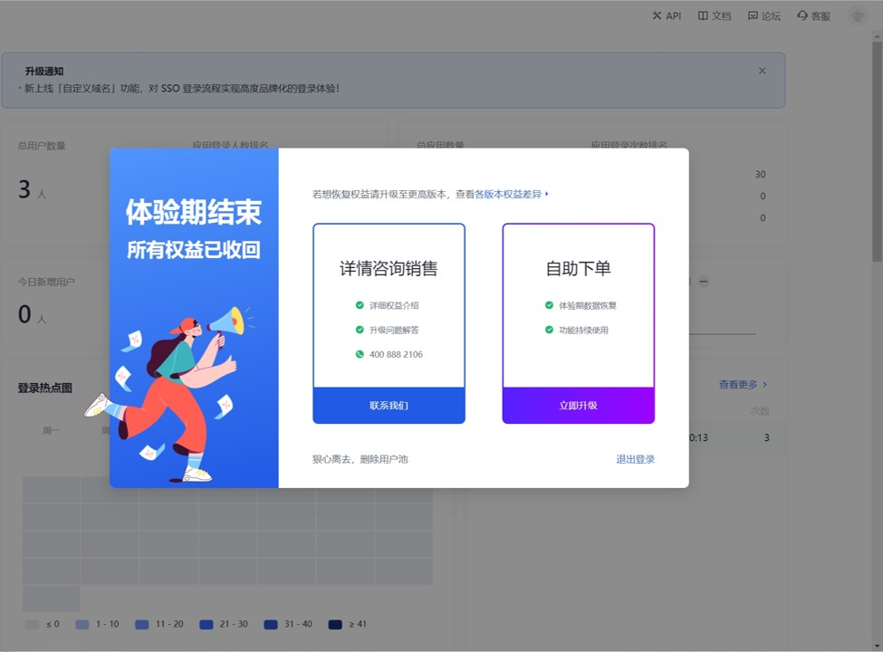

管理员可以点击 **联系我们**，填写联系信息，描述问题。

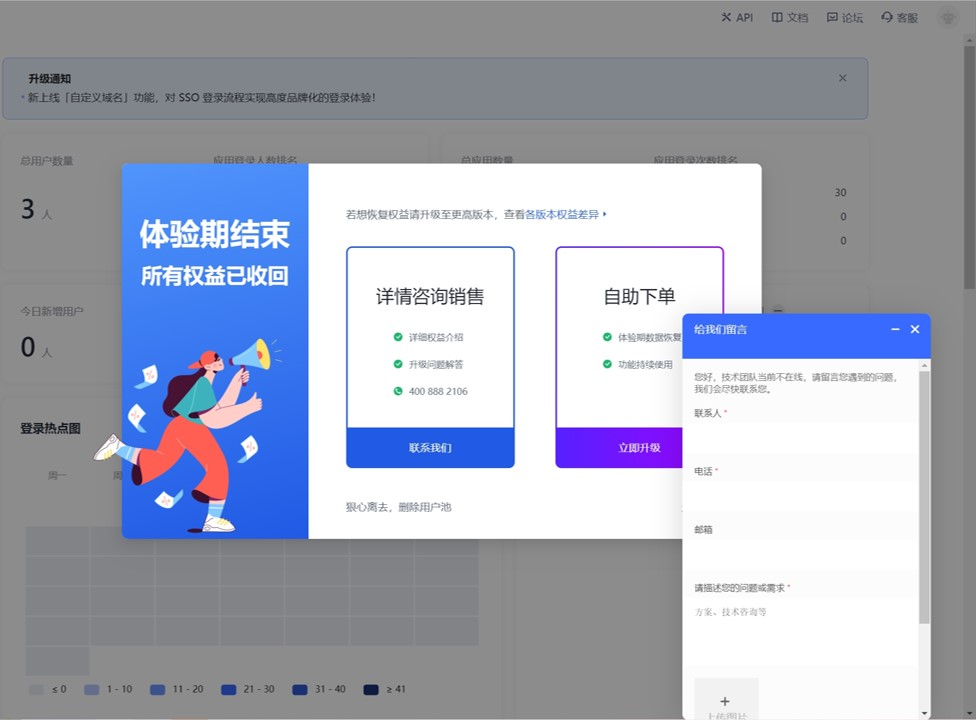

也可点击 **立即升级**，跳转到 **费用管理** 页面，升级到高级别的版本，从而继续使用用户池权益。

还可点击弹出页面下方的 **狠心离去，删除用户池**，从而删除当前用户池。

::: hint-info
删除用户池后，体验期的所有数据会一并删除，不可恢复。
:::

### 体验期到期后用户升级

路径：**设置->费用管理->版本信息->版本升级**

#### 升级到基础版本

适用于：ToC、ToB 场景

体验期到期后，如果用户池从免费版升级到基础版，体验期享有的部分高级版权益（溢出权益）将不再可用（但仍可见）。

要升级到基础版，执行以下步骤：

1. 在 **版本升级** 模块点击 **基础版本** 所在卡片 **立即升级** 按钮。

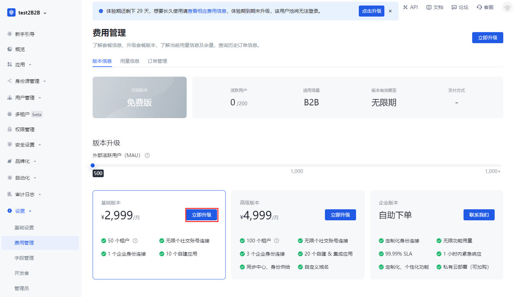

2. 在弹出的提示窗口浏览高级版拥有而基础版不支持的溢出权益。 也可在弹窗中点击 **各版本权益差异** 查看各版本支持的权益详情（详见 [版本对比](#查看权益对比)）。

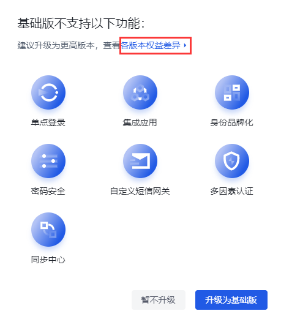

::: hint-info
若仍需使用溢出权益，则可退出当前操作，执行 [升级到高级版](#升级到高级版)。
:::

3. 点击 **升级为基础版**。 点击 **暂不升级** 则退出版本升级操作，放弃升级为基础版。

4. 点击 **前往实名认证**。

::: hint-info
依据相关法律规定，下单前需完成个人或企业实名认证。
:::

5. 选择认证类型：**个人认证** 或 **企业认证**，点击 **开始认证**。

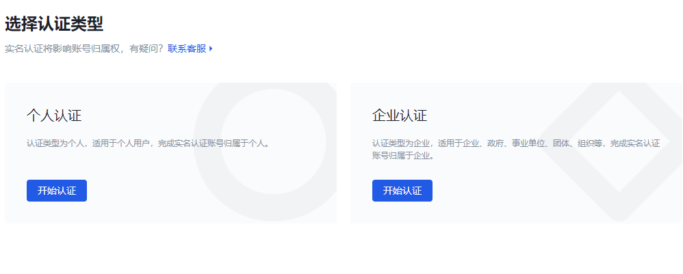

6. 填写认证信息，点击 **提交认证**。

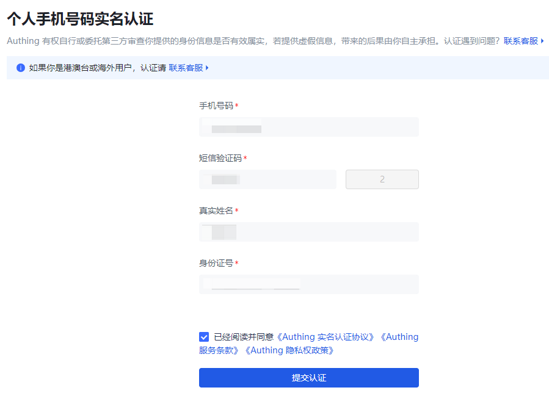

::: img-description
个人实名认证
:::

::: img-description
企业认证
:::

系统提示认证成功，几秒后返回 **费用管理->版本升级** 页面。

7. 再次点击 **基础版本** 所在卡片 **立即升级** 按钮。 进入付费方式选择页面。

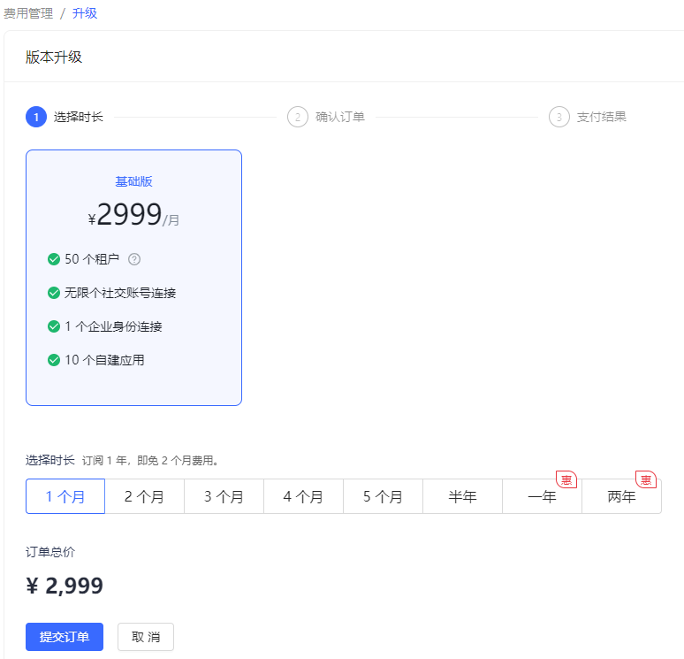

8. 你可以在此选择新版本使用时长，点击 **提交订单**。

::: hint-info
对于超过一年的使用时长，{{$localeConfig.brandName}} 提供优惠政策：每满一年，免 2 个月的费用。
:::

9. 选择 **支付方式**，查看 **服务协议** 后勾选同意，点击 **立即支付**。

::: hint-info
用户需要在 2 个小时内完成支付，逾期会关闭交易。
:::

10. 在弹出窗口扫码支付。

#### 升级到高级版本

适用于：ToC、ToB、ToE 场景

升级到高级版后，所有权益都可用，且部分权益用量会提高。

::: hint-info
体验期升级后：测试功能的数据仍可见。
:::

要升级到高级版，执行以下步骤：

1. 在 **版本升级** 模块点击 **高级版本** 所在卡片 **立即升级** 按钮。

2. 若尚未进行实名认证，如 [升级到基础版本步骤 5、6](#升级到基础版本) 所述进行个人 / 企业实名认证。

3. 再次点击 **高级版本** 所在卡片 **立即升级** 按钮。 进入付费方式选择页面。

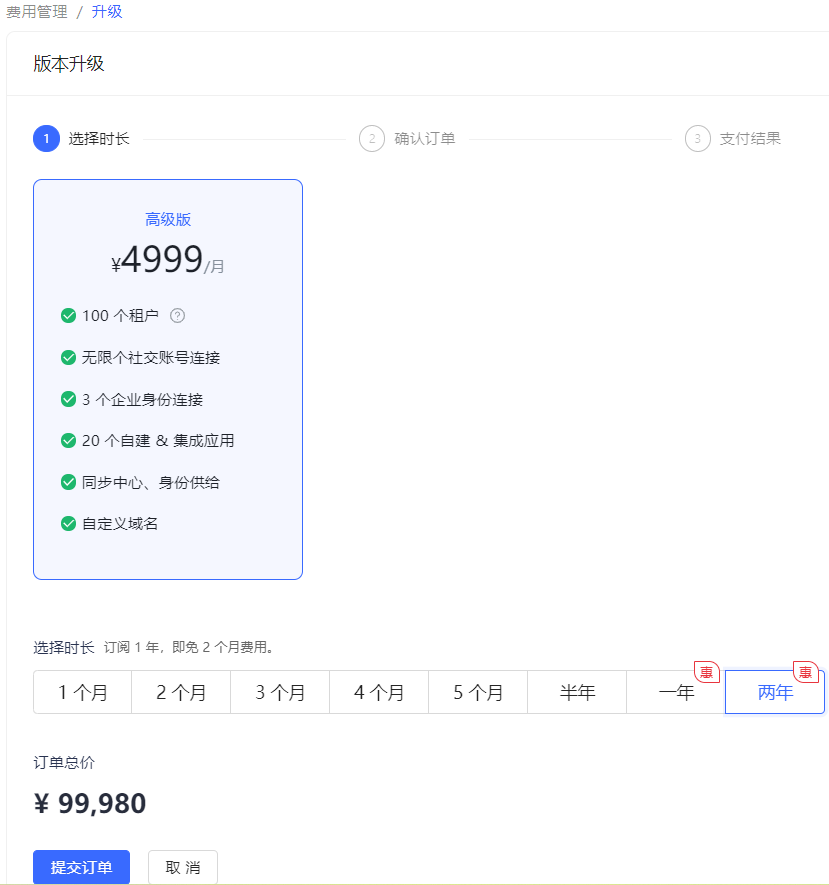

4. 参考 [升级到基础版本步骤 8-10](#升级到基础版本) 进行付款。

至此，完成到高级版本的升级。