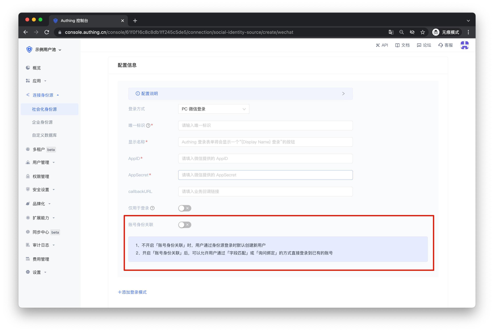
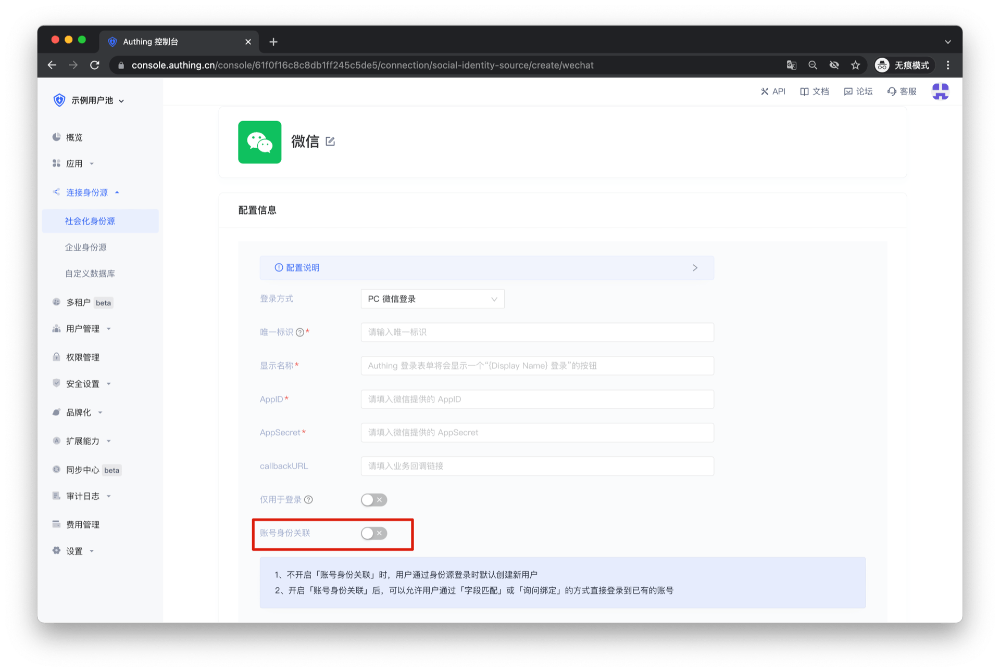
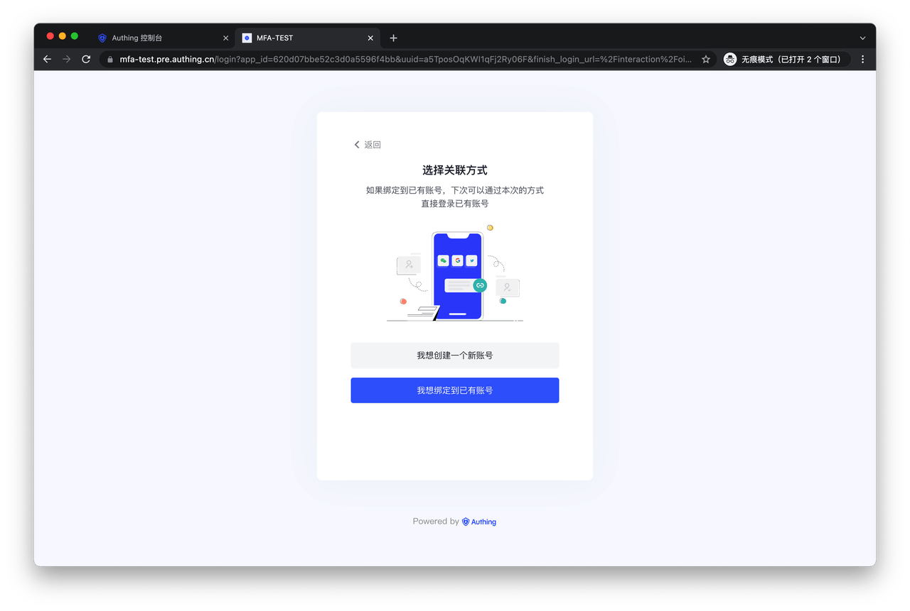
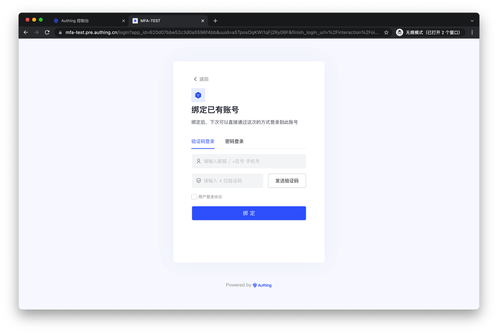

# 身份源连接的账号关联

<LastUpdated/>

使用「身份源连接的账号关联」功能，让你的用户在使用你所配置的社会化身份源和企业身份源登录时，能够直接登录到已有账号。你可以在创建身份源连接时看到相关的配置项。

## 功能介绍

目前本功能支持的身份源连接有：

- 微信
  - PC 微信登录
  - 微信公众号扫码登录
- QQ
- 微博

其他身份源的本功能正在测试中，将会逐步开放，敬请期待。

## 使用说明

当 **未开启「账号身份关联」** 时，用户首次通过身份源登录时默认在用户池中创建新用户。

如果开启了 **「仅用于登录」**，首次使用身份源登录的用户将无法完成登录，只有老用户才能够使用身份源登录。

开启 **「账号身份关联」** 后，你可以对用户的“身份源账号关联方式”进行选择，可以允许用户通过「字段匹配」或「询问绑定」的方式直接登录到已有的账号。

需要注意的是，Authing 仅对于能够获取到用户手机号和邮箱的身份源连接支持「账号匹配」功能，具体细节详见：[身份源连接的账号匹配规则 | Authing 文档](./user-mapping.md)

如果选择 **「询问绑定」** 方式进行身份源的账号关联，你需要在这里配置用户在「账号询问绑定」页面能够使用的绑定方式。

## 用户旅程

在 Authing 控制台完成询问绑定的相关配置后，你的用户在使用身份源登录时会被提示选择是「创建新账号」还是「绑定到已有账号」。

如果用户选择「我想创建一个新账号」，则会在用户池内创建一个新用户。如果用户选择「我想绑定到已有账号」，则会跳转到如下页面：

你的用户可以在这里输入已存在的账号信息，点击「绑定」后，本次登录使用的身份源将作为一种登录方式绑定到已有的账号上。用户在之后的使用中可以直接通过本次的身份源登录方式登录到同一个账号。

另外，当前应用的「登录协议」、「安全设定」等配置，在「账号绑定」页面仍将生效，持续保护用户的登录流程。
