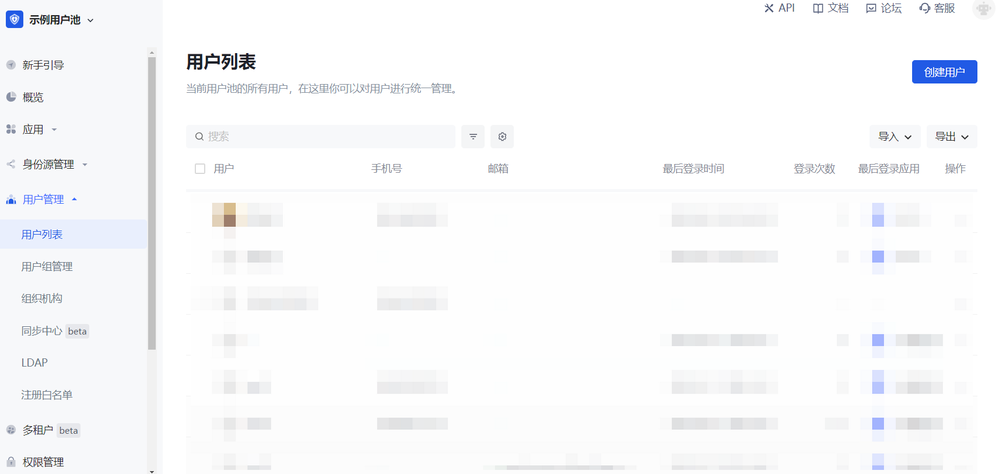
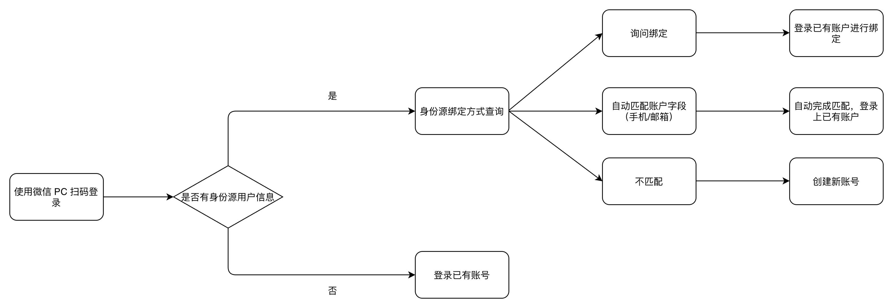

# 账号绑定

<LastUpdated/>

路径：**身份源管理->社会化身份源 / 企业身份源->登陆模式配置详情页->账号绑定**

Authing 支持通过各种不同的方式登录：

* 常规方法是，你的用户使用账号密码、短信 / 邮箱验证码的方式完成登录。

* 另有一种便捷方式，如果你配置了第三方账号登录，那么你的用户可以直接通过自己的第三方账号实现一键登录。

## 在什么情况下你需要账号绑定功能？

我们来设想一种常见的场景：

你准备开始使用 {{$localeConfig.brandName}} 的用户池。由于你的业务已经在正式运行中，已经积累了一些存量用户。于是首先你将存量用户导入到了你的 {{$localeConfig.brandName}} 用户池：

这时，你的用户列表中用户信息可能已经包含了相应用户的手机号、邮箱、用户名等信息：

在这种情况下，你希望通过 {{$localeConfig.brandName}} 提供的第三方账号登录能力，让你的用户不必每次登录时都必须输入账号密码，而是可以直接一键登录。

此时你可能会产生疑问：通过第三方账号登录至你集成在 {{$localeConfig.brandName}} 的应用，如何保证用户通过不同登录方式到达同一个账号？

## 用户旅程

在开始详细介绍账号绑定功能之前，我们首先以「PC 微信扫码」身份源登录方式为例介绍 {{$localeConfig.brandName}} 的账号绑定功能在你的用户登录全旅程中的作用，详见下图：

## 功能概要

当你在 {{$localeConfig.brandName}} 配置第三方身份源时，可以通过「账号绑定」功能确保你的用户无论使用任何一种方式登录，最终都会登录到同一个账号，从而确保每个用户在 {{$localeConfig.brandName}} 的账号唯一性。

{{$localeConfig.brandName}} 支持通过两种方式实现账号绑定：

* **询问绑定**

* **字段匹配**

::: img-description
账号绑定 - 以 Github 为例
:::

::: hint-info
并非所有身份源登录模式都支持账号绑定。关于何种身份源的何种登录模式支持哪种关联方式的账号绑定，请查看下方 [全身份源账号绑定功能支持状态](#全身份源账号绑定功能支持状态)。你可以根据使用的身份源类型以及期望的用户旅程选择适用的账号绑定模式。​
:::

## 字段匹配
​
::: hint-info
本章节以 Github 为例说明如何通过​「字段匹配」实现​「账号绑定」功能。
:::

「字段匹配」适用于能够获取到 {{$localeConfig.brandName}} 用户账号的唯一性字段的身份源。

### 功能作用

开启「字段匹配」后，当你的用户首次通过这个身份源登录时，我们会使用从该身份源拉取到的、你所配置的字段，在 Authing 用户池中进行对应字段的匹配。匹配有两种可能的结果：

* 匹配成功：用户将会直接成功登录至匹配到的账号，并完成该账号与该身份信息的绑定。

* 匹配失败：将会在你的用户池自动创建新账号，用户后续再次使用这种方式登录时，将会登录至本次创建的新账号。特别的，如果你的应用禁止注册（在应用的 **安全管理** 标签页开启了 **禁止注册** 开关），那么在匹配失败时该用户将会被禁止创建新账号，而无法登录，保障你的应用访问安全。

### 管理员配置步骤

角色：管理员

要配置 **字段匹配** 方式的账号绑定，执行以下步骤：

::: img-description
字段匹配 - 以「Github」为例
:::

1. 在你要使用的身份源、指定登录模式配置详情页打开 **账号绑定** 开关。

2. 在 **关联方式** 模块选择 **字段匹配**。

3. 在 **字段类型** 模块选择匹配时使用到的字段（**手机号/邮箱/其他字段**）。

### 终端用户使用旅程

角色：终端用户

按照上述步骤开启 **字段匹配** 后，当终端用户 **首次** 通过这个身份源进行登录时，会经历以下路径：

1. 使用 Github 登录。

2. 从 Github 获取到用户邮箱，在你的用户池中与存量用户进行邮箱匹配。

3. 若匹配成功，登录已有账号；若匹配失败，创建用户或禁止注册。

## 询问绑定

::: hint-info
本章节以​「微信公众号关注」为例说明如何通过​「询问绑定」实现​「账号绑定」功能。
:::

「字段匹配」适用于能够获取到 {{$localeConfig.brandName}} 用户账号的唯一性字段的身份源。对于其他由于第三方账号本身限制、导致无法获取到关键性用户信息的身份源，你可以使用「询问绑定」的方式实现用户账号绑定。

### 功能作用

你为你的用户配置了通过第三方账号登录的方式，同时你的用户池中已经有一些存量的用户账号。当你完成第三方账号配置后，用户可以通过第三方账号实现更加便捷的登录。你希望确保老用户使用新的登录方式仍旧可以登录原有的账号。

### 管理员配置步骤

角色：管理员

要配置 **询问绑定** 方式的账号绑定，执行以下步骤：

1. 在你要使用的身份源、指定登录模式配置详情页打开 **账号绑定** 开关。

2. 在 **关联方式** 模块选择 **询问绑定**。

3. 选择支持进行绑定的方式（**手机验证码**、**邮箱验证码**、**账号密码**、**手机号密码** 和 **邮箱密码**）。

::: img-description
询问绑定 - 以「微信公众号关注」为例
:::

### 终端用户使用旅程

按照上述步骤开启 **询问绑定** 后，当你的用户 **首次** 通过这个身份源登录时，会经历以下路径：

1. 使用微信公众号扫码。

2. 选择 **我想创建一个新账号** 或者 **我想绑定到已有账号**。

::: hint-info
* 如果用户选择 **我想创建一个新账号**，则会跳过账号绑定流程，登录成功，直接在 {{$localeConfig.brandName}} 用户池创建新的独立的用户账号。

* 如果用户选择 **我想绑定到已有账号**，则会进入第三步。
:::

3. 输入需绑定的账号，用户即完成账号绑定旅程。

::: hint-info
* 输入的账号需在 {{$localeConfig.brandName}} 用户池中已存在、但未绑定其他同种第三方账号（在本例中，即未绑定其他微信公众号）。

* 除了在登录时绑定账号之外，你的用户也可以直接在 **[个人中心](https://docs.authing.cn/v2/concepts/application.html#%E8%AE%BF%E9%97%AE%E5%9C%A8%E7%BA%BF%E7%89%88%E7%9A%84%E4%B8%AA%E4%BA%BA%E4%B8%AD%E5%BF%83)**（无论你使用的是 {{$localeConfig.brandName}} 的个人中心或者是你独立开发的个人中心）绑定第三方账号（也可以自行解绑）。完成绑定后，即可以通过任何一种登录方式（常规的账号密码、第三方账号）登录至同一个账号。
:::

::: img-description
个人中心账号绑定
:::

## 全身份源账号绑定功能支持状态

基于各第三方身份源的限制，当前 {{$localeConfig.brandName}} 的账号绑定的功能实现情况如下表，你可以通过全局搜索的方式找到对应的身份源，以查看当前账号绑定功能的支持状态。

<aside>
💡<b>图例说明：</b> ✅-已支持       ❌-不支持       ⌛️-已支持，待上线       / -不涉及

</aside>

| 身份源名称 | 登录方式 | 是否支持字段匹配 | 通过邮箱匹配 | 通过手机号匹配 | 通过其他字段匹配 | 是否开放询问绑定 |
| --- | --- | --- | --- | --- | --- | --- |
| Gitlab（gitlab） | Web | 是 | ✅ | ❌ | ❌ | ✅ |
| 微信（wechat） | PC网页扫码 | ❌ | / | / | / | ✅ |
| 微信（wechat） | 微信网页授权 | ❌ | / | / | / | ⌛️ |
| 微信（wechat） | APP 拉起小程序 | ❌ | / | / | / | ⌛️ |
| 微信（wechat） | 微信移动端 | ❌ | / | / | / | ⌛️ |
| 微信（wechat） | PC 小登录扫码 | ✅ | ❌ | ✅ | ❌ | ⌛️ |
| 微信（wechat） | 微信公众号关注 | ❌ | / | / | / | ✅ |
| 微信（wechat） | 小程序 | ✅ | ❌ | ✅ | ❌ | ⌛️ |
| Github | Web | ✅ | ✅ | ❌ | ❌ | ✅ |
| 企业微信（WeCom） | 企业微信自建应用扫码 | ✅ | ✅ | ✅ | ❌ | ⌛️ |
| 企业微信（WeCom） | 企业微信自建应用扫码（待开发模式） | ✅ | ✅ | ✅ | ❌ | ⌛️ |
| 企业微信（WeCom） | 企业微信服务商应用扫码 | ❌ | / | / | / | ⌛️ |
| 企业微信（WeCom） | 企业微信移动端 | ✅ | ✅ | ✅ | ❌ | ⌛️ |
| 企业微信（WeCom） | 企业饿微信移动端（待开发模式） | ✅ | ✅ | ✅ | ❌ | ⌛️ |
| 飞书（lark） | 飞书应用商店应用 | ✅ | ✅ | ✅ | ❌ | ⌛️ |
| 飞书（lark） | 飞书企业自建应用 | ✅ | ✅ | ✅ | ❌ | ⌛️ |
| Slack | Web | ✅ | ✅ | ❌ | ❌ | ⌛️ |
| 钉钉 | 钉钉 H5 微应用（企业内部开发） | ✅ | ✅ | ✅ | ❌ | ⌛️ |
| LinkedIn | Web | ❌ | / | / | / | ⌛️ |
| Twitter | Web | ❌ | / | / | / | ⌛️ |
| Facebook | Web | ✅ | ✅ | / | / | ⌛️ |
| 百度 | Web | ❌ | / | / | / | ⌛️ |
| Apple | Web 端 | ✅ | ✅ | / | / | ⌛️ |
| Apple | 移动端 | ✅ | ✅ | / | / | ⌛️ |
| 支付宝 | Web | ❌ | / | / | / | ⌛️ |
| QQ | Web | ❌ | / | / | / | ✅ |
| Google | Web 端 | ✅ | ✅ | ❌ | ❌ | ⌛️ |
| Google | 移动端 | ✅ | ✅ | ❌ | ❌ | ⌛️ |
| OAuth 2.0 | Web | ✅ | ✅ | ✅ | ❌ | ✅ |
| OIDC | Web | ✅ | ✅ | ✅ | ❌ | ⌛️ |
| SMAL | Web | ✅ | ✅ | ✅ | ✅（externalId） | ⌛️ |
| CAS | Web | ✅ | ✅ | ✅ | ❌ | ⌛️ |
| LDAP | Web | ✅ | ✅ | ✅ | ✅（username） | ⌛️ |
| Azure AD | Web | ✅ | ✅ | ✅ | ❌ | ⌛️ |
| Windows AD | Web | ✅ | ✅ | ✅ | ✅（username） | ⌛️ |
| Windows AD | Windows 域内免登 | ✅ | ❌ | ❌ | ✅（username） | ⌛️ |
| 青云 QingCloud | Web | ✅ | ✅ | ✅ | ❌ | ⌛️ |
| 新浪微博 | 网页扫码 | ❌ | / | / | / | ✅ |
| Gitee | Web | ✅ | ✅ | ❌ | ❌ | ✅ |
| 网易易顿 | Web | ✅ | ❌ | ✅ | ❌ | ⌛️ |
| Instagram | Web | ✅ | ✅ | ❌ | ❌ | ⌛️ |
| Welink | Web | ✅ | ✅ | ❌ | ❌ | ⌛️ |