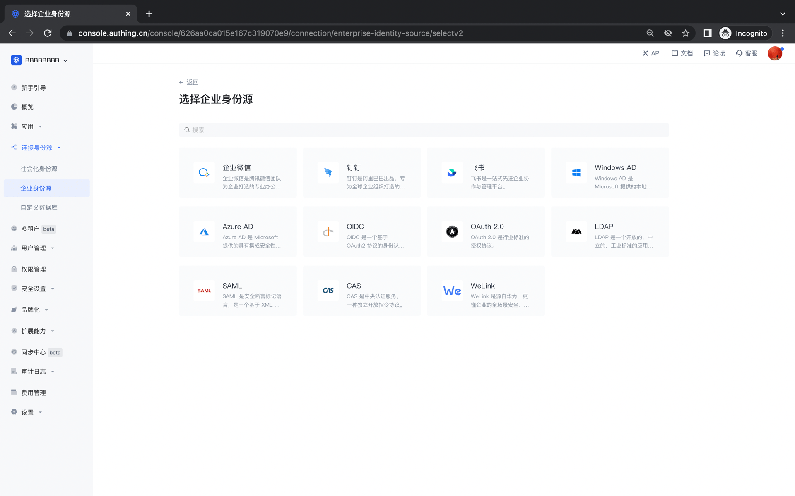

# 企业身份源

<LastUpdated/>

企业身份源登录，是指用户使用企业的身份认证信息在公司内部应用或第三方应用进行认证登录的流程。在 {{$localeConfig.brandName}} 控制台中，企业身份源包含两类：办公应用（比如飞书、企业微信、钉钉）与标准协议应用（比如 OIDC、SAML、CAS 等标准协议），你可以通过配置企业身份源连接，实现使用第三方身份源登录 {{$localeConfig.brandName}} 应用 及[从第三方身份源导入组织机构和用户](/guides/org/create-or-import-org/#导入组织机构)。

## 企业身份源登录列表

以下是目前平台支持的企业登录完整列表及相关使用文档：

!!!include(common/enterprise-connections-table.md)!!!

## 企业登录关联方式

使用「身份源连接的账号关联」功能，让你的用户在使用你所配置的企业身份源登录时，能够直接登录到已有账号。

当 **未开启「账号身份关联」** 时，用户首次通过身份源登录时默认在用户池中创建新用户。开启 **「账号身份关联」** 后，你可以对用户的“身份源账号关联方式”进行选择，可以允许用户通过「字段匹配」或「询问绑定」的方式直接绑定且登录到已有的账号。

以下是目前平台支持的企业身份源支持关联账号的方式：

!!!include(common/enterprise-connections-associated.md)!!!
