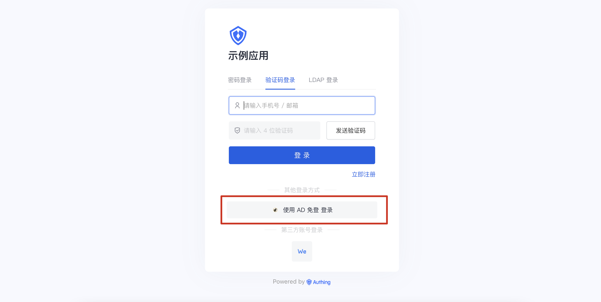

# AD 免登

<LastUpdated/>

## 场景介绍

- **概述**：AD 免密自动登录功能支持 Windows、MacOS 系统，可实现用户在登录 PC 终端后通过免密方式进行自动身份认证，访问内部资源如: Web Apps。
- **应用场景**：企业 PC 免登场景
- **终端用户预览图**：

## 注意事项

- Windows Domain Controller 域控制器，Schema Windows 2003 或以上
- 需要提供域内 Windows 终端 CA 信任的证书，实现高网络安全环境 (SSL/TLS)
- 需要建立域内一个系统账户（不需任何权限）
- 需要域管理员 (Domain Admin) 在 DC 上执行命令权限
- 需要一个内网固定 IP 地址
- 需要在域内创建一个 DNS A / CNAME 记录
- 需要添加一条 Domain Group Policy 域内信任策略 （启用 Windows 自动登录，域内可信任地址）
- 需要提供以下任意一个环境用于安装 Authing 域内代理服务：
  - 虚拟机 (ESXi)
  - Docker
- 如果你未开通 {{$localeConfig.brandName}}控制台账号，请先前往 [ {{$localeConfig.brandName}}Console 控制台](https://authing.cn/) 注册开发者账号；

## 配置步骤

具体配置步骤较为繁琐，请联系 <a href="mailto:csm@authing.cn">Authing 售后服务人员</a>。
