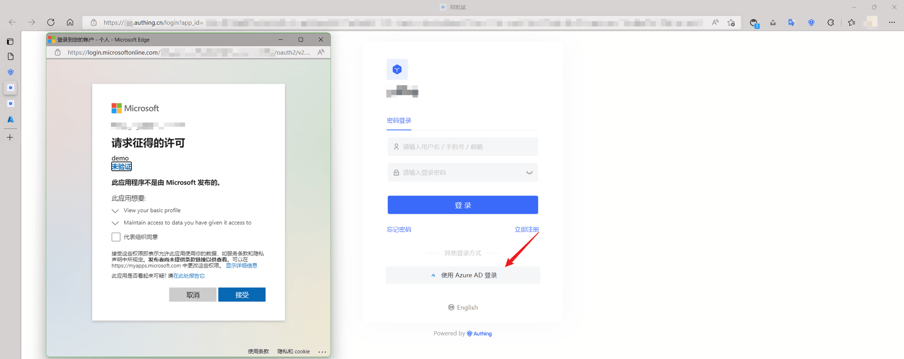
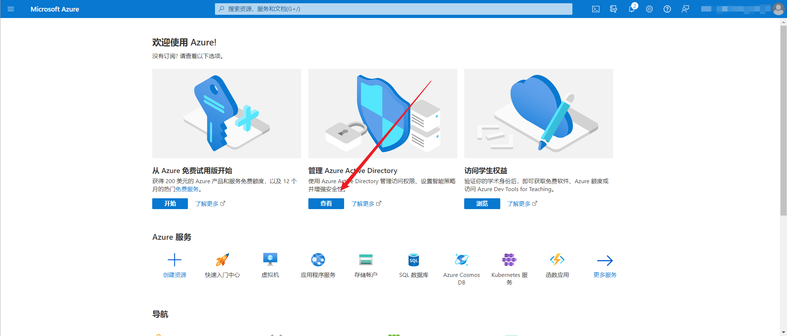
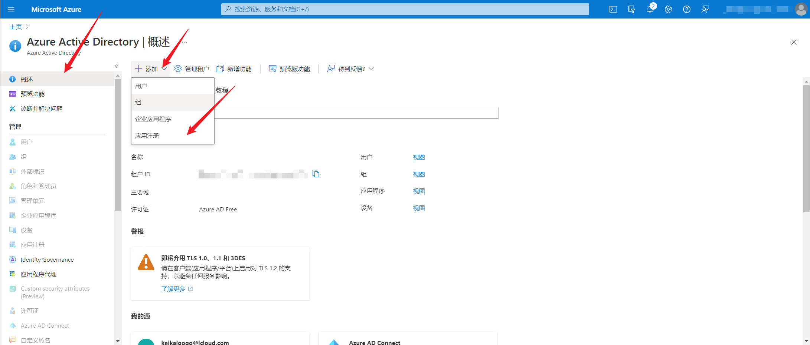
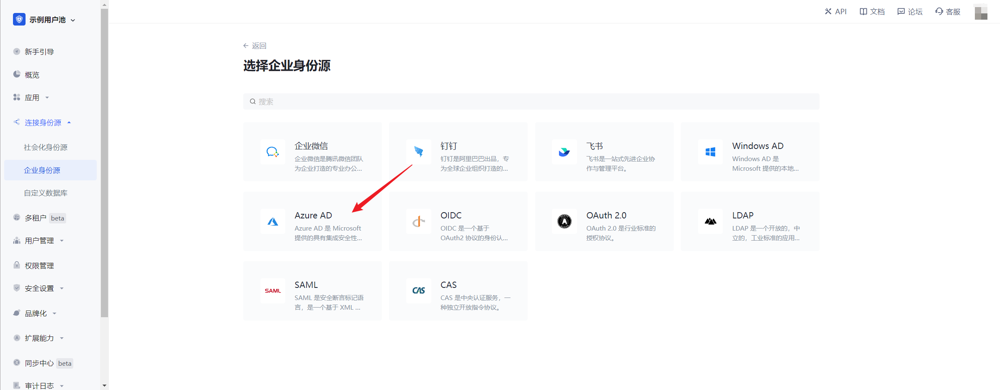
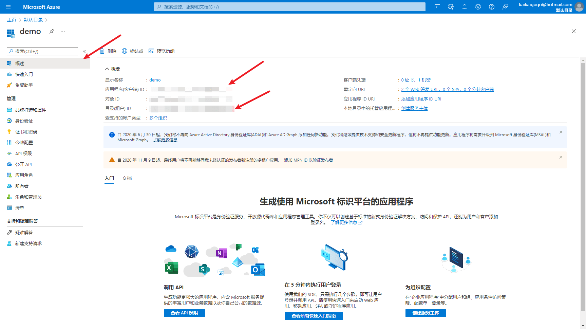
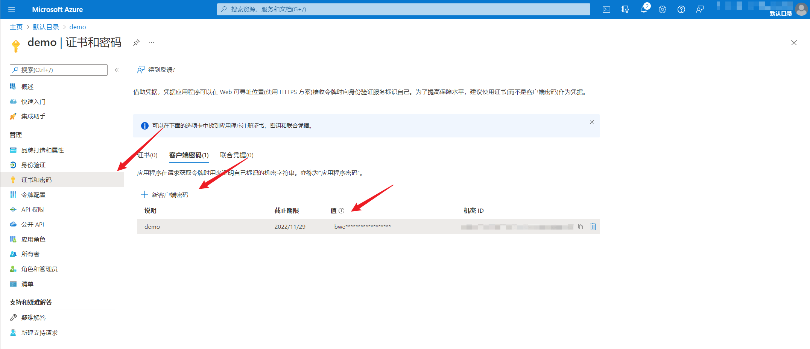
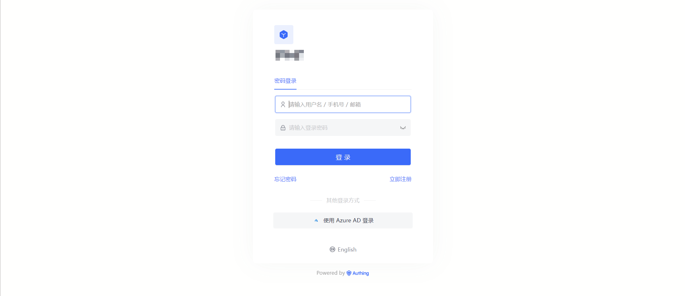
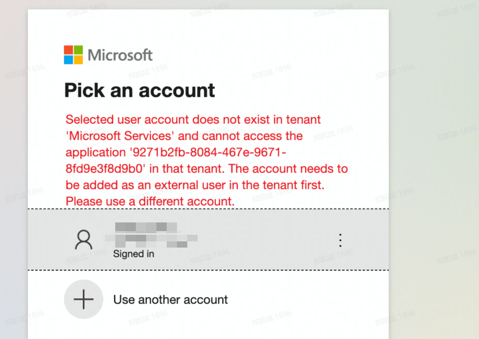

# Azure AD 

<LastUpdated/>

## 场景介绍

- **概述**：Azure AD 是 Microsoft 提供的具有集成安全性的完整标识和访问管理解决方案。在 {{$localeConfig.brandName}} 中配置并开启 Azure AD 的企业登录，即可实现通过 {{$localeConfig.brandName}} 快速获取 Azure AD 基本开放的信息和帮助用户实现免密登录功能。
- **应用场景**：PC 网站
- **终端用户预览图**：

## 注意事项：

- 如果您还没有微软账号，请先前往 [Microsoft 平台](https://signup.live.com/signup) 进行账号注册。
- 您的微软账号需要注册 Azure 账号，请先前往 [Azure 平台](https://signup.azure.com/signup) 进行账号注册。
- 如果您未开通 {{$localeConfig.brandName}} 控制台账号，请先前往 [{{$localeConfig.brandName}} Console 控制台](https://{{$localeConfig.brandName}}.cn/) 注册开发者账号；

## 步骤 1：创建 Azure Active Directory 应用

前往 [Azure 平台](https://portal.azure.com/#home)，点击**管理 Azure Active Directory**。

在概览页，选择**新注册**，找到**应用注册**按钮，注册应用。

在应用注册页面，受支持的帐户类型，根据你的实际情况选择合适的类型。如果你希望其他组织的账号也能够使用你的应用，可以选择**任何组织目录(任何 Azure AD 目录 - 多租户)中的帐户**，如果你只希望自己组织的成员使用你的应用，请选择**仅此组织目录(仅 默认目录 - 单一租户)中的帐户**。重定向 URI 类型选择 **Web**，填入回调地址**https://core.{{$localeConfig.brandName}}.cn/connections/azure-ad/callback**

点击**注册**。

## 步骤 2：在 {{$localeConfig.brandName}} 控制台配置 Azure AD

2.1 请在 {{$localeConfig.brandName}} Console 控制台 的「企业身份源」页面，点击「创建企业身份源」按钮，进入「选择企业身份源」页面，选择「Azure AD」身份源按钮，进入 「Azure AD 登录模式」页面。

2.2 请在 {{$localeConfig.brandName}} Console 控制台 的「企业身份源」-「Azure AD」页面，配置相关的字段信息。

| 字段/功能           | 描述                                                                                                                                                                         |
| ------------------- | ---------------------------------------------------------------------------------------------------------------------------------------------------------------------------- |
| 唯一标识            | a.唯一标识由小写字母、数字、- 组成，且长度小于 32 位。b.这是此连接的唯一标识，设置之后不能修改。                                                                             |
| 显示名称            | 这个名称会显示在终端用户的登录界面的按钮上。                                                                                                                                 |
| 身份源域名          | Azure AD 有两个不同的认证域名，两者之间用户数据互不相通，可以通过确认当前已有业务使用的登录认证域名，在此选择相同的认证域名，进行用户认证。                                  |
| 目录(租户) ID       | 目录(租户) ID ，不填写默认选择为 organization，即只有组织内账号能在应用进行登录。                                                                                            |
| 应用程序(客户端) ID | 应用程序(客户端) ID，需要在 Azure AD 平台上获取。                                                                                                                            |
| 客户端密码（值）    | 客户端密码（值），需要在 Azure AD 平台上获取                                                                                                                                 |
| 回调地址            | Azure AD 的重定向 URI。需要将此 URL 配置到 Azure AD 平台上，填写内容为**https://core.authing.cn/connections/azure-ad/callback**。                        |
| 邮箱验证同步策略    | 用户认证后，是否将用户邮箱验证状态标识为已验证                                                                                                                               |
| 登录模式            | 开启「仅登录模式」后，只能登录既有账号，不能创建新账号，请谨慎选择。                                                                                                         |
| 账号身份关联        | 不开启「账号身份关联」时，用户通过身份源登录时默认创建新用户。开启「账号身份关联」后，可以允许用户通过「字段匹配」或「询问绑定」的方式直接登录到已有的账号。a.关联方式：选择 |

2.2.1 在应用的概述页，可以找到 应用程序(客户端) ID 和 目录(租户) ID

2.2.2 在应用的证书和密码页，点击生成 **新客户端密码**，可以获得客户端密码值

配置完成后，点击「创建」或者「保存」按钮完成创建。

## 步骤 3：开发接入

- **推荐开发接入方式**：使用托管登录页

- **优劣势描述**：运维简单，由 {{$localeConfig.brandName}} 负责运维。每个用户池有一个独立的二级域名;如果需要嵌入到你的应用，需要使用弹窗模式登录，即：点击登录按钮后，会弹出一个窗口，内容是 {{$localeConfig.brandName}} 托管的登录页面，或者将浏览器重定向到 {{$localeConfig.brandName}} 托管的登录页。

- **详细接入方法**：

  3.1 在 {{$localeConfig.brandName}} 控制台创建一个应用，详情查看：[如何在 {{$localeConfig.brandName}} 创建一个应用](./guides/app/create-app.md)

  3.2 在已创建好的 Azure AD 身份源连接详情页面，开启并关联一个在 {{$localeConfig.brandName}} 控制台创建的应用

3.3 在登录页面体验 Azure AD 第三方登录

## 步骤 4：常见报错问题解决

4.1 如果你选择的受支持的账户类型是**仅此组织目录（仅 默认目录 - 单一租户）中的账户**，当其他组织的用户尝试使用 Azure AD 登录时，会提示类似以下的错误：

