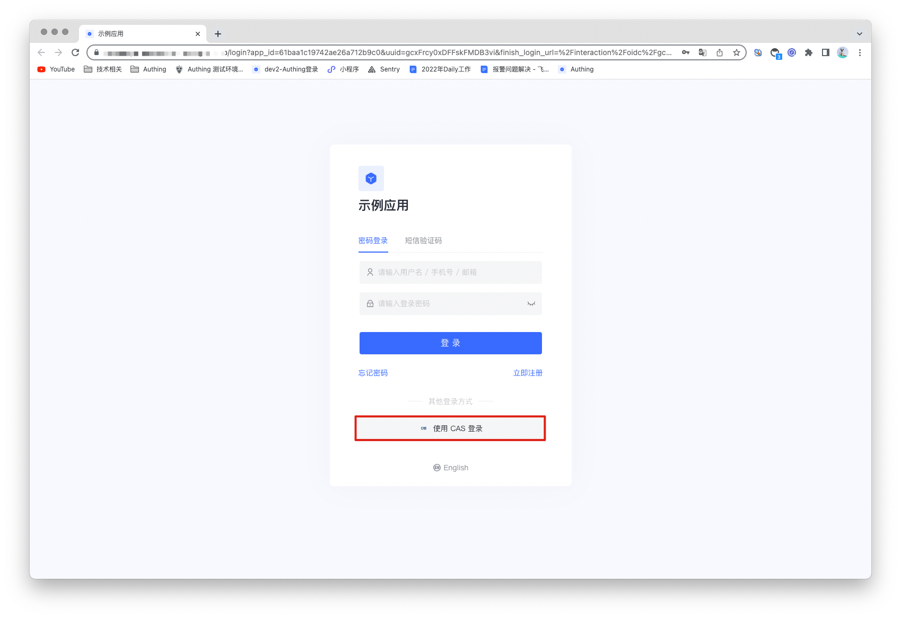
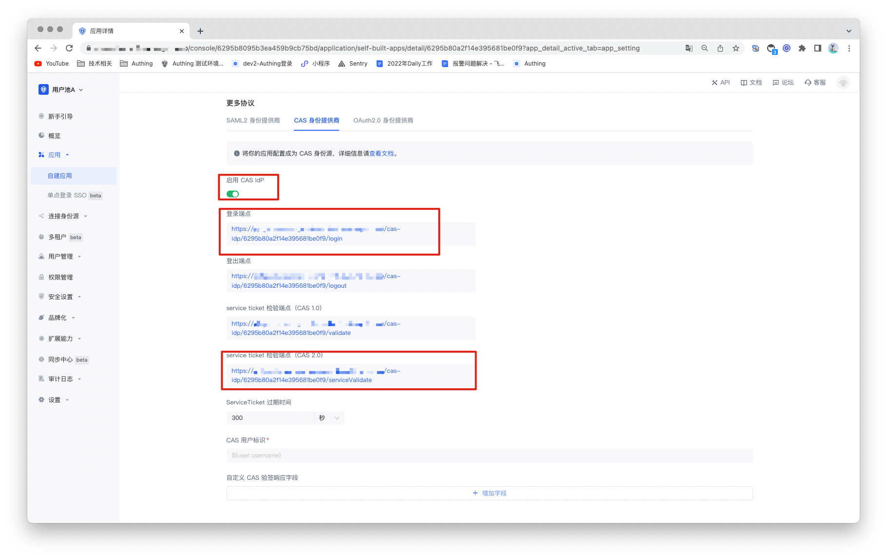
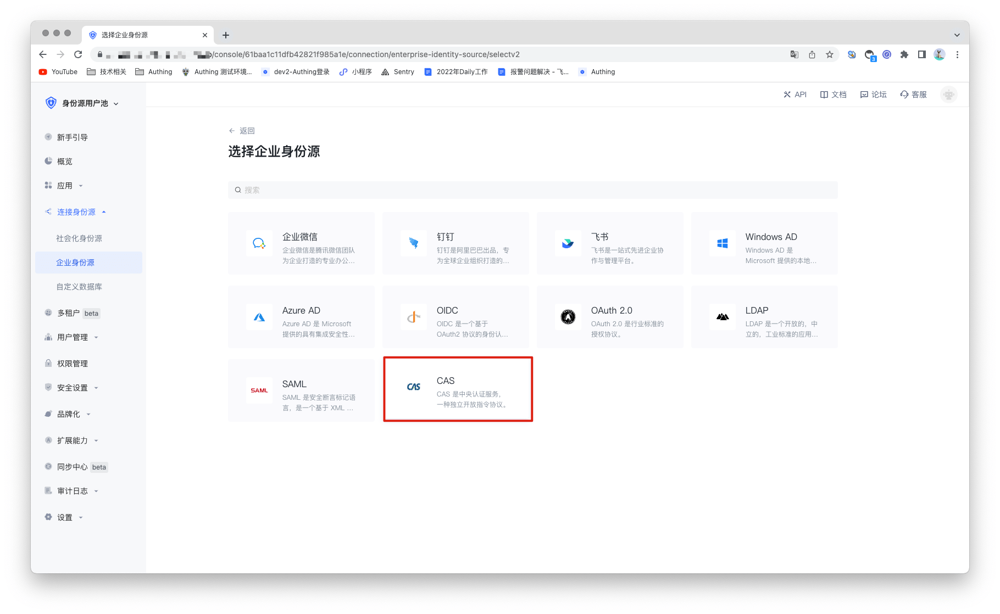
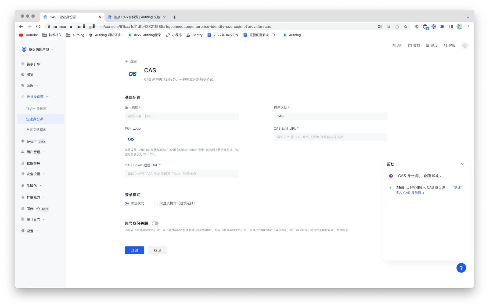
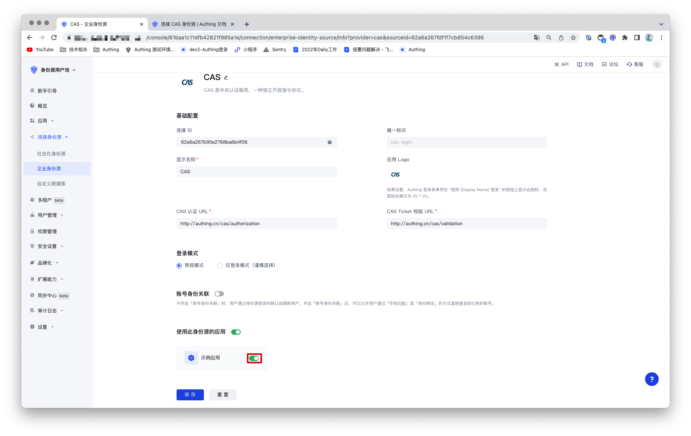

# CAS

<LastUpdated/>

## 场景介绍

- **概述**：CAS (Central Authentication Service ) 是一种用于 Web 的单点登录/单点登出协议。 它允许用户访问多个应用程序，同时仅向中央 CAS 服务器应用程序提供一次凭据（例如用户 ID 和密码）。Authing 支持 CAS 协议的认证能力，用户仅需提供 CAS 协议认证所需的服务和配置。通过配置 CAS 身份源后就可以使用其完成单点登录和登出功能。
- **应用场景**：PC 网站
- **终端用户预览图**：

## 注意事项

- 需要一个有 CAS 协议能力的服务；
- 本例将以 Authing 自带的 CAS IdP 为例。连接 CAS 身份源的用户池和作为 CAS 身份源的用户池不能是同一个。
- 如果您未开通 Authing 控制台账号，请先前往 [Authing Console 控制台](https://authing.cn/)注册开发者账号；

## 步骤 1：创建 CAS 身份源

您需要配置自己的 CAS 身份源（即身份提供者 IDP）并获取相关信息。本例将以 Authing 自带的 CAS IdP 为例。如果你已经有 CAS 身份源，可直接进入第 2 步进行配置。

1.1  打开 **Authing 控制台**，进入想要作为身份源的用户池，这里称其为 **「用户池 A」**。单击左侧菜单的「应用」选项，在右侧面板找到想要启用 CAS IdP 能力的应用，点击进入应用配置页面。

1.2 在「应用配置」选项卡中找到「其他配置」，打开「启用 CAS IdP」开关，并单击右上角的「保存」按钮。记录下「登录端点」和「service ticket 检验端点（CAS 2.0）」两项的内容，之后的配置中会用到。

## 步骤 2：在 Authing 控制台配置 CAS 身份源

2.1 打开 **Authing 控制台**，进入想要连接 CAS 身份源的用户池，这里称其为 **「用户池 B」**。在左侧菜单中选择 「连接身份源」 > 「企业身份源」，在右侧面板选择「创建企业身份源」。

2.2 在右侧面板找到「CAS」，点击进去。

2.3 根据 CAS 的配置要求，填入 CAS 协议所要求的配置内容。

| 编号  | 字段/功能           | 描述                                                         |
| ----- | ------------------- | ------------------------------------------------------------ |
| 2.3.1 | 唯一标识            | a.唯一标识由小写字母、数字、- 组成，且长度小于 32 位。b.这是此连接的唯一标识，设置之后不能修改。 |
| 2.3.2 | 显示名称            | 这个名称会显示在终端用户的登录界面的按钮上。                 |
| 2.3.3 | 应用 Logo           | 在登录界面按钮上显示的身份源 Logo 。                         |
| 2.3.4 | CAS 认证 URL        | 用来向 CAS IdP 发起认证请求的 URL。填入之前记录的「登录端点」。 |
| 2.3.5 | CAS Ticket 检验 URL | 用来从 CAS IdP 处获取身份信息的 URL。填入之前记录的「service ticket 检验端点（CAS 2.0」。 |
| 2.3.7 | 登录模式            | 开启「仅登录模式」后，只能登录既有账号，不能创建新账号，请谨慎选择。 |
| 2.3.8 | 账号身份关联        | 不开启「账号身份关联」时，用户通过身份源登录时默认创建新用户。开启「账号身份关联」后，可以允许用户通过「字段匹配」或「询问绑定」的方式直接登录到已有的账号。 |

配置完成后，点击「保存」按钮完成创建。

## 步骤 3: 开发接入

- **推荐开发接入方式**：使用托管登录页

- **优劣势描述**：运维简单，由 Authing 负责运维。每个用户池有一个独立的二级域名;如果需要嵌入到你的应用，需要使用弹窗模式登录，即：点击登录按钮后，会弹出一个窗口，内容是 Authing 托管的登录页面，或者将浏览器重定向到 Authing 托管的登录页。

- **详细接入方法**：

3.1 在 Authing 控制台创建一个应用，详情查看：[如何在 Authing 创建一个应用](/guides/app-new/create-app/create-app.md)。

3.2 在已创建好的 CAS 身份源连接详情页面，开启并关联一个在 Authing 控制台创建的应用。

3.3 在登录页面体验 CAS 的企业化登录

