# 钉钉 H5 微应用（企业内部开发）

<LastUpdated/>

## 场景介绍

- **概述**：钉钉 H5 微应用（企业内部开发）企业化登录是用户以 钉钉 H5 微应用（企业内部开发） 为身份源安全登录第三方应用或者网站。在 {{$localeConfig.brandName}} 中配置并开启 钉钉 H5 微应用（企业内部开发） 的企业化登录，即可实现通过 {{$localeConfig.brandName}} 快速获取 钉钉 H5 微应用（企业内部开发） 基本开放的信息和帮助用户实现免密登录功能。
- **应用场景**：创建网站应用
- **终端用户预览图**：

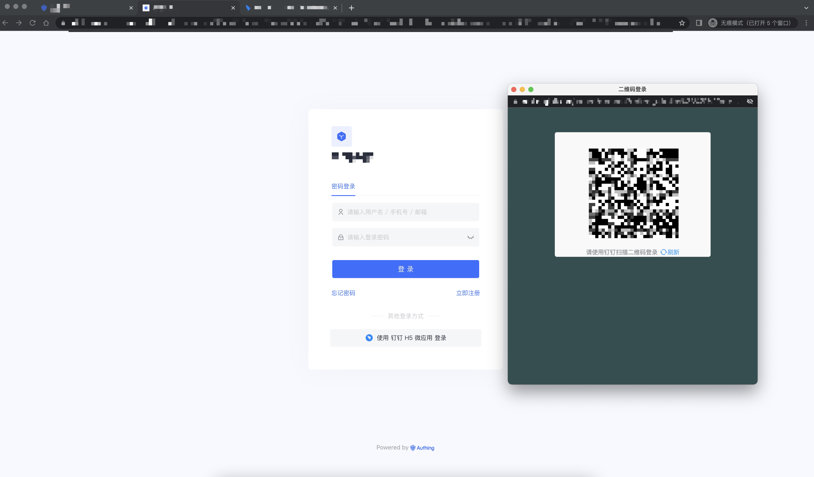

## 注意事项

- 如果您未开通钉钉开放平台账号，请先前往 [钉钉开放平台](https://open-dev.dingtalk.com/#/) 注册账号。
- 如果您未开通 {{$localeConfig.brandName}} 控制台账号，请先前往 [{{$localeConfig.brandName}} 控制台](https://authing.cn/) 注册开发者账号。

## 步骤 1：在钉钉开放平台开发者控制台创建一个网站应用

- 打开[钉钉开放平台](https://open-dev.dingtalk.com/#/)，点击企业应用进行快捷创建。

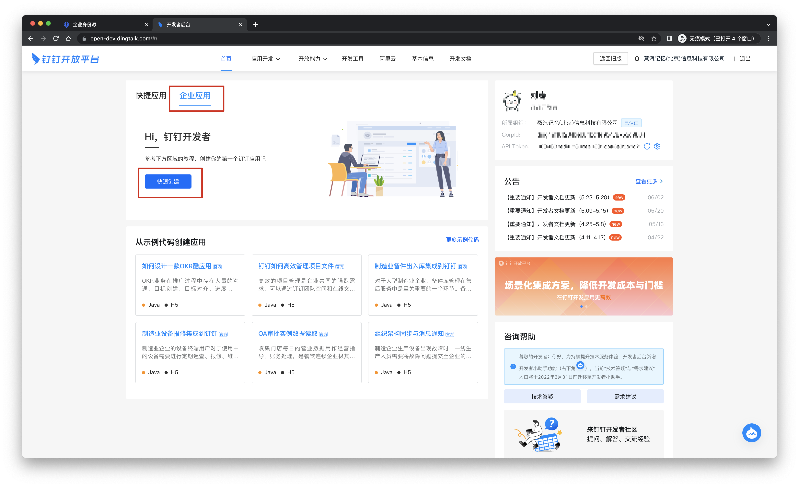
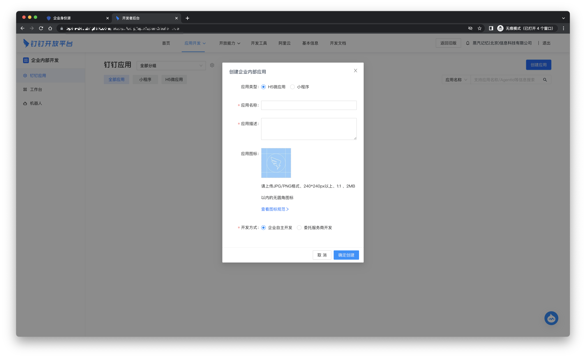

- 创建企业内部应用，并记录下 AppKey，AppSecret。

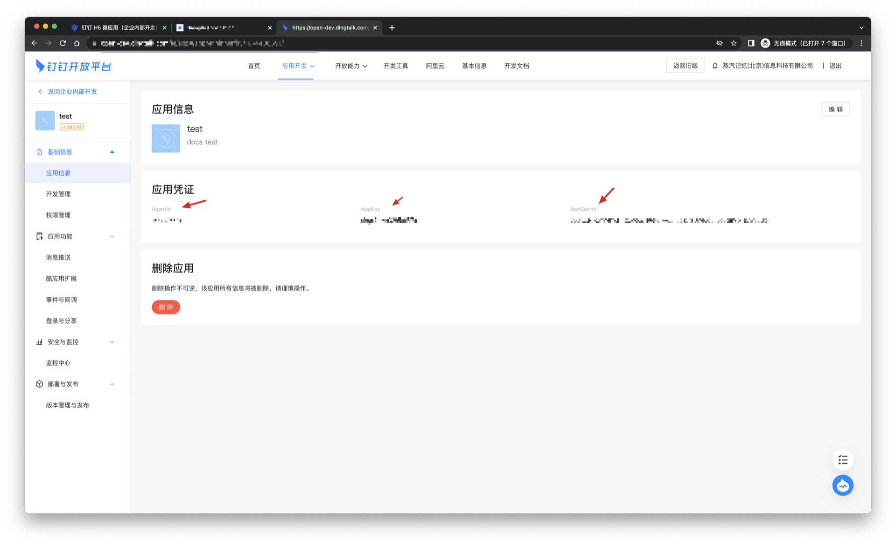

- 在登录与分享中，填写回调域名为：`https://core.authing.cn/connection/social/<Unique Identifier>/<USERPOOL_ID>/callback`，你需要将其中的 `<Unique Identifier>` 替换成你的`唯一标识`，`<USERPOOL_ID>` 替换成你的 [用户池 ID](/guides/faqs/get-userpool-id-and-secret.md)

## 步骤 2：在 {{$localeConfig.brandName}} 控制台配置钉钉 H5 微应用（企业内部开发）

2.1 请在 {{$localeConfig.brandName}} 控制台 的「企业化身份源」页面，点击「创建企业化身份源」按钮，进入「选择企业化身份源」页面。

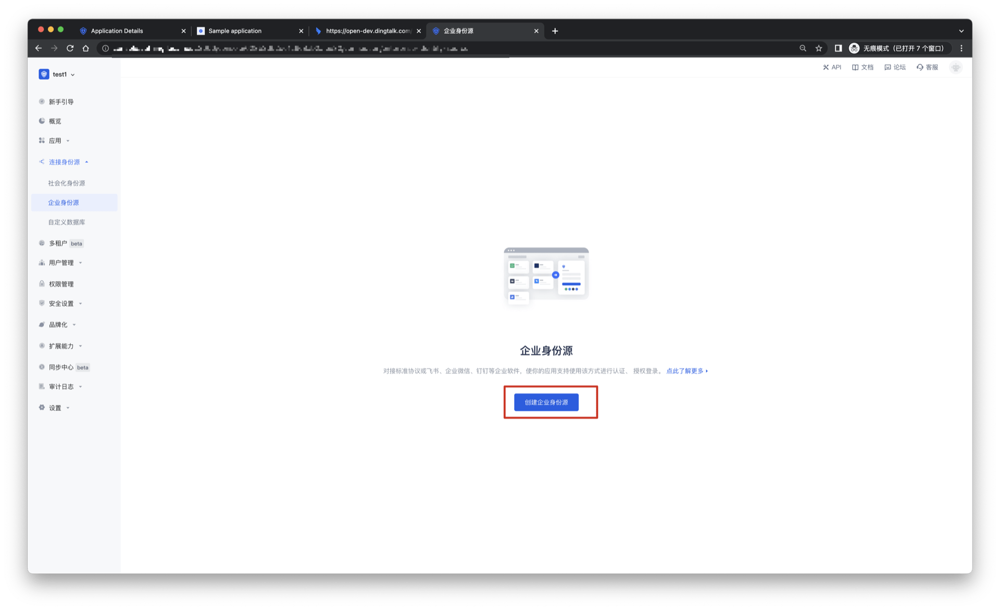

2.2 请在 {{$localeConfig.brandName}} 控制台 的「企业化身份源」-「选择企业化身份源」页面，点击「钉钉」身份源按钮，进入 「钉钉 H5 微应用（企业内部开发）登录模式」页面。

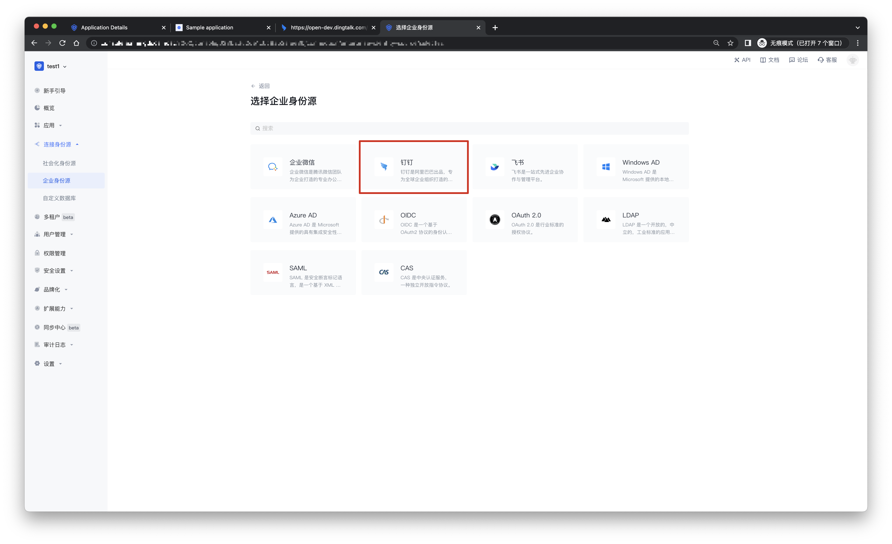

2.3 请在 {{$localeConfig.brandName}} 控制台 的「企业化身份源」-「钉钉 H5 微应用（企业内部开发）」页面，配置相关的字段信息。

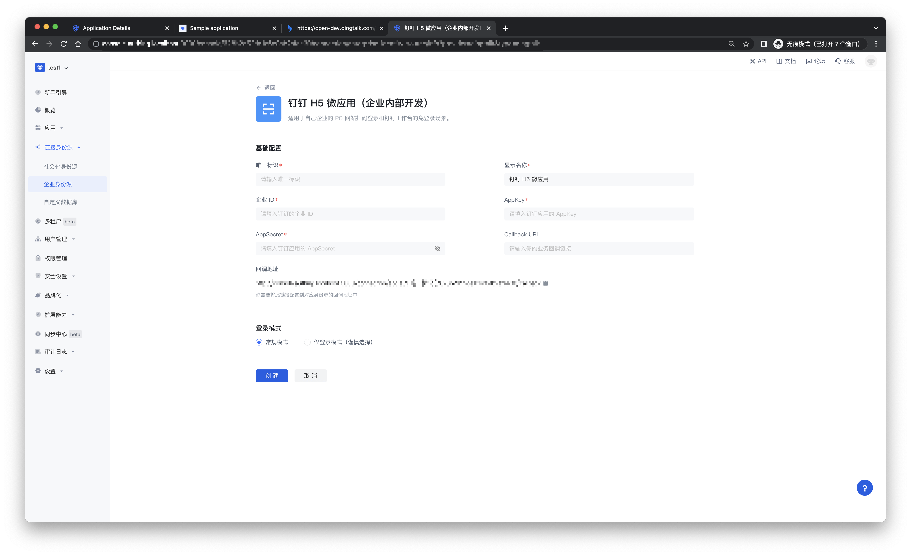

| 字段/功能    | 描述                                                                                                                                                                         |
| ------------ | ---------------------------------------------------------------------------------------------------------------------------------------------------------------------------- |
| 唯一标识     | a.唯一标识由小写字母、数字、- 组成，且长度小于 32 位。b.这是此连接的唯一标识，设置之后不能修改。                                                                             |
| 显示名称     | 这个名称会显示在终端用户的登录界面的按钮上。                                                                                                                                 |
| 企业 ID      | CorpId 需要在钉钉开放平台首页可以看到。                                                                                                                                      |
| AppKey       | 钉钉编号，需要在钉钉开放平台上获取。                                                                                                                                         |
| AppSecret    | 钉钉密钥，需要在钉钉开放平台上获取。                                                                                                                                         |
| Callback URL | 可以填写你的业务回调地址，用户完成登录后，浏览器将会跳转到该地址。                                                                                                           |
| Scopes       | 默认情况下，{{$localeConfig.brandName}} 只会向用户申请基础用户信息（如头像、昵称等）的授权，如果你需要更多高级权限，可以勾选上对应的选项。                                   |
| 回调地址     | 钉钉有效跳转 URI。需要将此 URL 配置到钉钉开放平台上。                                                                                                                        |
| 登录模式     | 开启「仅登录模式」后，只能登录既有账号，不能创建新账号，请谨慎选择。                                                                                                         |
| 账号身份关联 | 不开启「账号身份关联」时，用户通过身份源登录时默认创建新用户。开启「账号身份关联」后，可以允许用户通过「字段匹配」或「询问绑定」的方式直接登录到已有的账号。a.关联方式：选择 |

配置完成后，点击「创建」或者「保存」按钮完成创建。

在钉钉开发平台首页可以看到 CorpId。

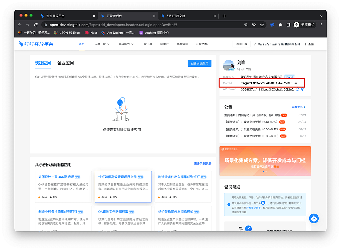

在 {{$localeConfig.brandName}} 控制台上创建完钉钉身份源后，需要将回调地址配置到钉钉开放平台上的回调域名。

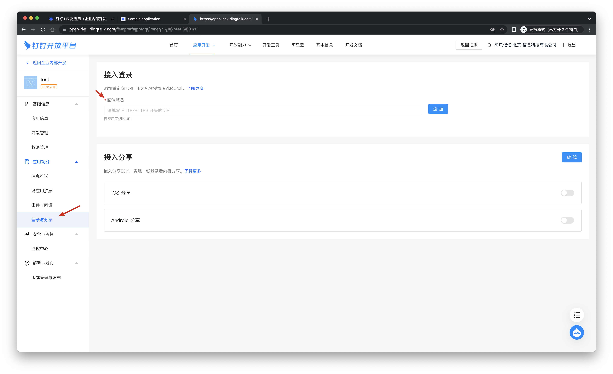

## 步骤 3：开发接入

- **推荐开发接入方式**：使用托管登录页

- **优劣势描述**：运维简单，由 {{$localeConfig.brandName}} 负责运维。每个用户池有一个独立的二级域名;如果需要嵌入到你的应用，需要使用弹窗模式登录，即：点击登录按钮后，会弹出一个窗口，内容是 {{$localeConfig.brandName}} 托管的登录页面，或者将浏览器重定向到 {{$localeConfig.brandName}} 托管的登录页。

- **详细接入方法**：

  3.1 在 {{$localeConfig.brandName}} 控制台创建一个应用，详情查看：[如何在 {{$localeConfig.brandName}} 创建一个应用](/guides/app-new/create-app/create-app.md)

  3.2 在已创建好的钉钉 H5 微应用（企业内部开发）身份源连接详情页面，开启并关联一个在 {{$localeConfig.brandName}} 控制台创建的应用

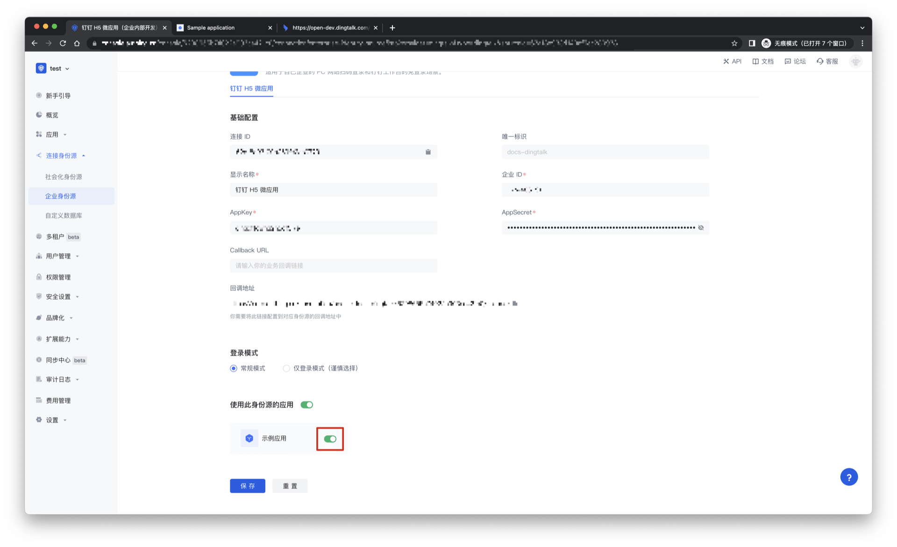

3.3 在登录页面体验钉钉 H5 微应用（企业内部开发）第三方登录

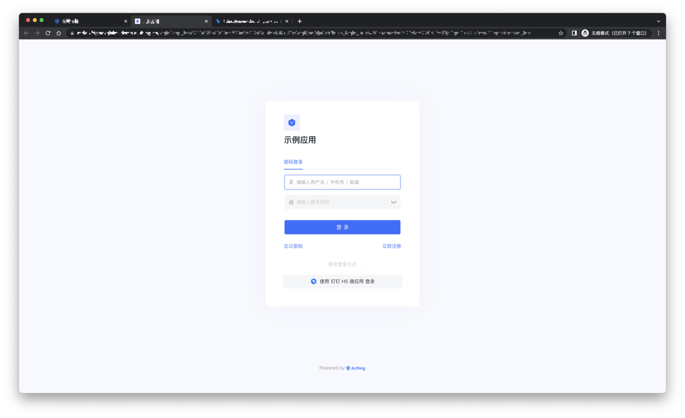
