# 飞书小组件

<LastUpdated/>

## 场景介绍

- **概述**：飞书小组件适用于企业在飞书工作台的使用飞书小组件场景。为企业实现在飞书小组件获取 {{$localeConfig.brandName}} 用户信息。在 {{$localeConfig.brandName}} 中配置并开启 飞书小组件的企业身份源，即可实现通过 {{$localeConfig.brandName}} 快速获取 飞书 基本开放的信息。
- **应用场景**：飞书工作台

## 注意事项

- 如果你未开通 飞书开发者 账号，请先前往 [飞书开发者后台](https://open.feishu.cn/app) 进行注册；
- 如果你未开通 {{$localeConfig.brandName}} 控制台账号，请先前往 [{{$localeConfig.brandName}} Console 控制台](https://authing.cn/) 注册开发者账号；

## 第一步：创建企业自建应用并开启飞书小组件场景

前往 [飞书开发者后台](https://open.feishu.cn/app)，点击**创建企业自建应用**，填写相应内容，创建应用。

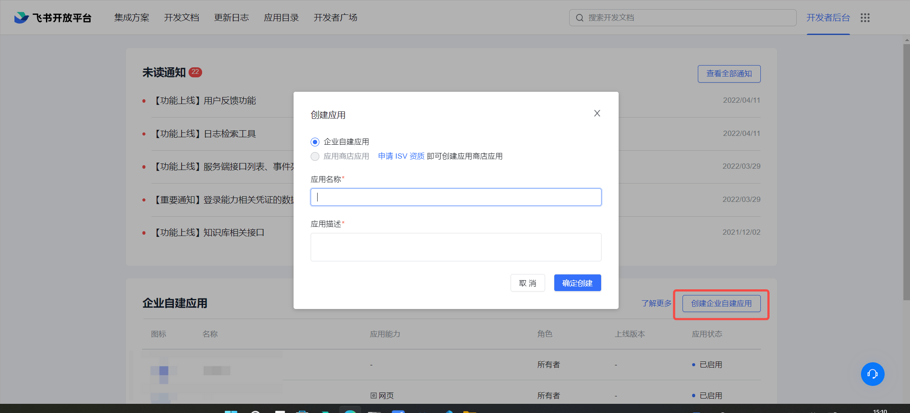

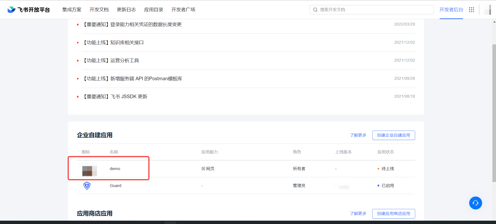

进入创建的应用，点击**应用能力**，选择**工作台小组件**，添加能力。具体配置参考[飞书小组件-快速开始](https://open.feishu.cn/document/uAjLw4CM/uYjL24iN/block/quick-start)

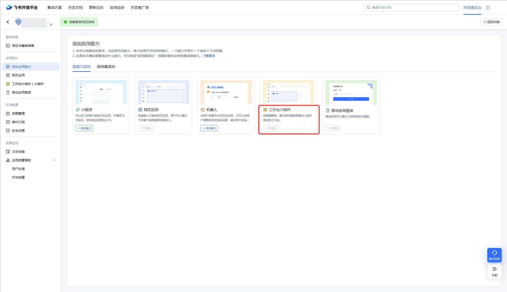

点击**凭证与基础信息**，查看 App ID 和 App Secret ，打开 {{$localeConfig.brandName}} 控制台。

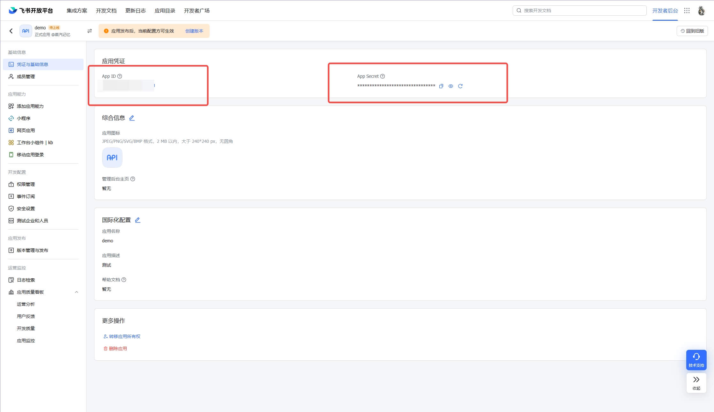

为了能够正常获取到飞书的用户信息，完成认证流程，需要在**权限管理**页面，完成**权限配置**，搜索以下权限，并开启：

- 以应用身份读取通讯录

- 获取用户受雇信息

- 获取用户基本信息

- 通过手机号或邮箱获取用户 ID

- 获取用户手机号

- 获取用户邮箱信息

- 查询用户的企业邮箱

- 获取用户组织架构信息

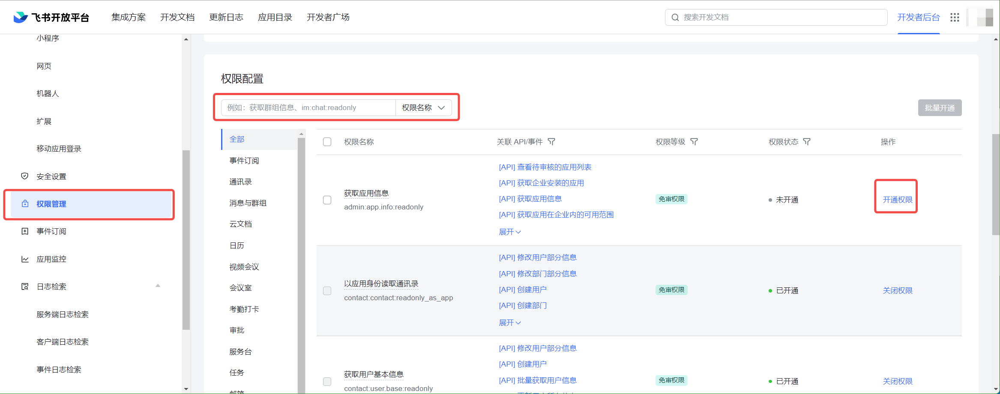

## 第二步：在 {{$localeConfig.brandName}} 控制台配置 飞书小组件

2.1 请在 {{$localeConfig.brandName}} Console 控制台 的「企业身份源」页面，点击「创建企业身份源」按钮，进入「选择企业身份源」页面，点击「飞书」身份源按钮

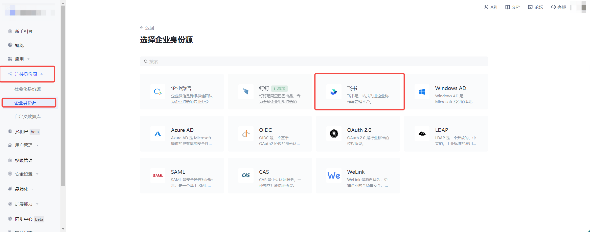

2.2 选择 「飞书小组件」。

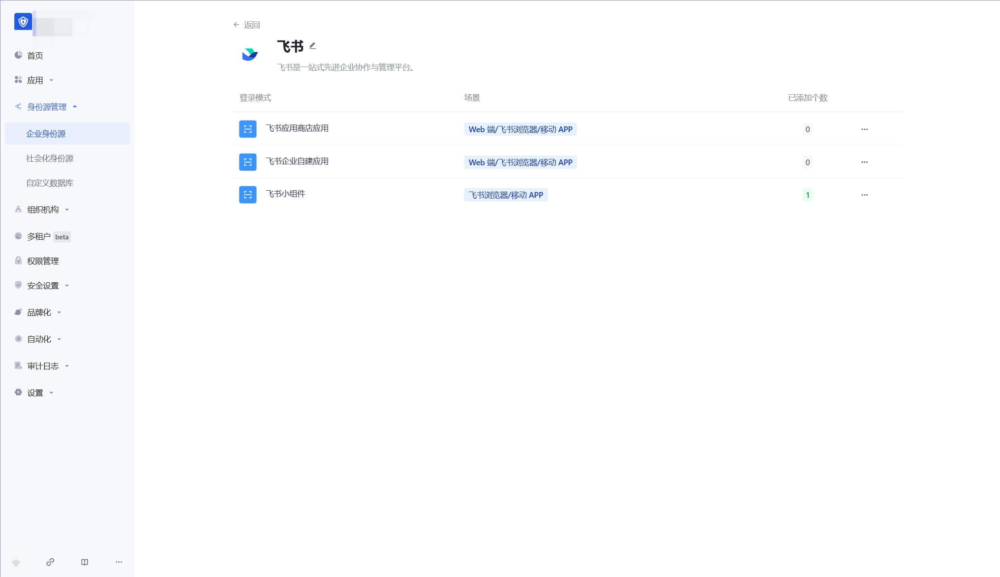

2.3 请在「飞书小组件」页面，填写相关的字段信息。
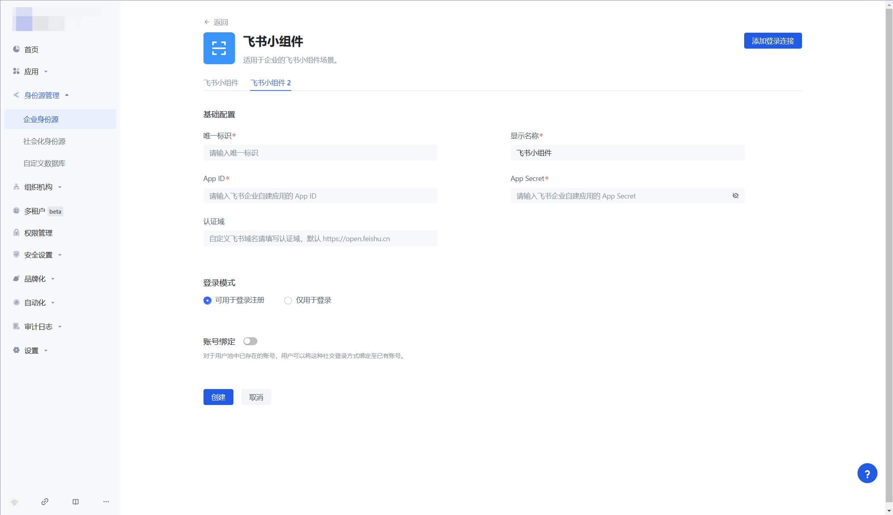

| 字段         | 描述                                                                                                                                                         |
| ------------ | ------------------------------------------------------------------------------------------------------------------------------------------------------------ |
| 唯一标识     | a. 唯一标识由小写字母、数字、- 组成，且长度小于 32 位。<br />b. 这是此连接的唯一标识，设置之后不能修改。                                                     |
| 显示名称     | 这个名称会显示在终端用户的登录界面的按钮上。                                                                                                                 |
| App ID       | 在飞书应用的后台， **凭证与基础信息** 中可以看到 App ID 和 App Secret 。                                                                                     |
| App Secret   | 在飞书应用的后台， **凭证与基础信息** 中可以看到 App ID 和 App Secret 。                                                                                     |
| 登录模式     | 开启「仅登录模式」后，只能登录既有账号，不能创建新账号，请谨慎选择。                                                                                         |
| 账号身份关联 | 不开启「账号身份关联」时，用户通过身份源登录时默认创建新用户。开启「账号身份关联」后，可以允许用户通过「字段匹配」或「询问绑定」的方式直接登录到已有的账号。 |

App ID 和 App Secret ，填写在飞书应用的后台， **凭证与基础信息** 中的 App ID 和 App Secret 。

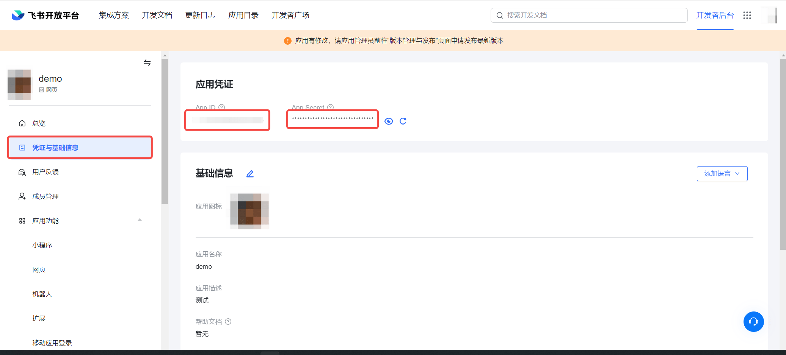

2.4 配置完成后，点击「创建」或者「保存」按钮完成创建。


## 第三步：在飞书后台上线飞书自建应用

3.1 在飞书开发者后台，选择应用发布，在**版本管理与发布**中，点击**创建版本**，将创建好的应用进行发布，

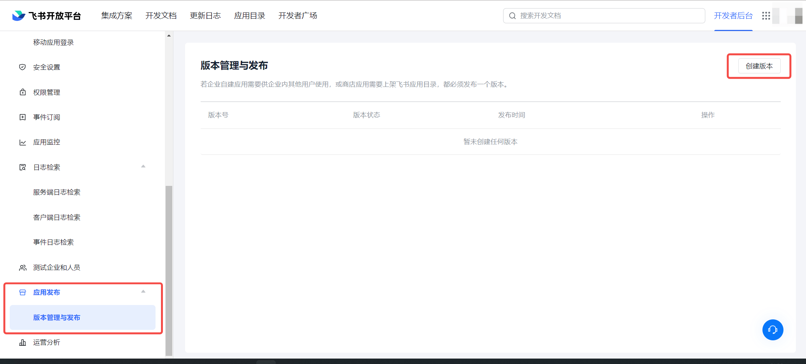

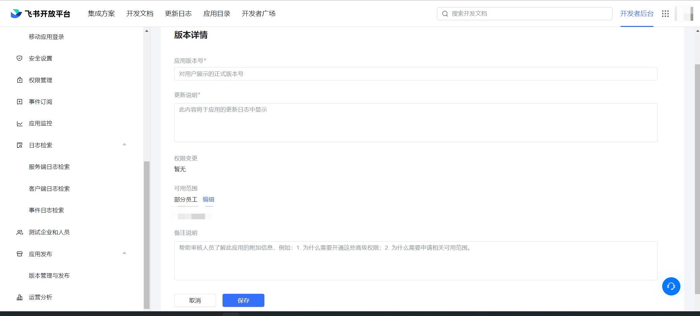

3.2 提交申请后，你的企业管理员会进行审核，审核结果会通过飞书和开发者后台发送给你。详情请见[飞书文档 - 开发企业自建应用](https://open.feishu.cn/document/uQjL04CN/ukzM04SOzQjL5MDN)

## 第四步：开发接入

- **推荐开发接入方式**：调用 Authing 开放 API 完成登录流程

- **详细接入方法**：

  4.1 参考飞书小组件身份周期，在符合你的业务场景的[生命周期](https://open.feishu.cn/document/uAjLw4CM/uYjL24iN/block/block-frame/logic-layer/lifecycle/lifecycle)中，调用获取飞书相关登录预授权码，调用 Authing 登录 API[移动端登录 API(以飞书小组件登录)](https://api-explorer.pre.authing.cn/?tag=tag/%E7%99%BB%E5%BD%95/API%20%E5%88%97%E8%A1%A8/operation/SignInV3Controller_signInByMobile)

```js
import promisify from "./libs/api-promise";
/** 以上引入了公共库，作用是：
 * promisify: 提供 Promise 化的 API，通过 tt.promises.API_NAME 使用
 */

//...
Block({
  // ...
  methods: {
    async request() {
      const { code } = await tt.promises.login();

      const response = await tt.promises.request({
        url: "https://core.authing.cn/api/v3/signin-by-mobile",
        method: "POST",
        header: {
          "content-type": "application/json",
          "x-authing-app-id": 应用 ID,
        },
        data: {
          connection: 'lark_block' //身份源连接类型,
          extIdpConnidentifier: 身份源连接标识,
          larkBlockPayload: {
            code: code //飞书小组件获取的授权码,
          },
        },
      });
      this.setData({
        info: JSON.stringify(response.data, null, 2),
      });
    },
  },
});
```

4.2 在已创建好的 飞书小组件 身份源连接详情页面，开启并关联一个在 {{$localeConfig.brandName}} 控制台创建的应用

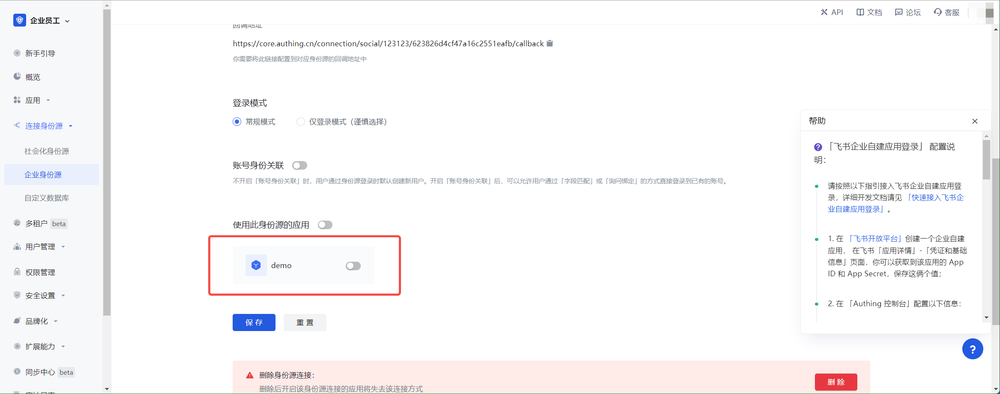

4.3 上传提交发布你的飞书小组件

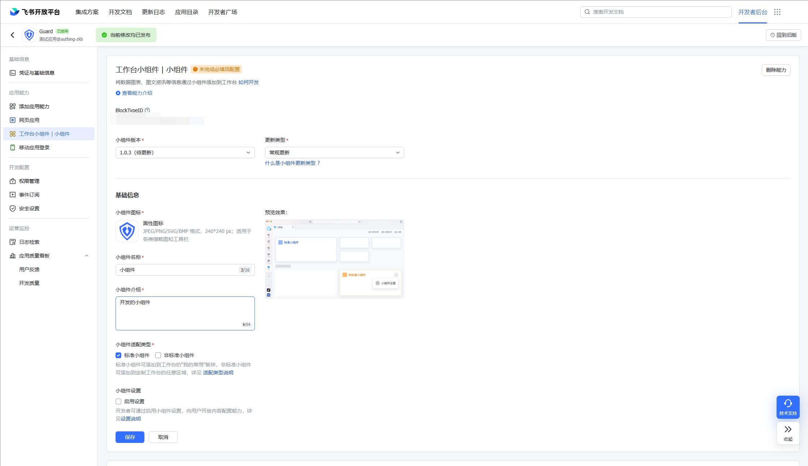
