# 飞书企业自建应用

<LastUpdated/>

## 场景介绍

- **概述**：飞书企业自建应用适用于自己企业的 PC 网站扫码登录和飞书工作台的免登录场景。为企业实现以飞书为身份源安全登录第三方应用或者网站。在 {{$localeConfig.brandName}} 中配置并开启 飞书企业自建应用 的企业登录，即可实现通过 {{$localeConfig.brandName}} 快速获取 飞书 基本开放的信息和帮助用户实现免密登录功能。
- **应用场景**：PC 网站、飞书工作台、移动端应用
- **终端用户预览图**：

## 注意事项

- 如果您未开通 飞书开发者 账号，请先前往 [飞书开发者后台](https://open.feishu.cn/app) 进行注册；
- 如果您未开通 {{$localeConfig.brandName}} 控制台账号，请先前往 [{{$localeConfig.brandName}} Console 控制台](https://authing.cn/) 注册开发者账号；

## 步骤 1：创建企业自建应用

前往 [飞书开发者后台](https://open.feishu.cn/app)，点击**创建企业自建应用**，填写相应内容，创建应用。

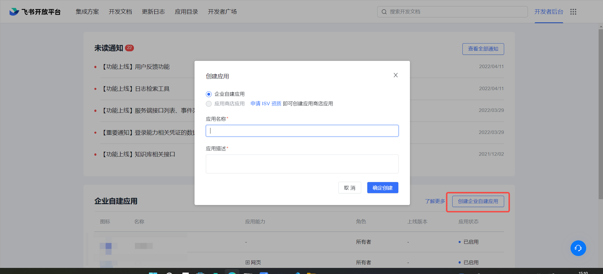

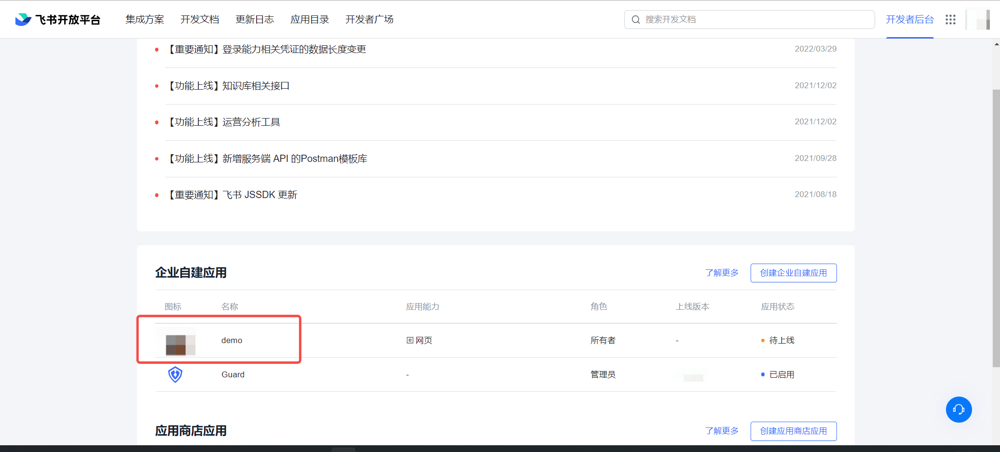

进入创建的应用，点击**应用功能**，选择**网页**，开启**启用网页**功能。

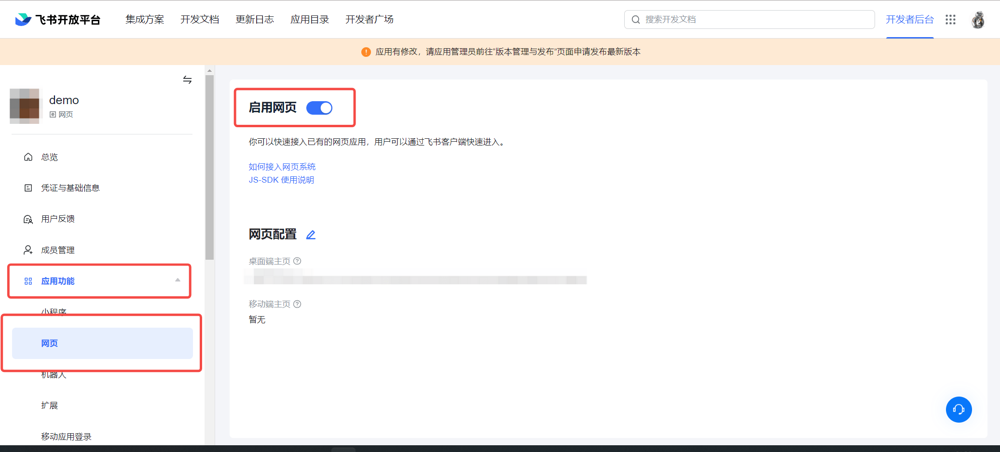

点击**凭证与基础信息**，查看 App ID 和 App Secret ，打开 {{$localeConfig.brandName}} 控制台。

如果你需要 **接入移动应用登录能力**，点击**应用功能**，选择**移动应用登录**，开启**飞书登录**功能，在下方的飞书登录配置中，用户登录协议选项 ** OAuth 2.0**，并填写移动端应用的配置。

为了能够正常获取到飞书的用户信息，完成认证流程，需要在**权限管理**页面，完成**权限配置**，搜索以下权限，并开启：

- 以应用身份读取通讯录

- 获取用户基本信息

- 通过手机号或邮箱获取用户 ID

- 获取用户手机号

- 获取用户邮箱信息

- 查询用户的企业邮箱

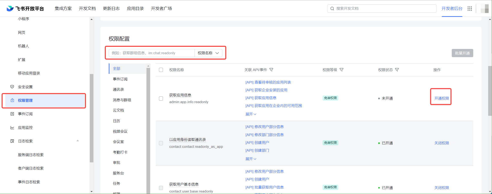

## 步骤 2：在 {{$localeConfig.brandName}} 控制台配置 飞书企业自建应用

2.1 请在 {{$localeConfig.brandName}} Console 控制台 的「企业身份源」页面，点击「创建企业身份源」按钮，进入「选择企业身份源」页面，点击「飞书」身份源按钮

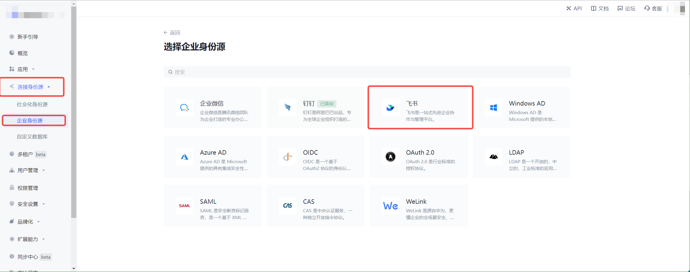

2.2 选择 「飞书企业自建应用」。

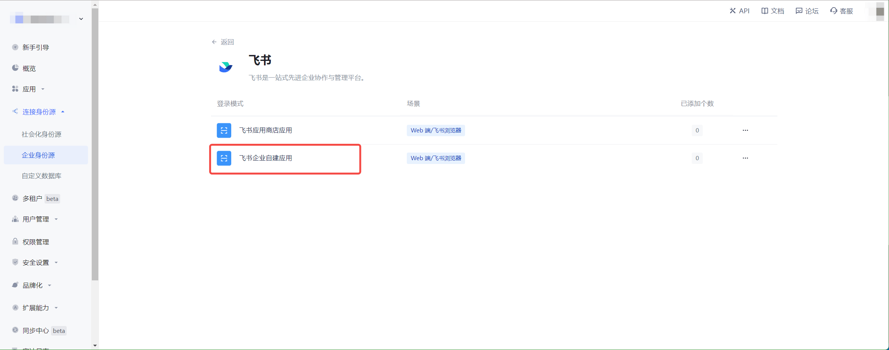

2.3 请在「飞书企业自建应用」页面，填写相关的字段信息。
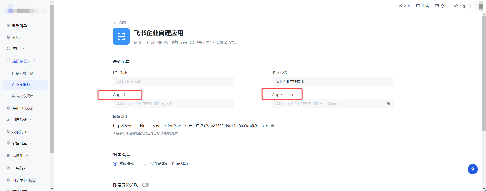

| 字段         | 描述                                                                                                                                                         |
| ------------ | ------------------------------------------------------------------------------------------------------------------------------------------------------------ |
| 唯一标识     | a. 唯一标识由小写字母、数字、- 组成，且长度小于 32 位。 b. 这是此连接的唯一标识，设置之后不能修改。                                                     |
| 显示名称     | 这个名称会显示在终端用户的登录界面的按钮上。                                                                                                                 |
| App ID       | 在飞书应用的后台， **凭证与基础信息** 中可以看到 App ID 和 App Secret 。                                                                                     |
| App Secret   | 在飞书应用的后台， **凭证与基础信息** 中可以看到 App ID 和 App Secret 。                                                                                     |
| 登录模式     | 开启「仅登录模式」后，只能登录既有账号，不能创建新账号，请谨慎选择。                                                                                         |
| 账号身份关联 | 不开启「账号身份关联」时，用户通过身份源登录时默认创建新用户。开启「账号身份关联」后，可以允许用户通过「字段匹配」或「询问绑定」的方式直接登录到已有的账号。 |

App ID 和 App Secret ，填写在飞书应用的后台， **凭证与基础信息** 中的 App ID 和 App Secret 。

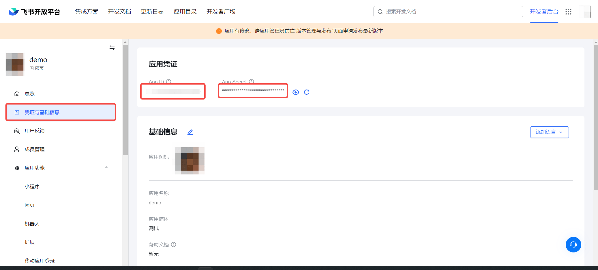

2.4 配置完成后，点击「创建」或者「保存」按钮完成创建。

在飞书开发者后台，打开应用管理页面，选择**安全设置**，将 {{$localeConfig.brandName}} 后台的 回调地址，添加到 **重定向 URL** 中

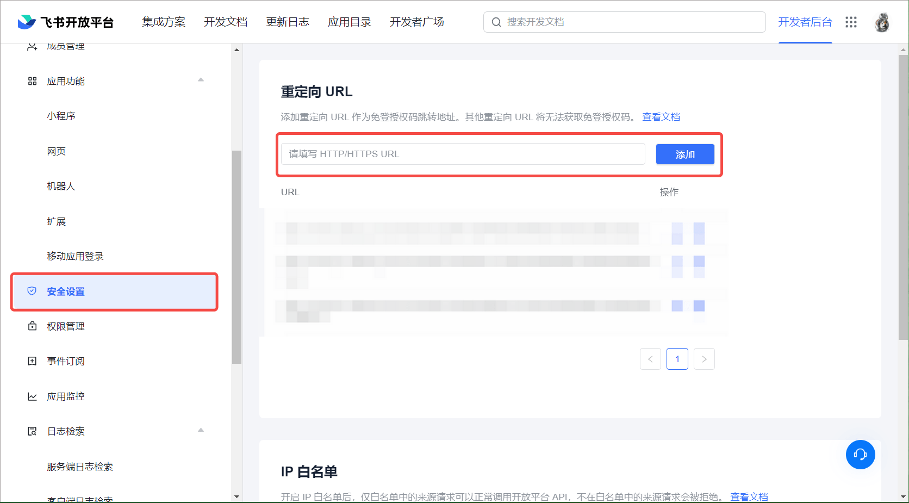

## 步骤 3：在飞书后台上线飞书自建应用

3.1 在飞书开发者后台，选择应用发布，在**版本管理与发布**中，点击**创建版本**，将创建好的应用进行发布，

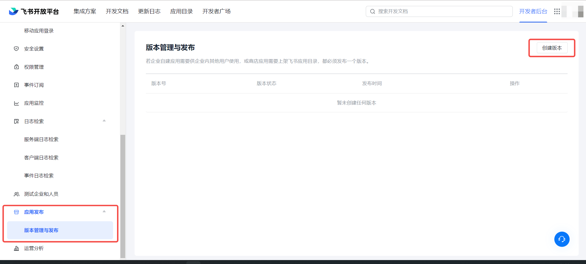

3.2 提交申请后，你的企业管理员会进行审核，审核结果会通过飞书和开发者后台发送给你。详情请见[飞书文档 - 开发企业自建应用](https://open.feishu.cn/document/uQjL04CN/ukzM04SOzQjL5MDN)

## 步骤 4：开发接入

- **推荐开发接入方式**：使用托管登录页

- **优劣势描述**：运维简单，由 {{$localeConfig.brandName}} 负责运维。每个用户池有一个独立的二级域名;如果需要嵌入到你的应用，需要使用弹窗模式登录，即：点击登录按钮后，会弹出一个窗口，内容是 {{$localeConfig.brandName}} 托管的登录页面，或者将浏览器重定向到 {{$localeConfig.brandName}} 托管的登录页。

- **详细接入方法**：

  4.1 在 {{$localeConfig.brandName}} 控制台创建一个应用，详情查看：[如何在 {{$localeConfig.brandName}} 创建一个应用](/guides/app-new/create-app/create-app.md)

  4.2 在已创建好的 飞书企业自建应用 身份源连接详情页面，开启并关联一个在 {{$localeConfig.brandName}} 控制台创建的应用

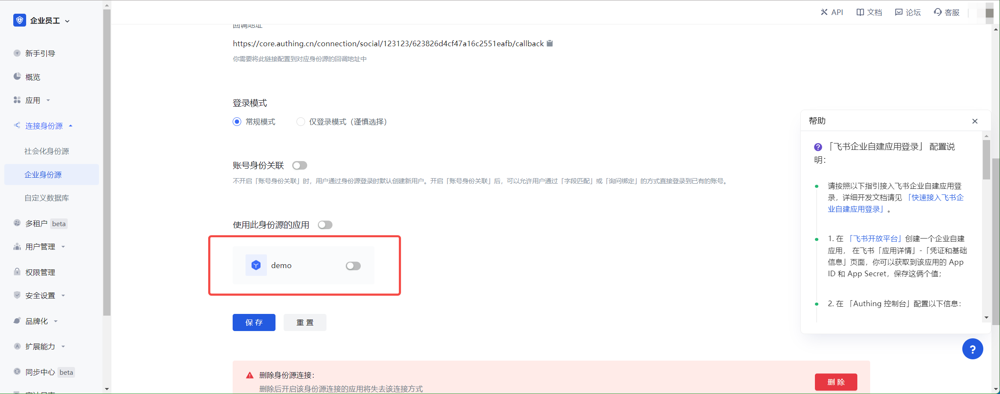

4.3 在登录页面体验 飞书企业自建应用 第三方登录

