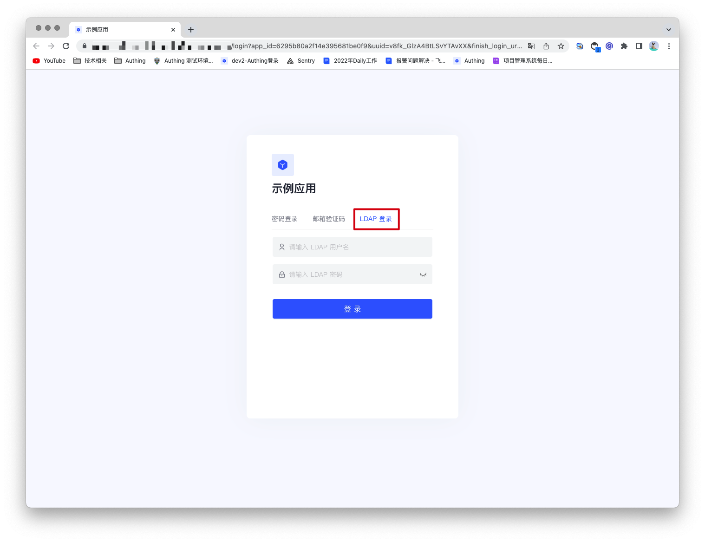
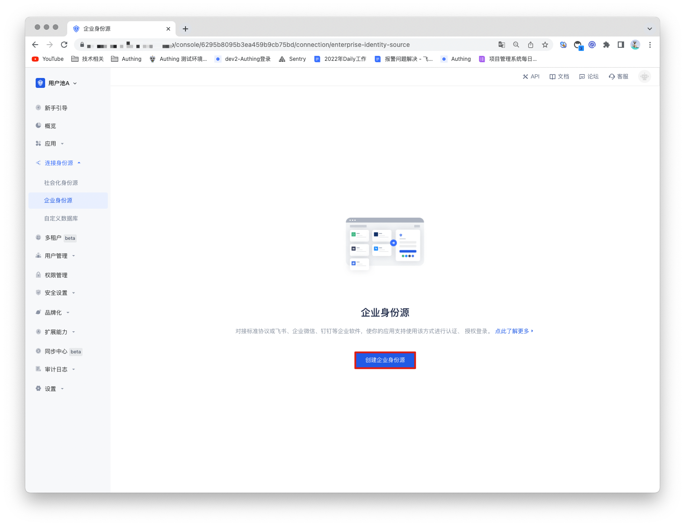
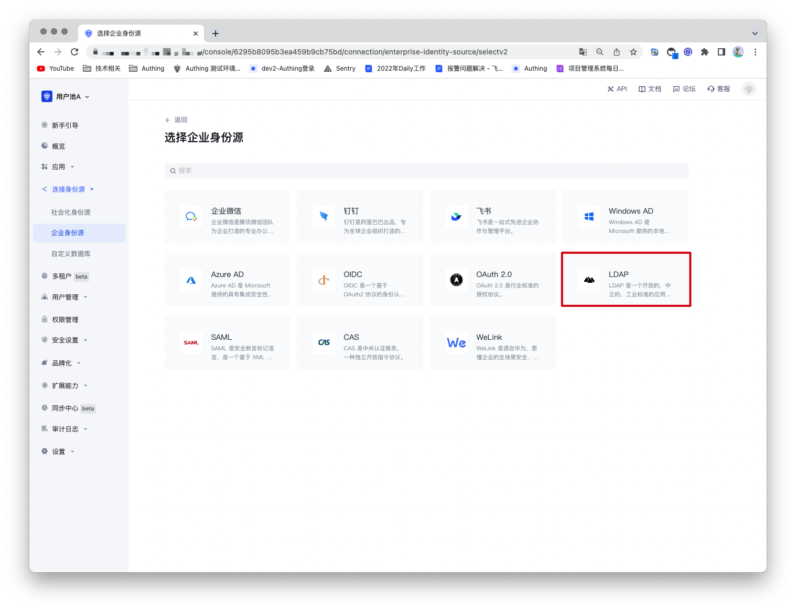
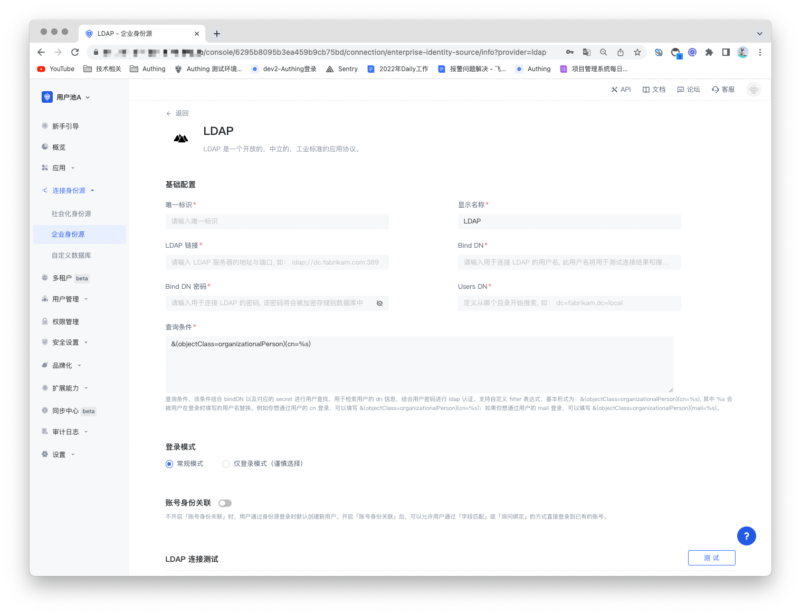
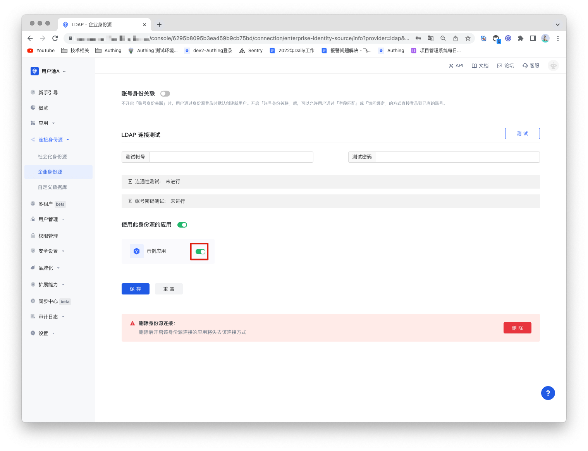

# LDAP

<LastUpdated/>

## 场景介绍

- **概述**：LDAP（轻型目录访问协议）是一种软件协议 ，使任何人都可以在公共互联网或公司内网上查找网络中的组织，个人和其他资源（例如文件和设备）的数据 。LDAP 是目录访问协议（DAP）的“轻量级”版本，它是 X.500（ 网络中目录服务的标准 ）的一部分。

- **应用场景**：PC 网站
- **终端用户预览图**：

## 注意事项

- 需要一个 LDAP 服务；
- 如果你未开通 Authing 控制台账号，请先前往 [Authing Console 控制台](https://authing.cn/)注册开发者账号；

## 第一步：创建 LDAP 身份源

Authing 支持使用 LDAP 协议查看、修改、增加和删除用户信息。所以如果没有自己的 LDAP，可以[使用 Authing 的 LDAP 用户目录](https://docs.authing.cn/v2/guides/users/ldap-user-directory.html)。

## 第二步：在 Authing 控制台配置 LDAP 身份源

2.1 打开 **Authing 控制台**，进入想要连接 LDAP 身份源的用户池，这里称其为 **「用户池 B」**。在左侧菜单中选择 「连接身份源」 > 「企业身份源」，在右侧面板选择「创建企业身份源」。

2.2 在右侧面板找到「 LDAP」，点击进去。

2.3 根据 LDAP 的配置要求，填入  LDAP 协议所要求的配置内容。

| 字段/功能    | 描述                                                         |
| ------------ | ------------------------------------------------------------ |
| 唯一标识     | a.唯一标识由小写字母、数字、- 组成，且长度小于 32 位。b.这是此连接的唯一标识，设置之后不能修改。 |
| 显示名称     | 这个名称会显示在终端用户的登录界面的按钮上。                 |
| LDAP 链接    | LDAP 服务器的地址。                                          |
| Bind DN      | 用于连接 LDAP 的用户名，此用户名将用于测试连接结果和搜索用户或用户组。 |
| Bind DN 密码 | 用于连接 LDAP 的密码，该密码将会被加密存储到数据库中。       |
| Users DN     | 定义从哪个目录开始搜索，如：dc=fabrikam,dc=local             |
| 查询条件     | 该条件结合 bindDN 以及对应的 secret 进行用户查找，用于检索用户的 dn 信息，结合用户密码进行 ldap 认证。支持自定义 filter 表达式，基本形式为：&(objectClass=organizationalPerson)(cn=%s)。 |
| 登录模式     | 开启「仅登录模式」后，只能登录既有账号，不能创建新账号，请谨慎选择。 |
| 账号身份关联 | 不开启「账号身份关联」时，用户通过身份源登录时默认创建新用户。开启「账号身份关联」后，可以允许用户通过「字段匹配」或「询问绑定」的方式直接登录到已有的账号。 |

配置完成后，点击「保存」按钮完成创建。

Authing 也提供对 LDAP 连接的测试，测试 LDAP 服务的连通性和账号密码是否正确，帮助你检查参数是否填写正确了。

## 步骤 3: 开发接入

- **推荐开发接入方式**：使用托管登录页

- **优劣势描述**：运维简单，由 Authing 负责运维。每个用户池有一个独立的二级域名;如果需要嵌入到你的应用，需要使用弹窗模式登录，即：点击登录按钮后，会弹出一个窗口，内容是 Authing 托管的登录页面，或者将浏览器重定向到 Authing 托管的登录页。

- **详细接入方法**：

3.1 在 Authing 控制台创建一个应用，详情查看：[如何在 Authing 创建一个应用](/guides/app-new/create-app/create-app.md)。

3.2 在已创建好的 LDAP 身份源连接详情页面，开启并关联一个在 Authing 控制台创建的应用。

3.3 在登录页面体验 LDAP  的企业化登录。

