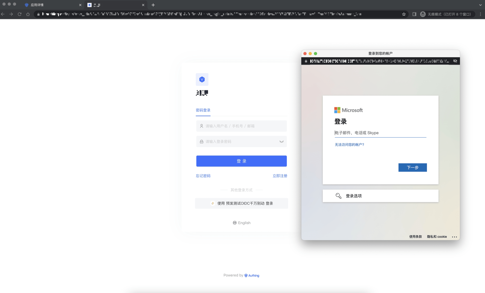
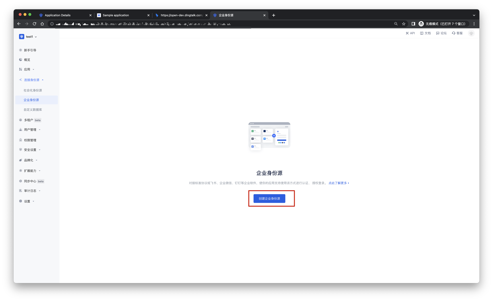
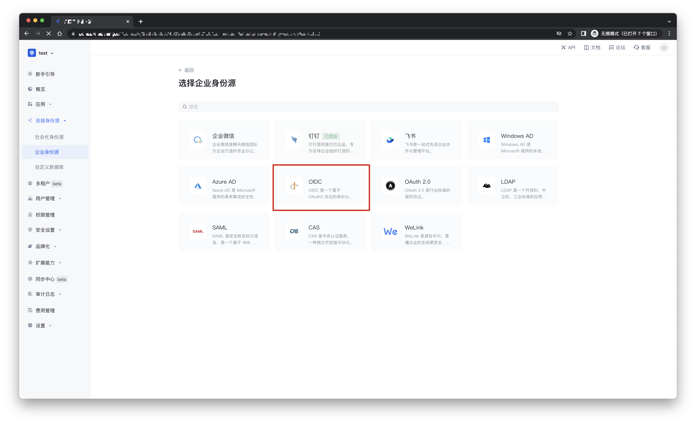
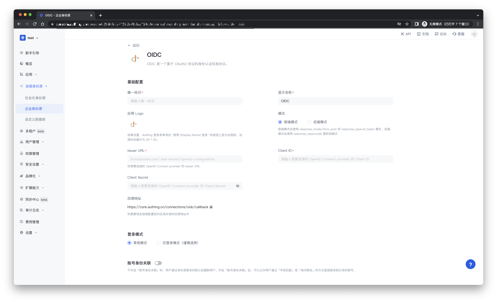
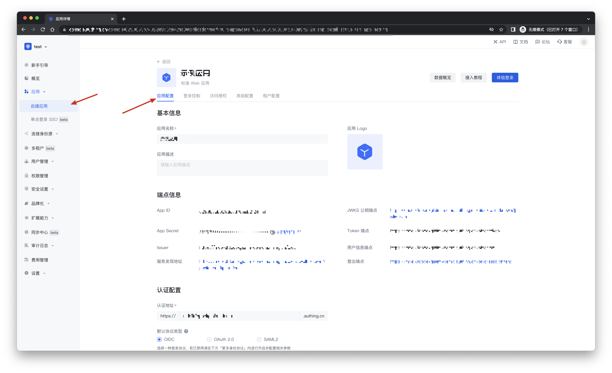
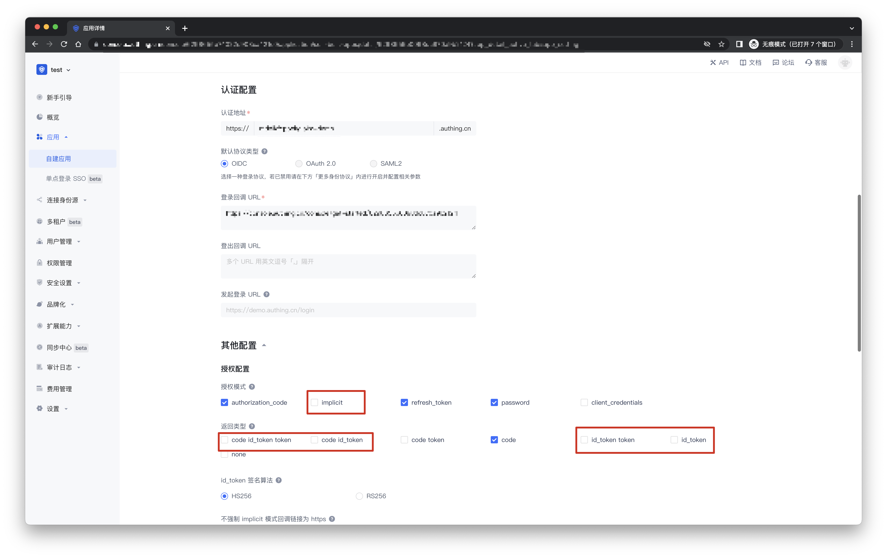
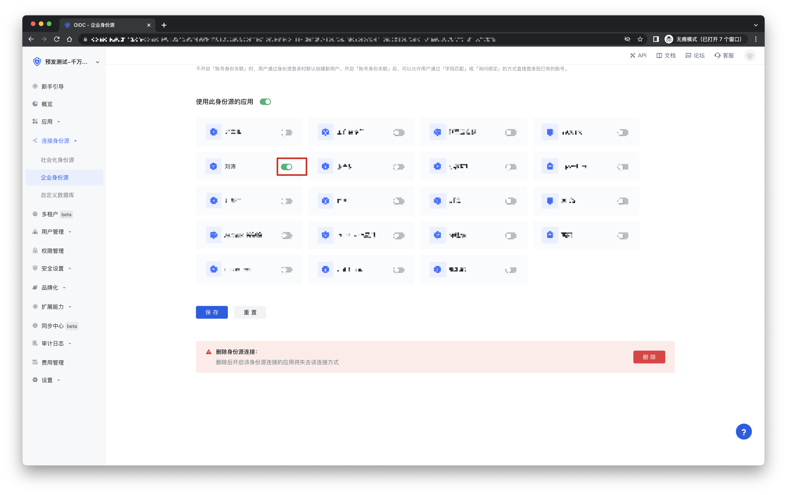

# OIDC 

<LastUpdated/>

## 场景介绍

- **概述**： 不同的 OIDC 身份服务商创建 OIDC Client 的过程可能会有所不同，你需要参考你的 OIDC 身份服务商的文档指引创建 OIDC Client。OIDC 是一个基于 OAuth2 协议的身份认证标准协议。
- **应用场景**：创建 OIDC Client
- **终端用户预览图**：

## 注意事项

- 如果您未开通 {{$localeConfig.brandName}} 控制台账号，请先前往 [{{$localeConfig.brandName}} 控制台](https://authing.cn/) 注册开发者账号。

## 步骤 1：在 OIDC 身份服务商中创建一个 OIDC Client

不同的 OIDC 身份服务商创建 OIDC Client 的过程可能会有所不同，你需要参考你的 OIDC 身份服务商的文档指引创建 OIDC Client。

你需要在合适的地方配置 OIDC Client 的回调链接。OIDC 客户端发起登录请求的时指定的回调链接需要和在 OIDC Identity Provider 处配置的回调链接匹配，否则会报错。

Authing 的 OIDC 回调链接为：https://core.authing.cn/connections/oidc/callback。

## 步骤 2：在 {{$localeConfig.brandName}} 控制台配置 OIDC Client

2.1 请在 {{$localeConfig.brandName}}  控制台 的「企业化身份源」页面，点击「创建企业化身份源」按钮，进入「选择企业化身份源」页面。

2.2 请在  {{$localeConfig.brandName}}  控制台 的「企业化身份源」-「选择企业化身份源」页面，点击「OIDC」身份源按钮，进入 「OIDC 登录模式」页面。

2.3 请在  {{$localeConfig.brandName}}  控制台 的「企业化身份源」-「OIDC」页面，配置相关的字段信息。

| 字段/功能           | 描述                                                         |
| ---------------- | ------------ | 
| 唯一标识     | a.唯一标识由小写字母、数字、- 组成，且长度小于 32 位。b.这是此连接的唯一标识，设置之后不能修改。 |
| 显示名称     | 这个名称会显示在终端用户的登录界面的按钮上。                 |
| 应用 Logo     | {{$localeConfig.brandName}} 登录表单将在 "使用 {Display Name} 登录" 的按钮上显示此图标，该图标会展示为 20 * 20。                 |
| 模式     | 前端模式会使用 response_mode=form_post 和 response_type=id_token 模式，后端模式会使用 response_type=code 授权码模式。                 |
| Issuer URL     | 你想要连接的 OpenID Connect provider 的 Issuer URL。                 |
| Client ID     | OIDC 身份服务商提供的 Client ID。                 |
| Client Secret     | OIDC 身份服务商提供的 Client Secret。                 |
| 回调地址     |  有效跳转 URI。需要将此 URL 配置到 OIDC 身份服务商上。 |
| 登录模式     | 开启「仅登录模式」后，只能登录既有账号，不能创建新账号，请谨慎选择。 |
| 账号身份关联 | 不开启「账号身份关联」时，用户通过身份源登录时默认创建新用户。开启「账号身份关联」后，可以允许用户通过「字段匹配」或「询问绑定」的方式直接登录到已有的账号。a.关联方式：选择 |

配置完成后，点击「创建」或者「保存」按钮完成创建。

## 步骤 3：选择 OIDC 的连接模式
- 前端模式：这种模式下，用户信息的交换会全部在浏览器前端完成，会使用 response_mode=form_post 和 response_type=id_token 模式，请确保你的 OIDC 应用打开了 implicit 模式，并且返回类型勾选上了 id_token
- 后端模式: 这种模式下，用户信息的交换会在 Authing 的服务器进行，会使用 response_type=code 授权码模式，所以需要提供你 OIDC 应用的密钥。

## 步骤 4：开发接入

- **推荐开发接入方式**：使用托管登录页

- **优劣势描述**：运维简单，由 {{$localeConfig.brandName}} 负责运维。每个用户池有一个独立的二级域名;如果需要嵌入到你的应用，需要使用弹窗模式登录，即：点击登录按钮后，会弹出一个窗口，内容是 {{$localeConfig.brandName}} 托管的登录页面，或者将浏览器重定向到 {{$localeConfig.brandName}} 托管的登录页。

- **详细接入方法**：

3.1 在 {{$localeConfig.brandName}} 控制台创建一个 OIDC Client，详情查看：[如何在 {{$localeConfig.brandName}} 创建一个应用](https://docs.authing.cn/v2/guides/app/create-app.html)

3.2 在已创建好的 OIDC Client 身份源连接详情页面，开启并关联一个在 {{$localeConfig.brandName}} 控制台创建的应用

3.3 在登录页面体验 OIDC 第三方登录

