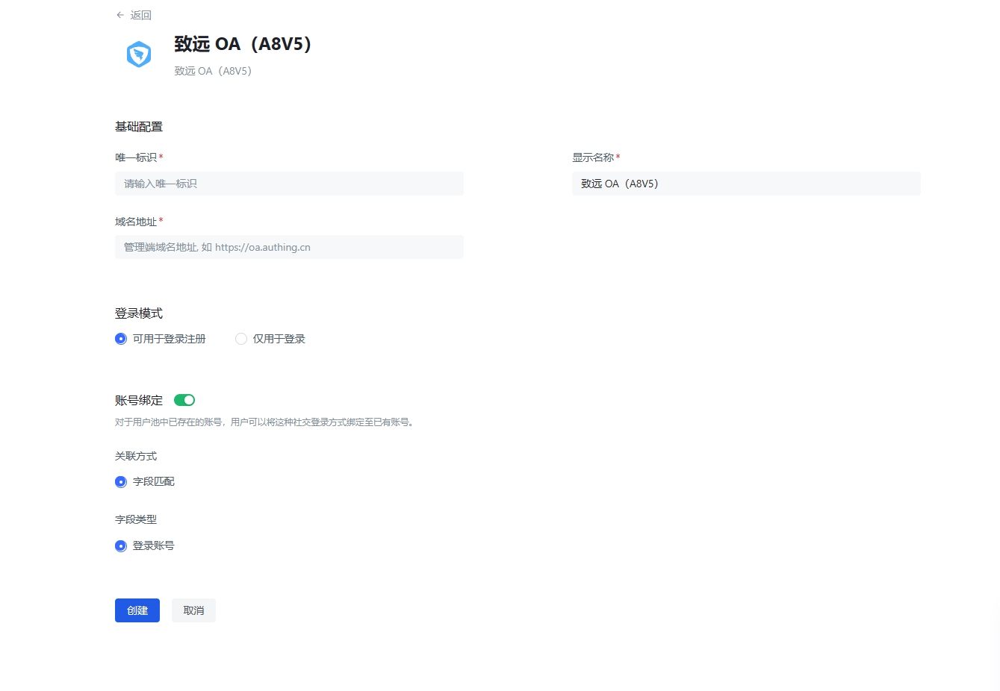

# 致远 OA

<LastUpdated/>

## 场景介绍

- **概述** 致远 OA 企业登录是用户以致远 OA 为身份源安全登录第三方应用或者网站。在 {{$localeConfig.brandName}} 中配置并开启致远 OA 登录，即可实现通过 {{$localeConfig.brandName}} 快速获取致远 OA 基本用户信息和帮助用户实现免密登录功能。
- **应用场景**：PC 网站

## 注意事项

- 需要致远 OA 的管理员账户，并且目前只支持致远 OA A8v5 版本。

## 第一步：进入配置后台

1.1 进入管理后台(参考地址：{致远 OA 域名}/seeyon/main.do?method=main&fl=1&switchToAdmin=1), 切换为集团管理员身份

选择进入 CIP 集成平台

在**第三方应用**栏目中，选择**产品登记**，点击新建，填写表单，对填写的内容没有指定要求，完成后确定创建即可

完成登记创建后，选择**应用注册**，点击新建，填写表单中，登记产品编码，选择刚刚在产品登记创建的产品编码，接入方式选择 PC，其他内容不做要求

## 第二步：在 {{$localeConfig.brandName}} 控制台配置 致远 OA

2.1 请在 {{$localeConfig.brandName}} Console 控制台 的「企业身份源」-「致远 OA」页面，配置相关的字段信息。

| 字段/功能 | 描述                                                                                             |
| --------- | ------------------------------------------------------------------------------------------------ |
| 唯一标识  | a.唯一标识由小写字母、数字、- 组成，且长度小于 32 位。b.这是此连接的唯一标识，设置之后不能修改。 |
| 显示名称  | 这个名称会显示在终端用户的登录界面的按钮上。                                                     |
| 域名地址  | 设置致远 OA 所在域名，以 http:// or https:// 开头， 结尾带 ‘/’ ，如 https://oa.authing.cn        |
| 登录模式  | 开启「仅登录模式」后，只能登录既有账号，不能创建新账号，请谨慎选择。                             |

配置完成后，点击「创建」或者「保存」按钮完成创建，获取到**身份源连接 ID**，并开启需要使用该登录方式的应用，回到致远 OA 管理后台

切换到**应用接入**栏目，选择你要使用的应用，点击**接入设置**

在设置页，**绑定类型**选择免绑定，**匹配类型**为账户匹配

进入单点登录设置页，选择启用，应用类型为 首页与功能单元，展示类型为 新页签，认证模式为门户认证机制， SSO 接口为 https://core.authing.cn，
PC 登录地址为 https://core.authing.cn/api/v3/signin-by-extidp?client_id={开启该登录方式的应用 ID}&ext_idp_conn_id={身份源连接 ID}&response_type=code&scope=openid%20profile%20email%20phone%20username%20address%20offline_access&redirect_uri={应用重定向地址}

**花括号内为需要更改的内容**

注意，需要选择登录授权的用户，只有有权限的用户才能够使用该登录方式

开启账号关联，可以通过用户名匹配到已有的用户池用户。

打开致远 OA 用户侧首页，在功能 tab 列表中，已经展示了上文创建的应用，点击即可完成 {{$localeConfig.brandName}} 登录，跳转到应用指定的登录回调页
