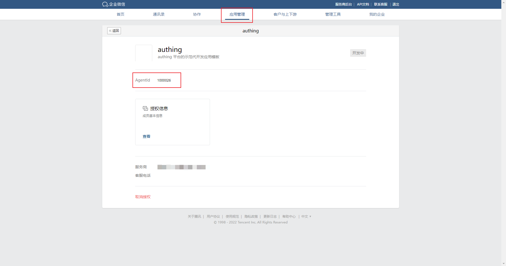

# 企业微信自建应用扫码（Authing 代理模式）

<LastUpdated/>

## 场景介绍

### 概述

企业微信自建应用扫码（Authing 代理模式）是通过 Authing 作为服务商提供代开发应用，第三方企业扫码授权的形式，为第三方企业实现以企业微信为身份源安全登录第三方应用或者网站。在 {{$localeConfig.brandName}} 中配置并开启企业微信自建应用扫码（Authing 代理模式）的企业登录，即可实现通过 {{$localeConfig.brandName}} 快速获取企业微信基本开放的信息，帮助用户实现免密登录功能。

### 应用场景

PC 网站

### 终端用户预览图

## 准备工作

- 开发过程中，需要一个企业微信的企业管理员账号，对代开发应用模板进行授权操作，你可以在 [企业微信权限管理页面](https://work.weixin.qq.com/wework_admin/frame#profile/role) 修改管理员权限。

- 如果你未开通 {{$localeConfig.brandName}} 控制台账号，请先前往 [{{$localeConfig.brandName}} Console 控制台](https://authing.cn/) 注册开发者账号。

## 配置步骤

### 第一步：企业授权代开发模板

1. 企业管理员扫描授权二维码。

2. 联系您的商务经理，提供您的企业名称，进行应用上线。

3. 上线完成后，点击 [**企业管理后台**](https://work.weixin.qq.com/wework_admin/frame)，在授权企业的企业管理后台选择 **我的企业->企业信息**，拷贝 **企业 ID**。

### 第二步：在 {{$localeConfig.brandName}} 控制台配置企业微信自建应用扫码（Authing 代理模式）

1. 选择 {{$localeConfig.brandName}} **身份源管理->企业身份源**，在 **企业身份源** 页面点击 **创建企业身份源** 按钮，进入 **选择企业身份源** 页面，点击 **企业微信** 身份源。

2. 选择 **企业微信自建应用扫码（Authing 代理模式）**。

3. 在 {{$localeConfig.brandName}} 中的 **企业 ID** 填入拷贝的信息。

4. 在授权企业的企业管理后台 **应用管理->应用** 中找到新建的应用，进入应用详情， 拷贝 **AgentId** 到 {{$localeConfig.brandName}} 控制台 **企业微信自建应用扫码（Authing 代理模式）** 页面的 **AgentId** 字段 中。

5. 在控制台 **Scopes** 字段选择 **snsapi_privateinfo** 选项（用于获取用户手机号）。

6. 在企业微信企业管理后台应用详情页点击 **编辑** 按钮，添加 **可见范围**。

::: hint-info
只有选择的组织成员可使用 {{$localeConfig.brandName}} 进行登录。
:::

7. 点击进入页面下方 **授权信息**，点击 **自定义权限**，添加允许的成员敏感信息。

::: hint-info
管理员添加敏感信息权限后， 使用 {{$localeConfig.brandName}} 的字段匹配功能要求用户第一次登录企业微信内应用时，先完成敏感信息的授权。
:::

### 第六步：开发接入

#### 开发接入方式

使用托管登录页。

#### 优劣势描述

运维简单，由 {{$localeConfig.brandName}} 负责运维。每个用户池有一个独立的二级域名。如果需要嵌入到你的应用，需要使用弹窗模式登录，即：点击登录按钮后，会弹出一个窗口，内容是 {{$localeConfig.brandName}} 托管的登录页面，或者将浏览器重定向到 {{$localeConfig.brandName}} 托管的登录页。

#### 详细接入方法

1. 在 {{$localeConfig.brandName}} 控制台创建一个应用。详情查看：[如何在 {{$localeConfig.brandName}} 创建一个应用](/guides/app-new/create-app/create-app.md)。

2. 在已创建好的 **企业微信自建应用扫码（Authing 代理模式）** 身份源连接详情页面，开启并关联一个在 {{$localeConfig.brandName}} 控制台创建的应用。

3. 在登录页面体验企业微信自建应用扫码（Authing 代理模式）第三方登录。

## 用户操作

推荐使用询问绑定，解决获取企业微信用户敏感信息限制；

要使用企业微信账号（邮箱手机号绑定）登录自建应用，用户需要在初次使用时从企业微信应用内打开登录 Authing 应用，完成敏感信息的授权；授权后，{{$localeConfig.brandName}} 自动进行手机号的匹配，从而实现后续的企业微信账号登录。

要完成敏感信息授权，用户需要执行以下步骤：

1. 登录企业微信，访问 **工作台**。

2. 拉到页面底部，找到并点击待授权的应用。

3. 点击页面底部 **登录应用** 按钮在企业微信内进行登录。

4. 在打开的 **企业微信授权** 页面勾选允许 {{$localeConfig.brandName}} 访问的用户个人敏感信息，点击 **同意**。

::: hint-info
请务必勾选 **你的手机号**，否则，企业微信账号与授权应用无法实现关联！
一旦手机号关联失败，后续可通过 PC 端 SSO 面板登录，进入 Authing **个人中心** 里绑定企业微信。有关详情，请参阅 [如何在应用面板配置企业微信与自建应用的绑定](/guides/faqs/sso-phone-binding.md)。
:::

用户选择敏感信息并同意授权后，即可完成登录；同时，你所勾选的信息将会同步至 {{$localeConfig.brandName}}，图示为用户个人中心获取到的用户信息。

