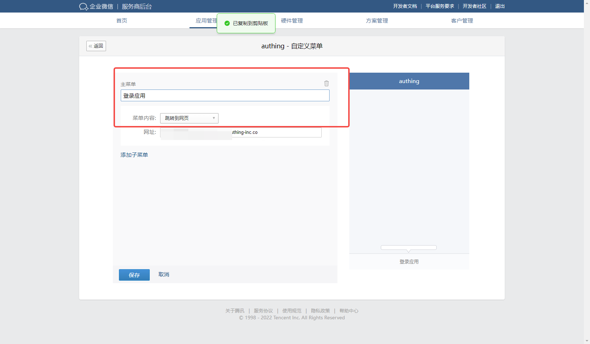
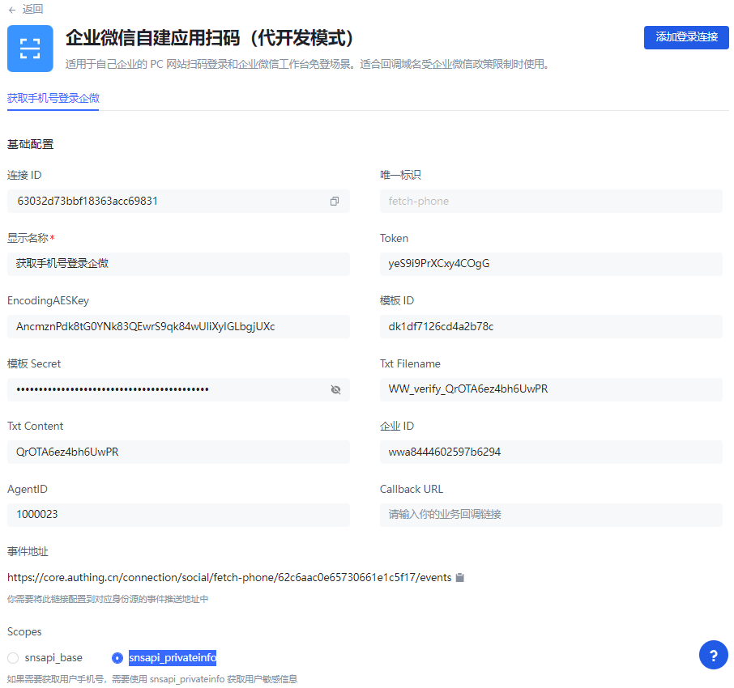
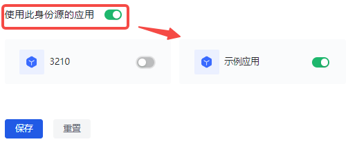
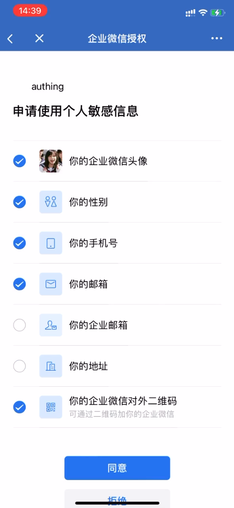
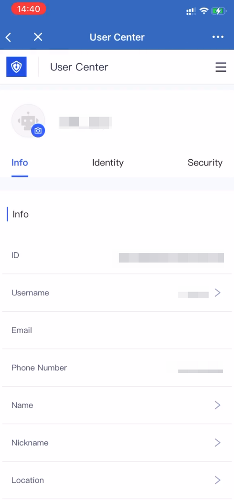

# 企业微信自建应用扫码（代开发模式）

<LastUpdated/>

## 场景介绍

### 概述

企业微信自建应用扫码（代开发模式）是通过服务商提供代开发应用，第三方企业扫码授权的形式，为第三方企业实现以企业微信为身份源安全登录第三方应用或者网站。在 {{$localeConfig.brandName}} 中配置并开启企业微信自建应用扫码（代开发模式）的企业登录，即可实现通过 {{$localeConfig.brandName}} 快速获取企业微信基本开放的信息，帮助用户实现免密登录功能。

### 应用场景

PC 网站

### 终端用户预览图

## 准备工作

- 如果你未开通企业微信服务商账号，请先前往 [企业微信服务商官网](https://open.work.weixin.qq.com/) 点击成为 **企业微信服务商**。

- 开发过程中，还需要一个企业微信的企业管理员账号，对代开发应用模板进行授权操作，你可以在 [企业微信权限管理页面](https://work.weixin.qq.com/wework_admin/frame#profile/role) 修改管理员权限。

- 如果你未开通 {{$localeConfig.brandName}} 控制台账号，请先前往 [{{$localeConfig.brandName}} Console 控制台](https://authing.cn/) 注册开发者账号。

## 配置步骤

### 步骤一：创建代开发应用

1. 在 [企业微信服务商后台](https://open.work.weixin.qq.com/wwopen/developer#/index) 点击左侧导航栏 **应用代开发** 菜单。 在右侧打开 **应用代开发** 页面。

2. 点击 **创建代开发应用模板** 按钮。 打开 **创建代开发应用模板** 窗口。

3. 配置模板 Logo、模板名称等基础信息，点击 **下一步，配置开发信息**。

4. 在 **配置开发信息** 标签页点击 **随机获取** 生成 **Token** 和 **EncodingAESKey**。

::: hint-info
代开发模板回调 URL 需要在 {{$localeConfig.brandName}} 控制台创建应用后才能生成，并通过微信服务器校验。因此先保留页面，打开 {{$localeConfig.brandName}} 控制台。
:::

### 步骤二：在 {{$localeConfig.brandName}} 控制台配置企业微信自建应用扫码（代开发模式）

1. 选择 **{{$localeConfig.brandName}} 控制台->身份源管理->企业身份源**，在 **企业身份源** 页面点击 **创建企业身份源** 按钮，进入 **选择企业身份源** 页面，点击 **企业微信** 身份源。

2. 选择 **企业微信自建应用扫码（代开发模式）**。

3. 在 **企业微信自建应用扫码（代开发模式）** 页面填写企业微信服务商后台 **配置开发信息页面** 获取的 **Token** 和 **EncodingAESKey**。

4. 点击 **保存**。 {{$localeConfig.brandName}} 控制台会自动跳转到身份源详情页。

5. 复制页面下方的 **事件地址** 所展示的 URL。

::: hint-info
由于企业微信需要进行回调验证，必须保存后再进行后续操作，否则微信回调验证无法通过。
:::

6. 将在 {{$localeConfig.brandName}} 控制台获取到的 **事件地址** 的 URL 填写到企业微信服务商后台 **配置开发信息** 中的 **代开发模板回调 URL** 中，然后点击 **保存**。

### 步骤三：上线企业微信代开发应用模板

1. 在企业微信服务商后台选择 **应用管理->代开发应用上线**，点击 **提交上线** 按钮。

2. 选择并提交刚创建的代开发模板。 企业微信会对代开发模板进行审核。

3. 审核通过后，在代开发应用/模板列表点击该模板，进入 **代开发模板审核详情** 窗口，点击 **提交上线**。 则该模板的状态从 **待上线** 变成 **已上线**。

4. 在企业微信服务商后台选择 **应用代开发**，选择需要被授权的代开发应用模板。

5. 点击 **查看模板信息**。

6. 分别将 **模板ID** 和 **模板Secret** 填写到 {{$localeConfig.brandName}} 控制台的身份源信息中。

7. 在企业微信服务商后台水平导航栏选择 **服务商信息->基本信息**，在 **IP 白名单** 字段添加 {{$localeConfig.brandName}} 的服务器 IP 地址。

::: hint-info
可点击 [{{$localeConfig.brandName}} 服务器 IP 列表](https://core.authing.cn/api/v2/system/public-ips) 获取。
:::

### 步骤四：企业授权代开发模板并开发代开发应用

1. 在企业微信服务商后台选择 **应用代开发**， 在右侧代开发应用模板列表点击刚才创建的应用代开发模板。

2. 企业管理员扫描授权二维码.

3. 刷新页面。 在页面下出现代开发应用。

4. 点击 **开始代开发应用**。

5. 确认基础信息后，配置开发信息，在 **可信域名** 中填写 `core.authing.cn`，点击 **完成** 按钮保存配置。

### 步骤五：配置并上线代开发应用

1. 点击完成后，回到代开发应用模板详情页面，点击 **查看**。

2. 在 **使用配置** 模块点击 **编辑** 按钮。

3. 点击 **校验可信域名归属**。

4. 在弹出窗口选择 **下载文件**。

5. 将文件名和内容分别填入 {{$localeConfig.brandName}} 控制台 **企业微信自建应用扫码（代开发模式）** 的 **Txt Filename** 和 **Txt Content** 字段中，点击 **保存**。

6. 在企业微信服务商后台点击 **使用配置** 上 **保存** 按钮。

7. 在 **自定义菜单** 模块点击 **设置** 按钮，在弹出 **自定义菜单** 窗口点击添加主菜单： a. 输入 **主菜单** 名。 b. **菜单内容** 默认选择 **跳转到网页**。 c. 下方输入用户企业微信登录应用网址，点击 **保存**。 右侧实时显示配置效果。

8. 返回 **代开发应用详情** 页，在 **企业微信授权登录** 模块配置各类客户端企业微信授权。 a. 点击 **设置** 按钮打开 **企业微信授权登录** 窗口。  b. 点击 Web 网页下 **设置授权回调域**，填写 `core.authing.cn`，点击 **保存**。

9. 配置完成后返回 **代开发应用上线** 页面点击 **提交上线**，提交应用并审核。

::: hint-info
应用做任何配置修改后，都需要重新上线，才能使修改生效。
:::

  审核通过后，代开发应用状态变更为 **待上线**。

10. 点击进入待上线的应用详情页，点击右上角 **提交上线** 按钮。

11. 点击顶部导航栏 **企业管理后台**，在授权企业的企业管理后台（注意：不是服务商管理后台）选择 **我的企业->企业信息**，拷贝 **企业ID**。

12. 在 {{$localeConfig.brandName}} 中的 **企业ID** 填入拷贝的信息。

13. 在授权企业的企业管理后台 **应用管理->应用** 中找到新建的应用，进入应用详情， 拷贝 **AgentId** 到 {{$localeConfig.brandName}} 控制台 **企业微信自建应用扫码（代开发模式）** 页面的 **AgentId** 字段 中。

14. 在控制台 **Scopes** 字段选择 **snsapi_privateinfo** 选项（用于获取用户手机号）。

15. 在企业微信企业管理后台应用详情页点击 **编辑** 按钮，添加 **可见范围**。

::: hint-info
只有选择的组织成员可使用 {{$localeConfig.brandName}} 进行登录。
:::

16. 点击进入页面下方 **授权信息**，点击 **自定义权限**，添加允许的成员敏感信息。

::: hint-info
管理员添加敏感信息权限后， 使用 {{$localeConfig.brandName}} 的字段匹配功能要求用户第一次登录企业微信内应用时，先完成敏感信息的授权。
:::

### 步骤六：开发接入

#### 开发接入方式

使用托管登录页。

#### 优劣势描述

运维简单，由 {{$localeConfig.brandName}} 负责运维。每个用户池有一个独立的二级域名。如果需要嵌入到你的应用，需要使用弹窗模式登录，即：点击登录按钮后，会弹出一个窗口，内容是 {{$localeConfig.brandName}} 托管的登录页面，或者将浏览器重定向到 {{$localeConfig.brandName}} 托管的登录页。

#### 详细接入方法

1. 在 {{$localeConfig.brandName}} 控制台创建一个应用。详情查看：[如何在 {{$localeConfig.brandName}} 创建一个应用](/guides/app-new/create-app/create-app.md)。

2. 在已创建好的 **企业微信自建应用扫码（代开发模式）** 身份源连接详情页面，开启并关联一个在 {{$localeConfig.brandName}} 控制台创建的应用。

3. 在登录页面体验企业微信自建应用扫码（代开发模式）第三方登录。

## 用户操作

要使用企业微信账号登录自建应用，用户初次使用，需要先从企业微信登录应用，完成敏感信息的授权；授权后，{{$localeConfig.brandName}} 自动进行手机号的匹配，从而实现后续的企业微信账号登录。

要完成敏感信息授权，用户需要执行以下步骤：

1. 登录企业微信，访问 **工作台**。

2. 拉到页面底部，找到并点击待访问授权的自建应用，在企业微信内进行登录。

3. 在打开的 **企业微信授权** 页面勾选允许 {{$localeConfig.brandName}} 访问的用户个人敏感信息，点击 **同意**。

绑定成功。
