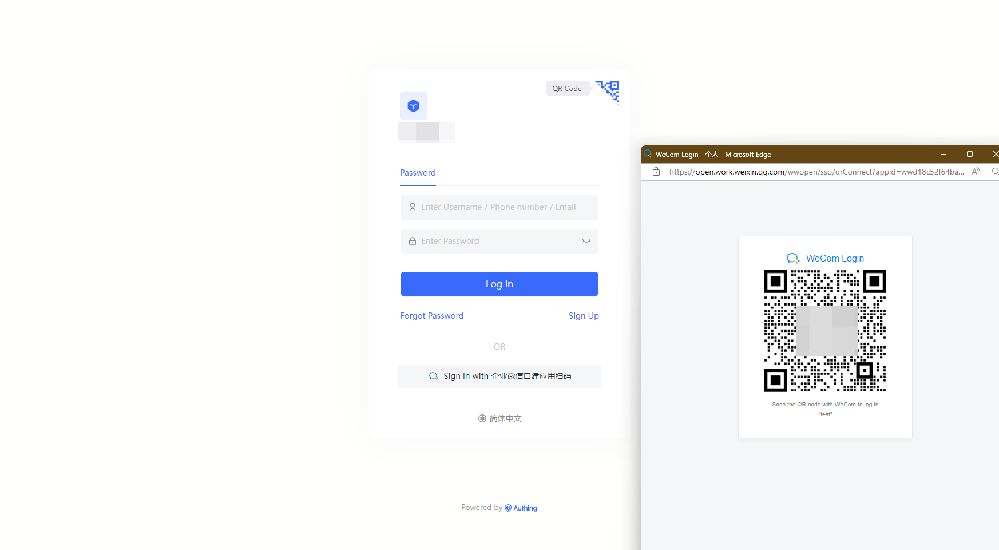
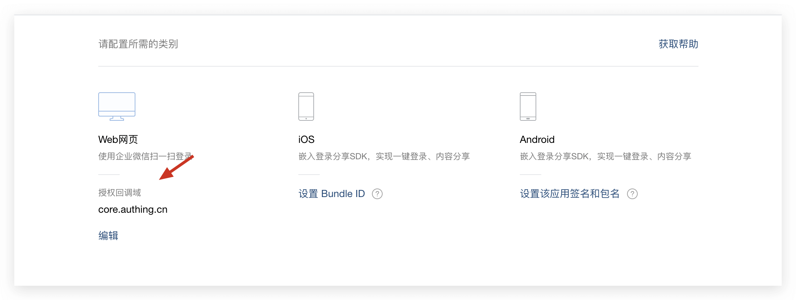
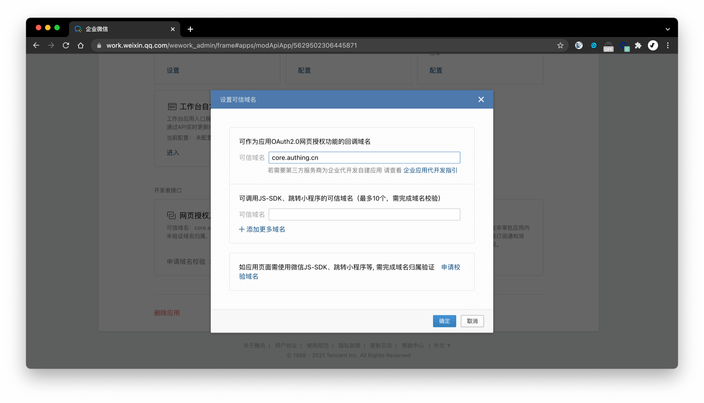
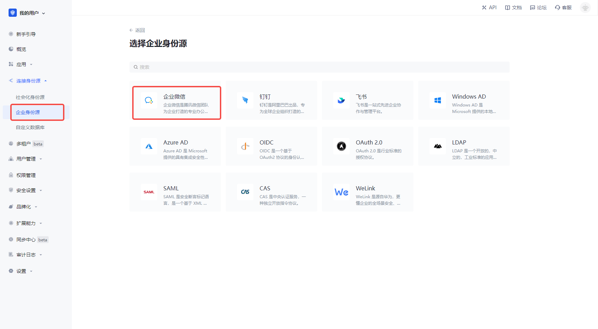
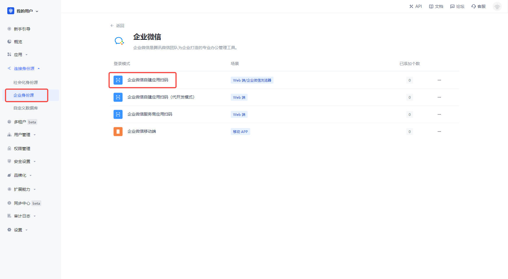
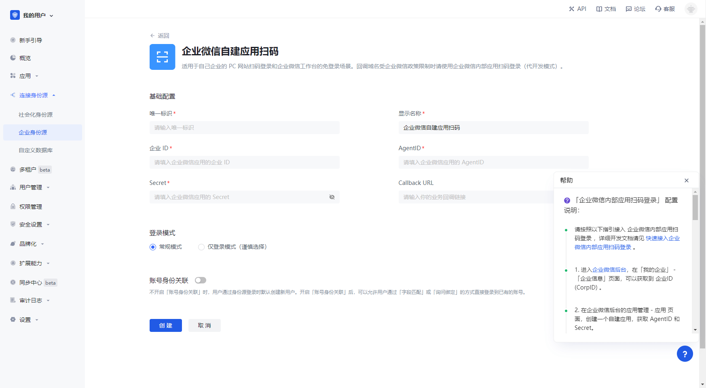
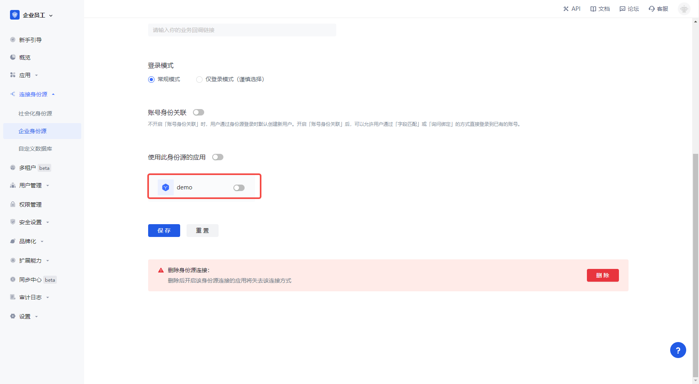
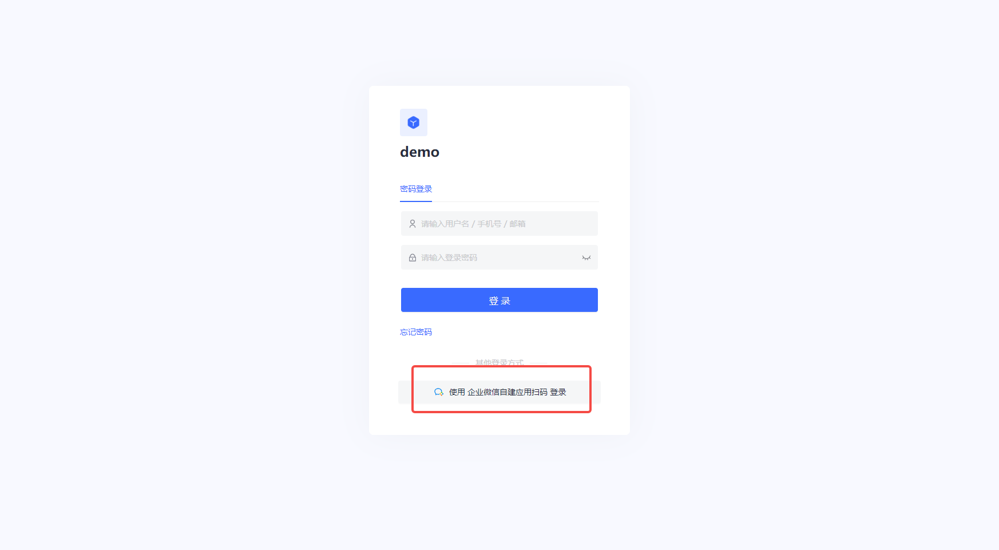

# 企业微信自建应用扫码

<LastUpdated/>

## 场景介绍

- **概述**：企业微信自建应用扫码适用于在网页中通过扫码企业微信让用户进行登录的免登录场景。为企业实现以企业微信为身份源安全登录第三方应用或者网站。在 {{$localeConfig.brandName}} 中配置并开启 企业微信自建应用扫码 的企业登录，即可实现通过 {{$localeConfig.brandName}} 快速获取 企业微信 基本开放的信息和帮助用户实现免密登录功能。
- **应用场景**：PC 网站
- **终端用户预览图**：

## 注意事项

- 如果你未开通 企业微信管理员 账号，请先前往 [企业微信管理员后台](https://work.weixin.qq.com/) 进行注册；
- 如果你未开通 {{$localeConfig.brandName}} 控制台账号，请先前往 [{{$localeConfig.brandName}} Console 控制台](https://{{$localeConfig.brandName}}.cn/) 注册开发者账号；

## 步骤 1：创建企业微信自建应用

前往 [企业微信管理员后台](https://work.weixin.qq.com/wework_admin/frame#profile)，

在**应用管理** - **应用** 页面，创建一个自建应用：

在应用详情页，点击设置企业微信授权登录：

设置授权回调域为 core.authing.cn 。

创建完成后，进入应用详情页，设置网页授权及 JS-SDK 域名，域名地址填写 `core.authing.cn`

## 步骤 2：在 {{$localeConfig.brandName}} 控制台配置 企业微信自建应用扫码

2.1 请在 {{$localeConfig.brandName}} Console 控制台 的「企业身份源」页面，点击「创建企业身份源」按钮，进入「选择企业身份源」页面，点击「企业微信」身份源按钮

2.2 选择 「企业微信自建应用扫码」。

2.3 请在「企业微信自建应用扫码」页面，填写相关的字段信息。

| 字段         | 描述            |
| ------------ | ------------------------------------------------ |
| 唯一标识     | a. 唯一标识由小写字母、数字、- 组成，且长度小于 32 位。 b. 这是此连接的唯一标识，设置之后不能修改。                                                                                                                                                                                                                                                                                                                   |
| 显示名称     | 这个名称会显示在终端用户的登录界面的按钮上。                                                                                                                                                                                                                                                                                                                                                                               |
| 企业 ID      | 在企业微信应用的后台， 在**我的企业** - 企业信息页面，可以获取企业 ID。                                                                                                                                                                                                                                                                                                                                                    |
| AgentID      | 在企业微信应用的后台， **凭证与基础信息** 中可以看到 App ID 和 App Secret 。                                                                                                                                                                                                                                                                                                                                               |
| Secret       | 在企业微信应用的后台， **凭证与基础信息** 中可以看到 App ID 和 App Secret 。                                                                                                                                                                                                                                                                                                                                               |
| Callback URL | 如果你想直接跳转到社会化身份源进行认证，中间不出现任何 {{$localeConfig.brandName}} 的页面，你可以配置这个参数作为认证成功后的业务回调地址，{{$localeConfig.brandName}} 会将用户的 ID Token 发送到这个 URL。比如你的网站域名是 https://example.com，处理 {{$localeConfig.brandName}} 回调请求的 url 为 /auth/callback，那么你应该填写为 https://example.com/auth/callback。**这个参数和应用配置里的回调链接没有任何关联**。 |
| 登录模式     | 开启「仅登录模式」后，只能登录既有账号，不能创建新账号，请谨慎选择。                                                                                                                                                                                                                                                                                                                                                       |
| 账号身份关联 | 不开启「账号身份关联」时，用户通过身份源登录时默认创建新用户。开启「账号身份关联」后，可以允许用户通过「字段匹配」或「询问绑定」的方式直接登录到已有的账号。                                                                                                                                                                                                                                                               |

在我的企业 - 企业信息页面，可以获取企业 ID。

在应用详情页，可以获取该应用的 **AgentId** 和 **Secret**：

## 步骤 3：开发接入

- **推荐开发接入方式**：使用托管登录页

- **优劣势描述**：运维简单，由 {{$localeConfig.brandName}} 负责运维。每个用户池有一个独立的二级域名;如果需要嵌入到你的应用，需要使用弹窗模式登录，即：点击登录按钮后，会弹出一个窗口，内容是 {{$localeConfig.brandName}} 托管的登录页面，或者将浏览器重定向到 {{$localeConfig.brandName}} 托管的登录页。

- **详细接入方法**：

  3.1 在 {{$localeConfig.brandName}} 控制台创建一个应用，详情查看：[如何在 {{$localeConfig.brandName}} 创建一个应用](/guides/app-new/create-app/create-app.md)

  3.2 在已创建好的 企业微信内部应用扫码登录（代开发模式） 身份源连接详情页面，开启并关联一个在 {{$localeConfig.brandName}} 控制台创建的应用

3.3 在登录页面体验 企业微信内部应用扫码登录（代开发模式） 第三方登录

