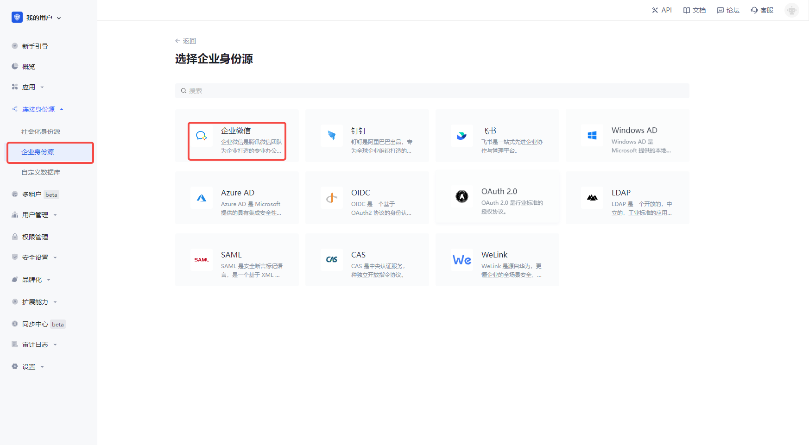
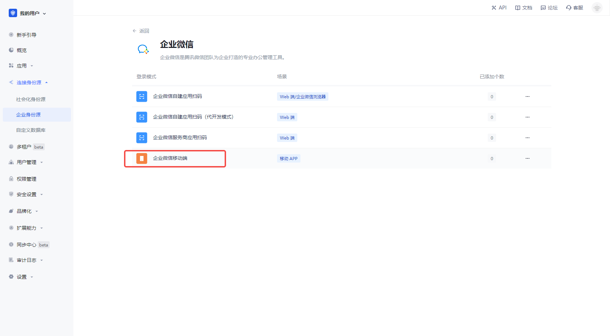
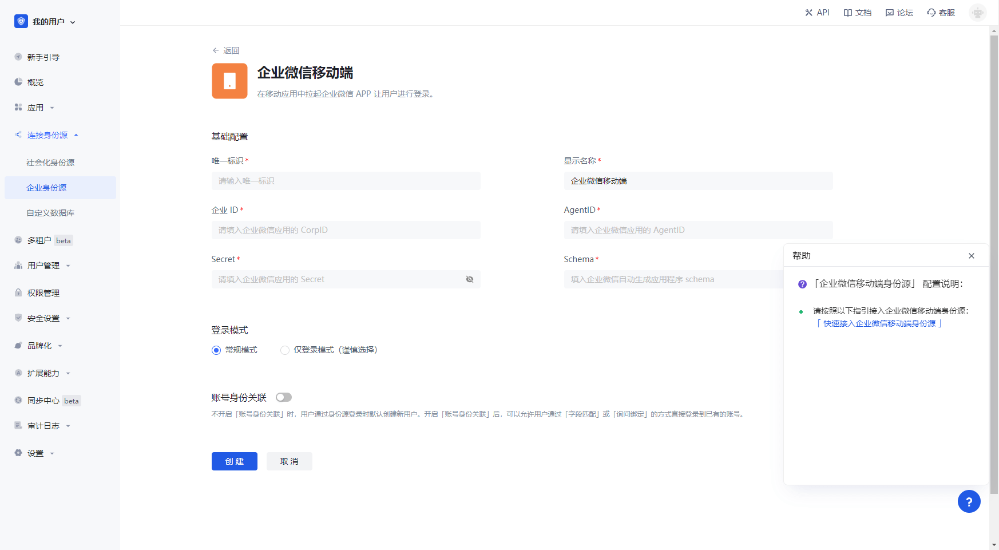
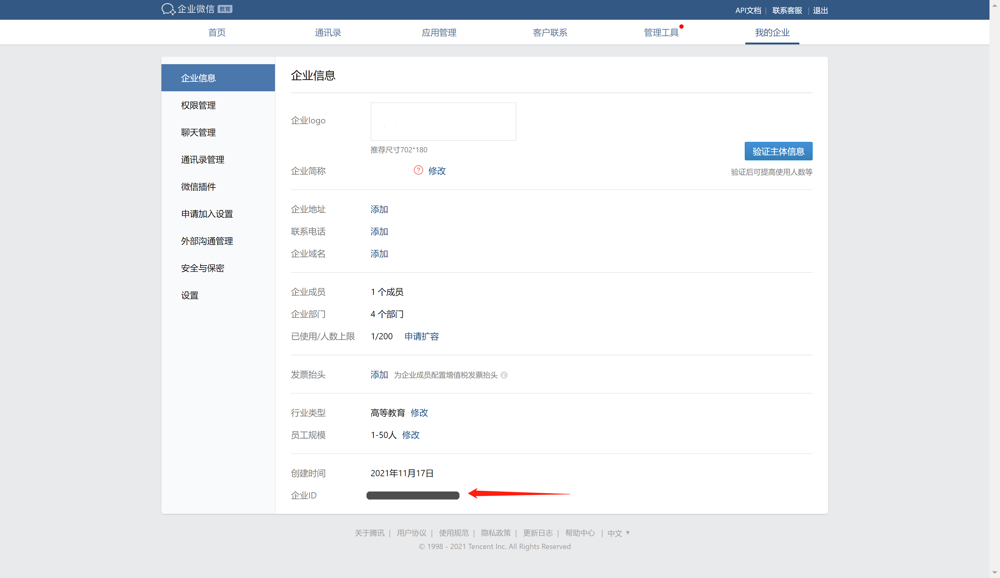
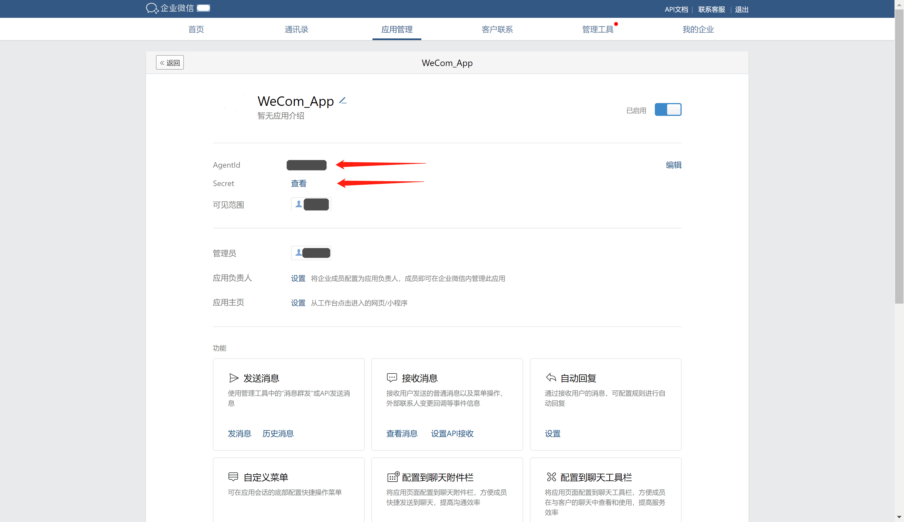

# 企业微信移动端

<LastUpdated/>

## 场景介绍

- **概述**：在移动应用中拉起企业微信 APP 让用户进行登录的免登录场景。为企业实现以企业微信为身份源安全登录第三方应用或者网站。在 {{$localeConfig.brandName}} 中配置并开启 企业微信移动端 的企业登录，即可实现通过 {{$localeConfig.brandName}} 快速获取 企业微信 基本开放的信息和帮助用户实现免密登录功能。
- **应用场景**：移动端应用
- **终端用户预览图**：

## 注意事项：

- 如果您未开通 企业微信开发者 账号，请先前往 [企业微信开发者后台](https://work.weixin.qq.com/) 进行注册；
- 如果您未开通 {{$localeConfig.brandName}} 控制台账号，请先前往 [{{$localeConfig.brandName}} Console 控制台](https://{{$localeConfig.brandName}}.cn/) 注册开发者账号；

## 步骤 1：创建企业自建应用

前往 [企业微信开发者后台](https://work.weixin.qq.com/wework_admin/frame#profile)，

在**应用管理** - **应用** 页面，创建一个自建应用：

在应用详情页，点击设置企业微信授权登录：

点击 IOS 或 Android 选项，获取 schema 并填入应用的应用签名和包名

## 步骤 2：在 {{$localeConfig.brandName}} 控制台配置 企业微信移动端

2.1 请在 {{$localeConfig.brandName}} Console 控制台 的「企业身份源」页面，点击「创建企业身份源」按钮，进入「选择企业身份源」页面，点击「企业微信」身份源按钮

2.2 选择 「企业微信移动端」。

2.3 请在「企业微信移动端」页面，填写相关的字段信息。

| 字段         | 描述                                                                                                                                                         |
| ------------ | ------------------------------------------------------------------------------------------------------------------------------------------------------------ |
| 唯一标识     | a. 唯一标识由小写字母、数字、- 组成，且长度小于 32 位。 b. 这是此连接的唯一标识，设置之后不能修改。                                                     |
| 显示名称     | 这个名称会显示在终端用户的登录界面的按钮上。                                                                                                                 |
| 企业 ID      | 在企业微信应用的后台， **凭证与基础信息** 中可以看到 App ID 和 App Secret 。                                                                                 |
| AgentID      | 在企业微信应用的后台， **凭证与基础信息** 中可以看到 App ID 和 App Secret 。                                                                                 |
| Secret       | 在企业微信应用的后台， **凭证与基础信息** 中可以看到 App ID 和 App Secret 。                                                                                 |
| Schema       | 在企业微信应用的后台， **凭证与基础信息** 中可以看到 App ID 和 App Secret 。                                                                                 |
| 登录模式     | 开启「仅登录模式」后，只能登录既有账号，不能创建新账号，请谨慎选择。                                                                                         |
| 账号身份关联 | 不开启「账号身份关联」时，用户通过身份源登录时默认创建新用户。开启「账号身份关联」后，可以允许用户通过「字段匹配」或「询问绑定」的方式直接登录到已有的账号。 |

在我的企业 - 企业信息页面，可以获取企业 ID。

在应用详情页，你可以获取该应用的 **AgentId** 和 **Secret**：

## 步骤 3：开发接入

- **推荐开发接入方式**：使用托管登录页

- **优劣势描述**：运维简单，由 {{$localeConfig.brandName}} 负责运维。每个用户池有一个独立的二级域名;如果需要嵌入到你的应用，需要使用弹窗模式登录，即：点击登录按钮后，会弹出一个窗口，内容是 {{$localeConfig.brandName}} 托管的登录页面，或者将浏览器重定向到 {{$localeConfig.brandName}} 托管的登录页。

- **详细接入方法**：

## 移动端接入 sdk
