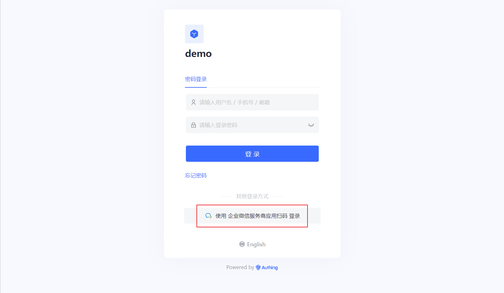
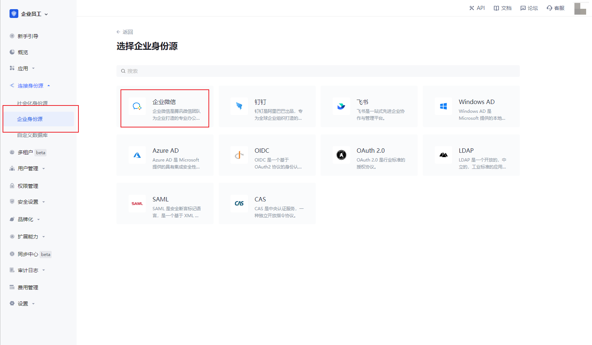
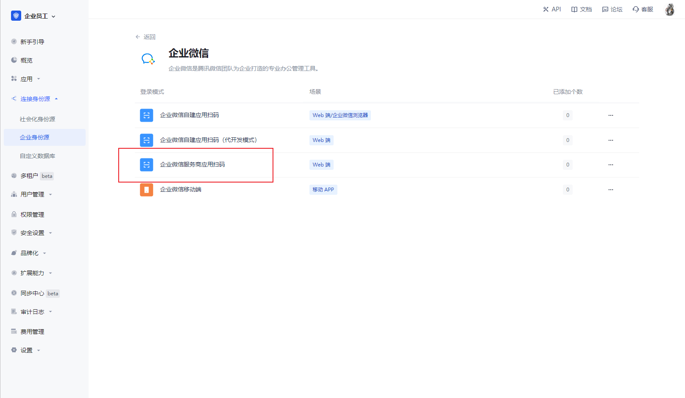
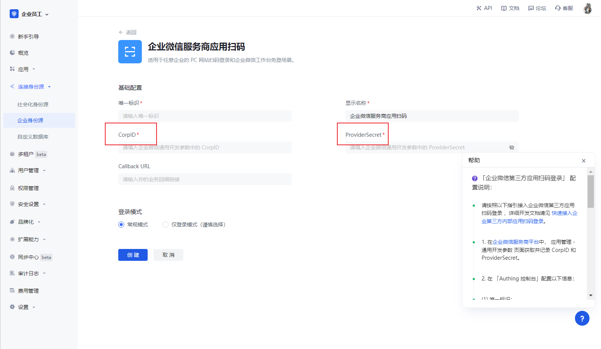
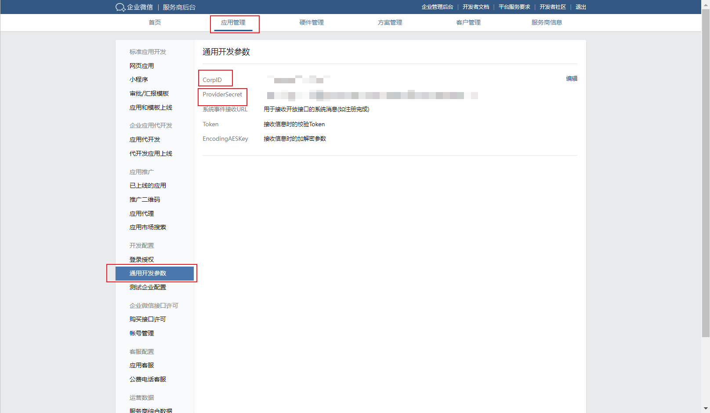
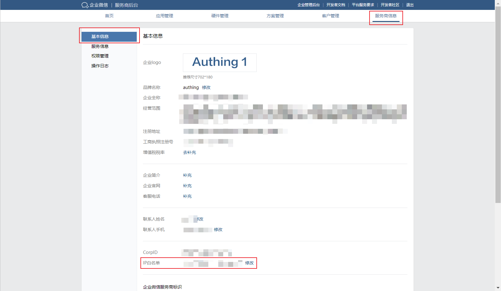
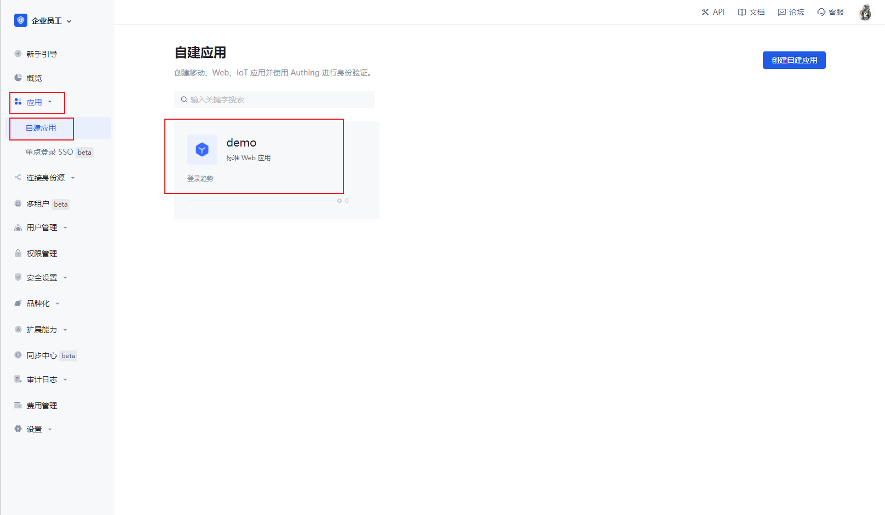
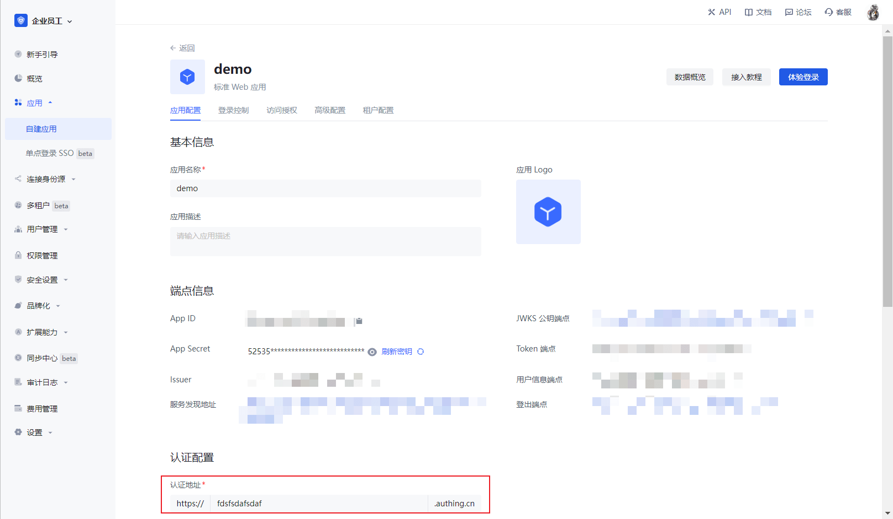
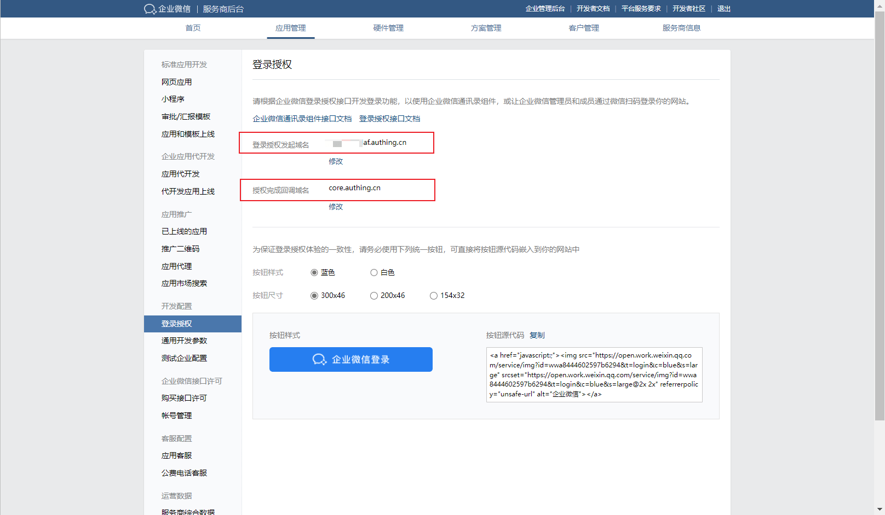

# 企业微信服务商应用扫码

<LastUpdated/>

## 场景介绍

- **概述**：企业微信服务商应用扫码通过第三方企业扫码服务商的应用授权，为第三企业实现以企业微信为身份源安全登录第三方应用或者网站。在 {{$localeConfig.brandName}} 中配置并开启 企业微信服务商应用扫码 的企业登录，即可实现通过 {{$localeConfig.brandName}} 快速获取 企业微信 基本开放的信息和帮助用户实现免密登录功能。
- **应用场景**：任意企业的 PC 网站扫码登录和企业微信工作台免登场景
- **终端用户预览图**：

## 注意事项

- 如果你未开通 企业微信服务商 账号，请先前往 [企业微信服务商官网](https://open.work.weixin.qq.com/) 点击成为**企业微信服务商**；
- 如果你未开通 {{$localeConfig.brandName}} 控制台账号，请先前往 [{{$localeConfig.brandName}} Console 控制台](https://authing.cn/) 注册开发者账号；

## 第一步：在 {{$localeConfig.brandName}} 控制台配置 企业微信服务商应用扫码

2.1 请在 {{$localeConfig.brandName}} Console 控制台 的「企业身份源」页面，点击「创建企业身份源」按钮，进入「选择企业身份源」页面，选择「企业微信」身份源按钮，点击「企业微信服务商应用扫码」，进入 「企业微信服务商应用扫码 登录模式」页面。

2.3 请在 {{$localeConfig.brandName}} Console 控制台 的「企业身份源」-「企业微信服务商应用扫码」页面，配置相关的字段信息。

| 字段/功能      | 描述 |
| -------------- | --------------------------|
| 唯一标识       | a.唯一标识由小写字母、数字、- 组成，且长度小于 32 位。b.这是此连接的唯一标识，设置之后不能修改。                                                                                                                                                                                                                                                      |
| 显示名称       | 这个名称会显示在终端用户的登录界面的按钮上。                                                                                                                                                                                                                                                                                                          |
| CorpID         | 企业微信平台上通用开发中的参数 Corp ID                                                                                                                                                                                                                                                                                                                |
| ProviderSecret | 企业微信平台上通用开发中的参数 ProviderSecret                                                                                                                                                                                                                                                                                                         |
| Callback URL   | 这是你的业务回调域名，和自建应用配置的回调链接不是一个概念，也和第三方社会化登录控制台的回调地址配置无关。比如你的网站域名是 https://example.com ， 处理 {{$localeConfig.brandName}} 回调请求的 url 为 /auth/callback ， 那么你应该填写为 https://example.com/auth/callback。这个参数已经不推荐使用，建议在应用中单独配置回调链接，此处地址可填入 #。 |
| 登录模式       | 开启「仅登录模式」后，只能登录既有账号，不能创建新账号，请谨慎选择。                                                                                                                                                                                                                                                                                  |

在企业微信服务商后台，选择**应用管理**，点击**通用开发参数**，将 CorpID 和 ProviderSecret 复制到 {{$localeConfig.brandName}} 控制台中

配置完成后，点击「创建」或者「保存」按钮完成创建。

## 第二步：增加企业微信 IP 白名单

2.1 在企业微信服务商后台，**服务商信息页面**，选择**基本信息**，在**IP 白名单**添加上 {{$localeConfig.brandName}} 的服务器 IP 地址，具体可点击 [{{$localeConfig.brandName}} 服务器 IP 列表](https://core.authing.cn/api/v2/system/public-ips)进行获取

## 第三步：进行登录授权

- 企业微信需要对发起登录的地址进行授权校验，下面以通过**托管登录页**登录的方式，说明如何增加登录授权

  3.1 在 {{$localeConfig.brandName}} 控制台创建一个应用，详情查看：[如何在 {{$localeConfig.brandName}} 创建一个应用](/guides/app-new/create-app/create-app.md)

  3.2 在已创建好的 企业微信服务商应用扫码 身份源连接详情页面，开启并关联一个在 {{$localeConfig.brandName}} 控制台创建的应用

3.3 在 **应用**，**自建应用** 栏目，点击刚刚开启的应用，进入应用详情，复制**认证地址**

3.4 把从应用详情中认证地址，填写到 微信服务商后台**应用管理**，**登录授权**中的**登录授权发起域名**，**授权完成回调域名**填写 core.authing.cn

## 第四步：开发接入

- **推荐开发接入方式**：使用托管登录页

- **优劣势描述**：运维简单，由 {{$localeConfig.brandName}} 负责运维。每个用户池有一个独立的二级域名;如果需要嵌入到你的应用，需要使用弹窗模式登录，即：点击登录按钮后，会弹出一个窗口，内容是 {{$localeConfig.brandName}} 托管的登录页面，或者将浏览器重定向到 {{$localeConfig.brandName}} 托管的登录页。

- **详细接入方法**：

  3.1 在 {{$localeConfig.brandName}} 控制台创建一个应用，详情查看：[如何在 {{$localeConfig.brandName}} 创建一个应用](/guides/app-new/create-app/create-app.md)

  3.2 在已创建好的 企业微信服务商应用扫码 身份源连接详情页面，开启并关联一个在 {{$localeConfig.brandName}} 控制台创建的应用

3.3 在登录页面体验 企业微信服务商应用扫码

