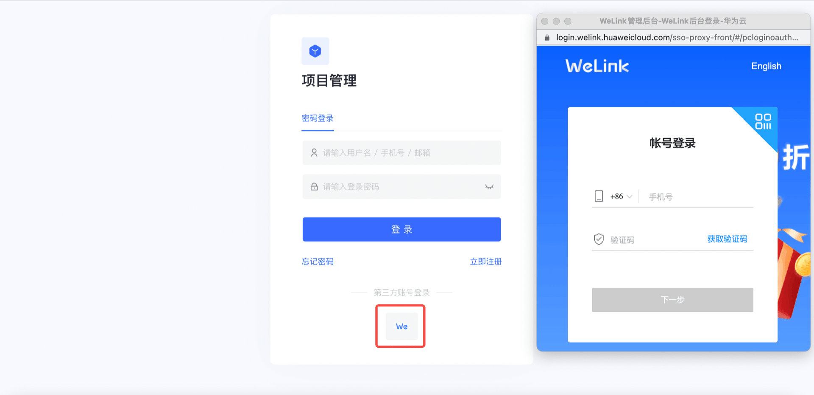
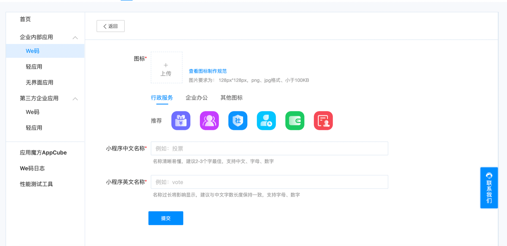
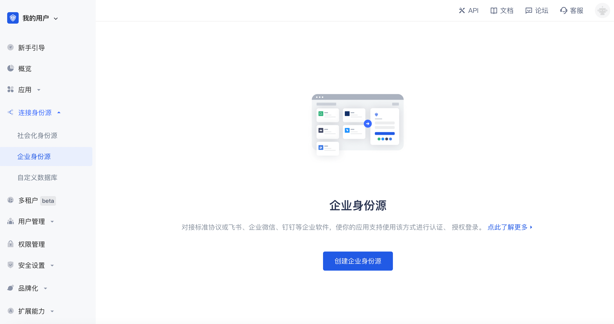
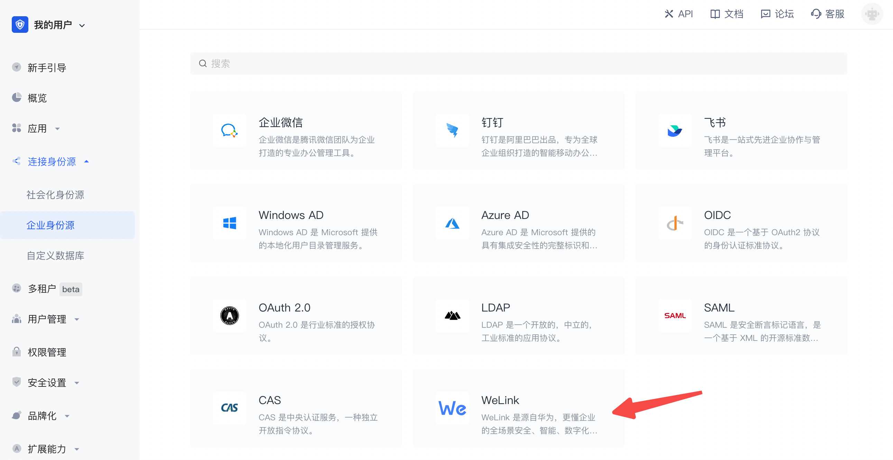
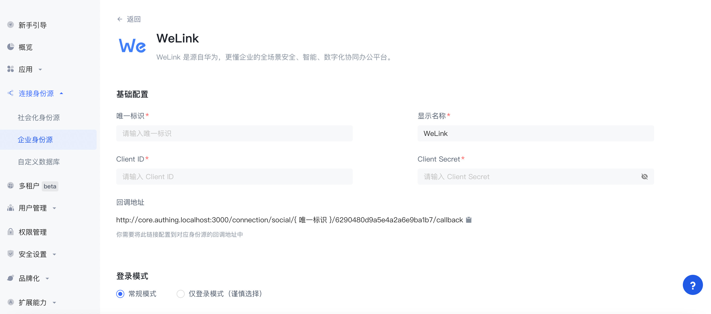
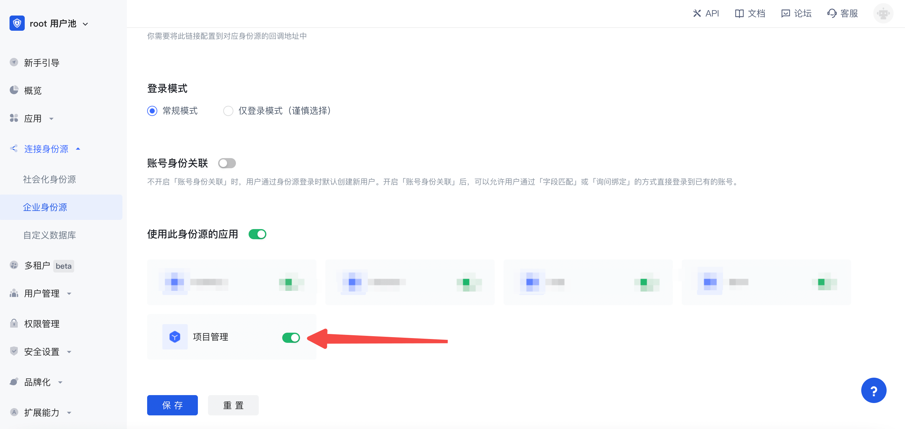
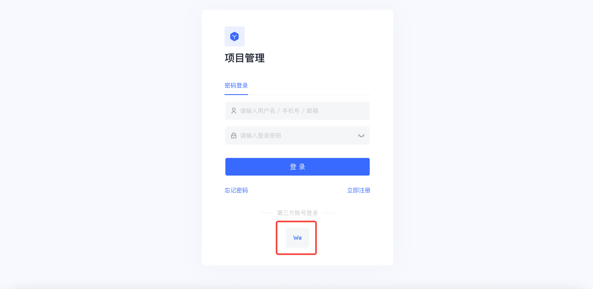

# WeLink 

<LastUpdated/>

## 场景介绍

- **概述**：WeLink 企业身份源登录是用户以 WeLink 为身份源安全登录第三方应用或者网站。在 Authing 中配置并开启 WeLink 的企业身份源登录，即可实现通过 Authing 快速获取 WeLink 基本开放的信息和帮助用户实现免密登录功能。
- **应用场景**：PC 网站
- **终端用户预览图**：

## 注意事项

- 如果你未开通 WeLink 开放平台账号，请先前往 [WeLink 开放平台](https://open.welink.huaweicloud.com/wecode-site/index.html#/home) 注册开发者账号。
- 如果你未开通 Authing 控制台账号，请先前往 [Authing 控制台](https://authing.cn/) 注册开发者账号；

## 步骤 1：创建 WeLink 应用

前往 [WeLink后台](https://open.welink.huaweicloud.com/wecode-site/index.html#/wecode/guide/guide)，创建We码应用。

填写应用基本信息

然后点击**提交**。

## 步骤 2：在 Authing 控制台配置 WeLink

2.1 请在 Authing 控制台 的「企业身份源」页面，点击「创建企业身份源」按钮，进入「选择企业身份源」页面。

2.2 请在 Authing 控制台 的「企业身份源」-「选择企业身份也」页面，点击「WeLink」身份源按钮，进入 「WeLink 登录模式」页面。

2.3 请在 Authing 控制台 的「企业身份源」-「WeLink」页面，配置相关的字段信息。

| 编号  | 字段/功能    | 描述                                                         |
| ----- | ------------ | ------------------------------------------------------------ |
| 2.3.1 | 唯一标识     | a.唯一标识由小写字母、数字、- 组成，且长度小于 32 位。b.这是此连接的唯一标识，设置之后不能修改。 |
| 2.3.2 | 显示名称     | 这个名称会显示在终端用户的登录界面的按钮上。                 |
| 2.3.3 | Client ID     | Client ID，需要在 WeLink 开放平台上获取。                  |
| 2.3.4 | Client Secret     | Client Secret，需要在 WeLink 开放平台上获取                    |
| 2.3.5 | 回调地址     | WeLink 有效 OAuth 跳转 URI。需要将此 URL 配置到 WeLink 开放平台上。 |
| 2.3.6 | 登录模式     | 开启「仅登录模式」后，只能登录既有账号，不能创建新账号，请谨慎选择。 |
| 2.3.7 | 账号身份关联 | 不开启「账号身份关联」时，用户通过身份源登录时默认创建新用户。开启「账号身份关联」后，可以允许用户通过「字段匹配」或「询问绑定」的方式直接登录到已有的账号。

配置完成后，点击「创建」或者「保存」按钮完成创建。

在 Authing 控制台上创建完 WeLink 身份源后，需要将回调地址配置到 WeLink 的开放平台上的 WeLink 应用的**应用管理后台**。

## 步骤 3：开发接入

- **推荐开发接入方式**：使用托管登录页

- **优劣势描述**：运维简单，由 Authing 负责运维。每个用户池有一个独立的二级域名；如果需要嵌入到你的应用，需要使用弹窗模式登录，即：点击登录按钮后，会弹出一个窗口，内容是 Authing 托管的登录页面，或者将浏览器重定向到 Authing 托管的登录页。

- **详细接入方法**：

3.1 在 Authing 控制台创建一个应用，详情查看：[如何在 Authing 创建一个应用](/guides/app-new/create-app/create-app.md)

3.2 在已创建好的 WeLink 身份源连接详情页面，开启并关联一个在 Authing 控制台创建的应用

3.3 在登录页面体验 WeLink 第三方登录

